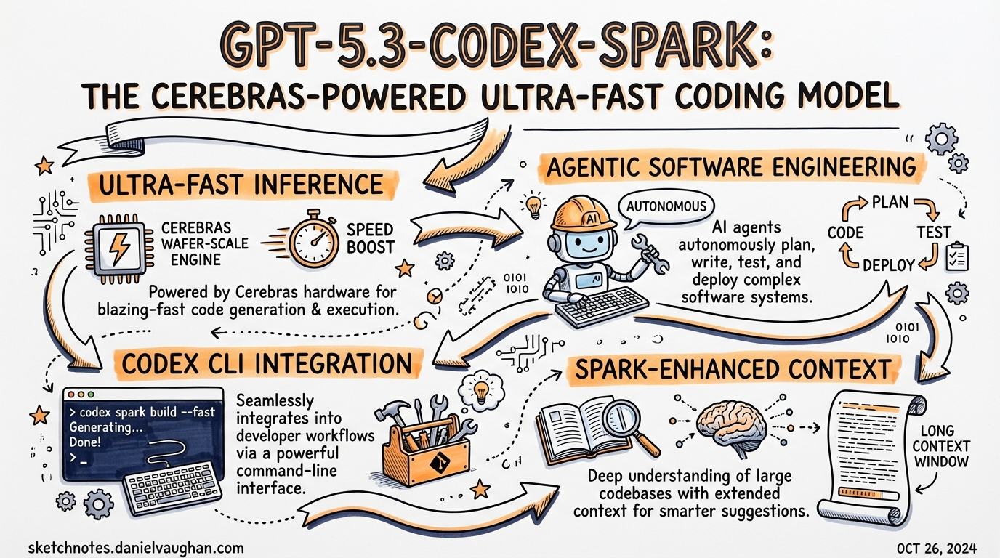
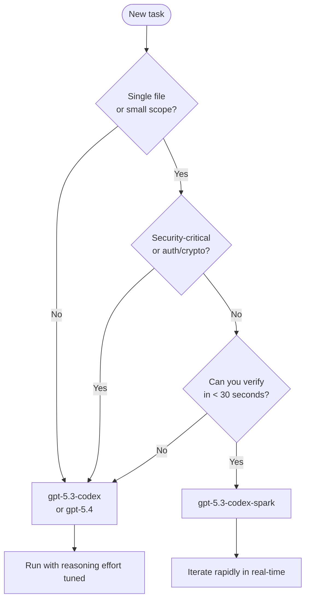

# GPT-5.3-Codex-Spark: The Cerebras-Powered Ultra-Fast Coding Model

**Date:** 2026-03-28
**Tags:** codex-spark, gpt-5-3-codex-spark, cerebras, wafer-scale-engine, real-time-coding, model-selection, latency, config-toml

On 14 January 2026, OpenAI announced a multi-year partnership with Cerebras Systems[^1]. Four weeks later, on 12 February 2026, the first concrete output shipped: **GPT-5.3-Codex-Spark** (`gpt-5.3-codex-spark`), a distilled coding model running on Cerebras' Wafer Scale Engine 3 (WSE-3) hardware and the first OpenAI production model not hosted on Nvidia GPUs[^2].

The headline number — over 1,000 tokens per second — is real. What it costs you, and how to configure Codex CLI to take advantage of it without breaking your existing setup, is the substance of this article.

---

## The Hardware: Cerebras Wafer Scale Engine 3

Standard GPU clusters run inference on discrete chips; inter-chip communication adds latency. Cerebras flips this by fabricating the entire compute graph on a single silicon wafer[^3]. WSE-3 exposes the largest on-chip SRAM of any shipping AI accelerator, eliminating the memory bandwidth bottleneck that governs per-token latency on GPUs.

The partnership gives OpenAI a low-latency inference path sitting alongside its existing GPU fleet. The routing decision is straightforward: GPU clusters for high-throughput batch inference and training; Cerebras for the sub-200 ms first-token latency that interactive coding demands.

OpenAI's engineering team also made protocol-level changes to match the hardware[^4]:

- **Persistent WebSocket connection** — eliminates repeated TLS handshakes on each turn
- **Responses API optimisation** — per-token overhead reduced by 30%
- **Client/server roundtrip** — overhead cut by 80%
- **Time-to-first-token** — reduced by 50% compared to equivalent GPU serving

The result for a typical function-level edit: you see the first token in under 200 ms and the entire response completes in 1–3 seconds.

---

## Model Characteristics

GPT-5.3-Codex-Spark is a distilled, smaller derivative of `gpt-5.3-codex`[^5]. It is **not** a faster version of the same model; it is a separate model checkpoint trained and quantised for the WSE-3 execution profile.

Key constraints at research preview launch:

| Property | GPT-5.3-Codex-Spark | GPT-5.3-Codex |
|---|---|---|
| Tokens per second | 1,000+ | 65–70 |
| Context window | 128k | 400k+ |
| Modality | Text-only | Text + images |
| SWE-Bench Pro | ~56% | ~72% |
| Reasoning fields | ❌ Not supported | ✅ Supported |
| Research preview | ChatGPT Pro only | Generally available |

The 16-point gap on SWE-Bench Pro[^6] reflects the accuracy cost of distillation. Spark sacrifices some reasoning depth to achieve its throughput target. In practice this manifests as:

- Minimal, targeted edits rather than broad architectural rewrites
- No automatic test execution unless explicitly prompted
- "Fast hallucinations that look correct" — fabricated API method names, phantom parameters[^7]
- Reduced reliability on structured output formatting

---

## Configuring Codex CLI for Spark

### Minimal config.toml switch

The only required change to use Spark is updating the `model` key:

```toml
# ~/.codex/config.toml
model = "gpt-5.3-codex-spark"
```

### What to remove

This is the critical part. Spark does not implement a chain-of-thought reasoning phase, so any reasoning-related keys in your config must be removed or commented out[^8]:

```toml
# Remove ALL of these when switching to Spark:
# model_reasoning_effort = "xhigh"
# model_reasoning_summary = "detailed"
# plan_mode_reasoning_effort = "high"
```

Leaving these keys in place does not cause a hard error, but they are silently ignored. More dangerously, a config that worked well for `gpt-5.3-codex` — with reasoning cranked to `xhigh` for thorough multi-file analysis — will produce confusingly shallow output from Spark even though it appears to run normally.

### A complete Spark profile

Use named profiles to switch between Spark and standard Codex without editing your root config:

```toml
# ~/.codex/config.toml

# Default profile — heavyweight tasks
model = "gpt-5.3-codex"
model_reasoning_effort = "high"
approval_policy = "on-failure"
sandbox_mode = "workspace-write"

# Spark profile — interactive iteration
[profiles.spark]
model = "gpt-5.3-codex-spark"
model_verbosity = "high"
approval_policy = "never"
sandbox_mode = "danger-full-access"

[profiles.spark.features]
multi_agent = true
```

Activate with:

```bash
codex --profile spark
```

### Fast mode vs. Spark

Codex CLI also exposes `/fast on` on GPT-5.4, which delivers a 1.5× speed increase at 2× credit consumption[^9]. This is a different mechanism from Spark:

- `/fast on` accelerates GPT-5.4 via preferential GPU routing — the same model, faster
- `gpt-5.3-codex-spark` is a distinct, smaller model on dedicated WSE-3 hardware

For truly interactive work (sub-second perceived latency), Spark wins. For tasks where you need GPT-5.4's reasoning depth but want it faster, `/fast on` is the right lever.

---

## Routing Logic: When to Use Spark



**Route to Spark for:**

- Single-file patches and utility functions
- Frontend component iteration (CSS, layout, styling)
- Rapid prototyping where you can visually verify the result immediately
- Codebase queries and exploration — "which file owns X?" style questions
- Plan revision in an active planning session — quick reformulations where the plan is already established

**Route to gpt-5.3-codex or gpt-5.4 for:**

- Multi-file refactors touching 5+ files
- Security-critical paths: authentication, authorisation, encryption, validation
- Database migrations and schema changes
- Long planning sessions requiring 12+ reasoning steps
- Any task where you cannot verify correctness in under 30 seconds
- Structured output that must conform to a strict schema (Spark's reliability here is lower)

---

## Practical Workflow Patterns

### Pattern 1: Spark as the inner loop, Codex as the outer loop

Use a subagent structure where Spark handles rapid, well-scoped sub-tasks while the orchestrator (running on `gpt-5.3-codex`) holds the broader plan:

```toml
# AGENTS.md snippet
When delegating to subagents for focused, bounded edits (single file,
clear spec, verifiable output), prefer gpt-5.3-codex-spark in the
subagent profile to minimise elapsed time.
```

```toml
# ~/.codex/config.toml
[profiles.subagent-spark]
model = "gpt-5.3-codex-spark"
model_verbosity = "low"
approval_policy = "never"
sandbox_mode = "workspace-write"
```

### Pattern 2: Spark for live pairing

Spark's latency profile matches human thinking speed. Use it during the "coding in the moment" phase where you are actively in the editor and want the model to feel like a fast autocomplete rather than a slow batch job:

```bash
# Start a Spark session for current-file work
codex --profile spark "Refactor this function to use early returns instead of nested conditionals"
```

### Pattern 3: Hybrid task decomposition

Break tasks explicitly before dispatching:

```
1. [SPARK] Add the new `UserPreferences` interface to types/user.ts
2. [SPARK] Update the three component files that consume UserPreferences
3. [CODEX] Write migration script to backfill the new preference column
4. [CODEX] Review the full changeset for security implications
```

Steps 1 and 2 are single-file, easily verifiable — Spark finishes each in seconds. Steps 3 and 4 involve multi-file reasoning and correctness guarantees where you want the full model.

---

## Access and Rate Limits

At launch, `gpt-5.3-codex-spark` is in research preview for **ChatGPT Pro subscribers only**, available in the Codex app, CLI, and VS Code extension[^10]. API access is limited to a small set of design partners.

Because it runs on dedicated WSE-3 hardware, Spark has its own separate rate limit pool — usage does not count against your standard Codex quota. However, during periods of high demand, OpenAI may apply additional queuing. OpenAI has signalled that broader access and expanded capabilities — larger models, longer context, and multimodal input — are on the roadmap for later in 2026[^11].

⚠️ If you are accessing Codex via ChatGPT OAuth (device-code sign-in) rather than an API key, selecting `gpt-5.3-codex-spark` with ChatGPT auth may return a provider error — Spark's rate-limit pool is gated separately from the standard ChatGPT backend at this stage[^8].

---

## What the Speed Actually Unlocks

The qualitative shift at 1,000 tokens/second is not just "faster waiting". It changes the interaction model:

- **Speculation becomes cheap.** At 65 tokens/second, trying five different approaches to a function signature is a five-minute commitment. At 1,000 tokens/second, it is thirty seconds. You will experiment more.
- **Context stays warm.** The cognitive overhead of re-establishing context after a long wait largely disappears when responses arrive before you lose your train of thought.
- **Shorter prompts work better.** Because iteration is fast, you can afford to send a rough prompt and correct the output rather than crafting an exhaustive specification upfront.

Simon Willison's observation captures it accurately: "When a model responds this fast you can stay in flow state and iterate with the model much more productively."[^12] The tradeoff is that you are staying in flow with a model that has ~56% SWE-Bench Pro accuracy — adequate for interactive iteration, inadequate for unattended agentic tasks.

---

## Summary

GPT-5.3-Codex-Spark is a purpose-built tool for interactive, real-time coding iteration. It is fast enough to feel like a hotkey rather than a job submission. It is not accurate enough to be trusted with security-critical code, long multi-step plans, or complex multi-file refactors. The configuration is straightforward — one model swap, plus the removal of reasoning fields that Spark does not support. Treat it as the inner loop of your agentic workflow; reserve the full models for the outer loop where correctness matters more than latency.

---

## Citations

[^1]: OpenAI–Cerebras partnership announcement, 14 January 2026. Techzine Global: [OpenAI swaps Nvidia for Cerebras with GPT-5.3-Codex-Spark](https://www.techzine.eu/news/analytics/138754/openai-swaps-nvidia-for-cerebras-with-gpt-5-3-codex-spark/)

[^2]: Neowin: [OpenAI introduces GPT‑5.3‑Codex‑Spark, an ultra-fast coding model powered by Cerebras](https://www.neowin.net/news/openai-introduces-gpt53codexspark-an-ultra-fast-coding-model-powered-by-cerebras/) — "first OpenAI model not to use Nvidia's hardware, running solely on Cerebras Wafer-Scale Engine 3 chips"

[^3]: Cerebras blog: [Introducing OpenAI GPT-5.3-Codex-Spark Powered by Cerebras](https://www.cerebras.ai/blog/openai-codexspark) — WSE-3 architecture, largest on-chip memory, multi-terabyte scalability

[^4]: InfoQ: [OpenAI Codex-Spark Achieves Ultra-Fast Coding Speeds on Cerebras Hardware](https://www.infoq.com/news/2026/03/open-ai-codex-spark/) — persistent WebSocket, Responses API optimisation, 80%/30%/50% overhead reductions

[^5]: Simon Willison: [Introducing GPT‑5.3‑Codex‑Spark](https://simonwillison.net/2026/Feb/12/codex-spark/) — "a smaller version of GPT‑5.3-Codex"

[^6]: Turing College: [Codex 5.3 vs. Codex Spark: Speed vs. Intelligence](https://www.turingcollege.com/blog/codex-5-3-vs-codex-spark-speed-vs-intelligence) — SWE-Bench Pro scores ~56% (Spark) vs ~72% (Codex 5.3)

[^7]: Turing College ibid. — "fast hallucinations that look correct" — fabricated API endpoints, phantom parameters

[^8]: XAI Router: [GPT-5.3 Codex Spark: Faster, But You Should Not Reuse gpt-5.3-codex Config](https://xairouter.com/en/blog/gpt-5-3-codex-spark/) — reasoning fields unsupported, ChatGPT auth caveat

[^9]: OpenAI Codex Speed documentation: [Speed – Codex | OpenAI Developers](https://developers.openai.com/codex/speed) — Fast mode: 1.5× speed, 2× credit rate, `/fast on|off|status`

[^10]: OpenAI Codex Models documentation: [Models – Codex | OpenAI Developers](https://developers.openai.com/codex/models) — "research preview for ChatGPT Pro subscribers"

[^11]: eWeek: [OpenAI Debuts GPT-5.3-Codex-Spark, a Near-Instant AI for Real-Time Coding](https://www.eweek.com/news/openai-gpt-5-3-codex-spark-real-time-coding-cerebras/) — roadmap for larger models, longer context, multimodal

[^12]: Simon Willison ibid. — flow state quote
