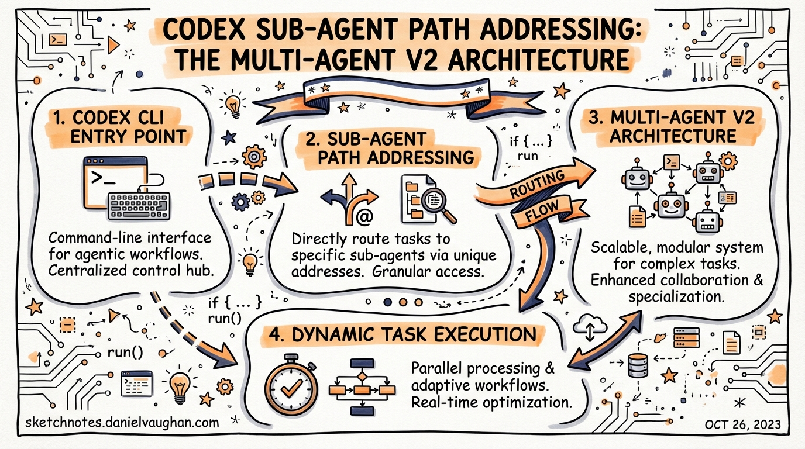
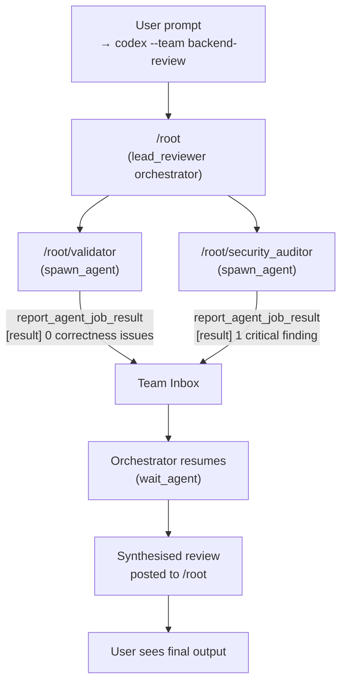

# Codex Sub-Agent Path Addressing: The Multi-Agent v2 Architecture

**Date:** 2026-03-28
**Tags:** codex-cli, multi-agent, subagents, architecture, orchestration, v0.117.0

Codex v0.117.0 replaced the original UUID-based sub-agent identification scheme with a hierarchical, path-like addressing system.[^1] The change is more than a cosmetic rename — it underpins a structured inter-agent messaging protocol, a formal agent-listing mechanism, and a team configuration layer that together constitute what the maintainers call "multi-agent v2". This article unpacks the architecture, walks through configuration, and shows where the new primitives change real orchestration patterns.

---

## The Problem With UUIDs

Before v0.117.0, spawned sub-agents were identified by raw call-IDs — opaque UUID strings that leaked into TUI output, approval overlays, and log messages. When you ran three parallel workers the TUI showed something like:

```
[3fa2b7c1-…] worker: checking auth module
[9e4d0012-…] worker: checking payment module
[c7a1ff83-…] worker: checking admin routes
```

No context about which worker was doing what, no stable handle you could target with a follow-up message, and no ergonomic way to route input to a specific running agent. The result was that complex orchestration patterns — reviewer pipelines, parallel explorers, sequential gated chains — were hard to reason about at runtime.[^2]

---

## Path-Based Addresses

The v0.117.0 path system assigns every agent session a deterministic address rooted at `/root`.[^1] The root session itself occupies `/root`. Direct spawns become `/root/agent_a`, `/root/agent_b`, and so on, with deeper nesting following the same convention:

```
/root
├── /root/explorer
├── /root/reviewer
│   └── /root/reviewer/security_auditor
└── /root/docs_researcher
```

Each segment corresponds to the agent's `name` field from its TOML definition, not a random identifier. Because the address is derived from configuration, it is stable across resume cycles and predictable when writing orchestration logic.

The PR that introduced this was `#15313` ("feat: change multi-agent to use path-like system instead of uuids").[^1] Agent listing (`#15621`) was added shortly after to let the orchestrator enumerate all currently active paths at runtime, which is the foundation for dynamic fan-out patterns where the parent adapts its strategy based on which children are still alive.

---

## Structured Inter-Agent Messaging

Alongside addressing, PR #15515 introduced a structured messaging protocol between agents.[^1] Rather than plain text flowing through `send_input`, agents can now post typed messages with a source address, destination address, and a message-class discriminator.

In the TUI, this surfaces as prefixed, coloured handles:

```
◉ @reviewer [spawned]
◉ @reviewer [progress] Checked 12/20 files — 2 critical findings
◉ @security_auditor [spawned] by /root/reviewer
◉ @security_auditor [result] 1 critical: missing input sanitisation in auth handler
```

The `[spawned]`, `[progress]`, and `[result]` labels are message classes in the underlying protocol.[^2] This structure enables the orchestrator to act on machine-readable payloads rather than parsing free text. The `report_agent_job_result` tool — already present in v1 for `spawn_agents_on_csv` — is now used by single-agent spawns as well when a structured result is expected.

---

## Directory Structure and Configuration

Custom agents are defined as TOML files. There are two scopes:

| Scope | Location |
|---|---|
| Personal (user-level) | `~/.codex/agents/` |
| Project-scoped | `.codex/agents/` (repo root) |

For the new team features, agents are grouped into subdirectories:[^2]

```
~/.codex/agents/
├── _builtin/             # built-in defaults (default, worker, explorer)
└── backend-review/
    ├── team.toml
    ├── lead_reviewer/
    │   ├── config.toml
    │   └── system_prompt.md
    ├── validator/
    │   ├── config.toml
    │   └── system_prompt.md
    └── security_auditor/
        ├── config.toml
        └── system_prompt.md
```

### team.toml

The `team.toml` file declares the team's identity, its membership, and its launch policy:

```toml
[team]
name         = "backend-review"
description  = "Full backend review pipeline"
tui_color    = "blue"
orchestrator = "lead_reviewer"
members      = ["lead_reviewer", "validator", "security_auditor"]

# Other teams this team's orchestrator is allowed to address
can_address_teams = ["devops", "frontend-review"]

[launch]
trigger = "manual"   # manual | on_task | always
```

The `orchestrator` field names the member that receives the initial prompt when the team is invoked. All other members start idle and are spawned by the orchestrator as needed.[^2]

### Per-Agent config.toml

Individual agent configs mirror the fields available in the root `config.toml`, with agent-scoped overrides:

```toml
[agent]
name      = "validator"
tui_color = "cyan"

[prompt]
file = "system_prompt.md"   # relative to this config.toml

[invocation]
trigger     = "manual"
watch_paths = ["src/**/*.ts", "package.json"]

[tools]
shell       = true
apply_patch = false

[[tools.mcp]]
name    = "github-mcp"
command = "npx"
args    = ["-y", "@modelcontextprotocol/server-github"]

[permissions]
network    = false
fs_read    = true
fs_write   = false
allow_paths = ["./reports/"]
```

Key fields for v2 orchestration:

- `tui_color` — gives the agent a distinct colour in TUI output, matching the `@handle` badge
- `watch_paths` — triggers the agent automatically when matching files change (⚠️ confirm stability of this field in your installed version)
- `[permissions]` — per-agent filesystem and network scoping, narrower than the parent session's sandbox

---

## Cross-Team Addressing and @mention Syntax

With teams in play, the `@mention` syntax extends to cover both individual agents and entire teams:[^2]

| Syntax | Destination |
|---|---|
| `@validator` | Direct message to the `validator` agent |
| `@backend-review` | Routes to `backend-review` team's orchestrator |
| `@backend-review/security_auditor` | Directly addresses a named member of that team |

The `/agent` command in the TUI now shows the agent picker grouped by team, with collapsible team sections and a team-level badge. Nicknames configured via `nickname_candidates` are shown in the picker when multiple instances of the same agent type are running simultaneously.[^3]

---

## Launching a Team

```bash
codex --team backend-review "Review PR #142 for correctness and security"
```

This starts the `lead_reviewer` orchestrator with the given prompt. The orchestrator then spawns `validator` and `security_auditor` sub-agents via `spawn_agent`, waits on their structured results, and synthesises a final review.[^3]

For one-off non-interactive runs:

```bash
codex exec --team backend-review --profile ci "Review PR #142"
```

---

## Architecture Flow

The following diagram shows how path addressing maps onto a two-level team with a gated result handoff:



---

## Async Orchestration and Idle State

A key change in v2 is that orchestrators can dispatch work and then suspend, rather than blocking. The orchestrator spawns its children, calls `wait_agent` (or `wait_agent` with a timeout), then enters an idle state that consumes no context tokens while the sub-agents run.[^1] When a sub-agent calls `report_agent_job_result`, the team inbox is updated and the orchestrator resumes.

This avoids the context-window pressure that plagued v1 orchestrators, which had to stay "active" throughout the duration of all child tasks. Paired with the new agent-listing operation (`#15621`), an orchestrator can query which children are still running and conditionally spawn new agents or escalate based on partial results.[^1]

---

## Global [agents] Config Keys

The root `~/.codex/config.toml` `[agents]` section controls limits that apply across all sessions:[^3]

```toml
[agents]
# Maximum concurrently open agent threads. Default: 6
max_threads = 6

# Maximum nested spawn depth. Root = depth 0. Default: 1
max_depth = 2

# Per-worker timeout for spawn_agents_on_csv jobs, in seconds. Default: 1800
job_max_runtime_seconds = 900

[agents.reviewer]
description   = "Find correctness, security, and test risks"
config_file   = "./agents/reviewer.toml"
nickname_candidates = ["Athena", "Ada", "Iris"]
```

Note that `max_depth = 1` (the default) allows one level of sub-agents below root. To use nested sub-agents (e.g., an orchestrator that spawns an orchestrator), increase this value deliberately — deeper nesting compounds context and approval complexity.

---

## Practical Patterns

### Pattern 1: Named Specialist Pipeline

Rather than spawning anonymous `worker` agents, define named specialists in `.codex/agents/`. The path-based addresses let you target follow-up messages precisely:

```toml
# .codex/agents/pr-review/team.toml
[team]
name         = "pr-review"
orchestrator = "triage"
members      = ["triage", "correctness", "security", "docs"]
```

The `triage` agent reads the PR diff, decides which specialists are needed, and spawns only the relevant sub-agents — skipping `docs` entirely for a backend-only change.

### Pattern 2: Progressive Depth

Set `max_depth = 2` and allow the `security` agent to spawn a `dependency_auditor` when it detects third-party library changes. The path becomes `/root/security/dependency_auditor`, addressable directly from the TUI if manual steering is needed.

### Pattern 3: Async Fan-Out With Reconciliation

The `spawn_agents_on_csv` tool remains the best choice for homogeneous parallel work (e.g., analysing 50 services with the same prompt). For heterogeneous pipelines — different agents, different prompts, different tool surfaces — the named team pattern with `spawn_agent` + `wait_agent` gives finer control and legible path addresses.

---

## What Hasn't Changed

- **TOML-first configuration**: all v1 TOML keys (`model`, `model_reasoning_effort`, `sandbox_mode`, `mcp_servers`, `skills.config`) work unchanged inside per-agent configs
- **Sandbox inheritance**: spawned agents inherit the parent session's live runtime overrides, including `/approvals` changes and `--yolo` flags[^3]
- **`spawn_agents_on_csv`**: unchanged API; path addressing is an additional layer, not a replacement
- **Approval overlays**: source agent is now shown by `@name` rather than UUID, but the approval flow is otherwise identical

---

## Citations

[^1]: OpenAI Codex Changelog v0.117.0 — Sub-agent path addressing, structured messaging, agent listing. [developers.openai.com/codex/changelog](https://developers.openai.com/codex/changelog)
[^2]: GitHub Issue #12047 — Multi-agent TUI overhaul: named agents, per-agent config, async orchestration & @mention messaging. [github.com/openai/codex/issues/12047](https://github.com/openai/codex/issues/12047)
[^3]: Official Codex Subagents documentation — TOML schema, config keys, nickname_candidates, sandbox inheritance. [developers.openai.com/codex/subagents](https://developers.openai.com/codex/subagents)
