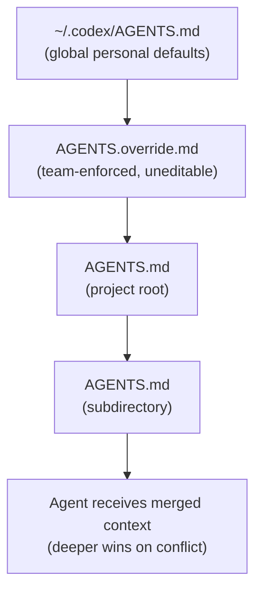
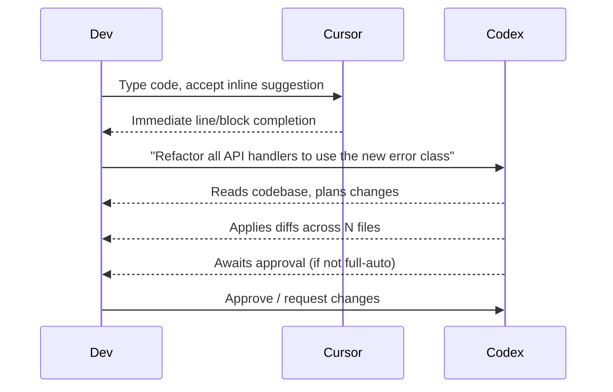
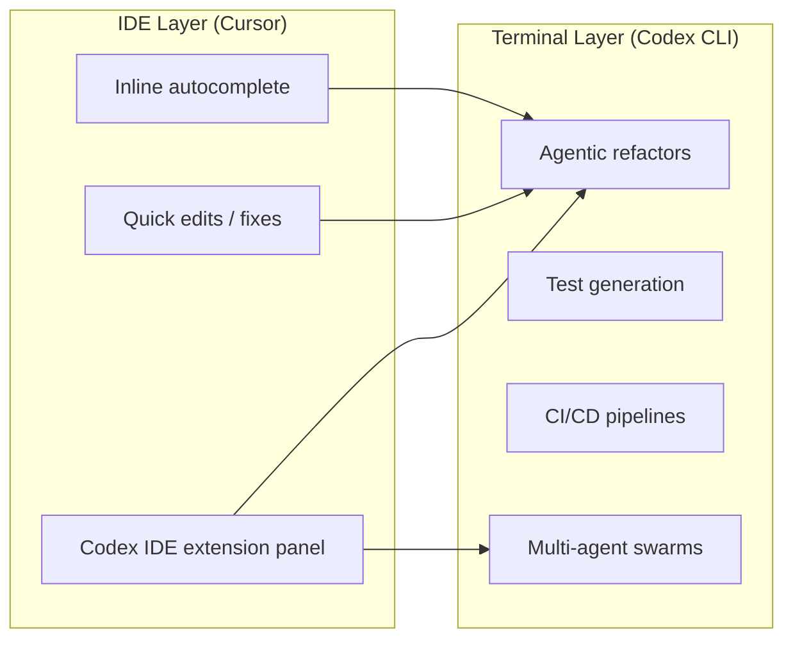

# Migrating from Cursor to Codex CLI

**Date:** 2026-03-28
**Tags:** cursor-migration, agents-md, hybrid-workflow, credit-model, tool-comparison

Cursor's June 2025 pricing overhaul — replacing predictable 500-request plans with variable credit pools — sent a visible slice of its user base searching for alternatives.[^1] For developers already comfortable in the terminal, Codex CLI is the natural landing spot. But the migration isn't just a config translation; it's a paradigm shift from an IDE-augmentation model to a terminal-first agentic one. This guide covers both the mechanical steps and the conceptual adjustments.

## Why Developers Are Moving

Cursor's Pro plan now charges variable credit rates per API call rather than a fixed request count.[^2] At the $20/month tier, effective usage dropped to approximately 225 requests per month for Claude Sonnet-class work — down from the 500 requests the previous model implied.[^3] Tiers escalate to $60/month (Pro+) and $200/month (Ultra) for heavier users.

Beyond price, there's a capability argument. Independent benchmarks found Codex CLI uses roughly **4× fewer tokens** than comparable Claude Code workflows for the same task.[^4] On terminal-specific evaluations (Terminal-Bench 2.0), Codex scores 77.3% against Cursor's Claude backend at 65.4%.[^5] The open-source codebase and zero-dependency Rust binary also appeal to teams with supply-chain restrictions.

That said, Cursor retains real advantages: local-first execution (your code never leaves your machine by default), a polished GUI editing loop, and model routing across Claude Opus 4.6, GPT-5.2, and Gemini 3 Pro.[^6] A hybrid approach — Cursor for interactive editing, Codex CLI for heavy agentic delegation — is the most common outcome, not a hard cut-over.

## Config Translation: Rules → AGENTS.md

### The Cursor rules landscape in 2026

Cursor's legacy `.cursorrules` file (a single Markdown blob at the project root) is deprecated.[^7] The current format is a `.cursor/rules/` directory of `.mdc` files — Markdown with YAML frontmatter, each scoped to a glob pattern and assigned one of four activation modes: *Always*, *Auto Attached*, *Agent Requested*, or *Manual*.[^8]

A typical `.cursor/rules/` directory might look like:

```
.cursor/rules/
  typescript.mdc       # Always — language conventions
  react-components.mdc # Auto Attached to *.tsx
  database.mdc         # Agent Requested
  api-patterns.mdc     # Auto Attached to src/api/**
```

Each `.mdc` file is recommended to be under 50 lines.[^9]

### AGENTS.md structure for Codex

Codex CLI reads `AGENTS.md` natively — OpenAI originated the format, which has since been placed under the Linux Foundation's Agentic AI Foundation and adopted by Google, Anthropic, AWS, and others as a cross-tool standard.[^10] Over 60,000 open-source repositories already include one.[^11]

The basic scope chain:



Codex walks from the Git root down to your current working directory, merging files at each level. Deeper files override shallower ones on conflict.[^12]

### Translating a Cursor rule set

A typical Cursor `.mdc` rule:

```yaml
---
description: TypeScript conventions for this project
globs: ["**/*.ts", "**/*.tsx"]
alwaysApply: false
---
- Use `interface` not `type` for object shapes
- Prefer `const` assertions over enums
- All async functions must include error handling
- Import order: external → internal → relative
```

The equivalent `AGENTS.md` section:

```markdown
## TypeScript Conventions

- Use `interface` not `type` for object shapes
- Prefer `const` assertions over enums
- All async functions must include error handling
- Import order: external → internal → relative
```

AGENTS.md does not have Cursor's glob-scoped activation. The file is always read in full. To replicate scope, use subdirectory `AGENTS.md` files:

```
src/api/AGENTS.md     # API-specific rules
src/ui/AGENTS.md      # Component-specific rules
AGENTS.md             # Project-wide rules
```

For teams using Cursor alongside Codex, add `.cursor/rules/*.mdc` sources to your fallback filenames in `~/.codex/config.toml` so Codex reads them without duplication:

```toml
[codex]
project_doc_fallback_filenames = ["AGENTS.md", "CLAUDE.md", ".cursorrules"]
```

⚠️ This reads the old-style `.cursorrules` as plain text; the YAML frontmatter from `.mdc` files will appear as verbatim content rather than being interpreted as metadata.

## Workflow Changes

### From autocomplete to delegation

Cursor's core interaction model is synchronous: you type, the AI suggests, you accept or reject. Codex CLI's is asynchronous: you delegate a task, the agent executes a sequence of tool calls, you review the diff.



The practical adjustment: Codex rewards **task-level prompts** rather than line-level steering. Instead of guiding each suggestion, you describe the outcome and let the agent traverse the codebase. This matches the `codex.exec` non-interactive mode used in CI pipelines.

### Approval policies

Cursor's inline suggestions are implicitly safe — you see each change before it's inserted. Codex operates on a configurable trust model:

```toml
[agent]
approval_policy = "unless-allow-listed"  # default — prompt for shell commands
# or
approval_policy = "on-failure"           # run freely, pause only on errors
# or
approval_policy = "never"                # fully autonomous (use with caution)
```

For interactive migration work, `unless-allow-listed` is the right starting point. You can approve-list specific safe commands as your trust in the agent grows:

```toml
[agent]
allow_listed_commands = ["cargo test", "npm test", "git diff", "rg"]
```

### Context persistence

Cursor maintains a persistent chat thread within the IDE session. Codex CLI has explicit session management: threads are saved and can be resumed with `codex resume --last` or listed in the session picker. Use `/fork` mid-thread to branch a conversation without losing the original path.

For long-running tasks (legacy codebase migrations, multi-day refactors), the **4-file durable memory pattern** provides persistence across sessions: a SPEC.md, a PLAN.md, a PROGRESS.md, and a NOTES.md — Codex reads these at session start and updates them as it works.[^13]

## What Cursor Still Does Better

Be honest about the trade-offs:

**Real-time autocomplete.** Cursor's tab-completion and multi-line ghost text have no equivalent in Codex CLI. The Codex IDE extension (available in VS Code and Cursor itself) provides an agent panel alongside Cursor's native autocomplete — the most common hybrid setup.[^14]

**Local-first privacy.** Cursor's basic operations run entirely on your machine with no network call. Codex CLI routes all inference through OpenAI's API. For teams with strict data sovereignty requirements, this is a blocker without an on-premises OpenAI deployment.

**Visual diff preview.** Cursor shows inline diffs as the agent proposes changes. Codex CLI presents diffs for approval at the terminal, which is less visual but scriptable and CI-friendly.

**Latency for small tasks.** For a two-line fix, Cursor's autocomplete is faster than dispatching a Codex task. Codex's overhead pays off at the task level (refactors, feature implementations, test generation), not the keystroke level.

## What Codex CLI Does Better

**Parallelism.** Codex can spawn multiple subagents simultaneously using `spawn_agents_on_csv` or path-based multi-agent addressing. Cursor's agents are single-threaded within a session.[^15]

**Token efficiency.** At API rates, the same workload costs approximately 4× more through Claude Code/Cursor API backends than through Codex's gpt-5-codex models.[^4]

**Terminal-native tasks.** Shell scripting, CI pipelines, Dockerfile generation, and system administration work align naturally with Codex's execution model. Cursor's IDE frame adds friction for pure-terminal workflows.

**Hooks and automation.** Codex's hook system (`PreToolUse`, `PostToolUse`, `SessionStart`, `PostTaskComplete`) enables composable automation pipelines. Pre-commit cost alerts, approval gates, and Slack notifications are straightforward hook implementations with no Cursor equivalent.

**Open source.** The entire Codex CLI codebase (the Rust rewrite, `codex-rs`) is public and auditable.[^16] Cursor is proprietary.

## The Hybrid Setup

The recommended 2026 pattern is not full migration but **complementary deployment**:



Install the Codex IDE extension in Cursor to access the agent panel without leaving your editor.[^14] The extension shares `~/.codex/config.toml` and credentials with the CLI, so configuration is unified.

For teams on Cursor Pro, consider routing high-volume, repeatable tasks (documentation generation, test scaffolding, code review) to Codex CLI's API key billing rather than burning Cursor credits.

## Practical Migration Checklist

1. **Audit your `.cursor/rules/` directory.** Identify rules that are always-on vs. glob-scoped. Always-on rules move directly to `AGENTS.md`. Glob-scoped rules move to subdirectory `AGENTS.md` files.

2. **Create `~/.codex/config.toml`** with your preferred model, approval policy, and any fallback filenames.

   ```toml
   [model]
   name = "gpt-5-codex"
   reasoning_effort = "medium"

   [agent]
   approval_policy = "unless-allow-listed"

   [codex]
   project_doc_fallback_filenames = ["AGENTS.md", "CLAUDE.md"]
   ```

3. **Write a global `~/.codex/AGENTS.md`** for personal style preferences that apply across all projects (formatting, commit conventions, language preferences).

4. **Run a low-stakes migration task** — a single-file refactor or test generation job — to calibrate your approval policy and verify AGENTS.md content is being picked up correctly. Use `codex --show-context` to inspect what the agent is reading before it acts. ⚠️ Verify this flag is supported in your installed version.

5. **Install the Codex IDE extension in Cursor** if you want agent access without leaving the editor. Configure it to use the same `config.toml`.

6. **Migrate billing progressively.** Keep Cursor credits for interactive work; use an OpenAI API key for agentic batch tasks where the 4× token efficiency advantage applies.

## Citations

[^1]: Cursor pricing overhaul community reaction — [Cursor Pricing 2026: Hobby, Pro and Business plans compared](https://www.eesel.ai/blog/cursor-pricing)
[^2]: Variable credit system details — [Cursor Pricing Explained 2026 | Vantage](https://www.vantage.sh/blog/cursor-pricing-explained)
[^4]: 4× token efficiency claim — [Claude Code vs Codex CLI 2026: Which Terminal AI Coding Agent Wins?](https://www.nxcode.io/resources/news/claude-code-vs-codex-cli-terminal-coding-comparison-2026)
[^5]: Terminal-Bench 2.0 scores — [Codex vs Cursor (2026): Terminal Agent vs AI IDE](https://www.morphllm.com/comparisons/codex-vs-cursor)
[^6]: Cursor model routing — [Claude Code vs Cursor vs OpenAI Codex: Which AI coding tool should you use in 2026?](https://medium.com/@writertripathi/claude-code-vs-cursor-vs-openai-codex-which-ai-coding-tool-should-you-use-in-2026-8f124e43c6fd)
[^7]: `.cursorrules` deprecation — [fatih kadir akın on X](https://x.com/fkadev/status/1890439029121822772)
[^8]: `.mdc` format and four activation modes — [The Complete Cursor Rules Guide (2026)](https://www.agentrulegen.com/guides/cursor-rules-guide)
[^9]: 50-line `.mdc` recommendation — [Elie Steinbock on X](https://x.com/elie2222/status/1907070722960187745)
[^10]: AGENTS.md Linux Foundation adoption — [AGENTS.md: Complete Guide to AI Coding Agent Config Files](https://vibecoding.app/blog/agents-md-guide)
[^11]: 60,000+ repositories with AGENTS.md — [AGENTS.md: One File to Guide Them All](https://layer5.io/blog/ai/agentsmd-one-file-to-guide-them-all/)
[^12]: Codex CLI AGENTS.md scope chain — [Custom instructions with AGENTS.md – Codex](https://developers.openai.com/codex/guides/agents-md)
[^13]: 4-file durable memory pattern — [Evaluating Codex Agents: Evals, Long-Horizon Benchmarks, and the 4-File Pattern](/codex-resources/articles/2026-03-28-evaluating-codex-agents-evals-longhorizon/)
[^14]: Codex IDE extension in Cursor — [IDE extension – Codex | OpenAI Developers](https://developers.openai.com/codex/ide)
[^15]: Codex subagent parallelism — [Codex CLI Subagents: TOML Format, Parallelism and spawn_agents_on_csv](/codex-resources/articles/2026-03-26-codex-cli-subagents-toml-parallelism/)
[^16]: codex-rs open-source repository — [openai/codex on GitHub](https://github.com/openai/codex)
