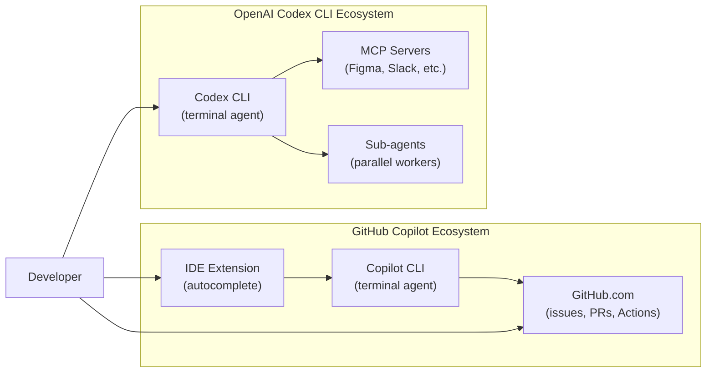

# Migrating from GitHub Copilot to Codex CLI

**Date:** 2026-03-28

**Tags:** copilot-migration, agents-md, terminal-first, enterprise, hybrid-workflow, copilot-instructions, agentic-coding

---

Before we begin: there is a naming trap to navigate. In February 2026, GitHub launched **GitHub Copilot CLI** — a terminal-native agent built by GitHub and available to all paid Copilot subscribers.[^1] That is *not* the same product as **OpenAI Codex CLI** — the open-source, terminal-first agentic coding tool from OpenAI.[^2] This article is about switching your primary agentic workflow from the GitHub Copilot ecosystem (IDE extension + Copilot CLI + `copilot-instructions.md`) to **OpenAI Codex CLI**. Where the GitHub Copilot CLI changes the comparison, that is noted explicitly.

---

## Why Consider the Switch?

GitHub Copilot has approximately 4.7 million paid subscribers.[^3] For most of those developers, Copilot functions primarily as an inline suggestion engine inside VS Code, JetBrains, or similar IDEs. The agentic capabilities — issue assignment, cloud tasks, Copilot CLI — came later and remain, for many teams, a partial upgrade grafted onto the original autocomplete experience.

Reasons teams investigate Codex CLI as an alternative or supplement:

- **Open-source and auditable.** Codex CLI is MIT-licensed and written in Rust.[^4] You can read, fork, and contribute to the full agent loop.
- **Token efficiency.** OpenAI claims Codex CLI is approximately four times more token-efficient than comparable agentic tools, meaning a given API budget goes further.[^5]
- **Terminal-first architecture.** Codex CLI is designed for shell workflows from the ground up — no IDE required, deep `stdin`/`stdout` composability, `codex exec` for headless CI.
- **Sandbox security model.** Codex CLI ships with Seatbelt (macOS), Landlock (Linux), and restricted tokens (Windows) as default isolation layers.[^6] Copilot CLI's sandbox model is less granular.
- **Hooks and lifecycle control.** Codex CLI exposes `SessionStart`, `PreTool`, `PostToolUse`, `PostTaskComplete`, and `userpromptsubmit` hooks that let you inject behaviour at every stage of the agent loop.[^7]

The honest counter-argument: if your team's workflow centres on GitHub issues, PRs, and Actions, Copilot's native GitHub integration remains best-in-class. The `/research` command, fleet mode (`/fleet`), and background cloud delegation (`&` prefix) in Copilot CLI all have genuine advantages for GitHub-native teams.[^8] The recommended pattern is **hybrid**: Codex CLI for heavy local agentic work, Copilot for IDE autocomplete and GitHub-native tasks.

---

## Step 1 — Translate Your Instruction Files

This is the lowest-friction migration step, and it frequently unlocks immediate compatibility with both tools simultaneously.

### What you have

```
project/
└── .github/
    └── copilot-instructions.md   # your existing Copilot instructions
```

### What to create

```
project/
├── AGENTS.md                     # primary cross-tool instructions
└── .github/
    └── copilot-instructions.md   # kept for Copilot IDE/CLI compatibility
```

`AGENTS.md` is now the cross-tool standard governed by the Agentic AI Foundation under the Linux Foundation.[^9] GitHub Copilot CLI reads it as *primary instructions* — with higher precedence than `.github/copilot-instructions.md`.[^10] OpenAI Codex CLI uses it natively. Cursor, Amp, Google Gemini CLI, and Factory also read it.

**Migration rules:**

| `.github/copilot-instructions.md` content | `AGENTS.md` equivalent |
|---|---|
| Language and framework conventions | Same — copy verbatim |
| Test runner expectations | Same — copy verbatim |
| Copilot-specific `@workspace` references | Remove — not valid in Codex CLI |
| `applyTo:` path-scoped instructions | Create nested `AGENTS.md` files in subdirectories instead |
| `<file>` XML tags for file context | Use plain Markdown — Codex CLI injects context from the working tree |

Path-scoped instructions in Copilot use frontmatter in separate `.instructions.md` files:[^11]

```markdown
---
applyTo: "src/api/**"
---
All API handlers must return typed Response objects.
```

In Codex CLI, move these to a subdirectory `AGENTS.md`:

```
project/
└── src/
    └── api/
        └── AGENTS.md   # "All API handlers must return typed Response objects."
```

The scoping behaviour is equivalent. Codex CLI walks the directory tree from the current working directory upwards and merges all `AGENTS.md` files it finds, with more-specific (closer) files taking precedence.[^12]

---

## Step 2 — Install Codex CLI

```bash
npm install -g @openai/codex
# or: curl -fsSL https://codex.openai.com/install.sh | sh
```

Set your API key — or if you use Copilot Pro+, the Codex VS Code extension can proxy model calls through your Copilot subscription.[^13]

```bash
export OPENAI_API_KEY="sk-..."
```

Create `.codex/config.toml` at your project root. GPT-5.3-Codex is the current LTS model with support guaranteed through February 2027.[^14]

```toml
[model]
name = "gpt-5.3-codex"           # LTS: supported through Feb 2027
reasoning_effort = "medium"

[sandbox]
network_disabled = true           # default; disable for web-search tasks

[features]
hooks = true
multi_agent = true
```

---

## Step 3 — Rebuild Your Approval Policy

Copilot CLI offers a binary choice: interactive mode (approve each step) or autopilot mode (no approvals).[^15] Codex CLI provides a richer approval model with four named policies:

| Policy | Behaviour |
|---|---|
| `suggest` | Every tool call requires approval |
| `auto-edit` | File edits auto-approved; shell commands need approval |
| `auto-run` | All tool calls auto-approved within sandbox |
| `full-auto` | Fully autonomous; disables confirmation prompts |

For most migration scenarios, `auto-edit` is the sensible default — it matches Copilot CLI's interactive mode for shell commands while removing friction for the file edits that dominate most tasks.

```toml
[policy]
default = "auto-edit"
```

You can also define per-command rules:

```toml
[policy.rules]
allow = ["git *", "npm test", "cargo build"]
deny  = ["rm -rf *", "curl * | sh"]
```

---

## Step 4 — Migrate Hooks

If you use Copilot CLI's pre/post task scripting (via `.github/copilot-hooks/` or similar), Codex CLI hooks give you more structured control.

### Example: Auto-format after every file edit

In Copilot CLI, this typically requires a wrapper script. In Codex CLI:

```toml
[hooks.PostToolUse]
command = "prettier --write \"$CODEX_TOOL_OUTPUT_PATH\" 2>/dev/null || true"
filter  = { tool = "write_file" }
```

### Example: Post-task notification

```toml
[hooks.PostTaskComplete]
command = """
osascript -e 'display notification "Codex task complete" with title "Codex CLI"'
"""
```

### Example: Block secrets leakage on prompt submit

```toml
[hooks.userpromptsubmit]
command = "grep -q 'sk-' <<< \"$CODEX_PROMPT\" && echo 'BLOCK: API key detected in prompt' && exit 1 || exit 0"
```

See the [hooks deep dive article](/codex-resources/articles/2026-03-26-codex-cli-hooks-deep-dive/) for the full event list and JSON protocol.

---

## Step 5 — Rethink Memory and Context

Copilot CLI maintains *repository memory* — it learns conventions from previous sessions and stores them automatically.[^16] Codex CLI does not do this by default. Instead, you explicitly capture learnings in `AGENTS.md` or in a project-level `MEMORY.md` that you reference from `AGENTS.md`:

```markdown
<!-- AGENTS.md -->
# Project Conventions

See [MEMORY.md](./MEMORY.md) for accumulated learnings from past Codex sessions.

## Core rules
- All new modules must have a corresponding test file.
- Use `pnpm` not `npm`.
```

This is a deliberate trade-off: Codex CLI's context is **explicit and version-controlled** rather than implicit and agent-managed. You know exactly what the agent knows, and you can review and audit it in a PR.

---

## Architecture Comparison



The recommended hybrid keeps **Copilot for IDE autocomplete** (Copilot has no competition for real-time inline suggestions) and **Codex CLI for agentic tasks** (multi-step, multi-file, CI pipelines).

---

## What Codex CLI Does Not Replace

Be explicit about the gaps before committing to a migration:

- **Inline autocomplete.** Codex CLI has no IDE integration for line-by-line code suggestions. Keep Copilot (or GitHub Copilot in VS Code) for this.
- **GitHub-native issue assignment.** Assigning a GitHub Issue directly to the Copilot agent — which then opens a draft PR — is a Copilot-specific workflow that requires Copilot Pro+ or Enterprise.[^17] Codex CLI has `codex cloud exec` for similar cloud tasks, but the GitHub issue → Codex agent → draft PR chain requires additional scripting.
- **Fleet mode.** Copilot CLI's `/fleet` runs identical tasks across multiple sub-agents simultaneously for decision-convergence.[^18] Codex CLI achieves parallelism via `spawn_agents_on_csv` and path-based sub-agent addressing, but the UX is more manual.
- **Automatic repository memory.** As noted above, Codex CLI's memory is explicit.

---

## Enterprise Considerations

If you are migrating an enterprise team currently on Copilot Business or Enterprise:

| Concern | Copilot Enterprise | Codex CLI Enterprise |
|---|---|---|
| **Managed policies** | Agent Control Plane, admin-controlled model access | `requirements.toml` for org-wide config lockdown |
| **RBAC** | GitHub permissions model | SCIM-based RBAC with Compliance API |
| **Audit logs** | GitHub audit log | OpenTelemetry traces (`[otel]` section) |
| **Data residency** | Microsoft/GitHub data centres | Configurable via API base URL |
| **IP indemnity** | Copilot Business includes IP indemnity | No equivalent commitment from OpenAI |

For regulated environments, Codex CLI's `requirements.toml` can enforce organisation-wide policy (model allowlists, network restrictions, approval policy minimums) in a way that can be committed to a central repo and audited.[^19]

---

## Migration Checklist

```
☐ Create AGENTS.md from .github/copilot-instructions.md content
☐ Migrate path-scoped instructions to nested AGENTS.md files
☐ Install Codex CLI and configure .codex/config.toml
☐ Set approval policy (start with auto-edit)
☐ Re-implement any post-task scripts as Codex hooks
☐ Create MEMORY.md for project conventions (replaces implicit Copilot memory)
☐ Verify test suite runs cleanly under codex exec
☐ Keep Copilot extension installed for IDE autocomplete
☐ Confirm enterprise policy compliance (requirements.toml if needed)
```

---

## Citations

[^1]: GitHub Changelog, "GitHub Copilot CLI is now generally available," 25 February 2026. <https://github.blog/changelog/2026-02-25-github-copilot-cli-is-now-generally-available/>

[^2]: OpenAI Codex CLI repository. <https://github.com/openai/codex>

[^3]: GitHub Copilot subscriber count widely cited in industry analyses; see Ryz Labs, "OpenAI Codex vs GitHub Copilot: Which AI Assistant Reigns Supreme in 2026?" <https://learn.ryzlabs.com/ai-coding-assistants/openai-codex-vs-github-copilot-which-ai-assistant-reigns-supreme-in-2026>

[^4]: OpenAI Codex CLI open-source Rust rewrite. <https://github.com/openai/codex>

[^5]: OpenAI token efficiency claim (4× vs comparable tools). <https://learn.ryzlabs.com/ai-coding-assistants/openai-codex-vs-github-copilot-which-ai-assistant-reigns-supreme-in-2026>

[^6]: Codex CLI sandbox security model (Seatbelt/Landlock/restricted tokens). See [Codex CLI Approval Modes and Sandbox Security Model](/codex-resources/articles/2026-03-26-codex-cli-approval-modes-sandbox-security/).

[^7]: Codex CLI hooks documentation. See [Codex CLI Hooks Deep Dive](/codex-resources/articles/2026-03-26-codex-cli-hooks-deep-dive/).

[^8]: GitHub Changelog, features at GA including `/research`, fleet mode, and background delegation. <https://github.blog/changelog/2026-02-25-github-copilot-cli-is-now-generally-available/>

[^9]: AGENTS.md governance by Agentic AI Foundation / Linux Foundation. <https://agents.md/>

[^10]: GitHub Changelog, "Copilot coding agent now supports AGENTS.md custom instructions," 28 August 2025. <https://github.blog/changelog/2025-08-28-copilot-coding-agent-now-supports-agents-md-custom-instructions/>

[^11]: GitHub Docs, "Adding custom instructions for GitHub Copilot CLI." <https://docs.github.com/en/copilot/how-tos/copilot-cli/customize-copilot/add-custom-instructions>

[^12]: Codex CLI AGENTS.md scope chain and directory tree walking. See [AGENTS.md Advanced Patterns](/codex-resources/articles/2026-03-26-agents-md-advanced-patterns/).

[^13]: GitHub Changelog, "Claude and Codex now available for Copilot Business & Pro users," 26 February 2026. <https://github.blog/changelog/2026-02-26-claude-and-codex-now-available-for-copilot-business-pro-users/>

[^14]: GitHub Changelog, "GPT-5.3-Codex long-term support in GitHub Copilot," 18 March 2026. <https://github.blog/changelog/2026-03-18-gpt-5-3-codex-long-term-support-in-github-copilot/>

[^15]: Copilot CLI autopilot mode at GA. <https://github.blog/changelog/2026-02-25-github-copilot-cli-is-now-generally-available/>

[^16]: Copilot CLI repository memory feature. <https://github.blog/changelog/2026-02-25-github-copilot-cli-is-now-generally-available/>

[^17]: GitHub Copilot coding agent issue assignment (Copilot Pro+/Enterprise). See [Codex as a GitHub Copilot Coding Agent](/codex-resources/articles/2026-03-28-codex-github-copilot-coding-agent-issue-assignment/).

[^18]: Copilot CLI fleet mode (`/fleet` command). <https://github.blog/changelog/2026-02-25-github-copilot-cli-is-now-generally-available/>

[^19]: Codex CLI enterprise `requirements.toml`. See [Codex Enterprise Admin Guide](/codex-resources/articles/2026-03-27-codex-enterprise-admin-guide/).
