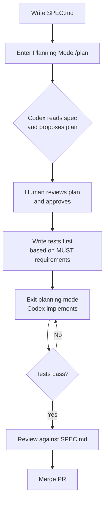

# Spec-Driven Development with Codex: Writing Specifications Before Code


Test-Driven Development (TDD) tells the agent *when it is done*. Spec-Driven Development (SDD) tells it *what to build in the first place*. The two approaches are not competing — they compose. But specs sit upstream of tests, and skipping them is the most common reason agentic workflows produce code that is technically correct but architecturally wrong.

This article covers how to write effective specification files, how Codex consumes them during planning mode, and how to connect the spec→test→implementation pipeline into a repeatable workflow.

---

## Why Specifications Matter More with Agents Than with Humans

When a human developer starts a task, they carry implicit context: they have read the surrounding code, attended the planning meeting, and absorbed the organisation's conventions through months of experience. An agent starts fresh every session with only what you explicitly provide.[^1]

A vague prompt like "add user authentication" leaves an enormous decision space open: Which standard (OAuth 2.0? JWT? Session cookies)? Which library? Where do tokens live? What is the refresh strategy? An experienced developer would ask or infer. Codex will pick an answer — often a plausible one — and proceed. Without a spec, you have no contract to verify against and no basis to reject the output other than taste.

A specification resolves that decision space before the first line of code is written. It is the contract between human intent and agent execution.[^2]

---

## The Spec File Format

No single canonical format exists, but a widely adopted community standard has emerged from discussions in the Codex GitHub repository.[^3] A complete `SPEC.md` contains exactly three top-level sections:

```markdown
# Feature: <name>

## Overview
A succinct description of the feature and the motivation behind it.
One or two paragraphs maximum.

## Requirements
- The system MUST validate tokens on every authenticated request.
- The refresh endpoint SHOULD return a new access token within 200 ms.
- The system MAY cache public-key lookups for up to 60 seconds.

## Design
High-level technical considerations: architecture, chosen libraries,
external dependencies, data models. No implementation detail — that
belongs in a plan, not a spec.
```

Requirements use RFC 2119 modal verbs (`MUST`, `SHOULD`, `MAY`) to express normative strength.[^3] This is not ceremony — it gives Codex explicit signal about which constraints are hard and which are flexible. `MUST` failures block acceptance; `SHOULD` violations warrant a comment but not a rejection.

Keep specs concise. A bloated spec is as harmful as a bloated `AGENTS.md` — it dilutes signal and increases the chance the agent fixates on peripheral detail.[^4]

---

## The ExecPlan: Specs for Multi-Hour Tasks

For complex, multi-hour implementations, OpenAI's own Cookbook formalises a complementary artefact: the **ExecPlan** (typically stored in `PLANS.md`).[^5] Where a `SPEC.md` captures *what* to build, an ExecPlan captures *how* the agent will build it — and crucially, it is a living document that the agent updates as it works.

A minimal ExecPlan skeleton:

```markdown
# ExecPlan: <short action-oriented title>

## Purpose
What user-visible behaviour does this plan enable?

## Context and Orientation
Repository layout, defined terms, external dependencies.

## Plan of Work
- [ ] Step 1: Scaffold the auth module (src/auth/)
- [ ] Step 2: Implement token validation middleware
- [ ] Step 3: Write integration tests (tests/auth/)
- [ ] Step 4: Update AGENTS.md with auth conventions

## Surprises & Discoveries
(updated by Codex as it works)

## Decision Log
(updated by Codex as it works)

## Outcomes & Retrospective
(completed at the end)
```

Every ExecPlan must be fully self-contained — it should contain all knowledge and instructions needed for a fresh Codex session to restart without losing context.[^5] This property is what enables multi-hour autonomous runs: if a session is interrupted, the next run picks up from the plan rather than prompting the user to reconstruct the context.

You wire an ExecPlan into Codex via `AGENTS.md`:

```markdown
## Planning

When asked to implement a complex feature, first create an ExecPlan in PLANS.md.
Define acceptance criteria as observable, demonstrable behaviour.
Update the plan continuously. Do not prompt for next steps — proceed to the next milestone.
```

---

## Connecting Spec to Planning Mode

Codex planning mode (`/plan`, or **Shift+Tab** to cycle modes) instructs the model not to write or modify files — it reasons, proposes an approach, and waits for human confirmation.[^6] This is where a `SPEC.md` earns its value: the agent reads the spec, populates a plan of work, and surfaces any open questions before a single file changes.

The recommended workflow:



The spec drives what tests you write in step E. Every `MUST` in the requirements section should map to at least one test assertion. This linkage — spec requirement → test case → implementation — is what gives the pipeline its predictability.[^7]

---

## Spec-Driven Tooling Ecosystem

Several community tools have emerged to automate the spec pipeline for Codex.

### cc-sdd

`cc-sdd` (Kiro-style commands) is an NPM package that brings structured SDD to Codex CLI, Claude Code, Cursor, and five other agents.[^8] After `npx cc-sdd@latest --codex`, you gain slash commands:

```bash
/kiro:spec-init        # initialise a new specification
/kiro:spec-requirements # generate EARS-formatted requirements
/kiro:spec-design       # create architectural design with Mermaid diagrams
/kiro:spec-tasks        # decompose into parallel-executable tasks
/kiro:spec-impl         # execute implementation
```

The framework enforces human review at each phase boundary — you approve requirements before design is generated, approve design before tasks are decomposed, and approve tasks before implementation begins. This staged gate pattern is the key to keeping the agent aligned with intent throughout a complex feature build.

### codex-spec

The `codex-spec` CLI (GitHub: shenli/codex-spec) stores all artefacts in a `.codex-specs/` directory with a consistent structure:[^9]

```
.codex-specs/
├── context/
│   ├── product.md      # product-level context
│   ├── tech.md         # technology choices
│   └── structure.md    # repository layout
└── 2026-03-28_auth-refresh/
    ├── specification.md
    ├── requirements.md
    ├── plan.md
    └── tasks.json
```

The `context/` layer is the key differentiator: it captures project-wide conventions once, so individual specs reference them without repetition. `codex-spec execute` runs individual tasks with full context injection, and `codex-spec status` surfaces a progress report across all active specs.

### GitHub Spec-Kit

GitHub's `spec-kit` (github/spec-kit) takes a broader multi-agent approach — it supports 25+ agents and provides Skills for Codex CLI via `$speckit-*` commands.[^10] Its six-phase workflow (Constitution → Specification → Planning → Tasks → Implementation → Review) adds a **Constitution** phase that establishes project-wide principles before any feature work begins. This is useful for teams onboarding multiple engineers to an agentic workflow — the constitution file captures the shared conventions that would otherwise live only in tribal knowledge.

### Kiro for Codex (VS Code Extension)

For teams already living in VS Code, the `kiro-for-codex` extension provides a visual panel for managing specs, steering documents, and prompts without leaving the editor.[^11] It generates requirements, design, and task breakdowns by invoking Codex CLI at each stage, and displays spec phase status in a sidebar — useful for tracking progress across a session that spans multiple spec phases.

---

## The Spec → Test → Implementation Pipeline in Practice

Here is a concrete example for a token-refresh endpoint. The spec might read:

```markdown
# Feature: JWT Token Refresh

## Overview
Authenticated clients whose access tokens are expiring should be able to
obtain a fresh pair without re-entering credentials.

## Requirements
- The `/auth/refresh` endpoint MUST accept a valid refresh token in the
  Authorization header (Bearer scheme).
- The endpoint MUST return a new access token and refresh token pair.
- Expired or revoked refresh tokens MUST receive a 401 response.
- The endpoint SHOULD complete within 150 ms at the 95th percentile.

## Design
Use the existing `TokenService` (src/services/token.ts). Refresh tokens
are stored as SHA-256 hashes in the `refresh_tokens` Postgres table.
Do not introduce a new caching layer — Redis is not in scope.
```

From the `MUST` requirements alone you derive your test skeleton before dispatching Codex:

```typescript
describe('POST /auth/refresh', () => {
  it('returns 200 with new token pair for valid refresh token', ...)
  it('returns 401 for expired refresh token', ...)
  it('returns 401 for revoked refresh token', ...)
  it('rejects requests without Bearer scheme', ...)
})
```

Now dispatch Codex in execute mode with the failing test suite as the feedback signal. The spec told it what to build; the tests tell it when it has succeeded. The combination eliminates the two most common failure modes: architectural drift (building the wrong thing) and ambiguous completion (not knowing when to stop).[^7]

---

## When Spec-Driven Is Worth the Overhead

Spec-driven development adds an upfront phase. For simple, well-scoped tasks — "rename this function across the codebase", "add a log statement here" — it is pure overhead. Apply it when:

- The task involves architectural decisions that are hard to reverse (data model changes, new service boundaries, API contracts)
- Multiple subagents will work in parallel and need a shared definition of done[^8]
- The feature requires sign-off from a human reviewer before implementation begins
- You are working in a team and the spec serves as the human-readable contract between engineers and the agent

For everything else, a well-crafted prompt with a clear acceptance criterion is sufficient.

---

## Citations

[^1]: OpenAI Codex documentation — agents read only what you provide in AGENTS.md and the current session context. <https://developers.openai.com/codex/cli>

[^2]: "A Practical Path to Spec-Driven Development with Codex", Marcos, March 2026. <https://mmarcosab.medium.com/a-practical-path-to-spec-driven-development-with-codex-a3cec3ef554a>

[^3]: "Plan / Spec Mode" — Codex GitHub Discussions #7355, community-adopted SPEC.md format with RFC 2119 requirements. <https://github.com/openai/codex/discussions/7355>

[^4]: "The AGENTS.md Bloat Problem", Daniel Vaughan, 2026-03-27. ETH Zurich research-backed finding that over-detailed context files reduce agent success rates. <https://danielvaughan.github.io/codex-resources/articles/2026-03-27-agents-md-bloat-problem/>

[^5]: "Using PLANS.md for multi-hour problem solving", OpenAI Cookbook. <https://developers.openai.com/cookbook/articles/codex_exec_plans>

[^6]: "Codex Plan Mode: Stop Code Drift with Plan→Execute (2026)", SmartScope. Plan mode on by default from v0.96+; activated via `/plan` or Shift+Tab. <https://smartscope.blog/en/generative-ai/chatgpt/codex-plan-mode-complete-guide/>

[^7]: "Test-First Development with Codex: Using TDD as the Agent Feedback Loop", 2026-03-28. <https://danielvaughan.github.io/codex-resources/articles/2026-03-28-test-first-development-codex-tdd-feedback-loop/>

[^8]: cc-sdd — Spec-Driven Development for Codex CLI and 7 other agents via `/kiro:spec-*` commands. <https://github.com/gotalab/cc-sdd>

[^9]: codex-spec — automated spec-driven workflows for Codex CLI with `.codex-specs/` directory structure. <https://github.com/shenli/codex-spec>

[^10]: GitHub Spec-Kit — six-phase SDD with Constitution→Specification→Planning→Tasks→Implementation→Review and Codex Skills support. <https://github.com/github/spec-kit>

[^11]: Kiro for Codex — VS Code extension for visual spec management with Codex CLI integration. <https://github.com/atman-33/kiro-for-codex>
