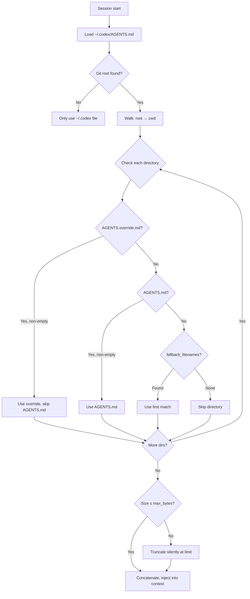
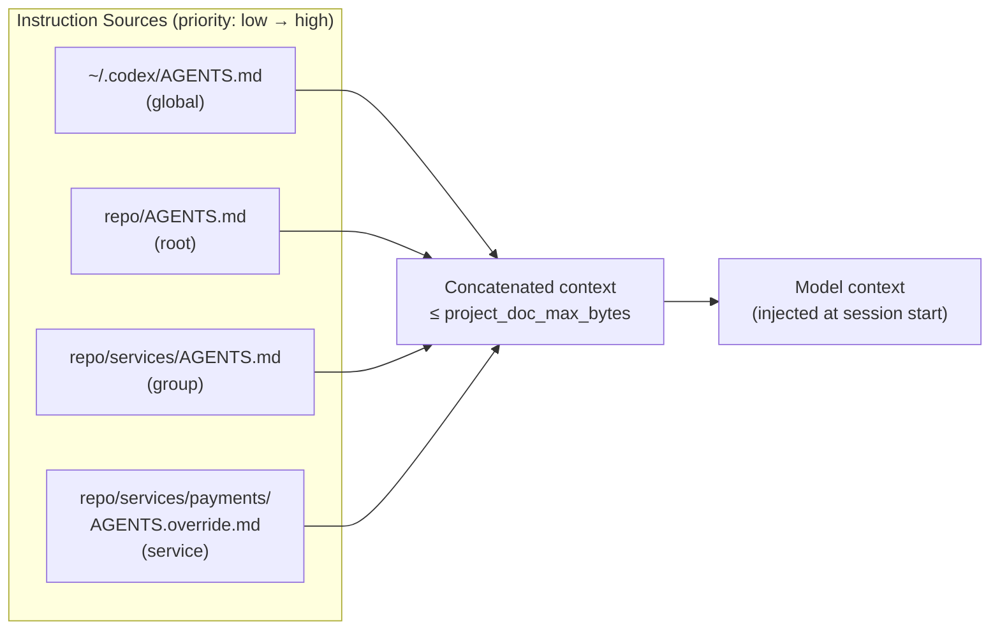

# Advanced AGENTS.md Patterns for Monorepos


Monorepos concentrate a large surface area of code under a single Git root, and that concentration creates a fundamental tension for AI coding agents: a flat, single AGENTS.md in the repository root cannot simultaneously express the sharp, service-specific conventions that each team needs. A payment-service team requires PCI DSS-aware prompts; the UI components package needs component-library constraints; the data-pipeline group has its own test scaffolding rules. Loading everything into one file is the AGENTS.md bloat trap at industrial scale.[^1]

Codex CLI resolves this with a scope chain: a root-to-leaf directory walk that discovers and concatenates AGENTS.md files, layering specificity as it descends. This article covers how that chain actually works, how to exploit it for large monorepos, the config keys that control its behaviour, and the known limitations you will hit in production.

---

## How the Discovery Algorithm Works

At session start, Codex builds the instruction chain exactly once.[^2] The algorithm has three phases:

1. **Global scope** — reads `~/.codex/AGENTS.md` (or `~/.codex/AGENTS.override.md` if present).
2. **Project walk** — starting from the Git root, walks toward the current working directory; at each directory it checks, in order: `AGENTS.override.md`, then `AGENTS.md`, then each name in `project_doc_fallback_filenames`. The first non-empty file found at each level is included; the rest are skipped.
3. **Concatenation** — all discovered files are joined (root first, leaf last) up to `project_doc_max_bytes` bytes.



The result is a **last-write-wins** composition: instructions closer to the leaf directory appear later in the concatenated string and therefore carry higher specificity in the model's attention. At 32 KiB default, a deep monorepo can exhaust the budget before reaching leaf-level instructions, which makes the configuration of `project_doc_max_bytes` a first-class operational concern.[^3]

---

## Configuration Keys

All keys live in TOML. They can be set at user level (`~/.codex/config.toml`) or project level (`.codex/config.toml` at the project root, loaded only for trusted projects).[^4]

```toml
# ~/.codex/config.toml

# Filenames to try at each directory level if AGENTS.md is absent.
# The list is tried in order; the first non-empty match wins.
project_doc_fallback_filenames = ["AGENTS.md", "TEAM_GUIDE.md", ".agents.md"]

# Byte limit on the combined, concatenated instruction context.
# Default: 32768 (32 KiB). Raise for deep monorepos with verbose service guides.
project_doc_max_bytes = 65536

# Which directory names are treated as project root markers.
# Default: [".git"]. Set to [] to treat the current working directory as root.
project_root_markers = [".git", ".pijul"]

# Enable the child_agents_md feature flag to surface AGENTS.md scope metadata
# in the model's instruction messages (useful for debugging override chains).
[features]
child_agents_md = true
```

The `project_doc_fallback_filenames` key is particularly useful for polyglot teams that work across Codex CLI, Claude Code (which uses `CLAUDE.md`), and Cursor (`.cursorrules`). You can point a single canonical file at multiple names to avoid duplication:[^5]

```toml
project_doc_fallback_filenames = ["AGENTS.md", "CLAUDE.md", "AI_INSTRUCTIONS.md"]
```

This does not provide live bidirectional sync — the list is simply the search order — but it removes the need to maintain parallel files when teams use more than one tool.

---

## Practical Monorepo Layout

A mid-size monorepo with 20–50 services benefits from a three-tier hierarchy:

```
~/.codex/AGENTS.md                      # Personal: preferred language, code style
myrepo/
  AGENTS.md                             # Tier 1 — repo root: team standards,
                                        #   build commands (nx, turborepo, bazel),
                                        #   PR conventions, commit message format
  services/
    AGENTS.md                           # Tier 2 — services group: REST/gRPC
                                        #   conventions, service-level testing rules,
                                        #   shared environment variables
    payments/
      AGENTS.override.md                # Tier 3 — payments: PCI DSS rules override
    auth/
      AGENTS.md                         # Tier 3 — auth: OAuth2/OIDC conventions
  packages/
    ui-components/
      AGENTS.md                         # Tier 3 — UI: Storybook, component patterns
    shared-utils/
      AGENTS.md                         # Tier 3 — utils: zero external deps policy
  .codex/
    config.toml                         # Project-level config (trusted projects only)
```

When Codex starts in `services/payments/`, it loads:

| Order | File | Purpose |
|-------|------|---------|
| 1 | `~/.codex/AGENTS.md` | Personal style |
| 2 | `myrepo/AGENTS.md` | Repo-wide standards |
| 3 | `myrepo/services/AGENTS.md` | Service group conventions |
| 4 | `myrepo/services/payments/AGENTS.override.md` | PCI DSS override (highest specificity) |

Note that `AGENTS.override.md` at level 4 **replaces** `AGENTS.md` at that level — it does not suppress parent levels. The parent chain is always loaded; the override only swaps out the file at its own directory.[^6]

---

## Writing Effective Service-Level AGENTS.md Files

### Tier 1 — Repo Root

Keep the root AGENTS.md to foundational, stable content that genuinely applies everywhere:

- Build commands and expected artefact locations
- Test runner invocations (with working-directory caveats)
- PR title format and commit conventions
- Monorepo-specific gotchas (e.g. "always run `nx affected` before committing — do not run tests for the entire repo")
- Links to ADRs or team decision logs

Avoid service-specific rules here. Every byte at the root tier occupies budget that service tiers need.

### Tier 2 — Group Level

Group-level files (e.g. `services/AGENTS.md`) are useful when multiple services share a pattern that does not apply to the entire repo:

```markdown
## Services Conventions

- All services expose a `/healthz` endpoint returning 200 on start-up.
- Integration tests require Docker Compose; run with `make test-integration` from the service directory.
- Environment variables are documented in each service's `.env.example`; never hardcode credentials.
- Services use the shared logging library at `packages/logger` — do not import third-party loggers directly.
```

### Tier 3 — Service/Package Level

This is where specificity earns its place. Be concrete and prescriptive:

```markdown
## Payments Service

PCI DSS SAQ-D scope — all changes here require:
- No logging of card numbers, CVV, or full PAN anywhere in application code
- All database queries use parameterised statements (no string interpolation)
- Encryption at rest via `packages/vault-client` — no direct AES usage
- Every PR must include a `SECURITY.md` section describing data flow changes

Test suite: `pytest tests/ -m "not integration"` (unit); `make test-pci` (PCI validation suite)
Model: prefer `gpt-5.4` with `model_reasoning_effort = "high"` for this service.
```

The profile directive in AGENTS.md works because Codex respects model and effort hints in the instruction context.[^7]

---

## The 32 KiB Budget Problem

At `project_doc_max_bytes = 32768` (the default), four verbose tiers can exhaust the budget before reaching the deepest service file.[^8] Two strategies address this:

**Raise the limit** via `project_doc_max_bytes`. The practical ceiling is bounded by how many tokens the model can attend to effectively — raising beyond 64 KiB has diminishing returns and increases session cost.

**Right-size each file**. Apply the progressive disclosure principle: put only what a senior engineer would not already know. Build command boilerplate, language syntax, and framework basics waste budget.

```toml
# .codex/config.toml (project root, trusted projects)
# Raise the budget for this deep monorepo
project_doc_max_bytes = 65536
```

You can verify what actually loaded using a quick one-shot:

```bash
codex --ask-for-approval never \
  "List all AGENTS.md files you have loaded for this session and their approximate byte sizes."
```

---

## Override Files for Regulated Services

`AGENTS.override.md` serves a different purpose from `AGENTS.md`: it is a hard replacement, useful when a service's requirements are so different from the group norm that the group-level file would actively mislead the agent. Payments, security, and compliance services are the canonical cases.[^9]

An override file should begin with an explicit statement of what it replaces:

```markdown
# payments/AGENTS.override.md
# This file REPLACES services/AGENTS.md for the payments service.
# All services-group conventions are superseded by the rules below.
# Refer to the repo-root AGENTS.md for build commands and PR format.

## Payments Service — PCI DSS Scope
...
```

The comment is for human readers; the model sees the concatenated chain, not individual file provenance.

---

## Fallback Filenames for Polyglot Teams

The `project_doc_fallback_filenames` key is particularly valuable in organisations that standardised on a different filename before AGENTS.md became the cross-tool convention. If your team has 50 services with `AI_CONTEXT.md` files, you do not need to rename them:

```toml
# ~/.codex/config.toml
project_doc_fallback_filenames = ["AGENTS.md", "AI_CONTEXT.md", "TEAM_GUIDE.md"]
```

Codex will find `AI_CONTEXT.md` at any level where `AGENTS.md` is absent. The search is short-circuiting: once a match is found at a directory level, remaining names are skipped for that level.[^10]

---

## Known Limitations

**No dynamic reload mid-session.** Codex loads the AGENTS.md chain once at session start. If your workflow involves running Codex from the repo root and asking it to work across multiple services, it will load the root-level chain (not individual service files) for the whole session. Issue #12115 (opened February 2026) tracks this as an open enhancement request — dynamic loading when the working directory changes, analogous to how Claude Code handles CLAUDE.md.[^11]

**No named variants.** There is no `--agents review` flag to switch between `AGENTS.review.md` and `AGENTS.md` for different workflow modes. Issue #10067 (opened January 2026) proposes this, but it is not yet implemented.[^12]

**Silent truncation.** If the concatenated chain exceeds `project_doc_max_bytes`, the excess is silently dropped. Issue #7138 led to a UI indicator (PR #7139) that may show a truncation warning in the TUI, but the default behaviour in non-interactive modes is still silent.[^13]

**Trusted project requirement.** The `.codex/config.toml` project-level config (for settings like `project_doc_max_bytes` overrides) is only loaded for projects in the trusted-projects list. A fresh clone will not pick it up until the user runs `codex trust` or confirms trust interactively.

---

## Debugging the Chain

When an agent ignores service-specific rules, the chain is the first thing to check:

```bash
# Confirm which files were loaded (one-shot, no-approval, minimal effort)
codex --ask-for-approval never \
  --model gpt-5.4 \
  --reasoning-effort minimal \
  "Repeat back the full contents of your AGENTS.md instructions verbatim."
```

Enable the `child_agents_md` feature flag for additional scope metadata in the model's instruction messages:

```toml
[features]
child_agents_md = true
```

For CI pipelines where you need a deterministic instruction set regardless of the engineer's working directory, use the `--no-project-doc` flag (available as of v0.117.0) to suppress AGENTS.md discovery entirely, then inject the relevant file explicitly via `--instructions-file`.[^14] ⚠️ Verify the exact flag name against the current `codex --help` output before relying on this in production pipelines.

---

## Architecture Summary



The pattern that works at scale: **thin at the top, specific at the leaf**. The root file earns every byte by holding content that is universal. Each descending tier adds only what the tier above cannot know. The `project_doc_fallback_filenames` and `project_doc_max_bytes` config keys are the operational dials that make this work without rewriting every service file.

---

## Citations

[^1]: [The AGENTS.md Bloat Problem – Codex Resources](https://danielvaughan.github.io/codex-resources/articles/2026-03-27-agents-md-bloat-problem/)
[^2]: [Custom instructions with AGENTS.md – Codex CLI Docs](https://developers.openai.com/codex/guides/agents-md)
[^3]: [AGENTS.md silently truncated – Issue #7138 · openai/codex](https://github.com/openai/codex/issues/7138)
[^4]: [Configuration Reference – Codex CLI Docs](https://developers.openai.com/codex/config-reference)
[^5]: [AGENTS.md Cross-Tool Unified Management Guide – SmartScope Blog](https://smartscope.blog/en/generative-ai/github-copilot/github-copilot-agents-md-guide/)
[^6]: [Agent does not read AGENTS.override.md – Issue #11838 · openai/codex (closed March 16, 2026)](https://github.com/openai/codex/issues/11838)
[^7]: [Best Practices – Codex CLI Docs](https://developers.openai.com/codex/learn/best-practices)
[^8]: [Advanced Configuration – Codex CLI Docs](https://developers.openai.com/codex/config-advanced)
[^9]: [AGENTS.md Advanced Patterns – Codex Resources](https://danielvaughan.github.io/codex-resources/articles/2026-03-26-agents-md-advanced-patterns/)
[^10]: [Config Basics – Codex CLI Docs](https://developers.openai.com/codex/config-basic)
[^11]: [Dynamically loading nested AGENTS.md – Issue #12115 · openai/codex (open Feb 18, 2026)](https://github.com/openai/codex/issues/12115)
[^12]: [Feature: Add --agents flag for named AGENTS.md variants – Issue #10067 · openai/codex (open Jan 28, 2026)](https://github.com/openai/codex/issues/10067)
[^13]: [AGENTS.md truncation warning indicator – PR #7139 · openai/codex](https://github.com/openai/codex/issues/7138)
[^14]: [Codex CLI v0.117.0 Release Notes – openai/codex](https://github.com/openai/codex/releases)
