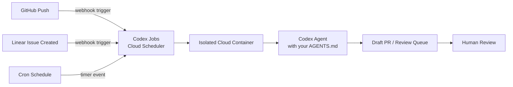
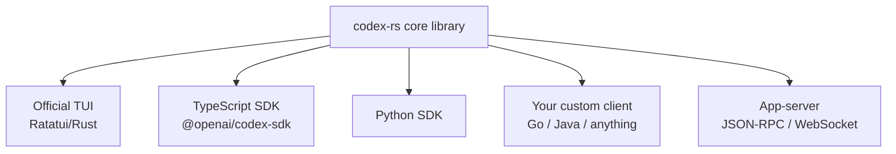
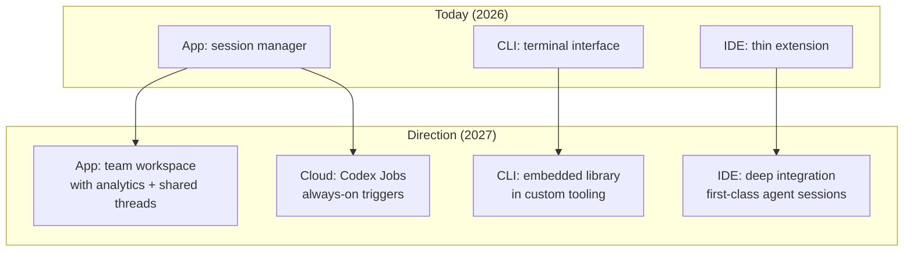

# Codex CLI in 2027: Reading the Roadmap

---

OpenAI does not publish a product roadmap for Codex CLI. What it does publish — obsessively, in sub-weekly releases — is a changelog. When you read the changelog as a signal rather than a list, a clear direction emerges. This is my reading of that direction: where Codex CLI is going by 2027, based on the architectural commitments already made, the features already shipped, and the explicit statements OpenAI has made about what comes next.

This is not speculation for its own sake. These are engineering bets: if you understand where the platform is heading, you can build workflows today that will compound in value rather than require rework.

---

## The Model Trajectory: GPT-5.x and Beyond

The current model lineup tells a story about the pace of iteration[^1]:

| Model | Role | Status |
|---|---|---|
| `gpt-5.4` | Flagship frontier model | Current recommended |
| `gpt-5.4-mini` | Fast subagent / interactive use | Current recommended |
| `gpt-5.3-codex` | Specialist coding model | Available |
| `gpt-5.3-codex-spark` | Real-time (>1,000 tokens/s, Cerebras) | Research preview |
| `gpt-5.2-codex`, `gpt-5.1-codex-max`, `gpt-5-codex` | Earlier iterations | Superseded |

Seven distinct Codex-oriented models shipped between 2025 and March 2026[^1]. The iteration cadence is roughly six to eight weeks per major model. By that pace, 2027 brings another three to five model generations — likely culminating in something called `gpt-5.5-codex` or a re-numbered `gpt-6-codex`.[^2]

What matters architecturally is not the marketing name but the capability curve. OpenAI noted a "sharp jump in cybersecurity evaluation capability starting with GPT-5-Codex, another large jump with GPT-5.1-Codex-Max, and a third jump with GPT-5.2-Codex" — and explicitly stated they expect the trajectory to continue.[^2] Each new model handles longer task horizons more reliably, meaning the sweet spot for unattended agentic work grows with every release.

The practical implication: workfows designed around the *weakest* model that can do a job today will become dramatically cheaper within 12 months. Design for capability, then optimise costs as the cheaper models catch up.

---

## Codex Jobs: The Cloud-Native Execution Layer

The biggest architectural bet OpenAI is explicitly signalling is the move from local automation to cloud-native scheduling. Today, Codex Automations run on a schedule defined in the app — but only while the developer's machine is on.[^3]

The stated roadmap replaces this with **Codex Jobs**: cloud-based triggers that run automations entirely in OpenAI's infrastructure, on events like a GitHub push, a Linear ticket assignment, or a scheduled cron.[^3][^4]

This is a meaningful shift in what Codex *is*. Local automations make Codex a productivity tool. Cloud-triggered jobs make it a **DevOps actor** — a persistent, always-on member of the CI/CD pipeline that reacts to events without any human initialising a session.

The precedent is already set: `codex cloud exec` and the Slack/Linear integrations (where `@Codex` in a thread dispatches a task to a cloud container) already demonstrate the pattern at small scale.[^4] Jobs is the generalisation of that capability.

What to build now: design your AGENTS.md and skills as if they will run in a headless cloud environment with no local filesystem access. That means MCP servers for external data, structured output for downstream consumption, and hooks that don't assume an interactive terminal.

---

## The Rust Rewrite: What It Actually Unlocks

`codex-rs`, the Rust rewrite that is now 95.6% of the codebase, is not primarily a performance story.[^5] It is an extensibility and embedding story.

The OpenAI team stated their intent explicitly: "Ultimately, OpenAI hopes `core/` to be a library crate that is generally useful for building other Rust/native applications that use Codex."[^5]

The wire protocol between the Rust core and the TUI layer already allows clients in any language — TypeScript (the current TUI), Python (the SDK), and hypothetically Go, Java, or anything that can speak JSON-RPC over stdio or WebSocket.[^6]

By 2027 this likely means:

- **Embeddable Codex** as a dependency in IDE plugins, CI systems, and custom tooling, without invoking a subprocess
- **Language-native SDKs** beyond TypeScript, enabling Codex integration from Python build systems, Go CLIs, or Rust toolchains directly
- **Community forks** of the core that experiment with alternative models or alternative approval UIs while sharing the underlying agentic loop

If you are building internal developer tooling that wraps AI coding capabilities, the architectural direction is: wait for the library crate to stabilise, then embed it rather than wrapping the CLI as a subprocess. The current subprocess pattern will become legacy.

---

## The Plugin Ecosystem at Scale

Plugins launched as first-class features in v0.117.0 (March 2026)[^6]. The 20+ first-party plugins shipped on day one (Slack, Figma, Google Drive, Notion, Cloudflare, and others) establish the distribution model.

The trajectory from here follows a predictable pattern:

1. **Community plugin marketplace** — a registry analogous to npm or the VS Code extension marketplace, with installation via `/plugins install <name>` and discovery via search
2. **Plugin analytics** — usage telemetry that surfaces which plugins are most activated across sessions, feeding back into skill design
3. **Plugin scoping per project** — `AGENTS.md` already scopes skills per directory; the same pattern extends to plugins, so a frontend project auto-activates the Figma and Netlify plugins while a data engineering project activates BigQuery and dbt

The interesting second-order effect: as the plugin ecosystem matures, the value of AGENTS.md shifts from *teaching the agent domain knowledge* (which plugins handle) to *expressing project-specific policy* — when to use which plugin, what to never do, what output format is expected. The instructions get leaner; the tools get richer.

---

## The App Workspace Evolution

The current Codex app is a session manager with a sidebar. The trajectory of features — thread search and archive (v0.117.0 app update), parallel worktree sessions, inline code review, automation scheduling — points toward something closer to a lightweight development workspace.[^7]

By 2027, expect:

- **Shared team threads**: a Slack-style model where a thread can be assigned to a team member and the agent's history is visible to the whole team
- **Agent analytics dashboard**: token usage, task success rate, compaction events, and approval frequency per project — the data is already captured via OTel, the UI layer is the work remaining
- **VS Code / JetBrains deep integration**: the current IDE extension is relatively thin; the path-based multi-agent addressing and JSON-RPC protocol enable much richer IDE-native workflows where agent sessions are first-class objects in the IDE sidebar

---

## What This Means for How You Work Now

Three strategic adjustments worth making today based on this reading:

**1. Invest in cloud-portable workflows.** Automations that depend on local file paths, SSH tunnels, or machine-specific state will not transfer to Codex Jobs. Start building automations using MCP servers and structured output today, so they work when cloud execution arrives.

**2. Treat AGENTS.md as policy, not documentation.** As plugins take over domain knowledge, the value of AGENTS.md concentrates in approval policy, tool allowlists, and output constraints. Audit your existing AGENTS.md files: anything that describes "how Python works" can be replaced by a Python plugin; what should remain is "in this project, never modify the schema without a migration, and always run the full test suite before committing."

**3. Monitor the `codex-rs` `core/` library status.** When OpenAI stabilises it as a library crate, that is the signal to move custom Codex integrations from subprocess wrappers to proper library consumers. The shift will bring significant reliability and performance improvements for embedded use cases.

The underlying direction is coherent: Codex is becoming a cloud-native, always-on, embeddable platform rather than a local CLI tool. The CLI will remain — it is too useful and too loved — but it will increasingly be one client among many for the same underlying agent infrastructure. Building against that infrastructure rather than the surface is the long-term play.

---

## Citations

[^1]: OpenAI, "Models – Codex," developers.openai.com/codex/models, accessed March 2026. <https://developers.openai.com/codex/models>

[^2]: OpenAI, "Introducing GPT-5.2-Codex," openai.com/index/introducing-gpt-5-2-codex/, accessed March 2026. <https://openai.com/index/introducing-gpt-5-2-codex/>

[^3]: IntuitionLabs, "OpenAI Codex App: A Guide to Multi-Agent AI Coding," intuitionlabs.ai, accessed March 2026. <https://intuitionlabs.ai/articles/openai-codex-app-ai-coding-agents>

[^4]: OpenAI, "Introducing upgrades to Codex," openai.com/index/introducing-upgrades-to-codex/, accessed March 2026. <https://openai.com/index/introducing-upgrades-to-codex/>

[^5]: InfoQ, "Another Rust Rewrite: OpenAI's Codex CLI Goes Native, Drops Node and TypeScript for Rust," infoq.com, accessed March 2026. <https://www.infoq.com/news/2025/06/codex-cli-rust-native-rewrite/>

[^6]: Releasebot, "Codex by OpenAI – Release Notes – March 2026 Latest Updates," releasebot.io, accessed March 2026. <https://releasebot.io/updates/openai/codex>

[^7]: Augment Code, "OpenAI Codex CLI ships v0.116.0 with enterprise features," augmentcode.com, accessed March 2026. <https://www.augmentcode.com/learn/openai-codex-cli-enterprise>
