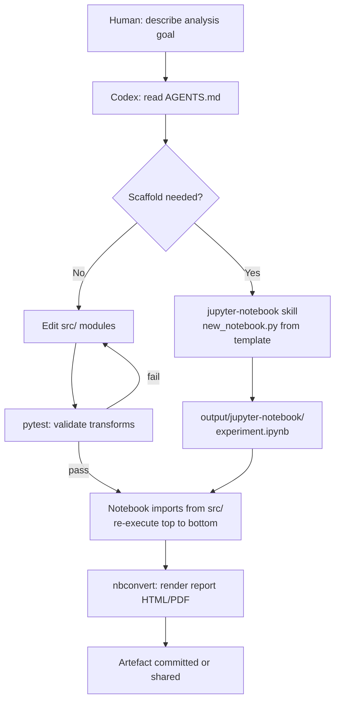

# Codex CLI for Jupyter Notebooks and Scientific Python

**Date:** 2026-03-29
**Tags:** jupyter, scientific-python, pandas, polars, notebook-workflows, agents-md, nbconvert, data-engineering

Jupyter notebooks are the lingua franca of scientific Python, yet the `.ipynb` format is one of the environments where Codex CLI historically performs least reliably. The notebook file is JSON — cells nested inside a structured document — and Codex's default file-editing tools were designed for plain text.[^1] The result is a subtle impedance mismatch: Codex can *reason* about notebook code perfectly well, but writing back to `.ipynb` files is error-prone.

This article covers the practical patterns that make Codex CLI genuinely useful for data science and scientific Python projects: the recommended `.py`-first workflow, the official `jupyter-notebook` Agent Skill, AGENTS.md conventions for notebook-centric repos, and parallel subagent patterns for data experiments.

---

## The `.ipynb` Problem

Jupyter notebooks store code, markdown, and output together in a single JSON file. A typical cell looks like this:

```json
{
  "cell_type": "code",
  "execution_count": null,
  "metadata": {},
  "outputs": [],
  "source": [
    "import polars as pl\n",
    "df = pl.read_parquet('data/events.parquet')\n",
    "df.head()"
  ]
}
```

Codex's file-writing tools emit plain text. When a write operation corrupts the outer JSON structure — a trailing comma, a missing escape, a newline inside a string field — the notebook becomes unreadable.[^2] Community reports document data loss when Codex edits markdown cells, and invalid-format outputs when generating new notebooks.[^3]

**The practical upshot:** treat `.ipynb` files as output artefacts, not source files. Do your development in `.py`, and only generate or render notebooks when the logic is finished.

---

## The `.py`-First Workflow

The most reliable pattern is to keep runnable logic in Python modules and use notebooks purely for narration and output display.

```
data-project/
├── AGENTS.md
├── src/
│   ├── load.py          # data ingestion
│   ├── transform.py     # feature engineering
│   └── analyse.py       # analysis functions
├── notebooks/
│   └── eda.ipynb        # narrative wrapper around src/
└── reports/
    └── weekly.ipynb     # generated by CI via nbconvert
```

When you ask Codex to implement a new analysis step, it edits `src/analyse.py`. Once complete, the notebook imports from `src/` and re-executes cleanly — no notebook JSON editing required.

Your `AGENTS.md` should make this contract explicit:

```markdown
## Notebook conventions
- All analysis logic lives in `src/`. Notebooks are presentation layers only.
- Do NOT edit `.ipynb` files directly. Edit `src/` modules, then mention
  that the relevant notebook cells import from those modules.
- To create a new notebook, use the `jupyter-notebook` skill.
- To execute notebooks in CI, use `jupyter nbconvert --to notebook --execute`.
```

---

## The `jupyter-notebook` Agent Skill

For cases where you genuinely need Codex to scaffold a new notebook, the official `jupyter-notebook` skill from `openai/skills` handles the JSON structure safely using bundled templates and a Python helper script.[^4]

Install it in your project:

```bash
npx skills add https://github.com/openai/skills --skill jupyter-notebook
```

The skill (released February 1, 2026) provides two notebook archetypes:[^5]

| Mode | Use when... |
|------|------------|
| **experiment** | Exploratory, analytical, or hypothesis-driven work |
| **tutorial** | Instructional, step-by-step, or audience-facing content |

The helper at `scripts/new_notebook.py` loads a template (`assets/experiment-template.ipynb` or `assets/tutorial-template.ipynb`), sets the title cell, and writes a structurally valid `.ipynb` to `output/jupyter-notebook/`. The script depends only on the Python standard library — no notebook runtime required at scaffold time.

The skill also ships reference documentation: `references/notebook-structure.md` documents safe editing rules for the JSON format, and `references/quality-checklist.md` defines done criteria including top-to-bottom execution with no errors.

---

## AGENTS.md Patterns for Scientific Python

Beyond notebook conventions, a well-tuned `AGENTS.md` will specify your preferred scientific Python stack. Polars has largely supplanted Pandas for performance-critical data work in 2026 — benchmarks show 30× speedups on large datasets, with lazy evaluation and multi-threaded execution enabling 10 million records in 2.3 seconds compared to 14.5 seconds in Pandas.[^6]

```markdown
## Scientific Python preferences
- Use **Polars** for all DataFrame operations. Import as `import polars as pl`.
- Use **Pandas** only when an external library requires it (scikit-learn, statsmodels).
  In that case, convert with `.to_pandas()` at the last possible moment.
- Use `uv` for environment management. Never use `pip install` directly.
- Store credentials in `.env`. Never hardcode them. Confirm `.env` is in `.gitignore`.
- Prefer **PyArrow** for Parquet I/O over `pd.read_parquet`.
- Use `polars.scan_parquet()` for datasets > 1 GB (lazy evaluation, no full load).

## Testing
- Data transformation functions in `src/` must have pytest unit tests in `tests/`.
- Use `polars.testing.assert_frame_equal` for DataFrame assertions.
- Run `uv run pytest` before marking any task complete.
```

The principle here — articulated by Max Woolf's deep dive into agentic coding — is to add a rule to `AGENTS.md` every time the agent does something you dislike.[^7] Codex defaults to Pandas because it dominates training data; the explicit rule reliably overrides that default.

---

## Workflow: From Prompt to Reproducible Notebook



---

## Parallel Data Experiments with Subagents

When you have multiple independent analyses — say, feature-engineering variants for a model comparison — Codex subagents can run them concurrently. Create a coordinator task file:

```toml
# experiments.toml
[spawn_on_csv]
agents = [
  { prompt = "Run ablation: feature set A. Write results to output/experiment-a.json.", workdir = "." },
  { prompt = "Run ablation: feature set B. Write results to output/experiment-b.json.", workdir = "." },
  { prompt = "Run ablation: feature set C. Write results to output/experiment-c.json.", workdir = "." }
]
max_threads = 3
```

Each subagent runs in an isolated session with its own context, eliminating cross-contamination between experiment branches. The coordinator then aggregates `output/experiment-*.json` and writes a comparison table.

This pattern works best when:

- Each experiment is self-contained (reads shared data but writes separate outputs)
- Experiments take minutes, not seconds (spawning overhead is ~5s per agent)
- Results are structured JSON or Parquet, not side-effecting database writes

---

## nbconvert Integration for CI Reports

For reproducible reporting, `nbconvert` executes notebooks headlessly and outputs HTML or PDF. Use it in CI to verify that your analytical notebooks run cleanly after each push:

```yaml
# .github/workflows/notebooks.yml
- name: Execute notebooks
  run: |
    uv run jupyter nbconvert \
      --to notebook \
      --execute \
      --ExecutePreprocessor.timeout=600 \
      --output-dir=reports/ \
      notebooks/*.ipynb
```

If any cell raises an unhandled exception, nbconvert exits non-zero and fails the job. Combine with `--allow-errors` only in exploratory branches, never on `main`.

For PDF reports to stakeholders, chain HTML conversion and `weasyprint`:

```bash
uv run jupyter nbconvert --to html notebooks/weekly.ipynb
uv run weasyprint reports/weekly.html reports/weekly.pdf
```

Reference these output artefacts in your AGENTS.md so Codex knows what CI validates:

```markdown
## CI validation
- `make test` runs pytest and executes notebooks via nbconvert.
- A passing CI run means: all unit tests green AND all notebooks execute top-to-bottom.
- If you edit a src/ module, re-run `jupyter nbconvert --execute` locally to confirm.
```

---

## Known Limitations

**Kernel state vs file state.** Notebooks maintain in-memory kernel state that is invisible to Codex. If a notebook relies on variables set in an earlier session, Codex cannot reproduce that state. Your `AGENTS.md` should instruct agents to write notebooks that are always runnable from a fresh kernel (`Kernel > Restart and Run All`).

**Large output cells.** Notebooks with embedded images or large DataFrames in output cells balloon in size, consuming context budget. Instruct agents to strip outputs before committing:

```bash
uv run jupyter nbconvert --to notebook --ClearOutputPreprocessor.enabled=True \
  --output notebooks/clean.ipynb notebooks/analysis.ipynb
```

**asyncio in Jupyter.** The OpenAI Agents SDK Cookbook notes that Jupyter/IPython already runs an event loop, so `asyncio.run()` raises an error inside a notebook cell.[^8] Use `await` directly in notebook cells, or use `nest_asyncio` as a workaround when consuming SDK output inside a notebook.

---

## Summary

| Concern | Recommendation |
|---------|----------------|
| Editing `.ipynb` files | Use `jupyter-notebook` skill or avoid direct edits |
| DataFrame library | Polars (specify in AGENTS.md) |
| Environment management | `uv` (specify in AGENTS.md) |
| Logic location | `src/` modules; notebooks are presentation layers |
| Parallel experiments | Subagent TOML with `max_threads` |
| CI validation | `nbconvert --execute`; fail on exceptions |
| Kernel state | Always runnable from fresh kernel |

The central insight: Codex is excellent at scientific Python when you treat it as a code-editor for `.py` files and a scaffolder for notebooks, rather than a notebook editor. Keep the logic in modules, keep the structure in version-controlled source, and use skills and nbconvert for the notebook surface.

---

## Citations

[^1]: OpenAI Community Forum, "Codex working with Jupyter notebook .ipynb files" — <https://community.openai.com/t/codex-working-with-jupyter-notebook-ipynb-files/1260513>
[^2]: nbformat documentation, "The Jupyter Notebook Format" — <http://ipython.org/ipython-doc/3/notebook/nbformat.html>
[^3]: OpenAI Community Forum, ibid. — multiple user reports of data loss when Codex edits markdown cells.
[^4]: agentskills.so, "jupyter-notebook — Agent Skill by openai/skills" — <https://agentskills.so/skills/openai-skills-jupyter-notebook>
[^5]: agentskills.so, jupyter-notebook skill, created February 1, 2026 — see skill metadata at the above URL.
[^6]: Nerd Level Tech, "Mastering Python Data Analysis in 2026: From Pandas to Polars" — <https://nerdleveltech.com/mastering-python-data-analysis-in-2026-from-pandas-to-polars>
[^7]: Max Woolf, "An AI agent coding skeptic tries AI agent coding, in excessive detail" (February 2026) — <https://minimaxir.com/2026/02/ai-agent-coding/>
[^8]: OpenAI Cookbook, "Building Consistent Workflows with Codex CLI & Agents SDK" — <https://cookbook.openai.com/examples/codex/codex_mcp_agents_sdk/building_consistent_workflows_codex_cli_agents_sdk>
