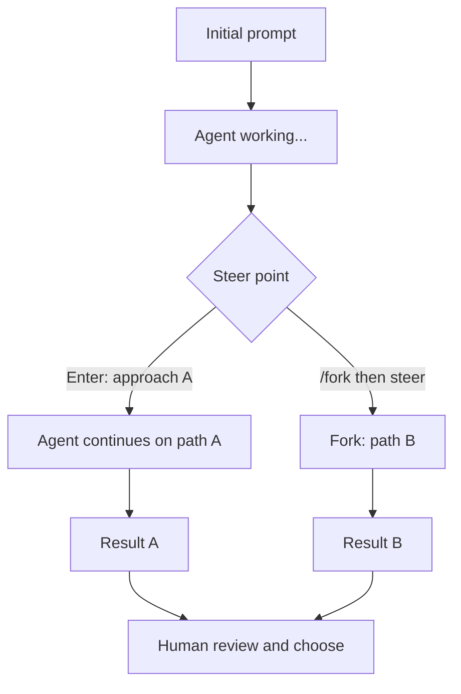

# Mid-Turn Steering in Codex CLI: Redirecting Agents in Flight


---

The default posture for working with agentic tools has always been: write a careful prompt, send it, wait, evaluate the output, and iterate. This wait-and-restart loop is acceptable when the agent is fast and cheap. It becomes expensive when the agent is deep into a complex refactor and you notice it has taken a wrong turn three minutes ago.

Steer Mode, introduced across versions 0.81 through 0.87 in the three days from 14 to 17 January 2026 and stabilised as a default feature in v0.98.0, breaks this loop.[^1] It turns the Codex CLI interaction model from a one-shot prompt-response cycle into a live collaboration: you can inject new instructions while the agent is actively working, and it will adapt without losing the progress it has already made.

This article covers how steering works mechanically, the practical patterns that make it useful for senior developers, how to combine it with the `/fork` command for controlled experimentation, and the known limitations you need to work around.

---

## The Two Keyboard Paths

When Codex is actively running, the TUI presents a minimal composer at the bottom of the screen. Two keys route input differently:

**`Enter` — Immediate steering injection**

Pressing Enter sends your message *immediately* into the current turn. The model receives it mid-execution and adjusts its approach without abandoning context. The work already completed stays intact.[^2]

Use this for:

- Urgent redirects: `"stop — don't modify that file"`
- Discovered constraints: `"the config lives at /etc/myapp/config.toml, not the default path"`
- Priority pivots: `"the migration script is more important than the tests right now"`

**`Tab` — Queue for next turn**

Tab queues your message to fire after the current operation completes. The agent finishes what it's doing before seeing your input.[^3]

Use this for:

- Follow-up work: `"after you finish the auth module, update the migration script"`
- Non-urgent context additions: `"the deploy target is staging, not production"`
- Scope expansions that don't affect the current task

The distinction is intentional. Enter means *now*; Tab means *after you're done with what you're doing*. Getting this right is the fundamental skill in steering-based workflows.

---

## Practical Patterns

### The Constraint Discovery Pattern

You notice partway through a refactor that the agent has made an assumption you need to correct. Rather than aborting and restarting:

1. Watch the agent's diff stream as it works
2. When you spot a problematic assumption, press Enter
3. State the constraint precisely: `"the UserRepository interface is frozen — don't modify it"`
4. The agent incorporates the constraint and continues

A worked example:

> Codex is refactoring the auth module...
>
> `[Enter]` → `"Use bcrypt instead of argon2 — we already have it as a dependency"`
>
> Codex adjusts immediately, mid-turn.
>
> `[Tab]` → `"Once auth is done, update the migration script too"`
>
> Codex finishes the auth refactor, then starts the migration.[^3]

### The Priority Redirect Pattern

When a multi-step task is running and you want to change the order of operations:

```
# Codex is writing unit tests for every function in order...

[Enter] "Skip to the payment module tests first — that's the blocker for QA"
```

The agent deprioritises the earlier work and jumps to what you've indicated is more urgent. This is particularly useful in long-running sessions where external context changes (a colleague messages you about a specific bug, a CI pipeline fails elsewhere) and you need to reorder the agent's work queue.

### The Scope Reduction Pattern

Agents have a well-documented tendency to expand scope when left unsupervised. Steering lets you trim this in real time rather than reviewing a larger-than-expected diff at the end:

```
[Enter] "Only fix the specific bug I described — don't refactor the surrounding code even if it looks messy"
```

This is the agentic equivalent of a tight PR review comment, issued before the diff is written rather than after.

---

## Combining Steering with `/fork`

The `/fork` command creates an independent conversation branch at the current point, leaving the original thread intact.[^4] The combination of steering and forking creates a genuinely powerful exploration workflow:

1. Run Codex with an initial approach
2. Once it's part way through, use `[Enter]` to steer in direction A
3. Later, use `/fork` (or `codex fork --last` from a second terminal) to branch the session
4. Steer the fork in direction B

You now have two live sessions exploring different implementations, both starting from the same intermediate state. This is useful when:

- A design decision has emerged mid-implementation that you genuinely aren't sure about
- You want to compare two approaches without committing to either

Forking from an earlier message in the thread (not just from the latest turn) was added in a subsequent release, giving even more granular control over where the branch point sits.[^5]



---

## Designing Prompts to Minimise Steering

The need to steer frequently is a signal that your initial prompt was underspecified. Steering is a valuable escape hatch, but it is still an interruption — each injection adds latency and requires your attention during a turn that was supposed to be running autonomously.

A prompt structured to reduce steering typically includes:

**Explicit constraints upfront:**

```
Refactor the authentication module. Constraints:
- The UserRepository interface is frozen
- Use bcrypt (already a dependency, not argon2)
- Do not modify tests — only production code
- The config path is /etc/myapp/config.toml
```

**Priority ordering for multi-step tasks:**

```
Priority order (complete in sequence):
1. Fix the null pointer in PaymentService
2. Update the migration script for the new schema
3. Add unit tests — only if time permits
```

**Explicit scope limits:**

```
Only fix the described bug. Do not refactor surrounding code even if
you notice issues. Add a TODO comment for anything else you spot.
```

An AGENTS.md file is a good place to codify the constraints that apply across all sessions for a given project — that way they are injected automatically and you are not relying on steering to communicate them every time.[^6]

---

## GPT-5.3-Codex and Steering Quality

Earlier model versions had a limitation: steering injections were technically received but the model's ability to integrate them mid-generation was inconsistent. Some steers would result in awkward seam points in the output where the model tried to reconcile its prior direction with the new instruction.

GPT-5.3-Codex, the model version released alongside the Codex CLI v0.98.0 stabilisation of Steer Mode, explicitly improved this.[^7] The model preserves intermediate work and integrates steering instructions more naturally, treating the injection as additional context rather than a context switch. GPT-5.3-Codex also provides more frequent progress updates during long-running turns, which makes the decision of when to steer easier to make — you have better visibility into what the agent is doing before you need to decide whether to intervene.

---

## Known Limitations

**Mid-flight API calls cannot be interrupted.** If the agent is in the middle of a tool call — fetching a URL, waiting for a subprocess, calling an external API — the steer injection is received and queued but does not affect the in-flight call. Codex will tell you when steering has been accepted but cannot yet be acted upon.[^8]

**Steering during `/review` is partially broken.** GitHub issue [#10895](https://github.com/openai/codex/issues/10895) documents that instructions injected via steering mid-review are not always incorporated by the review pass — the agent may complete the review using its original plan before acknowledging the steer. The workaround is to wait for the review to complete and then give instructions in a normal turn.[^9]

**Steer mode operates in the interactive TUI only.** `codex exec` in non-interactive mode does not support mid-turn steering. This is by design — `codex exec` is intended for headless CI/CD use where there is no human present to steer.[^10]

**Context window pressure.** Each steering injection adds tokens to the current turn's context. In a very long-running session that is already approaching its context limit, frequent steering can accelerate compaction. If you are running a session that is expected to be long, prefer `/compact` early and prefer Tab-queued instructions (which are processed in fresh turns where compaction can occur between turns) over aggressive Enter-based steering.

---

## Quick Reference

| Action | Key | When it fires |
|---|---|---|
| Steer immediately | `Enter` | During the current turn, right now |
| Queue for next turn | `Tab` | After the current operation completes |
| Branch the session | `/fork` | Creates new thread from current state |
| Branch from specific message | `Esc+Enter` on that message | Creates branch from earlier in thread |

---

## Summary

Steer Mode changes the agent interaction model from a series of discrete prompt-response cycles into a live collaboration. The Enter/Tab distinction is simple but powerful: Enter is for urgent course corrections that need to affect the work in progress, Tab is for additions and follow-ups that can wait. Combining steering with `/fork` enables side-by-side exploration of alternative approaches. The quality of steering is highest in GPT-5.3-Codex, which integrates injections more naturally than earlier models.

The practical implication for production workflows is straightforward: you no longer need to accept an overshooting agent and restart from scratch. Watch what the agent is doing, steer when it diverges from what you need, and use forks when you genuinely want to explore two paths simultaneously.

---

## Citations

[^1]: Mid-turn steering introduced in v0.81–v0.87, 14–17 January 2026. JP Caparas, "Codex CLI's Busy Week: Steer Mode, /fork, and 7 Releases in 3 Days", Dev Genius, January 2026. <https://blog.devgenius.io/codex-clis-busy-week-steer-mode-fork-and-7-releases-in-3-days-ece5c742923e>

[^2]: Enter key behaviour for immediate injection. Blake Crosley, "Codex CLI: The Definitive Technical Reference", 2026. <https://blakecrosley.com/guides/codex>

[^3]: Tab key behaviour for queued instructions, and practical example. Blake Crosley, "Codex CLI: The Definitive Technical Reference", 2026. <https://blakecrosley.com/guides/codex>

[^4]: `/fork` command creates an independent conversation branch. Releasebot, "Codex by OpenAI — Release Notes March 2026 Latest Updates". <https://releasebot.io/updates/openai/codex>

[^5]: Forking from an earlier message in the thread. Codex App 26.317 (March 18, 2026): "Mid-thread conversation forks (not just from the latest turn)". Releasebot, <https://releasebot.io/updates/openai/codex>

[^6]: AGENTS.md for project-scoped constraints. OpenAI Codex documentation, AGENTS.md guide. <https://developers.openai.com/codex/agents-md>

[^7]: GPT-5.3-Codex steering improvements: preserves intermediate work and integrates steering naturally; 25% faster than predecessor. OpenAI Codex Changelog. <https://developers.openai.com/codex/changelog>

[^8]: Mid-flight tool calls cannot be interrupted by steering. MarketBetter, "OpenAI Codex Mid-Turn Steering: The Killer Feature for GTM Teams [2026]". <https://marketbetter.ai/blog/codex-mid-turn-steering-gtm/>

[^9]: Steering during `/review` does not take effect mid-review. GitHub issue #10895, "Support steering during /review". <https://github.com/openai/codex/issues/10895>

[^10]: `codex exec` non-interactive mode does not support steering. OpenAI Codex documentation, CLI reference. <https://developers.openai.com/codex/cli/reference>
