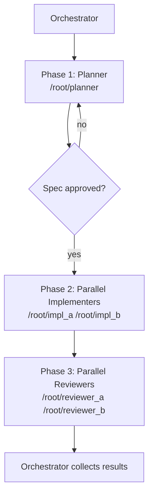
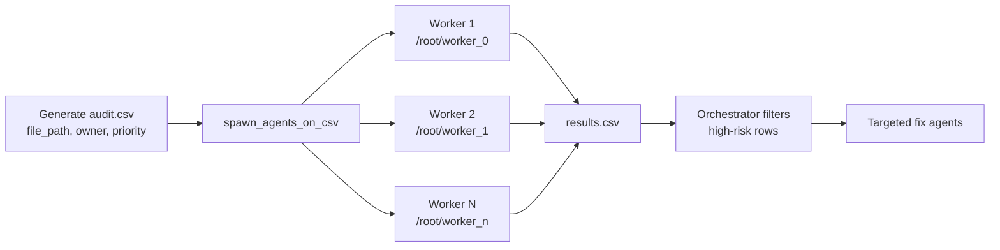
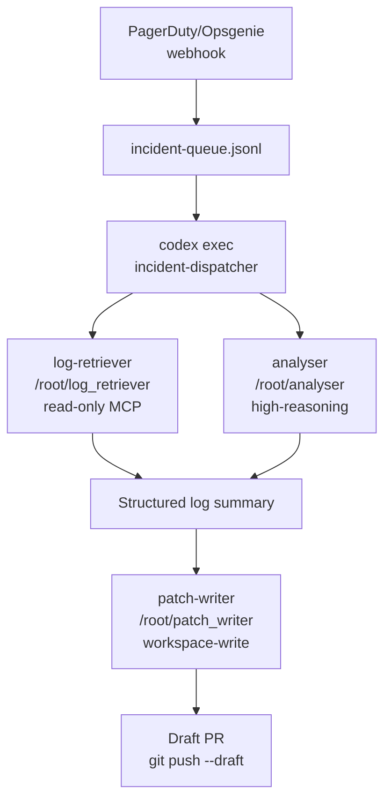

# Codex CLI Multi-Agent Patterns in Production: Real-World Case Studies

**Date:** 2026-03-29
**Tags:** multi-agent-v2, path-addressing, production-patterns, case-studies, orchestration, spawn-agents-on-csv, toml-config, otel

Sub-agents reached general availability in Codex CLI v0.115.0 (16 March 2026)[^1] and gained readable path-based addressing in v0.117.0 (26 March 2026)[^2]. With the scaffolding now stable, production teams have started publishing their actual topologies. This article walks through three patterns — parallel feature development with wave-based phase gating, a continuous review-and-fix swarm for legacy codebases, and an event-driven incident response agent — with complete TOML configurations, cost models, OTel integration, and documented failure modes.

## Prerequisites

Sub-agents are enabled by default from v0.115.0 onwards; no feature flag is required[^1]. You'll need:

- Codex CLI ≥ v0.117.0 for path-based addressing[^2]
- Custom agent TOML files in `.codex/agents/` (project-scoped) or `~/.codex/agents/` (global)[^3]
- The `[agents]` section in your `config.toml` to set thread limits and depth

```toml
# .codex/config.toml
[agents]
max_threads = 8
max_depth   = 1
```

Keep `max_depth = 1` unless you explicitly need recursive fan-out; uncapped depth dramatically inflates token usage[^3].

---

## Case Study 1: Parallel Feature Development with Wave-Based Phase Gating

### Topology

A three-phase wave model with a hard gate between each phase. Phase one is always sequential — the planner runs alone and produces a `SPEC.md`. Phases two and three spawn parallel workers from that spec.



### Agent TOML Definitions

```toml
# .codex/agents/planner.toml
name                  = "planner"
description           = "Reads requirements and writes SPEC.md. Read-only except for SPEC.md."
model                 = "gpt-5.4"
model_reasoning_effort = "high"
sandbox_mode          = "workspace-write"

[instructions]
text = """
Your only output is SPEC.md in the project root.
Write: goals, interface contracts, data model, test acceptance criteria.
Do not write implementation code.
"""
```

```toml
# .codex/agents/implementer.toml
name                  = "implementer"
description           = "Implements one module from SPEC.md. Writes tests alongside code."
model                 = "gpt-5.4"
model_reasoning_effort = "medium"
sandbox_mode          = "workspace-write"
nickname_candidates   = ["Atlas", "Bruno", "Clio", "Dora"]

[instructions]
text = """
Read SPEC.md. Implement only the module you are assigned.
Write unit tests. Do not touch modules owned by other implementers.
"""
```

```toml
# .codex/agents/reviewer.toml
name                  = "reviewer"
description           = "Reviews correctness, security, and test coverage for an assigned module."
model                 = "gpt-5.4"
model_reasoning_effort = "medium"
sandbox_mode          = "read-only"
nickname_candidates   = ["Athena", "Bora"]

[instructions]
text = """
Review the assigned module. Return a structured JSON report via report_agent_job_result:
{ "module": string, "risks": string[], "passed": boolean, "comments": string }
"""
```

### Orchestrator Prompt Pattern

Phase 1 spawns the planner and waits for `SPEC.md`. Phase 2 reads the spec, extracts module list, and spawns one implementer per module in parallel. Phase 3 spawns one reviewer per module; any `passed=false` result triggers a targeted re-implementation loop for that module only.

### Cost Model

For a five-module feature: ~$0.24 (planner) + 5×$0.30 (implementers) + 5×$0.12 (reviewers) = **~$2.34**. Iteration loops are the main cost multiplier — target first-pass review pass rates ≥70% to keep total cost under $5.[^4]

### Failure Modes

- **Spec drift**: If implementers read SPEC.md at different clock times and it's edited mid-run, their outputs diverge. Mitigation: generate a SHA-256 of SPEC.md in the orchestrator and include it as a context seed for each implementer.
- **Module ownership collision**: Two implementers writing the same file. Mitigation: make module boundaries explicit file paths in SPEC.md, not just logical names.

---

## Case Study 2: Continuous Review-and-Fix Swarm for Legacy Codebases

This pattern uses `spawn_agents_on_csv` (merged PR #10935, 24 February 2026)[^5] to batch-audit every file in a legacy codebase and optionally apply fixes.



### Orchestrator Prompt

```text
Call spawn_agents_on_csv with:
  csv_path:        "./audit.csv"
  output_csv_path: "./results.csv"
  instruction: >
    Review {file_path} owned by {owner}.
    Check for: security vulnerabilities, missing tests, dead code, outdated dependencies.
    Call report_agent_job_result exactly once with JSON:
    { "file_path": string, "risk": "high"|"medium"|"low", "summary": string, "fix_required": boolean }
  max_concurrency: 8
  max_runtime_seconds: 300
```

### Global Config

```toml
# .codex/config.toml
[agents]
max_threads              = 16
job_max_runtime_seconds  = 300

[features]
sqlite = true
```

The `sqlite` feature flag is required for `spawn_agents_on_csv` state persistence[^5].

### Post-Processing: Targeted Fix Pass

After the swarm completes, filter `results.csv` for `fix_required=true, risk=high` rows and spawn a second wave of implementer agents — this time with `sandbox_mode = "workspace-write"` — to apply fixes:

```bash
codex exec --full-auto --profile fix-swarm \
  "Read results.csv. Filter rows where fix_required is true and risk is high.
   For each, spawn an implementer agent to apply the minimum safe fix to that file.
   Commit each fix with a message referencing the file path."
```

### OTel Monitoring

Wire up the `[otel]` section to export spans and metrics for swarm health[^6]:

```toml
[otel]
endpoint     = "http://localhost:4318"
service_name = "codex-audit-swarm"
export_spans   = true
export_metrics = true
```

Spans emit under `codex.agent_job`; use `codex_agent_job_completions_total` and `codex_agent_job_duration_seconds_bucket` in your metrics dashboard for per-worker completion rates and P95 latency.

### Failure Modes

- **Workers timing out silently**: A worker that exits without calling `report_agent_job_result` is marked `failed` in the output CSV — the batch continues, but those rows are silently skipped[^5]. Always cross-reference `results.csv` row count against `audit.csv`.
- **SQLite contention at high concurrency**: Above `max_threads = 16`, write contention on the SQLite state file causes intermittent `SQLITE_BUSY` errors. Keep concurrency ≤ 12 until the upstream locking fix ships. ⚠️

---

## Case Study 3: Event-Driven Incident Response Agent

### Architecture

A webhook receiver (external to Codex) writes an incident descriptor to a JSONL queue file. A scheduled `codex exec` job polls the queue, spawns agents per incident, and produces a draft PR for human review.



### Agent Definitions

```toml
# .codex/agents/log-retriever.toml
name        = "log-retriever"
description = "Fetches structured logs for a given service and time window via MCP."
model       = "gpt-5.4-mini"
sandbox_mode = "read-only"

[[mcp_servers]]
name    = "datadog"
command = "npx"
args    = ["-y", "@datadog/codex-mcp-server"]
env     = { DD_API_KEY = "${DD_API_KEY}", DD_APP_KEY = "${DD_APP_KEY}" }
```

```toml
# .codex/agents/analyser.toml
name                  = "analyser"
description           = "Performs root cause analysis from log summary and codebase context."
model                 = "gpt-5.4"
model_reasoning_effort = "high"
sandbox_mode          = "read-only"

[instructions]
text = """
You receive a log summary and a service name.
Identify the most probable root cause. Cross-reference against the codebase.
Output a structured JSON: { "service": string, "root_cause": string, "affected_files": string[], "confidence": number }
"""
```

```toml
# .codex/agents/patch-writer.toml
name        = "patch-writer"
description = "Writes a minimal targeted patch for a diagnosed incident."
model       = "gpt-5.4"
model_reasoning_effort = "medium"
sandbox_mode = "workspace-write"

[instructions]
text = """
You receive root cause analysis JSON. Apply the minimum safe patch.
Write or update tests. Do not touch files not in affected_files.
Create a branch named incident/<timestamp>. Push as a draft PR.
"""
```

### Dispatcher Prompt (codex exec)

```bash
codex exec --full-auto --profile incident-response --max-turns 40 \
  "Read incident-queue.jsonl. For each pending entry:
   spawn log-retriever for the last 30 minutes of logs.
   Spawn analyser with the log summary.
   If confidence > 0.7, spawn patch-writer to create a draft PR.
   Mark entry as processed. Write summary to incident-report.md."
```

### Safety Guardrails

Always require human approval before any `git push`: set `approval_policy = "unless-allow-listed"` in the patch-writer profile. Add a `PostTaskComplete` hook that runs `gh pr checks --watch` and stashes changes if CI fails — this prevents an automated fix from landing a broken branch.

At roughly $0.72 per incident (log retrieval ~$0.04, analysis ~$0.30, patching ~$0.38), 20 incidents per month costs ~$14.40 — negligible compared with on-call engineer time.

### Failure Modes

- **Log retriever MCP timeout**: The Datadog MCP server has a default 30-second timeout. If logs are large, the retriever silently returns an empty summary. Mitigation: set `max_runtime_seconds = 120` for the log-retriever agent and add an explicit check in the dispatcher prompt.
- **Analyser confidence below threshold**: Set a minimum confidence of 0.7 before proceeding to patching; below that, file the incident as `needs-human-review` in the queue rather than attempting an automated patch.

---

## Cross-Cutting Observations

**Path addressing changed the debugging experience.** Before v0.117.0, agent threads showed opaque UUIDs in the picker. Now addresses like `/root/log_retriever` appear in the TUI; pressing `/agent` cycles through running threads[^2]. This makes production multi-agent debugging tractable.

**Sandbox inheritance is a gotcha.** Sub-agents inherit the parent session's live sandbox override, not the value in their TOML[^3]. Opening a session with `--yolo` grants all children write access regardless of their agent file. Always start batch and incident-response sessions without `--yolo`.

**OTel is the only reliable per-agent cost source.** The TUI shows aggregate token usage; granular per-child accounting requires the `[otel]` section pointing at a metrics backend[^6].

---

## Citations

[^1]: [Sub-agents reach GA in Codex CLI v0.115.0 — OpenAI Developers changelog, March 2026](https://developers.openai.com/codex/changelog)
[^2]: [Path-based addressing in v0.117.0 — GitHub openai/codex Releases, March 26 2026](https://github.com/openai/codex/releases)
[^3]: [Subagents documentation — OpenAI Developers](https://developers.openai.com/codex/subagents)
[^4]: [Codex CLI Multi-Agent Capabilities — FlowDevs, 2026](https://www.flowdevs.io/blog/post/boost-your-workflow-with-codex-cli-multi-agent-capabilities)
[^5]: [PR #10935 — spawn_agents_on_csv — openai/codex, February 24 2026](https://github.com/openai/codex/pull/10935)
[^6]: [OpenTelemetry support in Codex CLI — OpenAI Developers changelog](https://developers.openai.com/codex/changelog)
