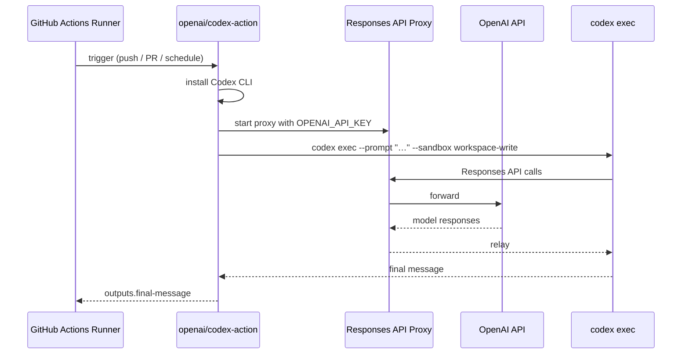
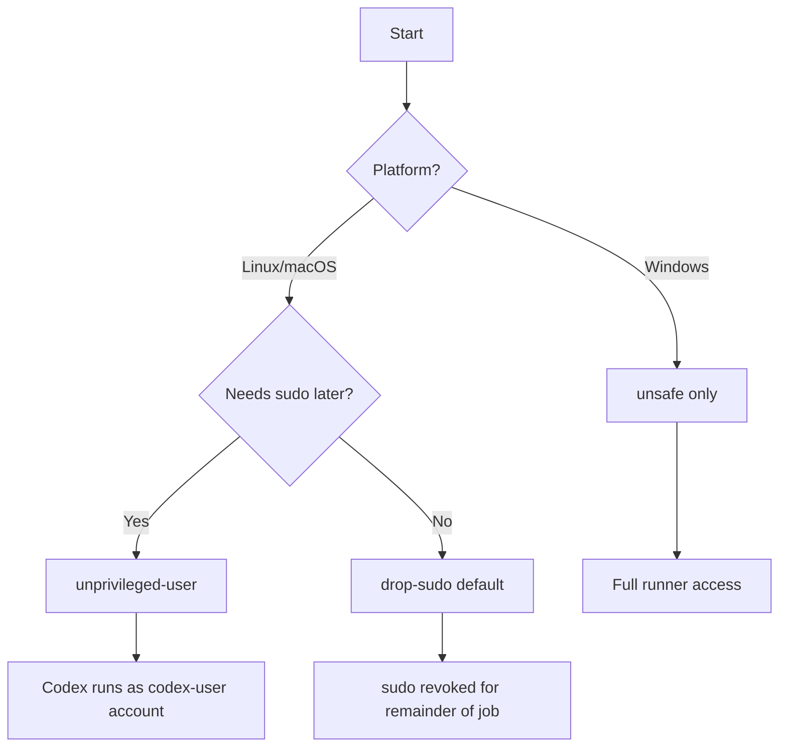
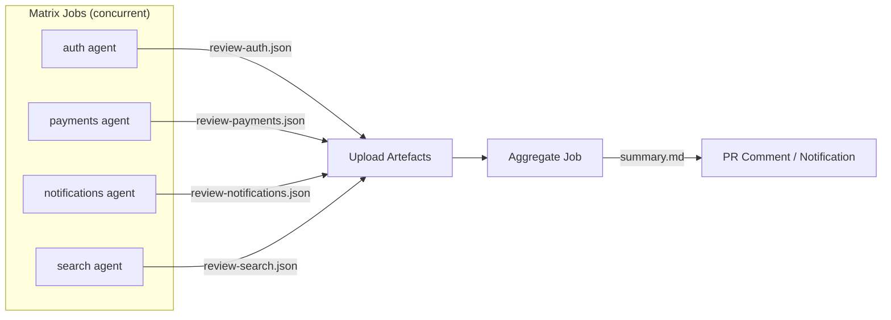
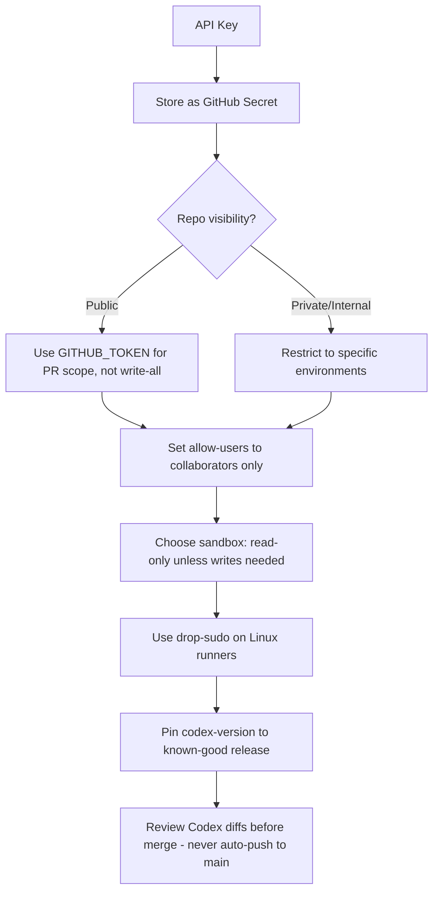

# Codex CLI + GitHub Actions: The Complete Integration Guide


The `openai/codex-action` GitHub Action lets you run the Codex CLI inside any GitHub Actions workflow — gating PRs on AI-driven code review, auto-fixing failing CI, or running repeatable agentic tasks on every push.[^1] This guide goes beyond the official quickstart: sandbox strategies, matrix parallelism, structured JSON output, Azure integration, cost attribution, and the full security model.

---

## Architecture Overview

When the action runs, it:

1. Installs the Codex CLI at the pinned or latest version
2. Starts a **Responses API proxy** that forwards calls to OpenAI (or Azure) using the supplied key
3. Invokes `codex exec` with your prompt and flags under the chosen sandbox and privilege model
4. Emits the final Codex message as the `final-message` job output[^2]



The proxy is the key security boundary: the runner never holds a raw `Authorization` header in process environment — the action owns the key and the proxy forwards requests on behalf of the CLI.[^3]

---

## Input Reference

All inputs are optional except `openai-api-key` and one of `prompt`/`prompt-file`.[^4]

| Input | Purpose | Default |
|---|---|---|
| `openai-api-key` | Secret key for the Responses proxy | *(required)* |
| `prompt` | Inline task instructions | — |
| `prompt-file` | Path to a `.md` or `.txt` prompt in the repo | — |
| `codex-args` | Extra `codex exec` flags (JSON array or shell string) | `""` |
| `model` | Model override | System default |
| `effort` | Reasoning effort level (`minimal`→`xhigh`) | System default |
| `sandbox` | Execution mode | `""` |
| `safety-strategy` | Privilege reduction strategy | `drop-sudo` |
| `output-file` | Write final message to this path | — |
| `codex-version` | Pin a specific CLI release | latest |
| `codex-home` | Shared Codex config directory | `~/.codex` |
| `responses-api-endpoint` | Override API endpoint (Azure, proxy) | OpenAI default |
| `working-directory` | Run Codex from this directory | repo root |
| `allow-users` | Comma-separated GitHub usernames that may trigger | all collaborators |
| `allow-bots` | Allow GitHub bots to trigger | `false` |

Store `openai-api-key` as a GitHub Actions secret; never hard-code it.[^5]

---

## Sandbox Modes

The `sandbox` input maps directly to `codex exec --sandbox`.[^6] Choose based on what the agent needs to do:

| Mode | File access | Network | Use when |
|---|---|---|---|
| `read-only` | Read-only | Blocked | Code review, analysis, report generation |
| `workspace-write` | Read+write under repo root | Blocked | Auto-fix, scaffold, generate docs |
| `danger-full-access` | Unrestricted | Unrestricted | Workflows that run live servers, e2e tests |

> ⚠️ `danger-full-access` with elevated runners gives the model broad access to the runner filesystem and network. Only use it in isolated, ephemeral environments.

---

## Safety Strategies

Separate from the Codex sandbox, the `safety-strategy` input controls the **OS-level privilege** of the process running the CLI.[^7]



- **`drop-sudo`** (default) — Removes the current user from the `sudo` group before running Codex. Irreversible for the job: any subsequent step that needs `sudo` must run in a new job on a fresh runner.[^8]
- **`unprivileged-user`** — Use with `codex-user` input to run as a pre-created non-root account. Gives you more control on self-hosted runners.
- **`read-only`** — Applies filesystem and network restrictions at the OS level in addition to Codex's own sandbox. Most restrictive option.
- **`unsafe`** — Required on Windows; no privilege reduction applied. ⚠️ Avoid on shared runners.

---

## Core Patterns

### 1. PR Code Review Bot

Gate every opened PR with a structured Codex review:

```yaml
name: Codex PR Review

on:
  pull_request:
    types: [opened, synchronize]

permissions:
  contents: read
  pull-requests: write

jobs:
  review:
    runs-on: ubuntu-latest
    steps:
      - uses: actions/checkout@v5
        with:
          fetch-depth: 0

      - name: Run Codex review
        id: review
        uses: openai/codex-action@v1
        with:
          openai-api-key: ${{ secrets.OPENAI_API_KEY }}
          prompt-file: .github/codex/prompts/pr-review.md
          sandbox: read-only
          safety-strategy: drop-sudo
          effort: medium
          output-file: review-output.md

      - name: Post review comment
        uses: peter-evans/create-or-update-comment@v4
        with:
          issue-number: ${{ github.event.pull_request.number }}
          body-file: review-output.md
```

Store prompts in `.github/codex/prompts/` so they are version-controlled alongside the workflow.[^9]

### 2. Auto-Fix Failing CI

Trigger a Codex repair pass after a test run fails:

```yaml
name: Codex Auto-Fix

on:
  workflow_run:
    workflows: ["CI"]
    types: [completed]

permissions:
  contents: write
  pull-requests: write

jobs:
  auto-fix:
    if: ${{ github.event.workflow_run.conclusion == 'failure' }}
    runs-on: ubuntu-latest
    steps:
      - uses: actions/checkout@v5
        with:
          ref: ${{ github.event.workflow_run.head_sha }}
          fetch-depth: 0

      - uses: actions/setup-node@v4
        with:
          node-version: 22
          cache: npm

      - run: npm ci

      - name: Run Codex fix
        uses: openai/codex-action@v1
        with:
          openai-api-key: ${{ secrets.OPENAI_API_KEY }}
          prompt: |
            The CI workflow at ${{ github.event.workflow_run.html_url }} failed.
            Identify the minimal change needed to make all tests pass.
            Implement only that change and stop.
          sandbox: workspace-write
          safety-strategy: drop-sudo
          effort: high

      - run: npm test

      - name: Open fix PR
        uses: peter-evans/create-pull-request@v6
        with:
          branch: codex/auto-fix-${{ github.run_id }}
          title: "fix: Codex auto-repair for failing CI"
          body: "Automated fix generated by Codex. Review before merging."
```

The pattern follows: diagnose → fix → verify → propose — keeping humans in the loop via a draft PR.[^10]

---

## Matrix Builds for Parallel Agent Runs

GitHub Actions' native `matrix` strategy lets you run independent Codex agents in parallel jobs sharing a single workflow. Use this to parallelise reviews, test-generation, or documentation tasks across services:

```yaml
name: Parallel Codex Service Review

on:
  push:
    branches: [main]

jobs:
  review:
    strategy:
      matrix:
        service: [auth, payments, notifications, search]
      fail-fast: false
    runs-on: ubuntu-latest
    steps:
      - uses: actions/checkout@v5

      - name: Review ${{ matrix.service }}
        id: codex
        uses: openai/codex-action@v1
        with:
          openai-api-key: ${{ secrets.OPENAI_API_KEY }}
          prompt: |
            Review the code in services/${{ matrix.service }}/.
            Focus on security, error handling, and test coverage.
            Output a structured JSON report.
          codex-args: >-
            ["--output-schema-file", ".github/codex/schemas/review.json"]
          sandbox: read-only
          effort: medium
          output-file: review-${{ matrix.service }}.json

      - name: Upload review
        uses: actions/upload-artifact@v4
        with:
          name: review-${{ matrix.service }}
          path: review-${{ matrix.service }}.json
```

Each matrix job runs as a separate runner, so four agents execute concurrently at the cost of four concurrent API calls.[^11] Set `fail-fast: false` so one agent's failure doesn't cancel the others.

### Aggregating Matrix Results

Use a follow-up `needs` job to combine the individual artefacts:

```yaml
  aggregate:
    needs: review
    runs-on: ubuntu-latest
    steps:
      - uses: actions/download-artifact@v4
        with:
          pattern: review-*
          merge-multiple: true
          path: reviews/

      - name: Summarise with Codex
        uses: openai/codex-action@v1
        with:
          openai-api-key: ${{ secrets.OPENAI_API_KEY }}
          prompt: |
            Combine all JSON review files in ./reviews/ into a single
            executive summary markdown document.
          sandbox: workspace-write
          output-file: summary.md
```



---

## Structured JSON Output

Pass `--output-schema` or `--output-schema-file` via `codex-args` to enforce a specific response shape.[^12] This is the critical pattern for workflows that need to parse Codex output programmatically rather than displaying it as Markdown:

```json
// .github/codex/schemas/review.json
{
  "type": "object",
  "required": ["severity", "issues", "recommendation"],
  "properties": {
    "severity": { "type": "string", "enum": ["low", "medium", "high", "critical"] },
    "issues": {
      "type": "array",
      "items": {
        "type": "object",
        "properties": {
          "file": { "type": "string" },
          "line": { "type": "integer" },
          "description": { "type": "string" }
        }
      }
    },
    "recommendation": { "type": "string" }
  }
}
```

```yaml
- name: Structured security scan
  id: scan
  uses: openai/codex-action@v1
  with:
    openai-api-key: ${{ secrets.OPENAI_API_KEY }}
    prompt-file: .github/codex/prompts/security-scan.md
    codex-args: '["--output-schema-file", ".github/codex/schemas/review.json"]'
    sandbox: read-only

- name: Fail on critical findings
  run: |
    SEVERITY=$(echo '${{ steps.scan.outputs.final-message }}' | jq -r '.severity')
    if [ "$SEVERITY" = "critical" ]; then
      echo "::error::Codex found critical security issue"
      exit 1
    fi
```

Structured output transforms Codex from a text generator into a **programmable CI gate**.[^13]

---

## Passing Artefacts Between Steps

The `codex-home` input lets you share MCP server configuration and local context between multiple action invocations in the same job:

```yaml
jobs:
  staged-pipeline:
    runs-on: ubuntu-latest
    steps:
      - uses: actions/checkout@v5

      # Step 1: Plan
      - name: Generate implementation plan
        uses: openai/codex-action@v1
        with:
          openai-api-key: ${{ secrets.OPENAI_API_KEY }}
          prompt: "Analyse the failing tests and write a step-by-step implementation plan to PLAN.md"
          sandbox: workspace-write
          codex-home: /tmp/codex-shared
          effort: high

      # Step 2: Implement (reads PLAN.md written above)
      - name: Execute implementation
        uses: openai/codex-action@v1
        with:
          openai-api-key: ${{ secrets.OPENAI_API_KEY }}
          prompt: "Read PLAN.md and implement each step. Run tests after each step."
          sandbox: workspace-write
          codex-home: /tmp/codex-shared
          effort: high
```

Using `codex-home` ensures both steps share the same MCP server state and session context, which matters for long-horizon tasks split across multiple invocations.[^14]

---

## Azure OpenAI Integration

For teams using Azure-hosted models — common in regulated environments or for cost attribution against an Azure subscription — override the Responses endpoint:

```yaml
- uses: openai/codex-action@v1
  with:
    openai-api-key: ${{ secrets.AZURE_OPENAI_API_KEY }}
    responses-api-endpoint: https://YOUR_PROJECT.openai.azure.com/openai/v1/responses
    model: gpt-5.3-codex
    prompt-file: .github/codex/prompts/review.md
    sandbox: read-only
```

The proxy sends `Authorization: Bearer <KEY>` to the Azure endpoint.[^15] Azure API Management policies can intercept this for chargeback and audit logging per-workflow.

---

## Cost Attribution in GitHub Actions Billing

Codex API costs are separate from GitHub Actions compute costs. Strategies to track them:

**1. Per-workflow tags via prompt injection**

Add a structured tag to every prompt:

```yaml
prompt: |
  [workflow: pr-review] [repo: ${{ github.repository }}] [run: ${{ github.run_id }}]
  Review the diff in this PR for correctness and security.
```

This appears in the OpenAI usage dashboard under the prompt content, allowing you to filter by tag.[^16]

**2. PostTaskComplete hook for logging**

Set up a `PostTaskComplete` hook in `.github/codex/config.toml` within the workflow context that writes token usage to a file:

```toml
[hooks]
PostTaskComplete = [
  { cmd = "sh", args = ["-c", "echo '{\"run\":\"$GITHUB_RUN_ID\",\"tokens\":\"$CODEX_TOKEN_USAGE\"}' >> /tmp/cost-log.json"] }
]
```

Upload `/tmp/cost-log.json` as an artefact, then ingest it into your cost dashboard.

**3. Separate API key per team**

Use different `OPENAI_API_KEY` secrets scoped to different GitHub environments (`staging`, `production`) — OpenAI's usage API breaks down usage per key.[^17]

---

## Branch Protection Integration

Require Codex review to pass before merging using status checks:

```yaml
name: Codex Quality Gate

on:
  pull_request:

jobs:
  quality-gate:
    runs-on: ubuntu-latest
    steps:
      - uses: actions/checkout@v5

      - name: Codex quality scan
        id: scan
        uses: openai/codex-action@v1
        with:
          openai-api-key: ${{ secrets.OPENAI_API_KEY }}
          prompt: |
            Analyse the diff. Output ONLY the word "PASS" if the code meets
            quality standards, or "FAIL: <reason>" if it does not.
          sandbox: read-only
          effort: minimal

      - name: Enforce gate
        run: |
          RESULT="${{ steps.scan.outputs.final-message }}"
          if [[ "$RESULT" != PASS* ]]; then
            echo "::error::Quality gate failed: $RESULT"
            exit 1
          fi
```

Add `quality-gate` as a required status check in your branch protection rules. The `effort: minimal` setting keeps latency and cost low for this high-frequency gate.[^18]

---

## Security Hardening Checklist



Key rules:

- **Never** set `permissions: write-all` — grant only the minimum (`contents: write`, `pull-requests: write`) needed.[^19]
- **Pin `codex-version`** to a specific release hash rather than `latest` in production workflows to prevent supply chain drift.
- **Always open a PR** rather than pushing directly to `main` or `master`. Codex output is a proposal, not a mandate.
- On **public repositories**, use `allow-users` to prevent external contributors from triggering expensive agentic workflows.
- The **`drop-sudo` side-effect** (revoked sudo for the remainder of the job) means you cannot run package managers with sudo after the action fires — sequence your steps accordingly.

---

## Practical Workflow Library

Store prompts as versioned files under `.github/codex/prompts/`. A recommended structure:

```
.github/
  codex/
    prompts/
      pr-review.md          # Standard PR review instructions
      security-scan.md      # Security-focused analysis
      test-generation.md    # Test scaffold prompts
      migration-check.md    # Breaking-change detection
    schemas/
      review.json           # Output schema for structured reviews
      migration.json        # Output schema for migration reports
```

This keeps prompts auditable, diffable, and reusable across workflows — the same prompt used in CI can be run locally with `codex exec --prompt-file .github/codex/prompts/pr-review.md`.[^20]

---

## GitHub Agentic Workflows Context

GitHub's February 2026 technical preview of **intent-driven repository automation** allows any compatible agent — including Codex — to receive natural-language instructions and generate complete GitHub Actions workflows from them.[^21] The longer-term direction: Codex as a first-class GitHub Actions participant, not just a workflow step. For now, `openai/codex-action@v1` is the production path.

---

## Citations

[^1]: OpenAI. "GitHub Action – Codex." *OpenAI Developers*. <https://developers.openai.com/codex/github-action>
[^2]: OpenAI. "openai/codex-action." *GitHub*. <https://github.com/openai/codex-action>
[^3]: OpenAI. "GitHub Action – Codex: Security." *OpenAI Developers*. <https://developers.openai.com/codex/github-action>
[^4]: OpenAI. "GitHub Action inputs reference." *OpenAI Developers*. <https://developers.openai.com/codex/github-action>
[^5]: GitHub. "Encrypted secrets." *GitHub Docs*. <https://docs.github.com/en/actions/security-guides/encrypted-secrets>
[^6]: OpenAI. "Sandbox modes." *OpenAI Developers*. <https://developers.openai.com/codex/github-action>
[^7]: OpenAI. "Safety strategy options." *OpenAI Developers*. <https://developers.openai.com/codex/github-action>
[^8]: OpenAI. "drop-sudo behaviour." *OpenAI Developers*. <https://developers.openai.com/codex/github-action>
[^9]: OpenAI. "Use Codex CLI to automatically fix CI failures." *OpenAI Cookbook*. <https://developers.openai.com/cookbook/examples/codex/autofix-github-actions>
[^10]: OpenAI. "Auto-Fix CI Failures Cookbook." *OpenAI Cookbook*. <https://developers.openai.com/cookbook/examples/codex/autofix-github-actions>
[^11]: GitHub. "Using a matrix for your jobs." *GitHub Docs*. <https://docs.github.com/en/actions/writing-workflows/choosing-what-your-workflow-does/running-variations-of-jobs-in-a-workflow>
[^12]: OpenAI. "codex exec --output-schema." *OpenAI Developers*. <https://developers.openai.com/codex/github-action>
[^13]: OpenAI. "Structured output in Codex." *OpenAI Developers*. <https://developers.openai.com/codex/github-action>
[^14]: OpenAI. "codex-home input." *OpenAI Developers*. <https://developers.openai.com/codex/github-action>
[^15]: OpenAI. "Azure OpenAI integration." *OpenAI Developers*. <https://developers.openai.com/codex/github-action>
[^16]: OpenAI. "Usage dashboard." *OpenAI Platform*. <https://platform.openai.com/usage>
[^17]: OpenAI. "API keys and usage." *OpenAI Platform*. <https://platform.openai.com/api-keys>
[^18]: GitHub. "About required status checks." *GitHub Docs*. <https://docs.github.com/en/repositories/configuring-branches-and-merges-in-your-repository/managing-protected-branches/about-protected-branches>
[^19]: GitHub. "Automatic token authentication." *GitHub Docs*. <https://docs.github.com/en/actions/security-guides/automatic-token-authentication>
[^20]: OpenAI. "codex exec." *OpenAI Developers*. <https://developers.openai.com/codex>
[^21]: Tech Hub. "GitHub Introduces Agentic Workflows: Integrating AI Agents with GitHub Actions." *tech.hub.ms*, February 2026. <https://tech.hub.ms/2026-02-25-GitHub-Introduces-Agentic-Workflows-Integrating-AI-Agents-with-GitHub-Actions.html>
