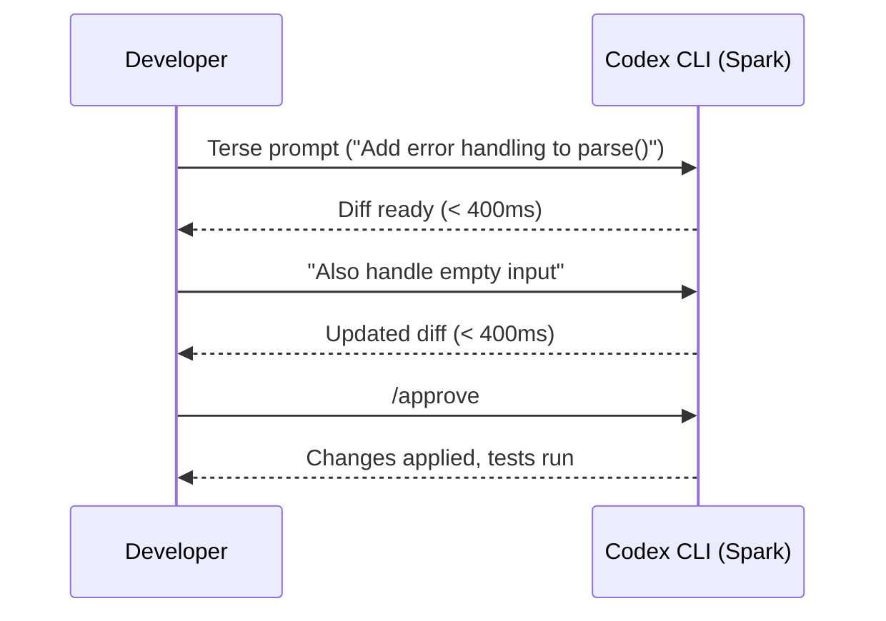
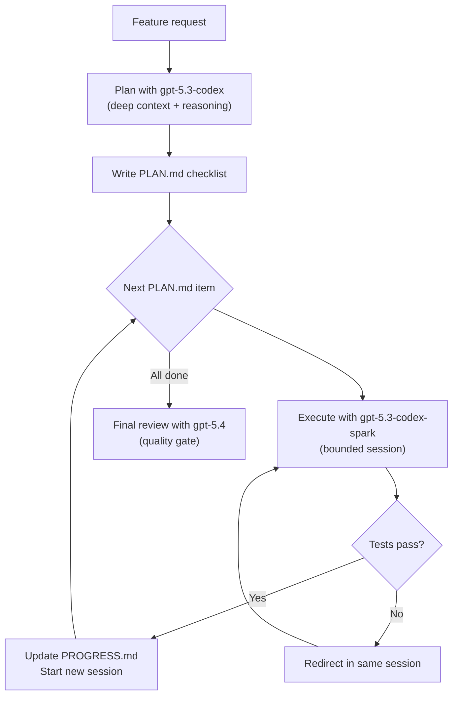

# Designing Workflows for Codex-Spark: When Inference Becomes Near-Instant


At 65–70 tokens per second, a 400-token code response takes roughly 6 seconds — a noticeable pause. At 1,000 tokens per second on Cerebras' Wafer Scale Engine 3, the same response arrives in under 400 milliseconds.[^1] That is not a speed improvement; it is a category change. The latency floor drops below the human perception threshold for "waiting", and that unlocks workflows that simply do not exist at slower inference speeds.

GPT-5.3-Codex-Spark (`gpt-5.3-codex-spark`) shipped on 12 February 2026 as a research preview for ChatGPT Pro users.[^2] It is available in the Codex CLI, the Mac desktop app, and the VS Code extension. This article is not about the model itself — the technical deep-dive covering WSE-3, SWE-Bench Pro scores, and API overhead reductions is elsewhere in this knowledge base.[^3] This article is about what you actually *do differently* when your coding agent is effectively instantaneous.

---

## The Inversion: Code Review Is Now the Bottleneck

In a standard Codex workflow, the model is the bottleneck. You write a prompt, wait several seconds for output, review it, and iterate. Cognitive overhead of the wait is high; you lose focus context between exchanges.

With Spark, **code review is the bottleneck**.[^4] The model can produce and revise a function faster than you can read it. This is not a problem to solve — it is an architectural constraint to design around. Every workflow pattern described below is oriented toward making human review sustainable when generation is no longer the limiting factor.

---

## Interactive Refinement Loops

The core workflow shift with Spark is from *delegation* to *collaboration*. Instead of writing a comprehensive prompt and waiting for a complete artefact, you work in a tight loop:

```
Ask → inspect diff → redirect → repeat
```

OpenAI's own guidance frames this as "interrupt and redirect" — a new muscle for developers who are used to writing long, detailed prompts.[^4] Useful redirects include:

- `"Only change the parser, leave the types alone"`
- `"Show me the diff before applying"`
- `"Revert that and try a different approach"`
- `"Do not touch the test file"`

Because each exchange takes under a second, you can afford to be terse and corrective rather than anticipatory and exhaustive. The cognitive overhead of writing a perfectly scoped prompt is higher than the cost of doing two fast iterations.



This loop is qualitatively different from async-style delegation. It feels like pair programming with a very fast typist, not like submitting a ticket.

---

## Context Window Constraints: 128k Is Not Infinite

Spark has a 128k context window, compared to 400k+ on `gpt-5.3-codex`.[^5] At 1,000 tokens per second generation speed, with a dense interactive session, **you will fill 128k in roughly two minutes**.[^4]

This is the most consequential constraint for workflow design. The solutions fall into two categories.

### Session Boundaries

Start fresh sessions frequently. With a slow model, the friction of starting a new session is significant — you lose context and have to re-establish it. With Spark, that friction is low because:

1. A new session initialises in seconds.
2. Spark reads your AGENTS.md, PLAN.md, and other durable files on load, reconstructing working context from structured artefacts rather than conversation history.

Useful session boundary commands:

```bash
# Start fresh from CLI with a specific model
codex -m gpt-5.3-codex-spark

# Within session: start a new thread
/new

# Fork to preserve good output before exploring alternatives
/fork
```

### The 4-File Memory Pattern

Because Spark burns through context, durable state must live in the repository, not in conversation history. The recommended pattern uses four files that the agent reads at session start:[^4]

| File | Purpose |
|---|---|
| `AGENTS.md` | Repository norms, test commands, conventions, tool constraints |
| `PLAN.md` | Checklist of tasks with definition-of-done per item |
| `PROGRESS.md` | Running log of completed changes and failed approaches |
| `VERIFY.md` | Exact commands that prove functionality (test runner invocations, type checks) |

**PLAN.md** is the critical one for Spark workflows. Because context is short-lived, you need the agent to be able to pick up mid-task from a written checklist rather than reconstructing intent from conversation. A minimal PLAN.md entry:

```markdown
## Current task

- [ ] Add retry logic to `fetchWithTimeout` (max 3 retries, exponential backoff)
  - Tests: `npm test -- --grep "fetchWithTimeout"`
  - Done when: all tests pass, no new lint errors
```

The agent loop becomes: read PLAN.md → implement one item → run VERIFY.md commands → update PROGRESS.md → loop. This is sometimes called a "Ralph loop" — clean context per iteration, with persistent memory externalised to git.[^4]

---

## Prompt Design for Spark

Spark is text-only and does not support reasoning fields.[^5] Two configuration implications:

### Remove Reasoning Fields from Config

If you have `reasoning` or `summary` parameters in your Codex config profile for Spark, remove them:

```toml
# config.toml — Spark profile
[profiles.spark]
model = "gpt-5.3-codex-spark"
model_reasoning_effort = "medium"  # ❌ Remove: reasoning fields unsupported on Spark
# model_reasoning_effort is a no-op on Spark; omit entirely
```

Submitting unsupported parameters may cause silent degradation or API errors depending on the Codex version.[^5]

### Keep Prompts Bounded and Singular

Spark's strengths are narrow-scope, rapid execution. Long compound prompts that would be appropriate for a standard model ("refactor the auth module, add tests, update the README, and check for security issues") create unnecessary context load and reduce diff reviewability.

One thing per exchange:

```bash
# Good: bounded, reviewable
codex -m gpt-5.3-codex-spark "Add input validation to createUser()"

# Less effective: too broad for interactive review
codex -m gpt-5.3-codex-spark "Refactor the user module, add tests, and update docs"
```

---

## Model Routing Decision Matrix

Spark is not a replacement for `gpt-5.3-codex` or `gpt-5.4` — it is a specialist. The routing decision is primarily about task shape:

| Task type | Recommended model | Reason |
|---|---|---|
| Interactive narrowly-scoped edits | `gpt-5.3-codex-spark` | Sub-second feedback matches terse prompt style |
| Complex planning / research | `gpt-5.3-codex` or `gpt-5.4` | Benefits from extended context and reasoning |
| Final code review pass | `gpt-5.3-codex` or `gpt-5.4` | Higher benchmark accuracy for nuanced judgement |
| Documentation updates | `gpt-5.3-codex-spark` | Bounded scope, fast iteration |
| Subagent parallel workers | `gpt-5.3-codex-spark` | Low latency per-task; context per worker is bounded |
| Overnight long-horizon tasks | `gpt-5.1-codex-max` or `gpt-5.3-codex` | Native compaction, extended context, xhigh reasoning |

### Hybrid Spark + Standard Patterns

The most productive workflows pair models by phase:[^4]

**Draft-with-Spark / Review-with-Standard:**

1. Use Spark for rapid drafting of a function or module.
2. When the draft feels stable, `/fork` the session.
3. Switch to `gpt-5.3-codex` or `gpt-5.4` for a deeper review pass.

**Plan-with-Standard / Execute-with-Spark:**

1. Use a standard model with full context to decompose a feature into a PLAN.md checklist.
2. Execute each checklist item with Spark in bounded sessions.



---

## Session Parallelism: A Different Kind of Limit

With a slow model, running multiple parallel sessions is valuable — you get concurrent output. With Spark, parallel sessions introduce a different constraint: **review bandwidth**.[^4]

A single Spark session produces reviewable output faster than one person can comfortably process. Running two or three sessions simultaneously means you are either:

- Context-switching rapidly, which degrades review quality.
- Queuing output for later review, at which point you lose the interactive-refinement advantage.

The practical recommendation is two to three sessions maximum, and only for genuinely independent tracks (e.g., backend service and frontend component with no shared types). More than that shifts the bottleneck from review to integration — you end up with independently-correct but collectively-inconsistent code.

---

## Configuring Spark in Codex CLI

### Named Profile

```toml
# ~/.codex/config.toml

[profiles.spark]
model = "gpt-5.3-codex-spark"
approval_policy = "suggest"      # Review each diff interactively
sandbox_permissions = []          # Start read-only; expand as needed

[profiles.spark.env]
CODEX_MAX_DIFF_LINES = "150"     # Soft limit: flag diffs > 150 lines for review
```

### Launching with the Profile

```bash
codex --profile spark
# or
codex -m gpt-5.3-codex-spark
```

### Switching Models Mid-Session

```bash
/model gpt-5.3-codex    # Switch to standard for a deep review
/model gpt-5.3-codex-spark  # Switch back for execution
```

---

## Availability Constraints

As of March 2026, Spark is a **ChatGPT Pro research preview**.[^2] There is no API access, no free tier, and no enterprise deployment path during the preview period. Cerebras is scaling datacenter capacity; rate limits apply and availability may be constrained at peak hours.⚠️

OpenAI has indicated that larger frontier models will be deployed on Cerebras infrastructure as capacity allows.[^2] The current preview is intended for community feedback while production hardening continues.

---

## Practical Implications for Development Teams

If you are a solo developer on a Pro subscription, the workflow changes above are immediately applicable. For teams, there are additional considerations:

1. **Context files become shared infrastructure.** AGENTS.md, PLAN.md, and VERIFY.md are now production artefacts that multiple team members and agents read. They warrant the same review rigour as code.

2. **Review processes need to adapt.** The bottleneck has moved from generation to review. Teams should invest in automation that reduces manual review load: strong test suites, type checkers, linters, and pre-commit hooks that run between every Spark iteration.

3. **Access is uneven.** Spark is Pro-only. A team where some members have Pro and others do not will have inconsistent workflow experiences. ⚠️

---

## Summary

Spark does not just make Codex faster — it changes which part of the workflow is the bottleneck. Designing for it means embracing terse, corrective, iterative prompts; managing context aggressively with fresh sessions and durable-file patterns; routing complex reasoning to standard models; and treating code review as the scarce resource.

The developers who extract the most value from Spark will be those who invest in the infrastructure that surrounds the interaction: well-maintained AGENTS.md files, crisp PLAN.md checklists, automated verification commands, and a discipline of staying actively engaged with each diff rather than batch-approving output.

---

## Citations

[^1]: OpenAI, "Introducing GPT-5.3-Codex-Spark", February 2026. <https://openai.com/index/introducing-gpt-5-3-codex-spark/>

[^2]: ServeTheHome, "OpenAI GPT-5.3-Codex-Spark Now Running at 1K Tokens Per Second on BIG Cerebras Chips", February 2026. <https://www.servethehome.com/openai-gpt-5-3-codex-spark-now-running-at-1k-tokens-per-second-on-big-cerebras-chips/>

[^3]: Codex Resources Knowledge Base, "GPT-5.3-Codex-Spark: The Cerebras-Powered Ultra-Fast Coding Model", 2026-03-28. [/codex-resources/articles/2026-03-28-codex-spark-cerebras-ultrafast-model/](/codex-resources/articles/2026-03-28-codex-spark-cerebras-ultrafast-model/)

[^4]: Cerebras, "How Codex Spark Changes The Way You Code", 2026. <https://www.cerebras.ai/blog/codex-spark-best-practices>

[^5]: OpenAI Developers, "Models – Codex", 2026. <https://developers.openai.com/codex/models>
