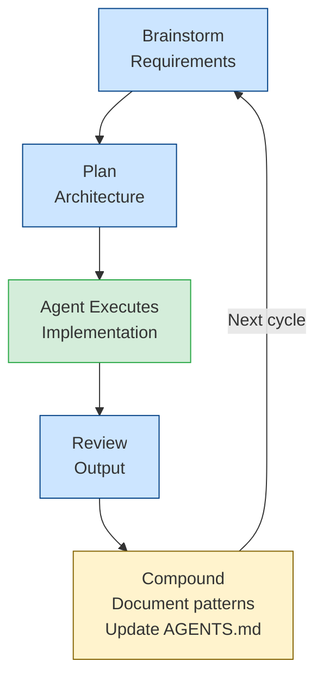
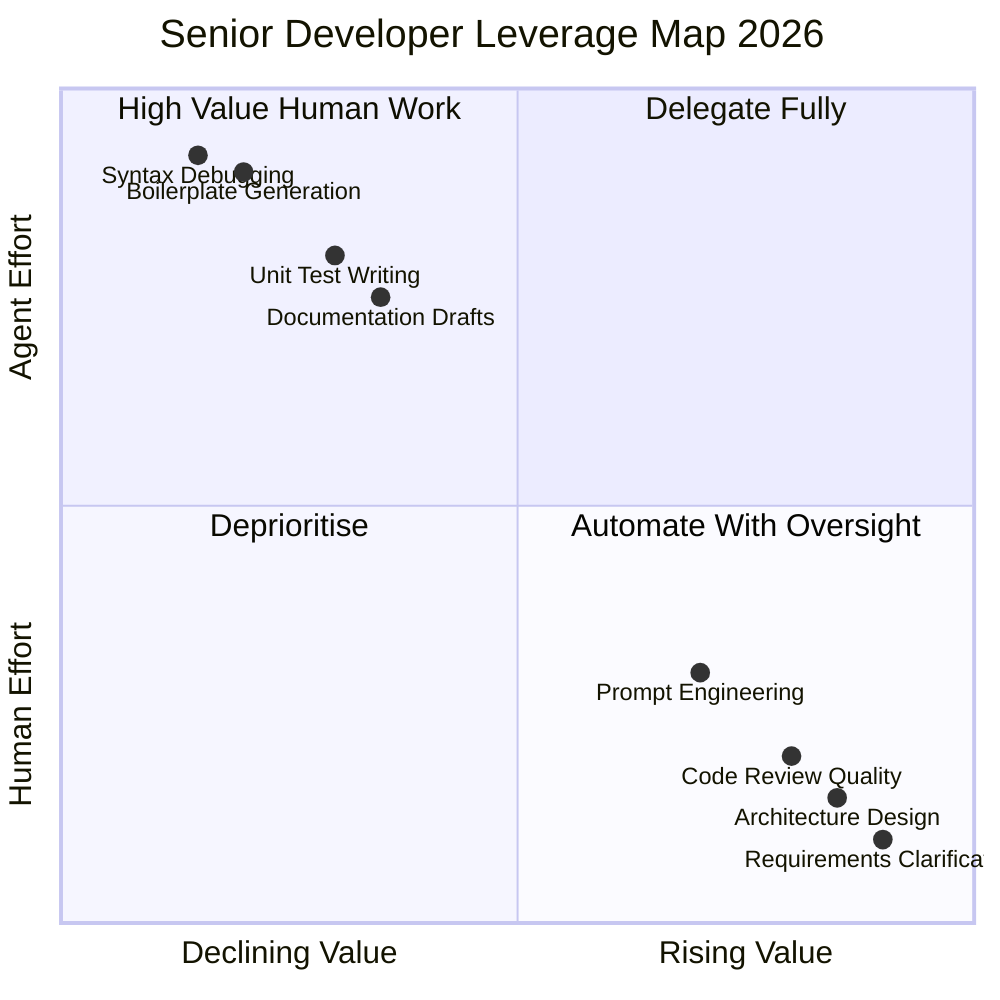
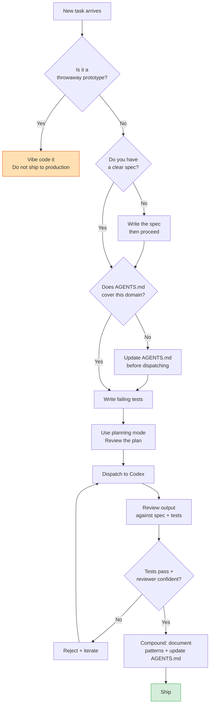

# Vibe Coding vs Agentic Engineering: A Senior Developer's Framework


---

On 2 February 2025, Andrej Karpathy posted a throwaway tweet about a new style of programming he called "vibe coding": *"you fully give in to the vibes, embrace exponentials, and forget that the code even exists."*[^1] It was a "shower thoughts" post — his words — yet it reshaped the vocabulary of an industry.

Exactly one year later, on 4 February 2026, Karpathy returned with a correction.[^2] The practice had matured, he said, and deserved a better name: **agentic engineering**. *"'Agentic' because the new default is that you are not writing the code directly 99% of the time, you are orchestrating agents who do and acting as oversight — 'engineering' to emphasise that there is an art & science and expertise to it."*[^3]

That reframing is the starting point for everything a senior developer needs to think about in 2026. This article unpacks the distinction, maps it to concrete Codex CLI practices, and offers a decision framework for staying technically rigorous while capturing the full leverage of agentic tooling.

---

## What Vibe Coding Actually Means

Vibe coding is a specific mode of working: you describe what you want in natural language, accept whatever the AI generates without deep review, and iterate by feel rather than by design. It is optimised for speed-of-creation and minimal cognitive overhead.

That makes it genuinely useful in narrow contexts:

- Throwaway prototypes and demos
- Internal tools with no production requirements
- Non-engineers translating an idea into working software for the first time

The problem is not the technique itself; it is where it gets applied. Vibe coding fails predictably when code enters production. It skips design, skips structured review, and skips testing — which is fine for a 20-minute hack, and a liability for anything that handles real users, real data, or real money.

By 2026, "cognitive debt" — the accumulated cost of poorly managed AI interactions, context loss, and unreliable agent behaviour — has emerged as the primary engineering risk of unchecked vibe coding at scale.[^4] Tooling and models have improved faster than the governance patterns surrounding them.

---

## The Agentic Engineering Alternative

Karpathy's redefinition shifts the human role from *writer* to *orchestrator*. Where vibe coding positions you as a prompt DJ, agentic engineering positions you as an engineering director: you own the architecture, the quality bar, and the correctness of the output. Agents handle the mechanical implementation work.

Addy Osmani's formulation captures this precisely: *"AI does the implementation, human owns the architecture, quality, and correctness."*[^5]

The difference is not just philosophical. It is expressed in concrete workflow choices:

| Dimension | Vibe Coding | Agentic Engineering |
|---|---|---|
| **Design phase** | Skip it — prompt directly | Produce a spec or plan first |
| **Agent instructions** | Ad-hoc prompts | Versioned `AGENTS.md` and `WORKFLOW.md` |
| **Review stance** | Accept output uncritically | Review every PR as if a junior submitted it |
| **Testing** | Optional | Tests are the agent's feedback loop |
| **Context management** | Ignore until it breaks | Structured: compaction, subagent delegation |
| **Failure mode** | Confident wrong output | Detectable at the gate |

---

## The Compound Engineering Framework

Every, Inc. has operationalised agentic engineering into what they call **compound engineering** — a methodology where each unit of engineering work is designed to make subsequent units easier rather than harder.[^6]

The central ratio: **80% planning and review, 20% execution**. Most thinking happens before and after the code gets written. Agents handle the 20%; the human handles the 80%.[^7]

This ratio feels counterintuitive to developers trained to "just start coding", but it maps directly to how senior engineers already work. When you are directing a team, you spend most of your time on architecture, requirements, and review — not implementation. Agentic engineering makes this explicit and tool-supported.

The compound engineering workflow follows a five-phase loop:



The green box — agent execution — is the small part. The blue boxes are human work. The amber box is what makes each cycle compound: insights fed back into context files, patterns added to `AGENTS.md`, anti-patterns documented in `docs/solutions/`.

Every, Inc. reports that a single developer using this methodology can match the output of five developers using traditional approaches.[^8]

---

## Applying This to Codex CLI

Codex CLI makes the agentic engineering pattern concrete. Here are the key leverage points.

### 1. Planning Mode as Your Design Gate

Never dispatch a complex task without a planning pass. Codex's `/plan` command (or `plan_mode` profile) externalises the agent's intent before a single file changes. Review the plan as you would review a design doc: check architectural assumptions, flag missing context, reject plans that would create hidden coupling.

```toml
# config.toml — enforce planning for production work
[profiles.production]
model = "gpt-5.4"
model_reasoning_effort = "high"
plan_mode_reasoning_effort = "high"
```

A plan you reject before execution saves more time than a PR you reject after.

### 2. AGENTS.md as Your Engineering Standards Document

`AGENTS.md` is not a list of instructions for the agent — it is a version-controlled encoding of your team's engineering standards. Treat it accordingly.[^9]

```markdown
# AGENTS.md — Engineering Standards

## Architecture constraints
- All database access must go through the repository layer in src/data/
- New API endpoints require a corresponding OpenAPI schema update
- Never introduce a new dependency without updating requirements.txt and CHANGELOG

## Test requirements
- Every new function requires at least one unit test
- Integration tests must pass before any PR is submitted

## Review checklist (agent must self-check before completing)
- [ ] No hardcoded credentials or API keys
- [ ] Error paths handled explicitly
- [ ] Structured logging added for new code paths
```

This is the difference between an agent that generates plausible code and one that generates code that passes your team's bar.

### 3. TDD as the Agent's Feedback Loop

Tests give the agent a verifiable, automated goal. Without them, "task complete" means nothing. With them, it means the implementation satisfies a contract you wrote.

Write the failing test first. Dispatch Codex to make it pass. Review the implementation against the test. This is the most reliable way to maintain quality without reviewing every line manually — you review the specification, and the tests enforce it.[^10]

```bash
# Write test first, dispatch to implementation
codex "The test in tests/test_payment_processor.py::test_idempotent_charge is failing.
Make it pass without modifying the test file."
```

### 4. Structured Review with Parallel Sub-Agents

The compound engineering plugin ships a `/workflows:review` command that runs 12 specialised reviewer sub-agents in parallel — security, performance, over-engineering, test coverage, and more.[^11] Even without the plugin, the pattern is replicable in Codex CLI directly:

```toml
# subagents.toml — parallel review swarm
[[agents]]
id = "security_reviewer"
prompt = "Review the changes in {{branch}} for security issues. Focus on: injection vectors, authentication, secrets exposure, dependency vulnerabilities."

[[agents]]
id = "perf_reviewer"
prompt = "Review the changes in {{branch}} for performance issues. Focus on: N+1 queries, unnecessary allocations, blocking I/O on hot paths."

[[agents]]
id = "architecture_reviewer"
prompt = "Review the changes in {{branch}} for architectural issues. Focus on: coupling, layering violations, hidden state, missing abstractions."
```

Running these in parallel takes seconds and surfaces issues a single reviewer would miss.

---

## The Career Dimension

For senior engineers, agentic engineering represents not a threat but an amplifier of existing strengths. The skills that define a senior developer — systems thinking, architectural judgement, risk assessment, knowing what to leave simple — become more valuable, not less, when agents handle implementation.[^12]

What does atrophy is low-level implementation fluency. Karpathy himself acknowledges his manual coding skills are declining because agents now handle the work that would have maintained them.[^13] This is not inherently bad — dentists do not miss the era before anaesthesia — but it is a genuine trade-off worth acknowledging.

The generational dimension is real and non-trivial. Junior engineers entering the field in 2026 are developing "supervisory engineering" skills natively: evaluating AI output, recognising confident wrong answers, navigating between multiple agent-generated options.[^14] This is a different cognitive profile from engineers trained to write everything from scratch. Both profiles have value; neither is intrinsically superior.

The practical implication: invest your development time in architectural judgement and review depth, not in regaining implementation fluency you have delegated to agents.



---

## A Decision Framework

Use this to route any task:



The workflow is deliberately front-loaded. Time spent on spec, `AGENTS.md`, and planning is time recovered from debugging and rework.

---

## Summary

Vibe coding and agentic engineering are not different points on a quality spectrum — they are different practices suited to different contexts. Vibe coding is appropriate for exploration and prototyping. Agentic engineering is appropriate for production software.

Codex CLI supports both modes, but its tooling — planning mode, `AGENTS.md`, sub-agents, structured review, hooks — is purpose-built for the second. The compound engineering framework gives that tooling a methodology: 80% human planning and review, 20% agent execution, with every cycle making the next one faster.

For senior developers, the transition to agentic engineering is largely a reframing. You already do most of this work. The change is that the implementation now happens at agent speed, which means your architectural judgement and review depth are the new bottleneck. That is a good problem to have.

---

## Citations

[^1]: Andrej Karpathy, "Vibe coding" tweet, 2 February 2025. <https://x.com/karpathy/status/1886192184808149317>

[^2]: Andrej Karpathy, one-year anniversary thread, 4 February 2026. <https://x.com/karpathy/status/2019137879310836075>

[^3]: Karpathy's definition of agentic engineering, quoted in "Karpathy Says 'Vibe Coding' Is Fading as 'Agentic Engineering' Becomes the New AI Coding Era", The Hans India, February 2026. <https://www.thehansindia.com/technology/tech-news/karpathy-says-vibe-coding-is-fading-as-agentic-engineering-becomes-the-new-ai-coding-era-1045758>

[^4]: "Agentic Engineering vs. Vibe Coding", Turing College Blog, 2026. <https://www.turingcollege.com/blog/agentic-engineering-vs-vibe-coding>

[^5]: Addy Osmani's formulation quoted in "It's Not Vibe Coding: Agentic Engineering", Michael Kennedy's blog. <https://mkennedy.codes/posts/its-not-vibe-coding-agentic-engineering/>

[^6]: "Compound Engineering: How Every Codes With Agents", every.to. <https://every.to/chain-of-thought/compound-engineering-how-every-codes-with-agents>

[^7]: "Introduction — Compound Engineering Plugin", Mintlify/EveryInc. <https://www.mintlify.com/EveryInc/compound-engineering-plugin/introduction>

[^8]: Every, Inc. internal results cited in the compound-engineering-plugin README, GitHub. <https://github.com/EveryInc/compound-engineering-plugin/blob/main/README.md>

[^9]: Codex CLI AGENTS.md patterns for production teams — see also "AGENTS.md Advanced Patterns: Nested Hierarchies, Override Files and Fallbacks" in this knowledge base.

[^10]: "Test-First Development with Codex: Using TDD as the Agent Feedback Loop", this knowledge base, 2026-03-28.

[^11]: "Compound Engineering Plugin", EveryInc GitHub, 2026. <https://github.com/EveryInc/compound-engineering-plugin>

[^12]: "Vibe Coding, Agentic IDEs, and Why Senior Engineers Are at a Career Inflection Point", Manoj Ramakrishnan, Medium, February 2026. <https://medium.com/@formanojr/vibe-coding-agentic-ides-and-why-senior-engineers-are-at-a-career-inflection-point-9f8dceb10d47>

[^13]: Karpathy noting his manual coding skills atrophying in the February 2026 thread, cited in "OpenAI Cofounder Andrej Karpathy Signals the Shift from Vibe Coding to Agentic Engineering", Yi Zhou, Medium. <https://medium.com/generative-ai-revolution-ai-native-transformation/openai-cofounder-andrej-karpathy-signals-the-shift-from-vibe-coding-to-agentic-engineering-ea4bc364c4a1>

[^14]: "From vibe coding to agentic engineering", Sau Sheong, Medium, February 2026. <https://sausheong.com/from-vibe-coding-to-agentic-engineering-1ca3ca72b5ac>
