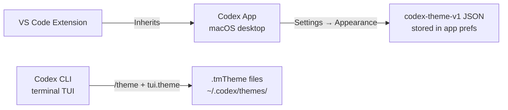
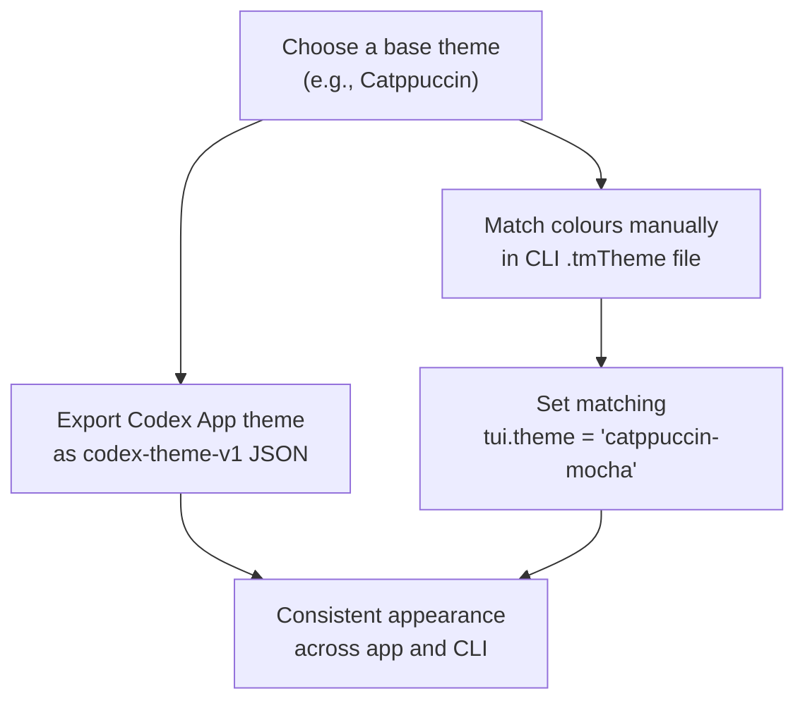

# Codex App Theming and Customisation: codex-theme-v1, Partner Themes, and the CLI /theme Command

**Date:** 2026-03-30

**Tags:** theming, appearance, codex-theme-v1, tui-theme, tmTheme, customisation, fonts, partner-themes, config-toml

OpenAI shipped full appearance customisation for the Codex app in late March 2026, adding base theme selection, per-channel colour controls, font overrides, and a portable `codex-theme-v1` JSON format for sharing themes with your team.[^1] The Codex CLI gained its own theming path earlier in the year, routed through a live-preview `/theme` picker and `.tmTheme` files.[^2] The two surfaces are architecturally distinct but share nomenclature — this article maps both systems, explains the `codex-theme-v1` wire format, and shows how to keep your desktop app and terminal consistent.

---

## Two Theming Surfaces

Codex now ships as three surfaces that each manage appearance differently:



The **Codex app** uses a bespoke JSON format (`codex-theme-v1`) that describes the entire visual chrome: surface colours, accent, ink, semantic diff colours, font choices, and window opacity.[^1] The **Codex CLI TUI** uses `.tmTheme` files — the same format that TextMate and most syntax-highlighting toolchains understand — scoped to syntax highlighting and diff colouring only.[^2]

---

## Codex App Appearance Settings

Open the Settings panel with **Cmd+,** (macOS) and navigate to **Appearance**.[^3] The panel is divided into:

| Control | What it changes |
|---|---|
| Base theme | Light, dark, or system (auto) |
| Accent colour | Interactive highlights, selection ring, link colour |
| Background colour | Surface behind the main content area |
| Foreground / ink colour | Body text and code text |
| Opacity | Translucent vs opaque window chrome |
| UI font | Font used throughout the app interface |
| Code font | Monospace font used in the editor and diff views |
| Semantic colours | `diffAdded`, `diffRemoved`, `skill` callout colours |

Changes apply immediately with a live preview. Selecting a built-in theme populates all fields at once; you can then override individual values.

### Built-in and Partner Themes

The Codex app ships with classic themes and a set built in collaboration with third-party products:[^4]

**Classic themes:** Catppuccin, Monokai, Solarized (light and dark variants)

**Partner themes:**

- **Linear** — matches Linear's own app chrome, useful if you keep both open side by side
- **Notion** — warm off-white surfaces with Notion's signature typography
- **OpenClaw** — dark high-contrast theme used by the viral AI tool built entirely with Codex[^5]

To apply a partner theme, select it from the base theme dropdown. Colours populate but fonts remain at your current choice — partner themes do not enforce font overrides.

---

## The `codex-theme-v1` Wire Format

Themes are shared as a compact URI-prefixed JSON string. The prefix `codex-theme-v1:` is stripped before parsing; the remainder is standard JSON.[^6]

```json
codex-theme-v1:{
  "codeThemeId": "one",
  "theme": {
    "accent": "#5c99d6",
    "contrast": 48,
    "fonts": {
      "code": "Fira Code",
      "ui": null
    },
    "ink": "#d8dee9",
    "opaqueWindows": true,
    "semanticColors": {
      "diffAdded": "#99c794",
      "diffRemoved": "#ec5f66",
      "skill": "#c695c6"
    },
    "surface": "#303841"
  },
  "variant": "dark"
}
```

### Field Reference

| Field | Type | Description |
|---|---|---|
| `codeThemeId` | `string` | Base built-in theme identifier (`"one"`, `"catppuccin"`, `"matrix"`, …) |
| `theme.accent` | hex string | Interactive highlight colour |
| `theme.contrast` | integer | Contrast level; higher values increase foreground–background ratio |
| `theme.fonts.code` | string \| null | Monospace font name; `null` = system default |
| `theme.fonts.ui` | string \| null | UI font name; `null` = system default |
| `theme.ink` | hex string | Primary text colour |
| `theme.opaqueWindows` | boolean | `false` = translucent sidebars/chrome |
| `theme.semanticColors.diffAdded` | hex string | Added line highlight in diffs |
| `theme.semanticColors.diffRemoved` | hex string | Removed line highlight in diffs |
| `theme.semanticColors.skill` | hex string | Skill callout badge colour |
| `theme.surface` | hex string | Main background surface colour |
| `variant` | `"dark"` \| `"light"` | Base variant; drives default text contrast calculations |

### Importing a Shared Theme

Navigate to **Settings → Appearance → Dark Theme (or Light Theme) → Import**, and paste the full `codex-theme-v1:…` string.[^6]

### Known Limitation: Custom `codeThemeId` Values

As of March 2026, the theme importer rejects `codeThemeId` values that do not match an existing built-in dropdown entry.[^7] A payload using `"codeThemeId":"custom"` fails silently; the same payload with `"codeThemeId":"one"` (or any valid built-in ID) succeeds. The expected fix is to validate the payload schema rather than gate on the identifier — this is tracked in the upstream issue and is expected to ship before the next major app release. In the interim, always set `codeThemeId` to an existing built-in (e.g., `"matrix"`, `"one"`, `"catppuccin"`) even when overriding all colour values.

---

## CLI TUI Theming

The CLI TUI is a Ratatui-based terminal interface with syntax highlighting powered by a TextMate grammar engine.[^8] Its theming is entirely separate from the app's JSON format.

### The `/theme` Picker

Type `/theme` in any Codex CLI session to open the live-preview theme picker.[^2] As you scroll, syntax-highlighted code samples and diff examples update in real time. Selecting a theme writes the kebab-case identifier to `tui.theme` in `~/.codex/config.toml` automatically.

```toml
[tui]
theme = "catppuccin-mocha"
```

### Custom `.tmTheme` Files

Drop any `.tmTheme` file into `$CODEX_HOME/themes/` (typically `~/.codex/themes/`) and it will appear in the `/theme` picker.[^2]

```bash
mkdir -p ~/.codex/themes
cp ~/Downloads/my-custom-theme.tmTheme ~/.codex/themes/
# Restart Codex CLI or start a new session — the theme will appear in /theme
```

TextMate-format themes are available from many sources: `textmate.org`, the Catppuccin project (which publishes `.tmTheme` exports), and the `rainglow` collection.

### Known Rendering Bug

In v0.105.0 and later, `markup.inserted`, `markup.deleted`, and `markup.changed` background overrides from custom `.tmTheme` files are ignored in diff views, which always render with hardcoded bright-green/red backgrounds.[^9] ⚠️ This is a known upstream issue. Workaround: set `theme.semanticColors.diffAdded` and `.diffRemoved` in the app settings (Codex App only), or accept the diff colouring as-is in the CLI.

### Profile-Scoped Themes

You can assign different themes to different profiles, so your CI automation profile uses a minimal high-contrast theme and your interactive deep-work profile uses your preferred custom theme:

```toml
[profiles.ci.tui]
theme = "gruvbox-dark"

[profiles.deep-work.tui]
theme = "tokyonight-storm"
```

Profile-scoped `[tui]` keys merge with (and override) the root `[tui]` section.[^10]

---

## Cross-Surface Consistency

The Codex app and CLI use different theming engines, so perfect pixel parity is not achievable. However, you can achieve reasonable consistency:



**Practical steps:**

1. Pick a base theme in the Codex app and export it via **Settings → Appearance → Export**.
2. Note the `surface`, `accent`, and `ink` hex values.
3. Find or create a matching `.tmTheme` file for the CLI.
4. Set `tui.theme` in `config.toml` to the matching name.
5. Set your terminal emulator's background to match `surface` for seamless integration.

The `codex-themes` community tool (GitHub: `ychampion/codex-themes`) automates steps 3–5 by generating matching terminal palette configs for Alacritty, iTerm2, and WezTerm from an exported `codex-theme-v1` JSON string.[^11]

---

## Sharing Themes in a Team

The `codex-theme-v1` format is designed to be portable. Practical sharing patterns:

**Via dotfiles:** Commit your exported theme string to a `~/.dotfiles` repo and restore it with a bootstrap script.

**Via AGENTS.md:** Embed a comment in your project's `AGENTS.md` with the team's preferred theme string so new contributors can paste it directly.

**Via a company plugin:** Package the theme JSON inside a [Codex plugin](./2026-03-30-codex-cli-plugin-system.md) under `plugin.json → appConfig`, so the theme applies automatically when the plugin is installed.

---

## Quick Reference

| Task | How |
|---|---|
| Open app theme picker | Settings → Appearance (Cmd+,) |
| Import a shared theme | Settings → Appearance → Import → paste `codex-theme-v1:…` |
| Export your theme | Settings → Appearance → Export |
| Open CLI theme picker | Type `/theme` in a CLI session |
| Add custom CLI theme | Drop `.tmTheme` into `~/.codex/themes/` |
| Set CLI theme in config | `[tui] theme = "theme-name"` in `~/.codex/config.toml` |
| Profile-scoped CLI theme | `[profiles.myprofile.tui] theme = "name"` |

---

## Citations

[^1]: OpenAI, "Codex App 26.323 — theming, automations, thread search", Codex Changelog, March 2026. https://developers.openai.com/codex/changelog
[^2]: OpenAI, "Features – Codex CLI: `/theme` picker and `tui.theme`", Codex Developer Documentation. https://developers.openai.com/codex/cli/features
[^3]: OpenAI, "Settings – Codex app", Codex Developer Documentation. https://developers.openai.com/codex/app/settings
[^4]: OpenAI, "OpenAI Upgrades Its Codex App With Customizable Themes", March 2026. https://www.eyerys.com/articles/news/openai-upgrades-its-codex-app-customizable-themes-and-automated-workflows
[^5]: "OpenAI launches Codex app to bring its coding models, used to build OpenClaw, to more users", Fortune, February 2026. https://fortune.com/2026/02/02/openai-launches-codex-app-to-bring-coding-models-to-more-users-openclaw-ai-agents/
[^6]: Dominik Kundel (@dkundel), `codex-theme-v1` JSON example, X (formerly Twitter), March 2026. https://x.com/dkundel/status/2032224113025302535
[^7]: "Theme importer rejects custom codeThemeId values unless they match dropdown IDs", GitHub Issue #14766, openai/codex. https://github.com/openai/codex/issues/14766
[^8]: OpenAI, "codex-rs Architecture: Ratatui TUI and TextMate syntax engine", Codex Developer Documentation. https://developers.openai.com/codex
[^9]: "Enable voice transcription in Linux/WSL builds", GitHub Issue #12894, openai/codex (references v0.105.0 diff-view rendering regression). https://github.com/openai/codex/issues/12894
[^10]: OpenAI, "Sample Configuration – Codex: profile-scoped `[tui]` overrides". https://developers.openai.com/codex/config-sample
[^11]: `codex-themes` community tool for generating matching terminal palette configs, GitHub: `ychampion/codex-themes`. ⚠️ Community project — verify current status before using in production.
