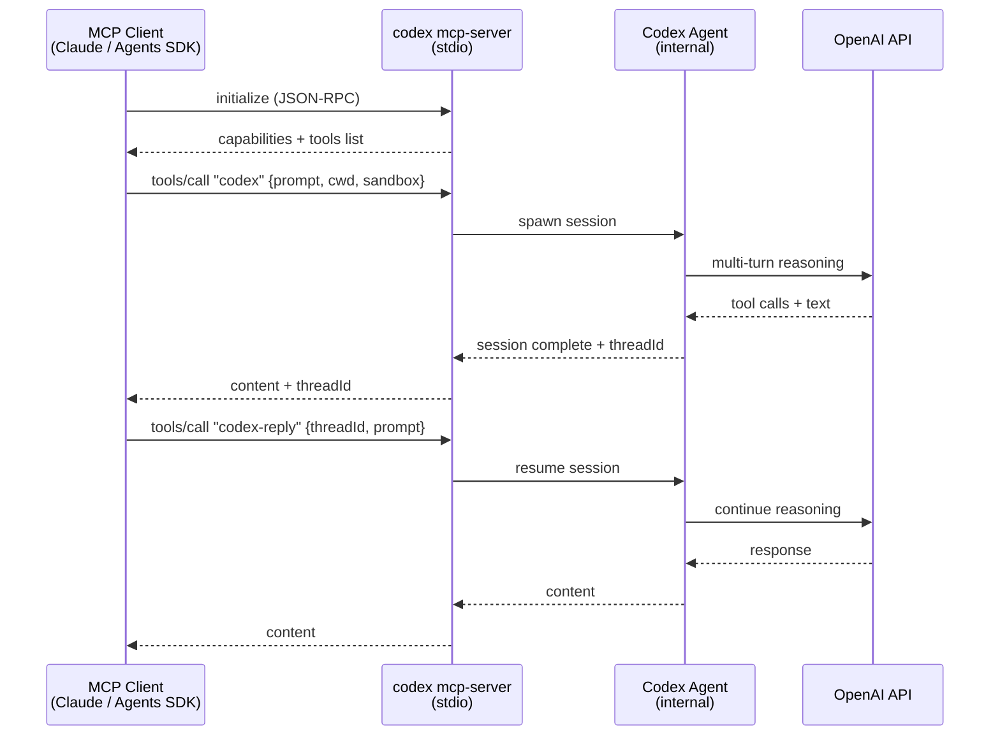

# Codex CLI as an MCP Server: Embedding Agent Intelligence in Your Tool Stack


Most Codex CLI coverage focuses on Codex *consuming* MCP servers — wiring in filesystem tools, database connectors, or third-party APIs. Less attention goes to the inverse: running Codex itself as an MCP server so that *other* agents and tools can invoke it as a callable tool. This is the `codex mcp-server` mode, available since the early Rust rewrite builds and now polished to production quality in v0.117.0[^1]. It changes the mental model from "Codex as a terminal assistant" to "Codex as a composable intelligence component."

## Why Expose Codex as an MCP Server?

The Model Context Protocol defines a standard wire format for tools, resources, and prompts over stdio or HTTP[^2]. Any MCP client — Claude Desktop, Zed, a custom orchestrator, or the OpenAI Agents SDK — can discover and invoke tools from any MCP server. Once Codex speaks MCP as a server, it becomes a first-class building block:

- An orchestrating agent can delegate coding subtasks to Codex without understanding Codex's internal API.
- Claude Desktop gains a `codex()` tool it can call to generate, refactor, or test code with full Codex capabilities including sandboxing, compaction, and hooks.
- Multi-agent pipelines built with the Agents SDK can treat Codex sessions as stateful, resumable units of work.
- You can chain Codex instances — one acting as a project manager, others as domain specialists — using standard MCP plumbing rather than bespoke integration code.

## Starting the MCP Server

```bash
codex mcp-server
```

That is the complete command[^3]. It starts a JSON-RPC 2.0 server on stdio, inherits your global `~/.codex/config.toml` configuration, and exits when the client closes the connection. There are no ports, no daemons, and no additional installation steps beyond a working Codex CLI installation.

To inspect the protocol during development, use the official MCP inspector:

```bash
npx @modelcontextprotocol/inspector codex mcp-server
```

This launches a browser-based UI showing the handshake, tool listing, and all JSON-RPC traffic — invaluable for debugging client integrations.

## The Two Exposed Tools

The server advertises exactly two tools[^4]:

### `codex`

Starts a new Codex session and returns when the agent completes its turn.

| Parameter | Type | Required | Description |
|---|---|---|---|
| `prompt` | string | ✓ | Initial instruction |
| `model` | string | | Override default model (e.g. `gpt-5.4`) |
| `profile` | string | | Named profile from `config.toml` |
| `cwd` | string | | Working directory for the session |
| `approval-policy` | enum | | `untrusted` \| `on-failure` \| `on-request` \| `never` |
| `sandbox` | enum | | `read-only` \| `workspace-write` \| `danger-full-access` |
| `base-instructions` | string | | Additional system instructions |

The response includes a `threadId` — a stable identifier for the session — and the agent's output `content`.

### `codex-reply`

Continues an existing session identified by `threadId`. Same parameter set as `codex`, plus the required `threadId` from a prior call. This is what enables multi-turn agentic conversations driven externally: the orchestrator holds the thread ID and issues follow-up instructions as needed.

## Registering Codex in a Client Config

### Claude Desktop / Zed

```json
{
  "mcpServers": {
    "codex": {
      "command": "codex",
      "args": ["mcp-server"]
    }
  }
}
```

Claude can then invoke `codex(prompt: "…")` inline. The session runs in a subprocess, sandboxed according to your Codex defaults.

### OpenAI Agents SDK

```python
from agents import Agent, MCPServerStdio, Runner

codex_server = MCPServerStdio(
    command="codex",
    args=["mcp-server"],
)

orchestrator = Agent(
    name="architect",
    instructions="Coordinate coding tasks by delegating to the codex tool.",
    mcp_servers=[codex_server],
)

result = Runner.run_sync(orchestrator, "Refactor the payment module for idempotency.")
print(result.final_output)
```

The SDK manages the subprocess lifecycle, surfaces the `codex` and `codex-reply` tools in the orchestrator's tool list, and handles JSON-RPC plumbing transparently[^5].

### Codex-Inside-Codex

You can add a Codex MCP server to another Codex instance's config, enabling a supervised pattern where an outer agent delegates to an inner agent with a stricter sandbox:

```toml
[mcp_servers.inner_codex]
command = "codex"
args    = ["mcp-server"]
env     = { CODEX_SANDBOX = "workspace-write" }
startup_timeout_sec = 15
tool_timeout_sec    = 180
required = false
```

The `required = false` flag means the outer Codex session starts even if the inner server fails to initialise — useful during development when the inner instance may not yet be stable.

## Architecture: What Happens Under the Hood



The server process lives as long as the client connection. Each `codex` call spawns an internal agent session; `codex-reply` rehydrates it. Sessions persist in the standard SQLite state store (`~/.codex/state.db`) so thread IDs remain valid across reconnections, enabling long-running workflows that survive client restarts[^6].

## Timeout Configuration

Default timeouts are conservative for interactive use but often too short for autonomous coding tasks[^7]:

```toml
[mcp_servers.inner_codex]
command             = "codex"
args                = ["mcp-server"]
startup_timeout_sec = 15    # default: 10
tool_timeout_sec    = 300   # default: 60 — extend for complex tasks
```

For overnight batch jobs invoked through the Agents SDK, set `tool_timeout_sec` to match your longest expected task. The server does not kill in-progress sessions when the timeout fires; it returns a timeout error to the client while the Codex subprocess continues, so you can reconnect and retrieve results via `codex-reply` with the thread ID.

## Approval Workflows

When `approval-policy` is `on-request` (the default for shell commands), the MCP server propagates approval requests back to the client using the MCP elicitation protocol[^8]. An MCP client that implements elicitation — as Claude Desktop and the Agents SDK both do — will surface these as approval dialogs or decision steps. Clients that do not implement elicitation receive a tool error; set `approval-policy = never` when the client cannot handle interactive requests and you trust the sandbox constraints to provide sufficient safety.

## Observability: Tracing Tool Calls

v0.117.0 added MCP tool call spans[^1]. Each `codex` and `codex-reply` invocation emits a trace span that integrates with the existing OpenTelemetry export configured under `[opentelemetry]` in `config.toml`. This means you can observe nested multi-agent architectures end-to-end: the outer orchestrator's span contains the Codex tool span, which in turn contains the Codex agent's internal tool calls. Standard OTLP backends (Jaeger, Honeycomb, Grafana Tempo) receive the full trace without any additional instrumentation.

## Practical Patterns

**Parallel specialist agents.** An Agents SDK orchestrator calls `codex` three times concurrently — one for backend refactoring, one for test generation, one for documentation — each with its own `cwd` and `profile`. The orchestrator collects results and reconciles conflicts before committing.

**Gated review pipeline.** A QA agent calls `codex(prompt="run full test suite and return failures")`, receives structured output, then conditionally calls `codex-reply` with a targeted fix prompt. Human approval gates sit between rounds, handled via elicitation.

**Context-scoped micro-agents.** Large monorepos benefit from calling `codex` with `cwd` set to individual service directories and `base-instructions` scoped to that service's AGENTS.md content. The orchestrator composes service-level changes without any single Codex session seeing the entire monorepo context, dramatically reducing token usage.

## Security Considerations

Codex MCP server mode does not relax any sandbox policies. The `sandbox` parameter accepted by the `codex` tool maps directly to Codex's native sandbox enforcement — `read-only` prevents all writes, `workspace-write` restricts to the working directory, `danger-full-access` removes restrictions entirely[^3]. Treat the server's stdio channel as trusted; any process that can write to stdin can issue arbitrary Codex commands. Keep the server behind the MCP client abstraction and avoid exposing it over network transports without authentication.

## Citations

[^1]: [Codex CLI Changelog — v0.117.0, March 26 2026](https://developers.openai.com/codex/changelog)

[^2]: [Model Context Protocol Specification](https://modelcontextprotocol.io/specification)

[^3]: [Codex CLI Command Line Reference — `codex mcp-server`](https://developers.openai.com/codex/cli/reference)

[^4]: [Codex MCP Server — Tools Reference](https://developers.openai.com/codex/mcp)

[^5]: [Use Codex with the OpenAI Agents SDK](https://developers.openai.com/codex/guides/agents-sdk)

[^6]: [DeepWiki — MCP Server Implementation (codex-mcp-server)](https://deepwiki.com/openai/codex/6.4-mcp-server-implementation-(codex-mcp-server))

[^7]: [Codex Configuration Reference — `mcp_servers` section](https://developers.openai.com/codex/config-reference)

[^8]: [MCP Elicitation Protocol](https://modelcontextprotocol.io/specification/elicitation)
