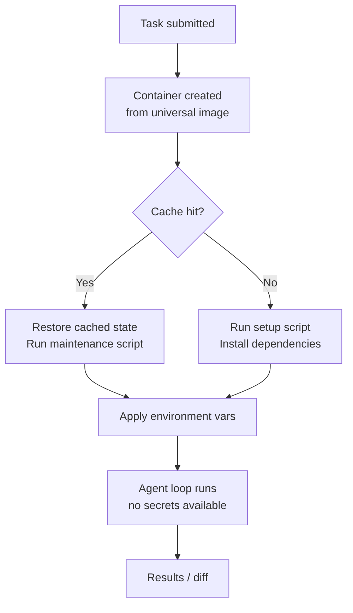

# Codex CLI in Docker: Containerised Environments, Sandboxing and codex-universal


Docker and Codex CLI have a natural affinity: Docker solves the "it works on my machine" problem for human developers; Codex needs a reproducible, safe execution context that it can be given unrestricted access to without risking the host. The combination yields isolated, auditable, CI-compatible agentic workflows.

This article covers the full picture — from OpenAI's official `codex-universal` base image through to community container patterns and cloud environment configuration.

---

## The codex-universal Base Image

OpenAI ships a reference Docker image at [`openai/codex-universal`](https://github.com/openai/codex-universal) that mirrors the environment Codex cloud tasks run in.[^1] It is built on Ubuntu 24.04 and pre-installs a comprehensive polyglot toolchain so that setup scripts do not spend time downloading compilers from scratch.

**Languages pre-installed:**

| Language | Versions available |
|---|---|
| Python | 3.10, 3.11, 3.12, 3.13, 3.14 (via pyenv) |
| Node.js | 18, 20, 22, 24 (via nvm) |
| Rust | 1.83.0 – 1.92.0 (ten versions via rustup) |
| Go | 1.22.12 – 1.25.1 |
| Java | 11–25 (amd64); 17–25 (arm64) |
| Ruby | 3.2.3, 3.3.8, 3.4.4 |
| PHP | 8.2 – 8.5 |
| Swift | 5.10, 6.1, 6.2 |
| Elixir/Erlang | Elixir 1.18.3 / Erlang 27.1.2 |

Also bundled: `uv`, `poetry`, `pnpm`, `yarn`, `ruff`, `black`, `mypy`, `pyright`, `golangci-lint`, `clang-tidy`, `cmake`, `ninja-build`, and Bazelisk.[^1]

### Pinning language versions with CODEX_ENV_*

Pass `CODEX_ENV_*` variables to select which version of each runtime is active:[^2]

```bash
docker run --rm \
  -e OPENAI_API_KEY="$OPENAI_API_KEY" \
  -e CODEX_ENV_PYTHON_VERSION=3.12 \
  -e CODEX_ENV_NODE_VERSION=22 \
  -e CODEX_ENV_RUST_VERSION=1.87.0 \
  -e CODEX_ENV_GO_VERSION=1.23.8 \
  -v "$PWD":/workspace \
  ghcr.io/openai/codex-universal:latest \
  codex "run the test suite"
```

The image is built for `linux/amd64` and `linux/arm64`, though only `amd64` is used in production cloud tasks.[^1] On Apple Silicon, pass `--platform linux/amd64` to use Rosetta emulation.

---

## Running Codex CLI Locally in Docker

The simplest local setup mounts your project directory and forwards your API key:

```bash
docker run --rm -it \
  -e OPENAI_API_KEY="$OPENAI_API_KEY" \
  -v "$HOME/.codex":/root/.codex \
  -v "$PWD":/workspace \
  -w /workspace \
  ghcr.io/openai/codex-universal:latest \
  codex
```

Mounting `~/.codex` persists OAuth tokens and configuration across container restarts, so you only run `codex login` once.[^3]

For teams using `config.toml`, mount it read-only so all developers share the same base policy:

```bash
docker run --rm -it \
  -e OPENAI_API_KEY="$OPENAI_API_KEY" \
  -v "$HOME/.codex/config.toml":/root/.codex/config.toml:ro \
  -v "$PWD":/workspace \
  -w /workspace \
  ghcr.io/openai/codex-universal:latest \
  codex exec "generate API documentation"
```

### Docker MCP Toolkit

Docker Desktop ships a curated catalogue of 220+ MCP servers via the Docker MCP Toolkit.[^4] Add server entries to `config.toml` using `host.docker.internal` as the DNS name. This gives Codex access to databases, REST APIs, and infrastructure tools without installing them locally.

---

## Sandbox Modes Inside Docker

Codex's native sandbox (Apple Seatbelt on macOS, Landlock/seccomp on Linux) is designed for host-level protection. Inside a Docker container, the container itself provides the isolation boundary — which means Codex's OS-level sandbox frequently conflicts with the kernel capabilities available to a non-privileged container.[^5]

### The three sandbox modes

```toml
# ~/.codex/config.toml

# Read-only: inspects but cannot edit files or run commands without approval
sandbox_mode = "read-only"

# workspace-write (default for local work)
# Reads files, edits within the workspace, runs routine local commands
sandbox_mode = "workspace-write"

# danger-full-access: no filesystem or network restrictions
# Use this when the container IS the sandbox
sandbox_mode = "danger-full-access"
```

Inside a Docker container, the recommended pattern is `danger-full-access` combined with `approval_policy = "never"` — the container walls are your security boundary.[^5][^6] This is equivalent to passing `--dangerously-bypass-approvals-and-sandbox` (or `--yolo`) at the command line:

```bash
docker run --rm \
  -e OPENAI_API_KEY="$OPENAI_API_KEY" \
  -v "$PWD":/workspace \
  -w /workspace \
  ghcr.io/openai/codex-universal:latest \
  codex --dangerously-bypass-approvals-and-sandbox exec "refactor the payment module"
```

### Network isolation at the container level

By default, Codex disables network access even in `danger-full-access` mode. For tasks that need internet access (e.g., to fetch dependencies), pass a Docker network flag. Prefer a named bridge network over `--network host` in CI to keep firewall rules predictable.

---

## Docker Desktop Native Sandbox

Docker Desktop ships a first-class Codex sandbox built on top of Docker's sandbox template system.[^7] The command is:

```bash
docker sandbox run codex ~/my-project
```

This instantiates a fresh container from `docker/sandbox-templates:codex`, mounts the given workspace, and drops you into an interactive Codex session. Credentials are scoped per sandbox — each `docker sandbox run` is isolated from others. For one-shot automation:

```bash
docker sandbox run codex ~/my-project -- --dangerously-bypass-approvals-and-sandbox exec "generate OpenAPI spec from source"
```

The `--` separator passes flags directly to Codex rather than to the `sandbox run` command.

---

## Codex Cloud Environments

When submitting cloud tasks via the Codex web interface, every task runs inside a container derived from the `universal` image.[^2] The environment configuration lives in the Codex web settings and controls three layers:



### Setup scripts vs maintenance scripts

**Setup scripts** run once when the cache is built — install heavy dependencies here:[^2]

```bash
#!/usr/bin/env bash
# setup.sh — runs on cache build
pip install -r requirements.txt
npm ci
cargo build --release  # or pre-compile what's needed
```

**Maintenance scripts** run each time a cached container resumes — keep the cache fresh:[^2]

```bash
#!/usr/bin/env bash
# maintenance.sh — runs on cache resume
git fetch origin
pip install --upgrade -r requirements.txt
```

### Secrets vs environment variables

A critical distinction: environment variables are available throughout the full task (setup + agent phases), whereas secrets are encrypted at rest and removed before the agent phase starts.[^2] This means database passwords, signing keys, and third-party API tokens that should not be accessible to the agent go in **secrets**; runtime config the agent can read goes in **environment variables**.

```
Environment variables  ─── available to setup script + agent loop
Secrets               ─── available to setup script only (removed before agent)
```

Cache validity follows a 12-hour TTL and auto-invalidates on any change to setup script, maintenance script, environment variables, or secrets. On Business and Enterprise plans, caches are shared across users with environment access.[^2]

---

## Community Container Patterns

### gnosis-container: 275+ MCP tools in one image

[gnosis-container](https://github.com/DeepBlueDynamics/gnosis-container) bundles Codex, an MCP tool registry, and a scheduler service into a single Docker image.[^8] A single PowerShell/Bash script builds and runs the stack:

```bash
# Default: sandboxed mode, requires approvals
./run.sh

# Full access inside Docker boundary
./run.sh -Danger

# Privileged for DNS/network access (Windows)
./run.sh -Danger -Privileged
```

Agents in this setup can self-schedule (write cron entries into the scheduler service), spawn sub-agents, and trigger on file drops. Sessions persist across container restarts by UUID, enabling long-running project workflows.

### aibox: multi-account persistent environment

[aibox](https://github.com/zzev/aibox) targets macOS developers running Codex, Claude Code, and Gemini CLI side by side.[^9] Named volumes persist `~/.codex`, `~/.claude`, and SSH config across container restarts, while isolating credentials per account — useful when switching between personal and work OpenAI API keys.

### Coder Registry module

The [Coder Registry codex module](https://registry.coder.com/modules/coder-labs/codex) (v4.3.1+) provides a Terraform-based setup for Codex in Coder workspaces — Docker or Kubernetes.[^10] For containerised workspaces, it sets `sandbox_mode = "danger-full-access"` automatically and injects the API key via a workspace parameter:

```hcl
module "codex" {
  source         = "registry.coder.com/coder-labs/codex/coder"
  version        = "4.3.1"
  agent_id       = coder_agent.example.id
  openai_api_key = var.openai_api_key
  workdir        = "/home/coder/project"
  base_config_toml = <<-EOT
    sandbox_mode = "danger-full-access"
    approval_policy = "never"
    preferred_auth_method = "apikey"
  EOT
}
```

---

## CI/CD Integration Pattern

Combining Docker with `codex exec` gives reproducible, auditable agentic CI steps. Use the `container:` field in GitHub Actions to run a job directly inside `codex-universal` — all language tooling is pre-installed, no setup time needed:[^11]

```yaml
jobs:
  review:
    runs-on: ubuntu-latest
    container:
      image: ghcr.io/openai/codex-universal:latest
      options: --user root
    steps:
      - uses: actions/checkout@v4
      - name: Run Codex review
        env:
          OPENAI_API_KEY: ${{ secrets.OPENAI_API_KEY }}
        run: |
          codex --dangerously-bypass-approvals-and-sandbox exec \
            "Review this PR for correctness and AGENTS.md adherence" \
            > review.json
      - uses: actions/upload-artifact@v4
        with:
          name: codex-review
          path: review.json
```

---

## Security Considerations

**Never run `--dangerously-bypass-approvals-and-sandbox` on your host.** This flag should only appear in contexts where an external boundary (Docker container, Coder workspace, cloud task container) provides the isolation. If you see it in a local shell alias, that is a configuration error.

**Avoid committing API keys into Docker images.** Pass `OPENAI_API_KEY` via environment variables or Docker secrets — never bake it into a `Dockerfile` `ENV` instruction. Use a `.env` file excluded from version control and reference it via `env_file` in Compose.

**Landlock/seccomp inside Docker**: Codex's native Landlock sandbox requires Linux ≥ 5.13 and specific kernel capabilities that most CI runners do not expose. In practice, `danger-full-access` is the only reliable choice inside containers.[^5]

---

## Summary

| Deployment | Sandbox mode | Isolation boundary |
|---|---|---|
| Local macOS host | `workspace-write` (default) | Apple Seatbelt |
| Local Linux host | `workspace-write` (default) | Landlock/seccomp |
| Docker container (local) | `danger-full-access` | Docker container |
| Docker Desktop sandbox | `danger-full-access` | Docker sandbox template |
| Codex cloud task | N/A (managed by OpenAI) | OpenAI cloud container |
| Coder workspace | `danger-full-access` | Coder/k8s namespace |
| CI runner (GitHub Actions) | `danger-full-access` | Actions runner container |

The `codex-universal` image is the canonical starting point for any containerised Codex workflow. Pin language versions via `CODEX_ENV_*`, keep secrets out of environment variables passed to the agent phase, and let the container boundary replace Codex's native OS sandbox.

---

## Citations

[^1]: openai/codex-universal GitHub repository — base Docker image reference implementation. https://github.com/openai/codex-universal
[^2]: OpenAI Developers — Cloud environments documentation. https://developers.openai.com/codex/cloud/environments
[^3]: ungb/codex-docker — discussion on OAuth token persistence. https://github.com/ungb/codex-docker
[^4]: Docker — Connect Codex to MCP Servers via Docker MCP Toolkit (October 2025). https://www.docker.com/blog/connect-codex-to-mcp-servers-mcp-toolkit/
[^5]: OpenAI Developers — Codex sandboxing concepts. https://developers.openai.com/codex/concepts/sandboxing
[^6]: Vincent Schmalbach — How Codex CLI Flags Actually Work (Full-Auto, Sandbox, and Bypass). https://www.vincentschmalbach.com/how-codex-cli-flags-actually-work-full-auto-sandbox-and-bypass/
[^7]: Docker Docs — Codex sandbox for Docker Desktop. https://docs.docker.com/ai/sandboxes/agents/codex/
[^8]: DeepBlueDynamics/gnosis-container — Codex CLI in Docker with 275+ MCP tools. https://github.com/DeepBlueDynamics/gnosis-container
[^9]: zzev/aibox — Secure Docker sandbox for Claude Code, Codex & Gemini CLI. https://github.com/zzev/aibox
[^10]: Coder Registry — codex module (v4.3.1). https://registry.coder.com/modules/coder-labs/codex
[^11]: OpenAI Developers — Command line options reference (codex exec). https://developers.openai.com/codex/cli/reference
