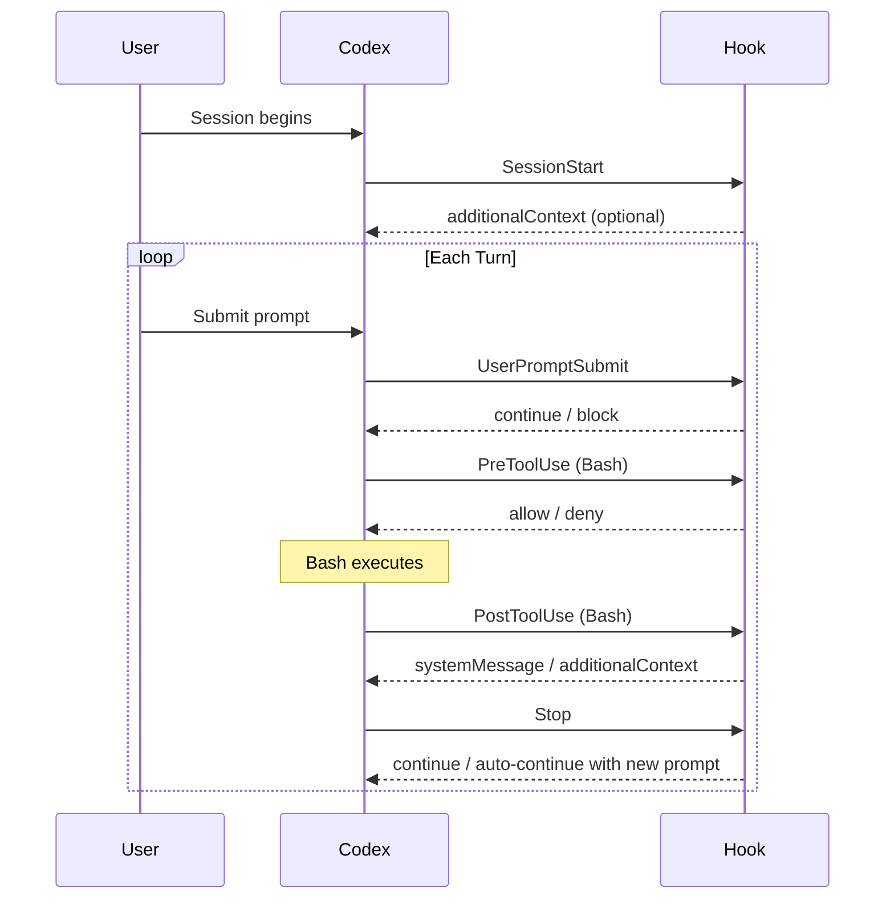

# Codex CLI Hooks Engine: Extending the Agentic Loop with Lifecycle Scripts

**Date:** 2026-03-30
**Tags:** hooks, hooks-engine, lifecycle-events, security-gates, audit-logging, PreToolUse, PostToolUse, SessionStart

The Codex CLI Hooks Engine, introduced experimentally in v0.114.0[^1], gives developers a principled way to inject scripts into the agentic loop at defined lifecycle points. Before hooks, the only way to enforce policy was to fork the process and manually parse JSONL rollout files — a fragile approach that broke across releases. Hooks change this: they are a first-class, documented mechanism backed by a stable JSON protocol.

This article covers the complete hooks surface as of v0.117.0: the five supported events, the `hooks.json` configuration format, the stdin/stdout contract, exit-code semantics, and practical patterns for security gates, audit logging, and session initialisation.

## Enabling Hooks

Hooks are off by default.[^2] Enable them in `~/.codex/config.toml`:

```toml
[features]
codex_hooks = true
```

Windows support is temporarily disabled.[^3] macOS and Linux are fully supported.

## Hook File Discovery

Codex loads `hooks.json` from two locations. Both files are loaded and their hooks merged — higher-precedence files do **not** shadow lower-precedence ones:[^4]

| Location | Scope |
|---|---|
| `~/.codex/hooks.json` | User-wide defaults |
| `<repo>/.codex/hooks.json` | Repository-level overrides |

This mirrors the layered semantics of `config.toml` and `AGENTS.md`: global defaults, local overrides.

## The Five Hook Events

Codex currently supports five lifecycle events.[^5] Four are turn-scoped (they fire within a single agent turn); `SessionStart` is session-scoped.



### SessionStart

Fires when a session begins (`startup`) or is resumed (`resume`). The matcher filters on start source:[^6]

```json
{
  "hooks": {
    "SessionStart": [
      {
        "matcher": "startup",
        "hooks": [
          {
            "type": "command",
            "command": "python3 ~/.codex/hooks/load_workspace_notes.py",
            "statusMessage": "Loading workspace context"
          }
        ]
      }
    ]
  }
}
```

**stdin payload:**

```json
{
  "session_id": "ses_abc123",
  "hook_event_name": "SessionStart",
  "cwd": "/home/dan/projects/myapp",
  "model": "gpt-5.3-codex",
  "transcript_path": "/home/dan/.codex/sessions/ses_abc123.jsonl"
}
```

**stdout response (optional):** Plain text written to stdout is injected as developer context — extra system instructions prepended to the conversation.[^7] Useful for loading dynamic workspace notes or environment-specific policies.

```python
#!/usr/bin/env python3
import json, sys, subprocess

# Inject current git branch and recent commits as context
branch = subprocess.check_output(["git", "rev-parse", "--abbrev-ref", "HEAD"]).decode().strip()
log = subprocess.check_output(["git", "log", "--oneline", "-5"]).decode().strip()

print(f"Current branch: {branch}\nRecent commits:\n{log}")
```

### PreToolUse

Fires before Codex executes a Bash command. This is the most security-critical hook — it can block the command before any side effects occur.[^8] Currently limited to Bash tool calls; other tools are not yet surfaced.

**stdin payload:**

```json
{
  "session_id": "ses_abc123",
  "hook_event_name": "PreToolUse",
  "turn_id": "turn_42",
  "cwd": "/home/dan/projects/myapp",
  "model": "gpt-5.3-codex",
  "tool_name": "Bash",
  "tool_use_id": "tool_use_7",
  "tool_input": {
    "command": "rm -rf ./dist"
  }
}
```

**Blocking a command:** Return exit code `2` and write the reason to stderr, or write a JSON block decision to stdout:[^9]

```json
{
  "hookSpecificOutput": {
    "hookEventName": "PreToolUse",
    "permissionDecision": "deny",
    "permissionDecisionReason": "Destructive rm -rf blocked by hook policy."
  }
}
```

**Example — blocking destructive commands:**

```python
#!/usr/bin/env python3
import json, sys, re

payload = json.load(sys.stdin)
command = payload.get("tool_input", {}).get("command", "")

BLOCKED_PATTERNS = [
    r"\brm\s+-rf\b",
    r"\bgit\s+push\s+--force\b",
    r"\bdrop\s+table\b",
    r"\btruncate\s+table\b",
]

for pattern in BLOCKED_PATTERNS:
    if re.search(pattern, command, re.IGNORECASE):
        print(json.dumps({
            "hookSpecificOutput": {
                "hookEventName": "PreToolUse",
                "permissionDecision": "deny",
                "permissionDecisionReason": f"Command matches blocked pattern: {pattern}"
            }
        }))
        sys.exit(2)
```

> ⚠️ `PreToolUse` currently supports `systemMessage` in the response, but `continue`, `stopReason`, and `suppressOutput` are parsed but not yet implemented for this event.[^10]

### PostToolUse

Fires after a Bash command completes. Cannot undo side effects, but can inject feedback into the model's context or signal an error condition.[^11]

**stdin payload adds the tool response:**

```json
{
  "session_id": "ses_abc123",
  "hook_event_name": "PostToolUse",
  "turn_id": "turn_42",
  "tool_name": "Bash",
  "tool_input": { "command": "npm test" },
  "tool_response": {
    "output": "...",
    "exit_code": 1
  }
}
```

**Useful response fields:** `systemMessage` is surfaced as a UI warning; `continue: false` with `stopReason` ends the turn; `additionalContext` feeds structured information back to the model.[^12]

**Example — test failure audit log:**

```python
#!/usr/bin/env python3
import json, sys, datetime, pathlib

payload = json.load(sys.stdin)
response = payload.get("tool_response", {})
exit_code = response.get("exit_code", 0)

if exit_code != 0:
    log_entry = {
        "ts": datetime.datetime.utcnow().isoformat(),
        "session_id": payload["session_id"],
        "command": payload["tool_input"]["command"],
        "exit_code": exit_code,
    }
    log_path = pathlib.Path.home() / ".codex" / "audit.jsonl"
    with log_path.open("a") as f:
        f.write(json.dumps(log_entry) + "\n")
```

### UserPromptSubmit

Fires every time the user submits a prompt, before it enters the conversation history. Ideal for secret detection — catching accidentally pasted API keys or tokens before they persist.[^13]

The matcher field is silently ignored for this event: all `UserPromptSubmit` hooks receive every prompt.[^14]

```json
{
  "hooks": {
    "UserPromptSubmit": [
      {
        "hooks": [
          {
            "type": "command",
            "command": "/usr/local/bin/python3 ~/.codex/hooks/secret_scan.py"
          }
        ]
      }
    ]
  }
}
```

**stdin payload:**

```json
{
  "session_id": "ses_abc123",
  "hook_event_name": "UserPromptSubmit",
  "turn_id": "turn_43",
  "prompt": "Please update the config to use sk-live-XXXXXXXXXXXXXXXXXXXXXXXX"
}
```

**Example — secret scanning hook:**

```python
#!/usr/bin/env python3
import json, sys, re

SECRET_PATTERNS = [
    (r"sk-live-[A-Za-z0-9]{20,}", "OpenAI live API key"),
    (r"ghp_[A-Za-z0-9]{36}", "GitHub personal access token"),
    (r"AKIA[0-9A-Z]{16}", "AWS access key ID"),
    (r"-----BEGIN (RSA|EC|OPENSSH) PRIVATE KEY-----", "Private key material"),
]

payload = json.load(sys.stdin)
prompt = payload.get("prompt", "")

for pattern, label in SECRET_PATTERNS:
    if re.search(pattern, prompt):
        print(json.dumps({
            "continue": False,
            "stopReason": f"Blocked: prompt contains {label}. Remove the secret and try again."
        }))
        sys.exit(2)
```

### Stop

Fires at the end of each turn, after the assistant's final message. Uniquely, returning `decision: "block"` does not abort the session — it triggers an **auto-continuation**, appending the `reason` as a new user prompt.[^15] This enables self-directed loops: a hook can instruct Codex to verify its own output.

**stdin payload includes the final assistant message:**

```json
{
  "session_id": "ses_abc123",
  "hook_event_name": "Stop",
  "turn_id": "turn_42",
  "stop_hook_active": false,
  "last_assistant_message": "I've updated the function. Here are the changes..."
}
```

> ⚠️ The `stop_hook_active` flag prevents infinite loops: if `Stop` fires because a previous `Stop` hook triggered a continuation, this flag is `true`. Your hook must check it and return normally to avoid infinite recursion.[^16]

**Example — automatic test verification loop:**

```python
#!/usr/bin/env python3
import json, sys, subprocess

payload = json.load(sys.stdin)

# Prevent recursive continuation
if payload.get("stop_hook_active"):
    sys.exit(0)

result = subprocess.run(
    ["npm", "test", "--silent"],
    capture_output=True, cwd=payload["cwd"]
)

if result.returncode != 0:
    print(json.dumps({
        "decision": "block",
        "reason": f"Tests failed after your changes. Failures:\n{result.stdout.decode()[:2000]}\nPlease fix them."
    }))
    sys.exit(2)
```

## Exit Code Semantics

| Exit Code | Meaning |
|---|---|
| `0` | Success — Codex proceeds normally |
| `1` | Non-blocking error — Codex logs but proceeds |
| `2` | Block — action is denied or turn is stopped |

Exit code `2` is the enforcement code. Any security gate that does not return `2` on match is advisory only.

## Timeout Configuration

Every hook definition accepts a `timeout` field (seconds, default 600).[^17] Keep synchronous hooks fast:

```json
{
  "type": "command",
  "command": "python3 ~/.codex/hooks/quick_check.py",
  "statusMessage": "Checking policy",
  "timeout": 10
}
```

Hooks running under 200ms add no noticeable latency. Slow `PreToolUse` hooks block every Bash call — profile carefully.

## Concurrency

Multiple hooks matching the same event fire **concurrently**.[^18] One hook cannot prevent another from starting. For security gates, this means multiple blockers can all fire simultaneously, but if any returns exit code `2`, the action is blocked.

## Community Ecosystem

The [`hatayama/codex-hooks`](https://github.com/hatayama/codex-hooks) project provides a macOS-focused hook runner that watches session JSONL files and replays a compatible subset of Claude Code hook events (`TaskStarted`, `TaskComplete`, `TurnAborted`). It also checks `~/.codex/hooks.json` before falling back to Claude's `~/.claude/settings.json`, enabling teams running both agents to share hook definitions.[^19]

Note the important limitation: this runner executes commands but does not implement the full Codex runtime protocol — hooks returning `{"decision":"block"}` will not influence Codex behaviour through this runner. It is best suited for side-effect notifications (desktop alerts, iTerm title updates, sound effects) rather than policy enforcement.

## Limitations and Roadmap

Several planned hook features are not yet implemented:[^20]

- `updatedInput` — modify the tool input before execution
- `updatedMCPToolOutput` — rewrite MCP tool results
- `suppressOutput` — parsed but inactive
- `permissionDecision: "ask"` — interactive approval mid-hook
- `PreToolUse` / `PostToolUse` for non-Bash tools (Edit, Write, etc.)
- Windows support

The gap between Codex hooks (5 events) and Claude Code hooks (12+ events) is most visible in the absence of MCP tool interception and non-Bash tool lifecycle events — worth tracking in the [GitHub issues](https://github.com/openai/codex/issues/14754).[^21]

## Practical Configuration: Full Example

A production-grade `.codex/hooks.json` combining all five events:

```json
{
  "hooks": {
    "SessionStart": [
      {
        "matcher": "startup|resume",
        "hooks": [
          {
            "type": "command",
            "command": "python3 .codex/hooks/load_context.py",
            "statusMessage": "Loading workspace context",
            "timeout": 15
          }
        ]
      }
    ],
    "UserPromptSubmit": [
      {
        "hooks": [
          {
            "type": "command",
            "command": "python3 .codex/hooks/secret_scan.py",
            "timeout": 5
          }
        ]
      }
    ],
    "PreToolUse": [
      {
        "matcher": "Bash",
        "hooks": [
          {
            "type": "command",
            "command": "python3 .codex/hooks/command_policy.py",
            "statusMessage": "Checking command policy",
            "timeout": 10
          }
        ]
      }
    ],
    "PostToolUse": [
      {
        "matcher": "Bash",
        "hooks": [
          {
            "type": "command",
            "command": "python3 .codex/hooks/audit_log.py",
            "timeout": 5
          }
        ]
      }
    ],
    "Stop": [
      {
        "hooks": [
          {
            "type": "command",
            "command": "python3 .codex/hooks/verify_tests.py",
            "timeout": 120
          }
        ]
      }
    ]
  }
}
```

This stack gives you: dynamic context injection at startup, secret scanning on every prompt, destructive command blocking, a JSONL audit trail of all commands, and automatic test verification before each turn ends.

## Citations

[^1]: Codex CLI v0.114.0 release — experimental hooks with `SessionStart` and `Stop` events (PR #13276). GitHub Releases: https://github.com/openai/codex/releases
[^2]: `features.codex_hooks` configuration key. Codex Configuration Reference: https://developers.openai.com/codex/config-reference
[^3]: Hooks — Codex Developer Documentation (Windows support note): https://developers.openai.com/codex/hooks
[^4]: Hook file discovery and merge behaviour. Codex Hooks Documentation: https://developers.openai.com/codex/hooks
[^5]: Five supported hook events: SessionStart, PreToolUse, PostToolUse, UserPromptSubmit, Stop. Codex Hooks Documentation: https://developers.openai.com/codex/hooks
[^6]: SessionStart matcher values (`startup`, `resume`). Codex Hooks Documentation: https://developers.openai.com/codex/hooks
[^7]: `additionalContext` field in SessionStart hookSpecificOutput. Codex Hooks Documentation: https://developers.openai.com/codex/hooks
[^8]: PreToolUse as security gate — fires before command execution. Codex Hooks Documentation: https://developers.openai.com/codex/hooks
[^9]: Blocking with exit code 2 or `permissionDecision: "deny"`. Codex Hooks Documentation: https://developers.openai.com/codex/hooks
[^10]: PreToolUse unsupported fields: `continue`, `stopReason`, `suppressOutput`. Codex Hooks Documentation: https://developers.openai.com/codex/hooks
[^11]: PostToolUse cannot undo side effects. Codex Hooks Documentation: https://developers.openai.com/codex/hooks
[^12]: PostToolUse supported fields: `systemMessage`, `continue: false`, `stopReason`. Codex Hooks Documentation: https://developers.openai.com/codex/hooks
[^13]: UserPromptSubmit for secret detection. OpenAI Codex CLI ships v0.116.0 with enterprise features — Augment Code: https://www.augmentcode.com/learn/openai-codex-cli-enterprise
[^14]: UserPromptSubmit matcher is silently ignored. Codex Hooks Documentation: https://developers.openai.com/codex/hooks
[^15]: Stop hook `decision: "block"` triggers auto-continuation. Codex Hooks Documentation: https://developers.openai.com/codex/hooks
[^16]: `stop_hook_active` flag prevents infinite loops. Codex Hooks Documentation: https://developers.openai.com/codex/hooks
[^17]: Hook `timeout` parameter, default 600 seconds. Codex Hooks Documentation: https://developers.openai.com/codex/hooks
[^18]: Concurrent hook execution. Codex Hooks Documentation: https://developers.openai.com/codex/hooks
[^19]: `hatayama/codex-hooks` — Claude Code hook compatibility runner: https://github.com/hatayama/codex-hooks
[^20]: Unimplemented hook features. Codex Hooks Documentation: https://developers.openai.com/codex/hooks
[^21]: Community request for PreToolUse/PostToolUse for non-Bash tools — Issue #14754: https://github.com/openai/codex/issues/14754
