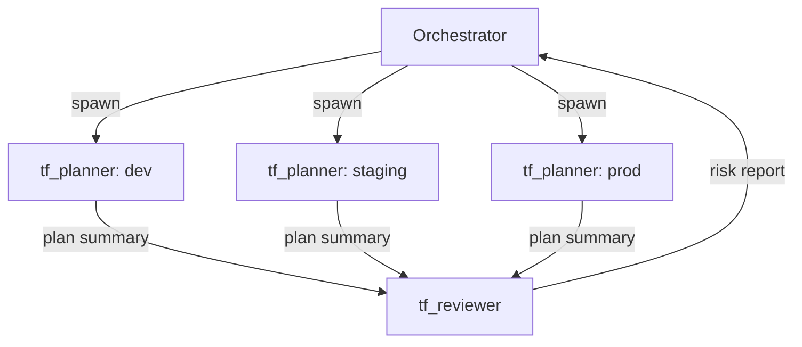

# Codex CLI for Infrastructure as Code: Terraform, Pulumi and Ansible Automation


Infrastructure as Code occupies a peculiar place in the agentic coding landscape. The feedback loops are slower than application code, the blast radius of a mistake is larger, and the tooling — `terraform apply`, `pulumi up`, `ansible-playbook` — does real things to real infrastructure. That makes IaC a good domain for Codex CLI: the agent handles the tedious scaffolding and validation loops, while you stay in the approval seat for anything that mutates state.

## Configuring Your IaC Repository for Codex

Start with a well-scoped `AGENTS.md` at the repo root. The key constraint for IaC work is telling Codex which files are sensitive and must never be read or echoed into the model context.[^1]

```markdown
# Infrastructure Repository Guide

## Structure
- `terraform/modules/` – Reusable HCL modules (VPC, EKS, RDS)
- `terraform/environments/` – Per-environment root modules (dev/, staging/, prod/)
- `ansible/roles/` – Ansible roles, each with a Molecule test scenario
- `ansible/playbooks/` – Environment-specific playbooks

## Conventions
- Terraform provider versions: `required_version = ">= 1.9.0"` on all modules
- Never generate `terraform.tfvars`; use `*.tfvars.json` with a `.gitignore` entry
- CDKTF is deprecated (EOL December 2025); use standard HCL only[^2]
- State is remote (S3/GCS backend); `.tfstate` files MUST NOT appear locally

## Security Rules
- Never read, embed, or echo content from `.env`, `*.tfstate`, `*tfvars*`, or `*credentials*`
- All IAM policies must follow least-privilege; flag any `"*"` in Resource blocks as HIGH risk
- Do not enable network access unless a fetch task explicitly requires it

## Test Commands
- Terraform: `terraform fmt -check && terraform validate && terraform plan -out=plan.tfplan`
- Ansible: `cd ansible/roles/<role> && molecule test`
- Lint: `tflint --recursive && ansible-lint ansible/`
```

For larger repos, place nested `AGENTS.md` files inside `terraform/` and `ansible/` with tool-specific conventions. The AGENTS.md standard — now stewarded by the Linux Foundation and adopted by 60,000+ open-source projects — supports hierarchical override: child files extend rather than replace parent context.[^3]

## Terraform Workflows

### Resource and Module Generation

Codex generates HCL, runs `terraform fmt` and `terraform validate`, and feeds any errors back into the model loop without manual intervention. For complex modules, the non-interactive path is cleaner than the interactive TUI:

```bash
codex exec --full-auto "Scaffold a Terraform module at terraform/modules/eks-cluster/ \
  with variables.tf, outputs.tf, versions.tf, and main.tf. \
  Requirements: EKS 1.32, managed node groups, IRSA enabled, \
  OIDC provider, IAM roles for aws-load-balancer-controller. \
  Run terraform fmt and terraform validate before finishing."
```

The agent self-corrects against `terraform validate` output in one to two iterations for most modules. HCP Terraform Stacks (GA in 2025) are now the preferred multi-environment backend; plan your module outputs to align with its stack configuration format.[^4]

### Plan Analysis

Feed `terraform show -no-color` output to Codex for a structured risk review:

```bash
terraform plan -no-color -out=tfplan
terraform show -no-color tfplan > plan_output.txt

codex exec --full-auto "Review plan_output.txt for:
  1. Destructive operations (forces_replacement = true)
  2. IAM or security group changes
  3. Cost-significant resource additions (RDS, ElastiCache, NAT Gateway)
  Output: SEVERITY: [CRITICAL/HIGH/MEDIUM/LOW] and RECOMMENDATION: [approve/block]
  with a bullet-point rationale for each finding."
```

Research from 2025 shows LLM-based drift detection achieves `pass@3` accuracy of 0.97 across hundreds of real Terraform scenarios when given structured plan JSON as context.[^5]

### Drift Detection

The agentic drift loop: read `terraform state list`, compare against live cloud API state via `aws resourcegroupstaggingapi` or equivalent, classify the drift category, and output an `import` block or targeted `terraform apply -target` recommendation.[^6] Use `sandbox: workspace-write` (default) and **never** grant network access unless you have explicitly scoped it to the cloud provider API endpoints in `requirements.toml`.

## Pulumi

There is no native Codex–Pulumi integration as of March 2026, but the workflow composes naturally. Codex reads Pulumi's TypeScript or Python SDK documentation via MCP context servers, and can drive the full `pulumi preview → fix → pulumi up` loop:

```bash
codex exec --full-auto "Generate a Pulumi TypeScript program in ./infra/ that deploys:
  - An S3 bucket with versioning and server-side AES256 encryption
  - A CloudFront distribution in front of the bucket with HTTPS-only viewer protocol
  - Use pulumi.Config() for environment-specific origin paths.
  Run pulumi preview; fix any TypeScript type errors; do not run pulumi up."
```

Stack configuration files (`Pulumi.dev.yaml`, `Pulumi.prod.yaml`) map naturally to Codex's ability to diff environment-specific values. The key discipline: instruct the agent to stop after `pulumi preview` — never allow it to run `pulumi up` without human review in the approval policy.

## Ansible

### Playbook and Role Generation

Codex correctly generates Ansible following idempotency conventions — using `ansible.builtin.package` rather than raw shell, proper `when:`, `loop:`, and `notify:` patterns:

```bash
codex exec --full-auto "Write an Ansible role at ansible/roles/nginx-hardened/ that:
  - Installs nginx 1.26 from the official repo
  - Deploys templates/nginx.conf.j2 with vars from host_vars/
  - Enables the service, notifies a reload handler on config change
  - Sets security headers: X-Frame-Options SAMEORIGIN, X-Content-Type-Options nosniff
  Follow ansible-galaxy init directory conventions including a Molecule test scenario."
```

Scaffold a complete Molecule test scenario alongside the role so validation is built in from the start.[^7]

### Molecule Testing Loop

```bash
# After Codex generates the role, validate it with Molecule
cd ansible/roles/nginx-hardened
molecule test   # destroy → create → converge → idempotence → verify → destroy
```

Important: AI-generated Ansible automation is non-deterministic. Steampunk/XLAB analysis (2026) shows that manual review and basic ansible-lint are no longer sufficient alone; combine with Molecule runtime validation and a static scanner (Steampunk Spotter, Checkov) before production use.[^8]

Red Hat shipped certified Ansible Content Collections for Terraform (`hashicorp.terraform`) and Vault (`hashicorp.vault`) in November 2025, enabling unified Ansible-Terraform-Vault workflows from a single Codex session.[^9]

## Multi-Environment Subagent Pattern

Use subagents to run Terraform plans across environments in parallel. Each sub-agent gets a single environment directory and is prohibited from running `apply`:

```toml
# .codex/config.toml
[agents]
max_threads = 4     # dev, staging, prod, and a reviewer in parallel
max_depth   = 1     # no recursive spawning
job_max_runtime_seconds = 1800
```

```toml
# .codex/agents/tf_planner.toml
name = "tf_planner"
description = "Terraform plan generator — validates, plans, never applies"
model = "gpt-5.4"
sandbox_mode = "workspace-write"
developer_instructions = """
Given an environment path and tfvars file:
1. terraform init -backend-config=<env>.hcl
2. terraform validate
3. terraform plan -out=<env>.tfplan -var-file=<env>.tfvars.json -no-color
4. Output the plan summary. Never run terraform apply.
"""
```

Orchestrator prompt:

```
Spawn one tf_planner sub-agent for each directory in terraform/environments/.
Pass each agent its environment path. Wait for all plans to complete,
then summarise any HIGH or CRITICAL findings per environment.
```

The `spawn_agents_on_csv` experimental tool enables batch processing from a CSV of environment names and paths.[^10]



Sub-agents inherit sandbox and approval policies from the parent session, including network rules and persisted host approvals — safe to use in locked-down enterprise environments.[^11]

## Security Considerations

IaC contexts carry elevated risk because the working directory often contains sensitive material. Three specific threats to address:

**Sensitive file exposure.** When Codex performs workspace-wide context searches via `rg` or `cat`, gitignored files (`*.tfstate`, `*.tfvars`, `.env`) can still be read locally and appear in model context — potentially sent to the OpenAI API.[^12] Mitigations:

```bash
# On Linux: use Landlock to restrict Codex to the Terraform directory only
landrun --ro /workspace/terraform --rw /workspace/terraform/.codex codex
```

Always use remote state backends (S3, GCS, HCP Terraform) rather than local state files. Set `log_user_prompt = false` in the `[otel]` config section to prevent prompt content being logged.

**CVE-2025-61260 (CVSS 9.8).** A command injection vulnerability in Codex CLI v0.22 and earlier allowed a malicious `.codex/config.toml` to execute arbitrary commands on anyone running Codex in that repo. Fixed in v0.23.0.[^13] Require a minimum version in your team's `requirements.toml`:

```toml
[requirements]
min_codex_version = "0.117.0"
```

**Credential hygiene in CI.** Use OIDC-based dynamic credentials (GitHub Actions OIDC → AWS, GCP, Azure) rather than long-lived access keys. Codex cloud environments strip secrets before agent execution begins, but for local use, prefer dynamic short-lived credentials that cannot persist in workspace context.

## CI/CD Integration

The `openai/codex-action@v1` GitHub Action integrates cleanly with Terraform PR workflows[^14]:

```yaml
name: IaC Review
on:
  pull_request:
    paths: ['terraform/**', 'ansible/**']

jobs:
  codex-review:
    runs-on: ubuntu-latest
    steps:
      - uses: actions/checkout@v4
      - uses: hashicorp/setup-terraform@v3
        with:
          terraform_version: "1.12.0"
          cli_config_credentials_token: ${{ secrets.TF_API_TOKEN }}

      - name: Generate Terraform Plan
        run: |
          terraform -chdir=terraform/environments/staging init
          terraform -chdir=terraform/environments/staging plan \
            -no-color -out=staging.tfplan
          terraform -chdir=terraform/environments/staging show \
            -no-color staging.tfplan > plan_output.txt

      - name: Codex IaC Review
        uses: openai/codex-action@v1
        with:
          prompt-file: .codex/prompts/terraform-review.md
          sandbox: read-only
          safety-strategy: drop-sudo
          output-file: review.txt
        env:
          OPENAI_API_KEY: ${{ secrets.OPENAI_API_KEY }}

      - name: Post Review Comment
        uses: actions/github-script@v7
        with:
          script: |
            const review = require('fs').readFileSync('review.txt','utf8');
            github.rest.issues.createComment({
              issue_number: context.issue.number,
              owner: context.repo.owner,
              repo: context.repo.repo,
              body: `## Codex IaC Review\n\n${review}`
            });
```

Use `sandbox: read-only` for review jobs to eliminate any risk of accidental mutation. GitLab CI follows the same pattern via `codex exec --full-auto` with structured JSON output extracted by `awk`.[^15]

## Summary

Codex CLI adds genuine value in IaC workflows when used in the right role: scaffolding and validating HCL/YAML, analysing plan output for risk, and coordinating multi-environment runs via subagents. The critical discipline is keeping Codex away from state files and secrets, using remote backends, and reserving `apply` operations for explicit human approval. With a well-crafted `AGENTS.md` and a layered security posture, it becomes a reliable force multiplier for infrastructure teams.

## Citations

[^1]: Codex CLI AGENTS.md guide — [https://developers.openai.com/codex/guides/agents-md](https://developers.openai.com/codex/guides/agents-md)
[^3]: AGENTS.md open standard (Linux Foundation) — [https://agents.md/](https://agents.md/)
[^4]: HCP Terraform Stacks GA announcement — [https://www.hashicorp.com/blog/terraform-stacks-general-availability](https://www.hashicorp.com/blog/terraform-stacks-general-availability)
[^5]: NSync: AI-Agents for Automated Infrastructure Reconciliation (arXiv, 2025) — [https://arxiv.org/html/2510.20211v1](https://arxiv.org/html/2510.20211v1)
[^6]: AI-Driven Drift Detection in AWS (DevOps.com) — [https://devops.com/ai-driven-drift-detection-in-aws-terraform-meets-intelligence/](https://devops.com/ai-driven-drift-detection-in-aws-terraform-meets-intelligence/)
[^7]: Ansible Molecule documentation — [https://docs.ansible.com/projects/molecule/](https://docs.ansible.com/projects/molecule/)
[^8]: Five Best Ansible Playbook Scanning Tools 2026 (Steampunk/XLAB) — [https://steampunk.si/spotter/blog/five-best-ansible-playbook-scanning-tools/](https://steampunk.si/spotter/blog/five-best-ansible-playbook-scanning-tools/)
[^9]: Red Hat Ansible Certified Content for HashiCorp Terraform and Vault (November 2025) — [https://www.redhat.com/en/blog/new-ansible-certified-content-hashicorp-terraformvault](https://www.redhat.com/en/blog/new-ansible-certified-content-hashicorp-terraformvault)
[^10]: Codex CLI subagents documentation — [https://developers.openai.com/codex/subagents](https://developers.openai.com/codex/subagents)
[^11]: Codex CLI agent approvals and security model — [https://developers.openai.com/codex/agent-approvals-security](https://developers.openai.com/codex/agent-approvals-security)
[^12]: GitHub issue #1397: Configurable file exclusion for sensitive files — [https://github.com/openai/codex/issues/1397](https://github.com/openai/codex/issues/1397)
[^13]: CVE-2025-61260: Codex CLI Command Injection Vulnerability (Check Point Research) — [https://research.checkpoint.com/2025/openai-codex-cli-command-injection-vulnerability/](https://research.checkpoint.com/2025/openai-codex-cli-command-injection-vulnerability/)
[^14]: OpenAI Codex GitHub Action — [https://developers.openai.com/codex/github-action](https://developers.openai.com/codex/github-action)
[^15]: Codex CLI GitLab secure quality cookbook — [https://developers.openai.com/cookbook/examples/codex/secure_quality_gitlab](https://developers.openai.com/cookbook/examples/codex/secure_quality_gitlab)
