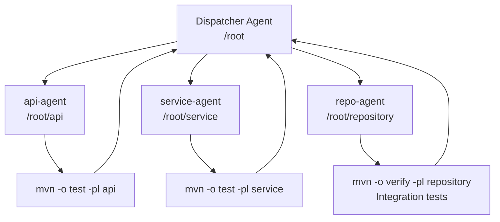

# Codex CLI for Java and Spring Boot Teams: AGENTS.md, Maven Sandboxing, and Gradle Workflows


Java is one of the most-used languages in enterprise software, yet Codex CLI guidance skews heavily toward Python, TypeScript, and Go. This article fills that gap: AGENTS.md templates, the Maven Central proxy workaround that trips up every new Java team, Gradle's cleaner offline story, and workflow patterns for Spring Boot projects that need Testcontainers, Spotless, and package-by-feature architecture.

---

## The Core Challenge: Maven and the Network Sandbox

Before writing a single line of AGENTS.md, every Java team hits the same wall. Codex CLI's default `workspace-write` sandbox blocks outbound network calls at the IP-tables level.[^1] `curl` and `apt-get` work because they honour the transparent `proxy:8080` tunnel Codex provisions — but Maven's HTTP client does not pick up that proxy automatically.

The result is a deeply unhelpful error on the first `./mvnw test`:

```
[ERROR] Non-resolvable import POM: The following artifacts could not be
resolved: org.springframework.boot:spring-boot-dependencies:pom:3.4.1
(absent): Could not transfer artifact ... Network is unreachable
```

This is not a bug you can fix by toggling "allow internet access" in the app — that permission controls something else entirely. The fix is a two-step setup script.

### Step 1: Route Maven Through Codex's Internal Proxy

Drop the following into **Environment → Setup Script** (cloud environments) or run it as part of your `SessionStart` hook (local):

```bash
#!/usr/bin/env bash
set -euo pipefail

# Point all HTTP(S) traffic at Codex's built-in proxy
export http_proxy="http://proxy:8080"
export https_proxy="http://proxy:8080"
export JAVA_TOOL_OPTIONS="-Dhttps.proxyHost=proxy -Dhttps.proxyPort=8080 \
  -Dhttp.proxyHost=proxy -Dhttp.proxyPort=8080 \
  -Dhttps.proxySet=true -Dhttp.proxySet=true"

# Write Maven settings.xml that routes through the proxy
mkdir -p ~/.m2
cat > ~/.m2/settings.xml <<'EOF'
<settings xmlns="http://maven.apache.org/SETTINGS/1.0.0">
  <proxies>
    <proxy>
      <id>codex</id>
      <active>true</active>
      <protocol>http</protocol>
      <host>proxy</host>
      <port>8080</port>
    </proxy>
    <proxy>
      <id>codex-https</id>
      <active>true</active>
      <protocol>https</protocol>
      <host>proxy</host>
      <port>8080</port>
    </proxy>
  </proxies>
</settings>
EOF

# Pre-warm the local Maven cache while the network is still open
mvn -B -q dependency:go-offline -f pom.xml 2>/dev/null || true
```

This script runs once when the Codex cloud environment is provisioned.[^2] After `dependency:go-offline` completes, all subsequent `mvn` invocations can resolve from `~/.m2/repository` without touching the network — which is exactly what happens once Codex's agent loop takes over.

### Step 2: Tell AGENTS.md to Use Offline Mode

```markdown
## Build & Test Commands

Always run Maven with `-o` (offline) after the initial setup:

```bash
# Run all tests
./mvnw -o verify

# Run a single test class
./mvnw -o test -Dtest=UserServiceTest

# Run integration tests only
./mvnw -o verify -Dit.test=UserRepositoryIT -DskipUnitTests=true
```

The `-o` flag prevents Maven from attempting remote artifact resolution.
Network is unavailable during agentic tool calls; builds that require
downloads will fail.

```

---

## Gradle: A Cleaner Offline Story

Gradle teams generally have fewer sandboxing headaches because the `--offline` flag is a first-class concept built deeply into Gradle's dependency resolution.[^3] The Temporal team, who used Codex to improve their Java SDK — generating seven merged pull requests across three repositories — relied exclusively on `--offline` for all test runs:[^4]

```bash
# Format before committing
./gradlew --offline spotlessApply

# Run a targeted test suite
./gradlew --offline :temporal-sdk:test --tests "io.temporal.workflow.*"

# Full build
./gradlew --offline clean build
```

The key constraint: run `./gradlew dependencies` once with the network proxy configured (same `JAVA_TOOL_OPTIONS` trick above) before agent sessions begin. After that, `--offline` is reliable.

For Gradle projects, add a `wrapper/gradle-wrapper.properties` enforcement to AGENTS.md:

```markdown
## Build Commands

Use the Gradle wrapper. Never install Gradle globally.

- Format: `./gradlew --offline spotlessApply`
- Unit tests: `./gradlew --offline test`
- Targeted: `./gradlew --offline :<module>:test --tests "<pkg.Class>"`
- All checks: `./gradlew --offline check`

Run `./gradlew --offline check` before marking any task complete.
```

---

## AGENTS.md Template for Spring Boot Projects

The community-maintained Spring Boot AGENTS.md template (originally written for Kotlin but fully applicable to Java) codifies several patterns that prevent common Codex mistakes in large Spring applications.[^5]

```markdown
# AGENTS.md — Spring Boot Project

## Architecture

This project uses **package-by-feature** (not package-by-layer).

Structure: `com.example.<feature>/{controller,service,repository,model,config}/`

- Features are self-contained. Never import a repository from another feature package.
- Repositories are `package-private` / `internal` to enforce encapsulation.
- Services own transactions. Multiple service calls can share one transaction.

## Bean Configuration

**Never** use `@Component`, `@Service`, or `@Repository` on implementation classes.
**Always** use `@Configuration` + `@Bean` methods for explicit dependency wiring.

Correct:
```java
@Configuration
public class UserConfig {
    @Bean
    public UserService userService(UserRepository repo) {
        return new UserServiceImpl(repo);
    }
}
```

Wrong (do not do this):

```java
@Service   // ← forbidden
public class UserServiceImpl implements UserService { ... }
```

## Dependency Versions

Always pin versions as properties in `pom.xml`:

```xml
<properties>
    <mapstruct.version>1.6.3</mapstruct.version>
    <resilience4j.version>2.3.0</resilience4j.version>
</properties>
```

Spring Boot parent-managed dependencies (e.g. `spring-boot-starter-web`) do not
need explicit version properties.

## Testing

- **Unit tests**: `@WebMvcTest` for controllers (mock service layer with `@MockBean`).
  `@ExtendWith(MockitoExtension.class)` for services.
- **Integration tests**: extend `BaseIT` which starts Testcontainers PostgreSQL.
  Use `@BeforeEach` + `repository.deleteAll()` for isolation between tests.
- **Never** use reflection to set entity IDs in tests — use the test-subclass pattern.

## Logging

Use SLF4J with Logback. `private static final Logger log = LoggerFactory.getLogger(Foo.class);`

- INFO: entity modified
- DEBUG: retrieval path
- WARN: recoverable errors
- ERROR: unrecoverable failures
- Never log PII or user identifiers.

## Error Handling

Return appropriate HTTP status codes:

- 503 for downstream unavailability
- 504 for timeout
- 500 for unexpected failures

Wrap external calls with Resilience4j circuit breakers for production services.

```

---

## Testcontainers and the Sandbox

Testcontainers spins up Docker containers during tests — this works correctly inside Codex's `workspace-write` sandbox because Docker socket access is **not** blocked by the network firewall.[^6]

However, pulling new images requires network access. Pull your test images during the setup script:

```bash
# In setup script, before network closes
docker pull postgres:17-alpine
docker pull redis:8-alpine
docker pull localstack/localstack:3.5
```

Then in AGENTS.md:

```markdown
## Testcontainers

All Docker images required for integration tests are pre-pulled. Do not attempt
to `docker pull` during test execution — the network is unavailable.

Integration tests inherit from `BaseIT`:

```java
@Testcontainers
public abstract class BaseIT {
    @Container
    static PostgreSQLContainer<?> postgres =
        new PostgreSQLContainer<>("postgres:17-alpine");

    @DynamicPropertySource
    static void props(DynamicPropertyRegistry r) {
        r.add("spring.datasource.url", postgres::getJdbcUrl);
        r.add("spring.datasource.username", postgres::getUsername);
        r.add("spring.datasource.password", postgres::getPassword);
    }
}
```

```

---

## Multi-Agent Pattern: Parallel Module Work

Large multi-module Maven or Gradle projects are well-suited to Codex CLI's multi-agent model.[^7] A dispatcher agent fans out work to specialist agents scoped to individual modules:



The dispatcher's TOML configuration in `.codex/agents/java-dispatcher.toml`:

```toml
[agent]
name = "java-dispatcher"
model = "gpt-5-codex"
description = "Orchestrates parallel module work across Maven sub-modules"

[agent.spawn]
max_threads = 4

[[agent.tasks]]
name = "api"
model = "gpt-5-codex-mini"
working_directory = "api/"

[[agent.tasks]]
name = "service"
model = "gpt-5-codex-mini"
working_directory = "service/"

[[agent.tasks]]
name = "repository"
model = "gpt-5-codex-mini"
working_directory = "repository/"
```

Each sub-agent inherits the sandbox policy and runs `./mvnw -o test -pl <module>` in its scoped directory.

---

## Database Schema Conventions

Guide Codex to generate consistent schema via AGENTS.md so you don't get mixed conventions across generated migrations (Flyway and Liquibase are both common in Spring teams):

```markdown
## Database Schema Conventions

- Table names: plural snake_case (`user_events`, not `UserEvent`)
- Column names: snake_case (`created_at`, not `createdAt`)
- Primary keys: `BIGSERIAL` or `UUID` — follow existing table convention
- Always include `created_at TIMESTAMPTZ DEFAULT NOW()` and
  `updated_at TIMESTAMPTZ DEFAULT NOW()` on every table
- Foreign keys: `<referenced_table>_id` (e.g. `order_id`)
- Flyway migrations: `V{next}__description_in_snake_case.sql`
- Never modify existing Flyway migration files — always create a new version

Prefer keyset pagination over `LIMIT/OFFSET`:

```sql
-- Correct
WHERE id > :lastSeenId ORDER BY id ASC LIMIT :pageSize

-- Avoid for large tables
LIMIT :pageSize OFFSET :offset
```

```

---

## CI/CD Integration with GitHub Actions

```yaml
# .github/workflows/codex-java.yml
name: Codex Java Review

on:
  pull_request:
    paths: ['src/**', 'pom.xml', 'build.gradle.kts']

jobs:
  codex-review:
    runs-on: ubuntu-latest
    steps:
      - uses: actions/checkout@v4

      - name: Cache Maven repository
        uses: actions/cache@v4
        with:
          path: ~/.m2/repository
          key: ${{ runner.os }}-maven-${{ hashFiles('**/pom.xml') }}

      - name: Set up Java 21
        uses: actions/setup-java@v4
        with:
          java-version: '21'
          distribution: 'temurin'

      - name: Codex review
        uses: openai/codex-action@v1
        with:
          prompt: |
            Review the changed files in this PR. Focus on:
            - Spring Boot best practices (explicit bean config, layered architecture)
            - Test coverage for new service methods
            - N+1 query risks in JPA associations
            - Missing circuit breakers on external service calls
          model: gpt-5-codex
          approval_policy: never
        env:
          OPENAI_API_KEY: ${{ secrets.OPENAI_API_KEY }}
```

The Maven cache step is critical — `codex exec` in CI inherits the same dependency resolution constraints as interactive mode.[^8]

---

## Known Limitations

- **JPMS module path**: Projects using Java Platform Module System (`module-info.java`) may confuse Codex's path resolution. Add explicit `module` structure to AGENTS.md so the agent understands the module graph. ⚠️
- **Annotation processors**: Lombok, MapStruct, and QueryDSL generate code at compile time. Codex will sometimes edit generated source files. Add a note to AGENTS.md: "Never edit files under `target/generated-sources/`."
- **Reactive WebFlux**: Codex tends to produce blocking code. If your project is reactor-based, explicitly state this in AGENTS.md and include a note forbidding `.block()` calls outside test code.
- **GitHub Packages**: If your project pulls internal artifacts from GitHub Packages, add the `<server>` block to `settings.xml` and configure `GITHUB_TOKEN` as a Codex environment secret.[^9]

---

## Putting It Together

The single biggest enabler for Java + Codex is the Maven proxy configuration. Once dependencies resolve correctly, the rest follows standard AGENTS.md practice. The Spring Boot community AGENTS.md template is a strong starting point; layer in your team's specific conventions — architecture style, naming rules, approved dependencies — and you get consistent, reviewable output that respects your existing codebase patterns.

---

## Citations

[^1]: OpenAI Developer Community — "Codex unable to access Java Maven repository": <https://community.openai.com/t/codex-unable-to-access-java-maven-repository/1266455>

[^2]: Below the Line Blog — "Getting Java & Spring Boot builds to run inside OpenAI Codex when Maven Central is 'unreachable'": <https://belowtheline.blog/2025/06/23/getting-java-spring-boot-builds-to-run-inside-openai-codex-when-maven-central-is-unreachable/>

[^3]: Gradle documentation — "Dependency management: offline mode": <https://docs.gradle.org/current/userguide/dependency_management.html>

[^4]: OpenAI Developers — "Temporal case study: Using Codex to improve the Java SDK": <https://developers.openai.com/codex/case-studies/temporal>

[^5]: GitHub Gist (sflandergan) — "AGENTS.md Template for Spring Boot Kotlin": <https://gist.github.com/sflandergan/3eab31b1e9efe8d405b03102e7f5b7a5>

[^6]: Testcontainers documentation — "Docker environment requirements": <https://java.testcontainers.org/supported_docker_environment/>

[^7]: OpenAI Developers — "Codex CLI subagents": <https://developers.openai.com/codex/subagents>

[^8]: OpenAI Codex Action — GitHub Actions integration: <https://github.com/openai/codex-action>

[^9]: OpenAI Developer Community — "Issue with Running Java Maven Tests in Codex – Dependency Resolution Failure": <https://community.openai.com/t/issue-with-running-java-maven-tests-in-codex-dependency-resolution-failure/1283045>
