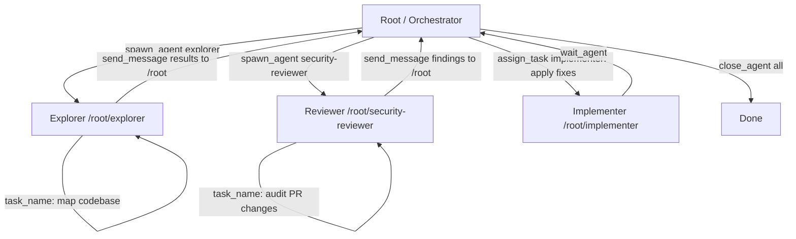

# Codex CLI Multi-Agent v2: Path-Based Addressing, Structured Messaging, and the v4 Agent API


---

Codex CLI's multi-agent system has always allowed you to spawn parallel subagents — but the original collaboration model relied on opaque session IDs, a flat agent namespace, and a limited set of coordination primitives. Multi-agent v2, shipped progressively through early 2026 and consolidated in v0.117.0[^1], replaces that with a hierarchical path-based address scheme, structured inter-agent messaging, and a new set of v4 API tools that give orchestrating agents genuine task-assignment semantics.

This article covers how to enable and configure multi-agent v2, what the new tools do, how path-based addressing changes debugging and TUI display, and the CSV fan-out pattern for large batch jobs.

---

## Enabling Multi-Agent v2

The multi-agent feature set is gated behind explicit feature flags in `~/.codex/config.toml` (user-wide) or `.codex/config.toml` (project-scoped).[^2]

```toml
[features]
# Stable: enables spawn_agent, send_input, wait_agent, close_agent
multi_agent = true

# Experimental: enables v4 agent API — fork_context, task_name,
# send_message, assign_task, list_agents
multi_agent_v2 = true

# Experimental: enables spawn_agents_on_csv for parallel fan-out
enable_fanout = true

# Required if you use request_user_input gates in workflow skills
default_mode_request_user_input = true
```

`multi_agent = true` has been enabled by default since v0.98.0; you only need to set it explicitly if you are using a locked-down policy profile that disables it.[^3] The `multi_agent_v2` and `enable_fanout` flags remain explicitly opt-in as of v0.117.0.

### Agent thread limits

```toml
[agents]
max_threads = 8          # concurrent open threads, default 6
max_depth   = 2          # nesting depth from root (default 1)
job_max_runtime_seconds = 3600  # per-worker timeout for CSV jobs
```

`max_depth = 1` (the default) means the root session can spawn children, but those children cannot themselves spawn further children. Increase it carefully: each nesting level multiplies token consumption and can produce deeply recursive failures that are hard to diagnose.[^4]

---

## Path-Based Agent Addressing

Prior to v0.117.0, spawned agents were identified by raw UUIDs. The TUI showed strings like `a3f7c912-0e2b-4d11-b8ab-...`, and inter-agent references in logs were effectively unreadable.

Multi-agent v2 introduces hierarchical path addresses[^1]:

- The root session is `/root`
- Direct children are `/root/agent_a`, `/root/agent_b`, etc.
- Grandchildren (when `max_depth ≥ 2`) are `/root/agent_a/worker_0`

These addresses appear in:

1. **TUI session tabs** — each parallel thread now shows its path label
2. **`list_agents` output** — returns a structured manifest of running agents with addresses, roles, and status
3. **Log and JSONL rollout files** — `agent_path` field replaces the UUID-only identifier
4. **Remote multi-agent TUI** — agent names replace raw IDs in the network view[^1]

The `/title` command (also new in v0.117.0) lets you rename the current thread's display label — useful when running many sibling agents that would otherwise share the same role name.[^1]

```
/title  security-auditor
```

---

## The v4 Agent API: New Tools

When `multi_agent_v2 = true`, Codex gains five additional tools on top of the stable collaboration surface.

### Stable multi-agent tools (available with `multi_agent = true`)

| Tool | Purpose |
|---|---|
| `spawn_agent` | Start a new subagent with a role and initial prompt |
| `send_input` | Send a follow-up message to an already-running agent |
| `wait_agent` | Block until a named agent completes or times out |
| `resume_agent` | Re-activate a paused agent thread |
| `close_agent` | Terminate and clean up an agent thread |

### v4 additions (require `multi_agent_v2 = true`)

**`fork_context`** — creates a new agent thread that inherits the calling agent's full conversation context up to that point. Equivalent to `/fork` at the TUI level, but invokable programmatically by the orchestrator. The child starts with the same working directory, environment, and tool permissions as the parent.[^2]

**`task_name`** — sets the human-readable display label for the current agent's task. Purely presentational; affects what appears in the TUI agent list and session metadata.[^2]

**`send_message`** — delivers a structured message to another agent identified by path address. Unlike `send_input` (which appends a raw string to the target's turn queue), `send_message` carries typed metadata: a `type` field, optional `payload`, and a `reply_to` address for the recipient to respond back.

**`assign_task`** — instructs a named idle agent to begin working on a new task description. Semantically cleaner than `send_input` for orchestration flows where the orchestrator acts as a task dispatcher and children are workers waiting for assignments.[^2]

**`list_agents`** — returns a snapshot of all currently open agent threads visible to the caller, including their path address, role name, status (`idle`, `running`, `waiting`), and current task label if set.

---

## Defining Custom Agent Roles

Role configuration lives in TOML files under `~/.codex/agents/` (user-wide) or `.codex/agents/` (project-scoped). Each file defines one role. A custom agent named `explorer` overrides the built-in agent of the same name.[^4]

```toml
# .codex/agents/security-reviewer.toml
name        = "security-reviewer"
description = "Audits code changes for security issues: injection, auth bypass, secret exposure, insecure deps."

developer_instructions = """
You are a security-focused code reviewer.
Only read files; never write or execute.
Flag every finding with severity (critical/high/medium/low) and CWE ID.
Output findings as JSON: [{file, line, severity, cwe, description}]
"""

model                  = "gpt-5-codex"
model_reasoning_effort = "high"

[sandbox]
mode = "read-only-with-networking-off"
```

```toml
# .codex/agents/implementer.toml
name        = "implementer"
description = "Executes code changes according to a plan. Does not review or audit."

developer_instructions = """
You are an implementation agent. Apply the plan exactly.
Run tests after each change. Stop and report if tests fail.
"""

model                  = "gpt-5-codex-mini"
model_reasoning_effort = "medium"
```

The built-in roles — `default`, `worker`, and `explorer` — remain available without any config files.[^4]

```toml
[agents.explorer]
description = "Read-heavy codebase exploration. Uses a fast model."
nickname_candidates = ["cartographer", "scout", "mapper"]
config_file = ".codex/agents/explorer-overrides.toml"
```

`nickname_candidates` provides a pool of display labels Codex assigns to spawned instances, so parallel explorer agents appear as `cartographer`, `scout`, etc. rather than `explorer-1`, `explorer-2`.[^2]

---

## Orchestration Flow: Dispatcher Pattern

The v4 API is designed for a dispatcher-worker architecture. The root agent (or a dedicated `orchestrator` role) decomposes the work, spawns workers, assigns tasks, and consolidates results.



A typical prompt to the root agent:

```
Spawn an explorer agent to map the authentication module,
and a security-reviewer agent to audit the last three commits.
When both complete, assign the implementer to apply any critical fixes.
Report the final diff.
```

Codex will invoke `spawn_agent`, `wait_agent`, `list_agents` to track state, `assign_task` to hand off implementation, and `close_agent` after each role completes.

---

## CSV Fan-Out with `spawn_agents_on_csv`

For batch work — auditing every microservice, reviewing every migration script, generating summaries for a list of endpoints — `spawn_agents_on_csv` (enabled by `enable_fanout = true`) is the right primitive.[^4]

```
Spawn one worker per row in services.csv.
For each row, review {path} owned by {owner}.
Return JSON: {path, risk (high/medium/low), summary, follow_up_required}.
Merge results to audit-results.csv.
```

The tool reads the source CSV, spawns one `worker` agent per row, respects `agents.max_threads` for concurrency, and writes a merged output CSV when all workers complete (or time out per `job_max_runtime_seconds`).[^4] Rows whose workers fail are marked with `status: failed` rather than aborting the entire job.

```csv
path,owner
services/auth,team-platform
services/payments,team-fintech
services/notifications,team-comms
```

With `max_threads = 4` and 12 rows, Codex processes four services in parallel, then the next four, and so on. Progress and ETA appear in the TUI.

---

## Sandbox and Approval Inheritance

Spawned subagents inherit the parent's active sandbox configuration at spawn time, including any interactive overrides set during the session (`/approvals` changes, `--yolo`).[^2] This means:

- If you ran `codex --sandbox-mode read-only`, children also start read-only unless their `config_file` explicitly overrides it.
- Per-session approval decisions (e.g., "always allow `npm install`") propagate to children.
- `--ephemeral` does not propagate: child JSONL logs are written unless the child itself is also launched with `--ephemeral`.

Symlinked writable roots and project-profile layering are now reliably applied to spawned agents as of v0.117.0, closing a class of sandbox-bypass issues reported in earlier multi-agent builds.[^1]

---

## Debugging Multi-Agent Sessions

### `list_agents` snapshot

At any point during a complex session, you can ask Codex to call `list_agents` to see what is running:

```json
[
  {"path": "/root",                    "role": "default",           "status": "running",  "task": "orchestrate security audit"},
  {"path": "/root/explorer",           "role": "explorer",          "status": "waiting",  "task": "map authentication module"},
  {"path": "/root/security-reviewer",  "role": "security-reviewer", "status": "running",  "task": "audit commits abc123-def456"}
]
```

### JSONL rollout

Each agent writes its own rollout to `~/.codex/sessions/<session-id>/<agent-path-slug>.jsonl`. The `agent_path` field on every item makes it straightforward to reconstruct per-agent timelines:

```bash
jq 'select(.agent_path == "/root/security-reviewer")' \
  ~/.codex/sessions/*/security-reviewer.jsonl
```

### Turn steering in multi-agent sessions

Mid-turn steering (Enter to interrupt, Tab to queue) works in the root session while children are running. Steering a running child directly requires selecting its TUI tab. Note that forcibly steering a child mid-flight can leave background tool calls in an inconsistent state — prefer `assign_task` to redirect idle agents cleanly.[^3]

---

## When to Use Multi-Agent v2 vs. Single-Agent

Multi-agent v2 is not the default for a reason: each spawned agent incurs independent model calls, context windows, and sandboxed processes.

| Scenario | Recommendation |
|---|---|
| Tasks that are genuinely parallel and independent | Multi-agent v2 — clear wins |
| Sequential steps with shared context | Single-agent with compaction |
| Batch processing > 10 identical units | `spawn_agents_on_csv` fan-out |
| Specialist roles needing different sandbox policies | Custom agent TOML files |
| Simple one-off tasks | Single agent — don't over-engineer |

Set `max_depth = 1` (default) unless you have a specific reason to allow grandchild agents. The risk of runaway recursion is real when agents can themselves spawn further agents.

---

## Summary

Multi-agent v2 in Codex CLI v0.117.0 brings three practical improvements over the original collaboration model: readable path addresses that make multi-agent sessions debuggable; structured messaging primitives (`send_message`, `assign_task`) that enable clean dispatcher-worker architectures; and `spawn_agents_on_csv` fan-out for high-volume batch work. Enable it with three feature flags, define custom roles as TOML files in `.codex/agents/`, and rely on `list_agents` to keep track of what is running.

---

## Citations

[^1]: OpenAI, "Release 0.117.0 · openai/codex," GitHub, 26 March 2026. <https://github.com/openai/codex/releases/tag/rust-v0.117.0>
[^2]: OpenAI, "Multi-agents – Codex," OpenAI Developers documentation. <https://developers.openai.com/codex/subagents>
[^3]: OpenAI, "Changelog – Codex," OpenAI Developers. <https://developers.openai.com/codex/changelog>
[^4]: OpenAI, "Configuration Reference – Codex," OpenAI Developers. <https://developers.openai.com/codex/config-reference>
