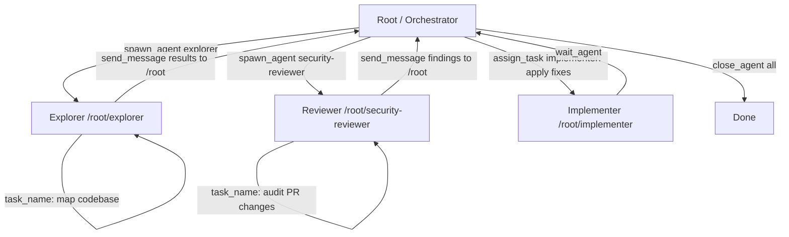
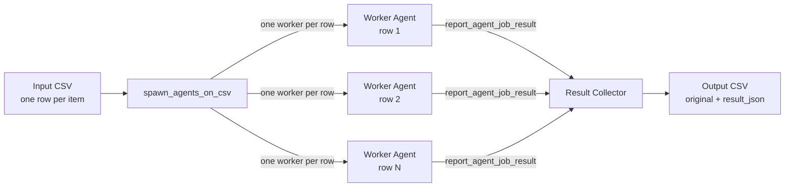

# Codex CLI Multi-Agent v2: Path-Based Addressing, Structured Messaging, and the v4 Agent API


---

Codex CLI's multi-agent system has always allowed spawning parallel subagents, but the original collaboration model relied on opaque session IDs, a flat agent namespace, and a limited set of coordination primitives. Multi-agent v2, shipped progressively through early 2026 and consolidated in v0.117.0[^1], replaces that with a hierarchical path-based address scheme, structured inter-agent messaging, and a new set of v4 API tools that give orchestrating agents genuine task-assignment semantics.

This article covers why subagents exist, how to enable and configure multi-agent v2, the TOML agent definition schema, the v4 tools, path-based addressing, team configuration, CSV fan-out, and the practical constraints that matter in production.

---

## Why Subagents?

Large software tasks — exhaustive code review, batch refactoring across dozens of files, parallel exploration of competing implementation paths — hit a natural ceiling in single-agent mode. Context windows fill up, serialised tool calls stack latency, and a single reasoning chain struggles to hold diverse concerns simultaneously.

Codex CLI addresses this with a first-class multi-agent system that lets a parent session spawn child agents, route work to them, wait for results, and synthesise a consolidated response.[^2] The model drives the orchestration; the CLI runtime handles thread scheduling, approval forwarding, and result collection.

**Important caveat:** subagents consume tokens across every spawned thread. Each child performs its own model inference and tool invocations — there is no free parallelism.[^5] Reach for them when the latency or context benefits outweigh the cost, not as a default.

---

## Enabling Multi-Agent v2

The multi-agent feature set is gated behind explicit feature flags in `~/.codex/config.toml` (user-wide) or `.codex/config.toml` (project-scoped).[^2] It can also be enabled interactively by running `/experimental` inside a session and toggling **Enable Multi-agents**.[^6]

```toml
[features]
# Stable: enables spawn_agent, send_input, wait_agent, close_agent
multi_agent = true

# Experimental: enables v4 agent API — fork_context, task_name,
# send_message, assign_task, list_agents
multi_agent_v2 = true

# Experimental: enables spawn_agents_on_csv for parallel fan-out
enable_fanout = true

# Required if you use request_user_input gates in workflow skills
default_mode_request_user_input = true
```

`multi_agent = true` has been enabled by default since v0.98.0; it only needs to be set explicitly when using a locked-down policy profile that disables it.[^3] The `multi_agent_v2` and `enable_fanout` flags remain explicitly opt-in as of v0.117.0.

### Agent thread limits

```toml
[agents]
max_threads = 8          # concurrent open threads, default 6
max_depth   = 2          # nesting depth from root (default 1)
job_max_runtime_seconds = 3600  # per-worker timeout for CSV jobs
```

`max_depth = 1` (the default) means the root session can spawn children, but those children cannot themselves spawn further children. Increasing this value should be done cautiously: each nesting level multiplies token consumption and can produce deeply recursive failures that are hard to diagnose.[^4]

---

## Path-Based Agent Addressing

### The Problem With UUIDs

Before v0.117.0, spawned subagents were identified by raw call-IDs — opaque UUID strings that leaked into TUI output, approval overlays, and log messages. When running three parallel workers the TUI showed something like:

```
[3fa2b7c1-…] worker: checking auth module
[9e4d0012-…] worker: checking payment module
[c7a1ff83-…] worker: checking admin routes
```

No context about which worker was doing what, no stable handle for targeting with a follow-up message, and no ergonomic way to route input to a specific running agent.[^7]

### Path Addresses in v0.117.0

The v0.117.0 path system assigns every agent session a deterministic address rooted at `/root`.[^1] The root session itself occupies `/root`. Direct spawns become `/root/agent_a`, `/root/agent_b`, and so on:

```
/root
├── /root/explorer
├── /root/reviewer
│   └── /root/reviewer/security_auditor
└── /root/docs_researcher
```

Each segment corresponds to the agent's `name` field from its TOML definition, not a random identifier. Because the address is derived from configuration, it is stable across resume cycles and predictable when writing orchestration logic.

These addresses appear in:

1. **TUI session tabs** — each parallel thread now shows its path label
2. **`list_agents` output** — returns a structured manifest of running agents with addresses, roles, and status
3. **Log and JSONL rollout files** — `agent_path` field replaces the UUID-only identifier
4. **Remote multi-agent TUI** — agent names replace raw IDs in the network view[^1]

The `/title` command (also new in v0.117.0) renames the current thread's display label — useful when running many sibling agents that would otherwise share the same role name.[^1]

```
/title  security-auditor
```

---

## Structured Inter-Agent Messaging

Alongside addressing, v0.117.0 introduced a structured messaging protocol between agents.[^1] Rather than plain text flowing through `send_input`, agents can post typed messages with a source address, destination address, and a message-class discriminator.

In the TUI, this surfaces as prefixed, coloured handles:

```
◉ @reviewer [spawned]
◉ @reviewer [progress] Checked 12/20 files — 2 critical findings
◉ @security_auditor [spawned] by /root/reviewer
◉ @security_auditor [result] 1 critical: missing input sanitisation in auth handler
```

The `[spawned]`, `[progress]`, and `[result]` labels are message classes in the underlying protocol.[^7] This structure enables the orchestrator to act on machine-readable payloads rather than parsing free text. The `report_agent_job_result` tool — already present in v1 for `spawn_agents_on_csv` — is now used by single-agent spawns as well when a structured result is expected.

---

## The v4 Agent API: New Tools

When `multi_agent_v2 = true`, Codex gains five additional tools on top of the stable collaboration surface.

### Stable multi-agent tools (available with `multi_agent = true`)

| Tool | Purpose |
|---|---|
| `spawn_agent` | Start a new subagent with a role and initial prompt |
| `send_input` | Send a follow-up message to an already-running agent |
| `wait_agent` | Block until a named agent completes or times out |
| `resume_agent` | Re-activate a paused agent thread |
| `close_agent` | Terminate and clean up an agent thread |

### v4 additions (require `multi_agent_v2 = true`)

**`fork_context`** — creates a new agent thread that inherits the calling agent's full conversation context up to that point. Equivalent to `/fork` at the TUI level, but invokable programmatically by the orchestrator. The child starts with the same working directory, environment, and tool permissions as the parent.[^2]

**`task_name`** — sets the human-readable display label for the current agent's task. Purely presentational; affects what appears in the TUI agent list and session metadata.[^2]

**`send_message`** — delivers a structured message to another agent identified by path address. Unlike `send_input` (which appends a raw string to the target's turn queue), `send_message` carries typed metadata: a `type` field, optional `payload`, and a `reply_to` address for the recipient to respond back.

**`assign_task`** — instructs a named idle agent to begin working on a new task description. Semantically cleaner than `send_input` for orchestration flows where the orchestrator acts as a task dispatcher and children are workers waiting for assignments.[^2]

**`list_agents`** — returns a snapshot of all currently open agent threads visible to the caller, including their path address, role name, status (`idle`, `running`, `waiting`), and current task label if set.

---

## Defining Custom Agent Roles

### TOML Schema

Role configuration lives in TOML files under `~/.codex/agents/` (user-wide) or `.codex/agents/` (project-scoped). Each file defines one role. A custom agent named `explorer` overrides the built-in agent of the same name.[^4]

#### Required fields

| Field | Purpose |
|---|---|
| `name` | Identifier used by the parent when invoking the agent. The filename conventionally matches this value, but `name` is the authoritative key.[^8] |
| `description` | Helps the parent model decide when to invoke this agent. Write it as a capability statement. |
| `developer_instructions` | Core system-level instructions. Equivalent to the `developer` role in the Responses API. |

#### Optional fields

| Field | Notes |
|---|---|
| `model` | Override model. Useful for assigning a cheaper/faster model to read-heavy explorers. |
| `model_reasoning_effort` | `"low"`, `"medium"`, or `"high"` |
| `sandbox_mode` | Inherits from parent if omitted. |
| `mcp_servers` | Attach MCP tools specific to this agent. |
| `skills.config` | Inject a skills configuration. |
| `nickname_candidates` | Pool of display names shown in the TUI thread list. |

### Example: Specialist Agents

```toml
# .codex/agents/security-reviewer.toml
name        = "security-reviewer"
description = "Audits code changes for security issues: injection, auth bypass, secret exposure, insecure deps."

developer_instructions = """
You are a security-focused code reviewer.
Focus exclusively on: SQL/NoSQL injection, authentication bypasses,
insecure deserialisation, supply-chain risks in new dependencies,
and OWASP Top 10 patterns.
Do NOT implement fixes — only report findings with file paths and line numbers.
Call report_agent_job_result with a JSON object containing:
  { "findings": [...], "severity_summary": {...} }
"""

model                  = "o4-mini"
model_reasoning_effort = "high"

[sandbox]
mode = "read-only-with-networking-off"
```

```toml
# .codex/agents/implementer.toml
name        = "implementer"
description = "Executes code changes according to a plan. Does not review or audit."

developer_instructions = """
You are an implementation agent. Apply the plan exactly.
Run tests after each change. Stop and report if tests fail.
"""

model                  = "gpt-5-codex-mini"
model_reasoning_effort = "medium"
```

The built-in roles — `default`, `worker`, and `explorer` — remain available without any config files.[^4]

```toml
[agents.explorer]
description = "Read-heavy codebase exploration. Uses a fast model."
nickname_candidates = ["cartographer", "scout", "mapper"]
config_file = ".codex/agents/explorer-overrides.toml"
```

`nickname_candidates` provides a pool of display labels Codex assigns to spawned instances, so parallel explorer agents appear as `cartographer`, `scout`, etc. rather than `explorer-1`, `explorer-2`.[^2]

### Per-Agent Config With Permissions and Tools

Individual agent configs support granular overrides for tools, permissions, and file-watching:

```toml
[agent]
name      = "validator"
tui_color = "cyan"

[prompt]
file = "system_prompt.md"   # relative to this config.toml

[invocation]
trigger     = "manual"
watch_paths = ["src/**/*.ts", "package.json"]

[tools]
shell       = true
apply_patch = false

[[tools.mcp]]
name    = "github-mcp"
command = "npx"
args    = ["-y", "@modelcontextprotocol/server-github"]

[permissions]
network    = false
fs_read    = true
fs_write   = false
allow_paths = ["./reports/"]
```

Key fields:

- `tui_color` — gives the agent a distinct colour in TUI output, matching the `@handle` badge
- `watch_paths` — triggers the agent automatically when matching files change (stability of this field should be confirmed per installed version)
- `[permissions]` — per-agent filesystem and network scoping, narrower than the parent session's sandbox

---

## Team Configuration

For multi-agent pipelines that run together as a unit, agents can be grouped into team directories:[^7]

```
~/.codex/agents/
├── _builtin/             # built-in defaults (default, worker, explorer)
└── backend-review/
    ├── team.toml
    ├── lead_reviewer/
    │   ├── config.toml
    │   └── system_prompt.md
    ├── validator/
    │   ├── config.toml
    │   └── system_prompt.md
    └── security_auditor/
        ├── config.toml
        └── system_prompt.md
```

### team.toml

The `team.toml` file declares the team's identity, membership, and launch policy:

```toml
[team]
name         = "backend-review"
description  = "Full backend review pipeline"
tui_color    = "blue"
orchestrator = "lead_reviewer"
members      = ["lead_reviewer", "validator", "security_auditor"]

# Other teams this team's orchestrator is allowed to address
can_address_teams = ["devops", "frontend-review"]

[launch]
trigger = "manual"   # manual | on_task | always
```

The `orchestrator` field names the member that receives the initial prompt when the team is invoked. All other members start idle and are spawned by the orchestrator as needed.[^7]

### Cross-Team Addressing and @mention Syntax

With teams in play, the `@mention` syntax extends to cover both individual agents and entire teams:[^7]

| Syntax | Destination |
|---|---|
| `@validator` | Direct message to the `validator` agent |
| `@backend-review` | Routes to `backend-review` team's orchestrator |
| `@backend-review/security_auditor` | Directly addresses a named member of that team |

The `/agent` command in the TUI shows the agent picker grouped by team, with collapsible team sections and a team-level badge.[^2]

### Launching a Team

```bash
codex --team backend-review "Review PR #142 for correctness and security"
```

This starts the `lead_reviewer` orchestrator with the given prompt. The orchestrator then spawns `validator` and `security_auditor` subagents via `spawn_agent`, waits on their structured results, and synthesises a final review.

For non-interactive runs:

```bash
codex exec --team backend-review --profile ci "Review PR #142"
```

---

## Orchestration Flow: Dispatcher Pattern

The v4 API is designed for a dispatcher-worker architecture. The root agent (or a dedicated `orchestrator` role) decomposes the work, spawns workers, assigns tasks, and consolidates results.



### Async Orchestration and Idle State

A key change in v2 is that orchestrators can dispatch work and then suspend, rather than blocking. The orchestrator spawns children, calls `wait_agent` (optionally with a timeout), then enters an idle state that consumes no context tokens while the subagents run.[^1] When a subagent calls `report_agent_job_result`, the team inbox is updated and the orchestrator resumes.

This avoids the context-window pressure that plagued v1 orchestrators, which had to stay "active" throughout the duration of all child tasks. Paired with the agent-listing operation, an orchestrator can query which children are still running and conditionally spawn new agents or escalate based on partial results.[^1]

### Invoking Subagents Through Prompting

There is no host-side `spawn_agent()` function callable programmatically.[^9] The parent model decides to spawn based on the prompt. Effective patterns include explicit enumeration and bounding:

```
Review this branch for production readiness. Spawn three specialist agents:
  1. security-reviewer — audit for vulnerabilities
  2. test-auditor — identify missing test coverage
  3. perf-profiler — flag N+1 queries and slow paths

Wait for all three. Produce a single report grouped by category with file
references. Do not spawn additional agents beyond these three.
```

The explicit enumeration and the "do not spawn additional agents" constraint are load-bearing: without bounding the depth and breadth, the model may choose to spawn further sub-children, increasing cost unpredictably.

---

## CSV Fan-Out with `spawn_agents_on_csv`

For batch work — auditing every microservice, reviewing every migration script, generating summaries for a list of endpoints — `spawn_agents_on_csv` (enabled by `enable_fanout = true`) is the right primitive.[^4]

### How It Works



### Invocation Parameters

| Parameter | Required | Notes |
|---|---|---|
| `csv_path` | Yes | Source CSV. |
| `instruction` | Yes | Template with `{column_name}` placeholders resolved per row. |
| `id_column` | No | Stable item identifier for output correlation. |
| `output_schema` | No | Expected JSON structure per worker result. |
| `output_csv_path` | Yes | Destination for merged results. |
| `max_concurrency` | No | Per-call concurrency cap; cannot exceed `agents.max_threads`. |
| `max_runtime_seconds` | No | Per-call timeout. Falls back to `agents.job_max_runtime_seconds` (default 1800s).[^2] |

### Example: Component Risk Review

```bash
# components.csv
path,owner,last_modified
src/auth/token.ts,platform-team,2026-01-15
src/payments/checkout.ts,payments-team,2026-02-03
src/api/graphql.ts,api-team,2026-03-01
```

Prompt:

```
Use spawn_agents_on_csv with:
  csv_path: components.csv
  id_column: path
  output_csv_path: review-results.csv
  instruction: |
    Review {path} owned by {owner} (last modified {last_modified}).
    Identify security risks and maintainability concerns.
    Call report_agent_job_result exactly once with JSON:
    { "path": "{path}", "risk": "low|medium|high", "summary": "...", "follow_up": [...] }
```

The output CSV contains the original columns plus `job_id`, `item_id`, `status`, `last_error`, and `result_json`.[^6]

With `max_threads = 4` and 12 rows, Codex processes four services in parallel, then the next four, and so on. Progress and ETA appear in the TUI.

### Critical Rule: `report_agent_job_result`

Every CSV worker **must** call `report_agent_job_result` exactly once before exiting. A worker that completes without this call is marked as an error in the output — its row receives `status: error` and `last_error` is populated.[^2] This requirement should be included explicitly in every instruction template.

---

## Sandbox and Approval Inheritance

Spawned subagents inherit the parent's active sandbox configuration at spawn time, including any interactive overrides set during the session (`/approvals` changes, `--yolo`).[^2] This means:

- Running `codex --sandbox-mode read-only` causes children to also start read-only unless their `config_file` explicitly overrides it.
- Per-session approval decisions (e.g., "always allow `npm install`") propagate to children.
- `--ephemeral` does not propagate: child JSONL logs are written unless the child itself is also launched with `--ephemeral`.
- Custom agent TOML files can specify different sandbox defaults that override the inherited configuration.

Symlinked writable roots and project-profile layering are now reliably applied to spawned agents as of v0.117.0, closing a class of sandbox-bypass issues reported in earlier multi-agent builds.[^1]

### Approval Forwarding in Interactive vs. Non-Interactive Mode

In the interactive CLI, approval requests from child agents surface in the parent's terminal with a thread label identifying the requesting agent. Press `o` to inspect the active threads before approving. Approval modes set via `/approvals` or `--yolo` propagate to all child agents unless a custom agent TOML specifies different defaults.[^2]

In non-interactive mode (`codex exec`), any action requiring new approval causes an error that surfaces back to the parent. Non-interactive subagent workflows should be designed so workers operate within their inherited sandbox without requiring fresh approvals.

---

## Debugging Multi-Agent Sessions

### `list_agents` snapshot

At any point during a complex session, calling `list_agents` shows what is running:

```json
[
  {"path": "/root",                    "role": "default",           "status": "running",  "task": "orchestrate security audit"},
  {"path": "/root/explorer",           "role": "explorer",          "status": "waiting",  "task": "map authentication module"},
  {"path": "/root/security-reviewer",  "role": "security-reviewer", "status": "running",  "task": "audit commits abc123-def456"}
]
```

### JSONL rollout

Each agent writes its own rollout to `~/.codex/sessions/<session-id>/<agent-path-slug>.jsonl`. The `agent_path` field on every item makes it straightforward to reconstruct per-agent timelines:

```bash
jq 'select(.agent_path == "/root/security-reviewer")' \
  ~/.codex/sessions/*/security-reviewer.jsonl
```

### Turn steering in multi-agent sessions

Mid-turn steering (Enter to interrupt, Tab to queue) works in the root session while children are running. Steering a running child directly requires selecting its TUI tab. Forcibly steering a child mid-flight can leave background tool calls in an inconsistent state — prefer `assign_task` to redirect idle agents cleanly.[^3]

---

## Practical Patterns

### Pattern 1: Named Specialist Pipeline

Rather than spawning anonymous `worker` agents, define named specialists in `.codex/agents/`. Path-based addresses allow targeting follow-up messages precisely:

```toml
# .codex/agents/pr-review/team.toml
[team]
name         = "pr-review"
orchestrator = "triage"
members      = ["triage", "correctness", "security", "docs"]
```

The `triage` agent reads the PR diff, decides which specialists are needed, and spawns only the relevant subagents — skipping `docs` entirely for a backend-only change.

### Pattern 2: Progressive Depth

Set `max_depth = 2` and allow the `security` agent to spawn a `dependency_auditor` when it detects third-party library changes. The path becomes `/root/security/dependency_auditor`, addressable directly from the TUI if manual steering is needed.

### Pattern 3: Async Fan-Out With Reconciliation

The `spawn_agents_on_csv` tool remains the best choice for homogeneous parallel work (e.g., analysing 50 services with the same prompt). For heterogeneous pipelines — different agents, different prompts, different tool surfaces — the named team pattern with `spawn_agent` + `wait_agent` gives finer control and legible path addresses.

---

## When to Use Multi-Agent v2 vs. Single-Agent

Multi-agent v2 is not the default for a reason: each spawned agent incurs independent model calls, context windows, and sandboxed processes. Cost scales linearly — a fan-out to eight workers at `o4-mini` is meaningfully cheaper than the same fan-out at `o3`, but the cost is not negligible at scale. Profile before committing to large CSV batch jobs.

| Scenario | Recommendation |
|---|---|
| Tasks that are genuinely parallel and independent | Multi-agent v2 — clear wins |
| Sequential steps with shared context | Single-agent with compaction |
| Batch processing > 10 identical units | `spawn_agents_on_csv` fan-out |
| Specialist roles needing different sandbox policies | Custom agent TOML files |
| Simple one-off tasks | Single agent — don't over-engineer |

Set `max_depth = 1` (default) unless there is a specific reason to allow grandchild agents. The risk of runaway recursion is real when agents can themselves spawn further agents.

---

## Known Limitations

**No programmatic spawning by agent name.** The `spawn_agent` interface accepts `agent_type` plus model/prompt overrides, but there is currently no parameter to specify "spawn the agent defined in `.codex/agents/security-reviewer.toml`".[^9] The workaround is to read the TOML's `developer_instructions` and inject them as prompt overrides when spawning a generic worker — functional but verbose.

**IDE and app integration is absent.** Multi-agent activity is currently CLI-only; the Codex web app and IDE plugins do not surface child thread activity.[^6]

**SQLite-backed state.** Agent job state and CSV results are persisted to a SQLite database. The `sqlite_home` config key controls its location.[^2] This matters when running Codex CLI in ephemeral CI environments.

**Orchestration is prompt-driven, not code-driven.** The `spawn_agent` and related tools appear as model-mediated tool calls in the parent's reasoning trace, not as a programmable host-side API.[^9] Invest in precise, bounded prompts.

---

## Summary

Multi-agent v2 in Codex CLI v0.117.0 brings several practical improvements over the original collaboration model: readable path addresses that make multi-agent sessions debuggable; structured messaging primitives (`send_message`, `assign_task`) that enable clean dispatcher-worker architectures; team configuration for grouping agents into named pipelines with cross-team addressing; async orchestrator idle state that avoids context-window pressure; and `spawn_agents_on_csv` fan-out for high-volume batch work. Enable it with three feature flags, define custom roles as TOML files in `.codex/agents/`, group related agents into teams with `team.toml`, and rely on `list_agents` to keep track of what is running.

---

## Citations

[^1]: OpenAI, "Release 0.117.0 · openai/codex," GitHub, 26 March 2026. <https://github.com/openai/codex/releases/tag/rust-v0.117.0>
[^2]: OpenAI, "Multi-agents – Codex," OpenAI Developers documentation. <https://developers.openai.com/codex/subagents>
[^3]: OpenAI, "Changelog – Codex," OpenAI Developers. <https://developers.openai.com/codex/changelog>
[^4]: OpenAI, "Configuration Reference – Codex," OpenAI Developers. <https://developers.openai.com/codex/config-reference>
[^5]: OpenAI, "Features – Codex CLI," OpenAI Developers. <https://developers.openai.com/codex/cli/features>
[^6]: FlowDevs, "Boost Your Workflow with Codex CLI Multi-Agent Capabilities," 2026. <https://www.flowdevs.io/blog/post/boost-your-workflow-with-codex-cli-multi-agent-capabilities>
[^7]: GitHub Issue #12047, "Multi-agent TUI overhaul: named agents, per-agent config, async orchestration & @mention messaging." <https://github.com/openai/codex/issues/12047>
[^8]: GitHub Issue #15250, "Custom subagents in .codex/agents are not accessible from tool-backed Codex sessions as docs imply." <https://github.com/openai/codex/issues/15250>
[^9]: GitHub Issue #11701, "Subagent configuration and orchestration." <https://github.com/openai/codex/issues/11701>
