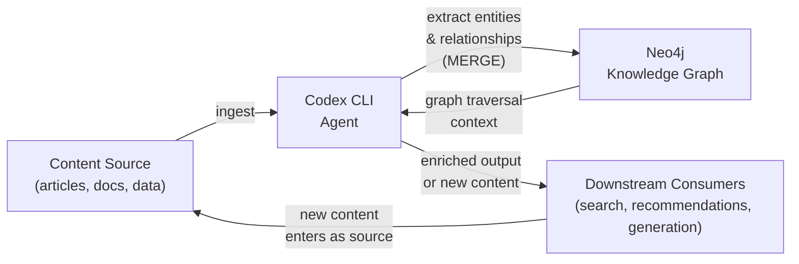
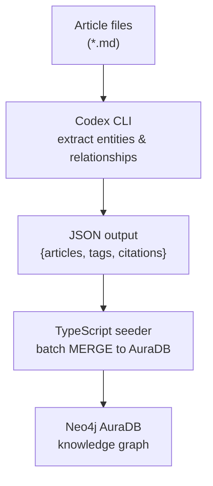

# Codex CLI and Neo4j: Use Cases and Best Practices


---

Graph databases and AI agents are a natural fit. An agent's core capability is traversal: follow a chain of reasoning across connected facts to reach a conclusion. A graph database's core capability is the same. Where relational databases optimise for aggregation over tabular rows, and vector stores optimise for approximate similarity across high-dimensional embeddings, Neo4j optimises for relationship traversal — the operation that most closely mirrors how an agent reasons.

This article covers the mechanics of wiring Codex CLI into a Neo4j workflow. It moves through Cypher generation, AGENTS.md conventions, hook patterns for graph mutations, AuraDB connection management in Cloud Run, vector search for RAG-style retrieval, and three end-to-end worked examples. The target reader has used Codex CLI before and wants to know how to make it genuinely useful in a Neo4j-backed system.

---

## 1. Why Graph Databases and AI Agents Are a Natural Fit

### The Knowledge Flywheel Pattern

The most powerful pattern that emerges from combining Codex CLI with Neo4j is what practitioners are calling the **Knowledge Flywheel**: an agent that simultaneously reads from, reasons over, and writes back to a graph.



Each agent run enriches the graph. The enriched graph improves subsequent agent runs. Over time the graph accumulates enough structure that agent prompts that previously required extensive context now resolve immediately via a single Cypher query.

This is qualitatively different from a vector store, which stores opaque embeddings. A knowledge graph stores named entities and named relationships — facts the agent can reason over symbolically, not just retrieve by similarity. GraphRAG research has confirmed that combining graph traversal with vector similarity substantially outperforms pure vector retrieval on multi-hop questions.[^1]

### Neo4j AuraDB as the Managed Cloud Option

For agent workflows that run in Cloud Run, GitHub Actions, or other ephemeral compute environments, AuraDB — Neo4j's fully managed cloud service — is the path of least resistance. There is no cluster to operate, no bolt port to open, and TLS is on by default.[^2]

AuraDB Free supports graphs up to 200K nodes, which is sufficient for a knowledge base of several thousand documents. The Professional tier starts at $65/GB/month and supports vector search natively, making it suitable for production GraphRAG workloads.

Connection is always via `neo4j+s://` (encrypted, certificate-validated). No extra TLS configuration is required at the driver level.

---

## 2. Cypher Query Generation via Codex CLI Prompts

One of the most immediately useful applications of Codex CLI in a Neo4j project is natural-language-to-Cypher generation. Cypher is expressive but has a learning curve — particularly for graph traversal patterns, variable-length path syntax, and aggregation semantics. Codex bridges this gap.

### A Worked Prompt

```
> Generate a Cypher query to find all articles tagged with 'hooks' that cite
  articles tagged with 'mcp'. Return the citing article title, the cited article
  title, and the relationship type. My schema:
  (:Article)-[:TAGGED_WITH]->(:Tag)
  (:Article)-[:CITES]->(:Article)
```

A well-calibrated Codex session with AGENTS.md context (see Section 3) will produce:

```cypher
MATCH (citing:Article)-[:TAGGED_WITH]->(:Tag {name: 'hooks'}),
      (citing)-[:CITES]->(cited:Article)-[:TAGGED_WITH]->(:Tag {name: 'mcp'})
RETURN citing.title AS citingArticle,
       cited.title  AS citedArticle,
       'CITES'      AS relationshipType
ORDER BY citingArticle
```

This is correct, but a naive implementation would execute it immediately. The right pattern is a dry run first.

### The Dry-Run Validation Pattern

Before executing any generated Cypher, prefix with `EXPLAIN` to obtain the query plan without touching data:

```cypher
EXPLAIN
MATCH (citing:Article)-[:TAGGED_WITH]->(:Tag {name: 'hooks'}),
      (citing)-[:CITES]->(cited:Article)-[:TAGGED_WITH]->(:Tag {name: 'mcp'})
RETURN citing.title AS citingArticle,
       cited.title  AS citedArticle
```

`EXPLAIN` never executes the query — it returns the planner's intended execution plan. If the plan shows a full node scan (no index hit on `Tag.name`), the query will be slow on a large graph and you should create an index first:

```cypher
CREATE INDEX tag_name_idx IF NOT EXISTS FOR (t:Tag) ON (t.name)
```

For write operations, use explicit transactions in your application code so you can roll back on validation failure:

```typescript
const session = driver.session({ defaultAccessMode: neo4j.session.WRITE })
const tx = session.beginTransaction()
try {
  await tx.run(cypher, params)
  // validate result before committing
  await tx.commit()
} catch (err) {
  await tx.rollback()
  throw err
} finally {
  await session.close()
}
```

### Codex as Cypher Debugger

When a query fails, paste the error back into Codex:

```
> This Cypher throws: "Variable `cited` not defined (line 2)"
  MATCH (citing:Article)-[:TAGGED_WITH]->(:Tag {name: 'hooks'})
  RETURN cited.title
  What's wrong?
```

Codex correctly identifies that `cited` is never introduced by a `MATCH` clause and suggests the fix. This feedback loop — generate, explain, execute, debug — makes Codex CLI a genuine force-multiplier for teams learning Cypher or working with unfamiliar schemas.

### Avoiding Cartesian Products

The most common Cypher mistake that Codex-generated queries can produce is an accidental Cartesian product — two disconnected `MATCH` clauses with no `WHERE` join condition:

```cypher
-- BAD: returns every combination of Article and Tag
MATCH (a:Article)
MATCH (t:Tag)
RETURN a.title, t.name

-- GOOD: traverse the explicit relationship
MATCH (a:Article)-[:TAGGED_WITH]->(t:Tag)
RETURN a.title, t.name
```

Add this as a rule in AGENTS.md (see Section 3) to prevent it.

---

## 3. AGENTS.md Patterns for Neo4j-Connected Workflows

AGENTS.md is the right place to encode Neo4j-specific conventions that you want Codex to apply consistently across a session. The goal is to prevent the most dangerous classes of mistake before they happen.

### A Full AGENTS.md Example

```markdown
# Neo4j Knowledge Graph Project

## Database
- AuraDB instance at $NEO4J_URI (bolt+s://)
- Driver: neo4j-driver v6.x (TypeScript)
- Cypher version: Cypher 25 (Neo4j 2025.10+)

## Schema summary
- (:Article {id, title, url, publishedAt, wordCount})
- (:Tag {name})
- (:Author {name, handle})
- (:Topic {name, description})
- (:Article)-[:TAGGED_WITH]->(:Tag)
- (:Article)-[:CITES]->(:Article)
- (:Article)-[:WRITTEN_BY]->(:Author)
- (:Article)-[:BELONGS_TO]->(:Topic)

## Query rules
- Always use labels in MATCH patterns — never `MATCH (n)` without a label
- Always use parameterised queries — never interpolate values into Cypher strings
- Validate syntax with EXPLAIN before executing any generated query on production data
- Use WITH to filter data mid-query and avoid passing unnecessary rows to later clauses
- Set explicit upper bounds on variable-length paths: use `[:CITES*1..3]` not `[:CITES*]`

## Write rules
- NEVER run DELETE or DETACH DELETE without explicit user confirmation in this session
- ALWAYS use MERGE instead of CREATE to avoid duplicate nodes
- ALWAYS check node existence before creating relationships:
  `MATCH (a:Article {id: $id}) WHERE a IS NOT NULL`
- Batch large writes: no more than 500 MERGE operations per transaction
- Always close sessions in a `finally` block

## Index awareness
- `article_id_idx`: range index on Article.id
- `tag_name_idx`: range index on Tag.name
- `article_embedding_idx`: vector index on Article.embedding (1536 dims, cosine)
- Do not create new indexes without checking for existing ones first

## Destructive operation policy
Before running any Cypher containing DELETE, DETACH DELETE, or REMOVE:
1. Show the user the query
2. Show a COUNT of affected nodes/relationships
3. Ask for explicit confirmation with the word "CONFIRM"
4. Only proceed after receiving "CONFIRM"
```

This AGENTS.md makes five things safe by default: it prevents unlabelled scans (performance), prevents string interpolation (injection), prevents accidental deletes (data safety), enforces MERGE semantics (idempotency), and ensures sessions are always closed (connection leak prevention).

### MERGE as the Default Write Primitive

`MERGE` is the idempotent alternative to `CREATE`. If the node or relationship already exists, it matches it. If not, it creates it. For agent workflows that may run multiple times against the same data source, MERGE is essential:

```cypher
// Idempotent article upsert
MERGE (a:Article {id: $id})
ON CREATE SET a.title = $title, a.url = $url, a.publishedAt = $publishedAt, a.createdAt = datetime()
ON MATCH  SET a.title = $title, a.url = $url, a.updatedAt = datetime()
```

The `ON CREATE` / `ON MATCH` blocks let you set creation-time properties separately from update-time properties — a pattern that AGENTS.md should document explicitly so Codex applies it consistently.

---

## 4. Hook Patterns for Neo4j

The Codex CLI hooks engine[^3] provides lifecycle callbacks at `SessionStart`, `PreToolUse`, `PostToolUse`, `PostToolUseError`, and `Stop`. Two of these are particularly valuable for Neo4j-connected workflows.

### PostToolUse Hook: Mutation Audit Trail

Any time Codex executes a shell command that touches Neo4j, log it:

```json
{
  "hooks": {
    "PostToolUse": [
      {
        "hooks": [
          {
            "type": "command",
            "command": "python3 ~/.codex/hooks/neo4j-audit.py",
            "statusMessage": "Logging graph mutation…",
            "timeout": 5
          }
        ]
      }
    ]
  }
}
```

```python
#!/usr/bin/env python3
# ~/.codex/hooks/neo4j-audit.py
# Reads PostToolUse event from stdin, logs Cypher mutations to audit file

import sys, json, datetime, os

event = json.load(sys.stdin)
tool_name = event.get("tool", "")
tool_input = event.get("input", {})

# Only log shell executions that reference neo4j or cypher
command = tool_input.get("command", "")
if "cypher" in command.lower() or "neo4j" in command.lower() or "bolt" in command.lower():
    audit_entry = {
        "ts": datetime.datetime.utcnow().isoformat() + "Z",
        "tool": tool_name,
        "command": command,
        "session": os.environ.get("CODEX_SESSION_ID", "unknown"),
    }
    audit_path = os.path.expanduser("~/.codex/neo4j-audit.jsonl")
    with open(audit_path, "a") as f:
        f.write(json.dumps(audit_entry) + "\n")

sys.exit(0)
```

This hook runs after every tool use, checks whether the command touched Neo4j, and appends a structured audit record. The exit code `0` means "allow" — the hook is purely observational.

### PreToolUse Hook: Cypher Syntax Gate

Before executing any generated Cypher via shell, validate it:

```json
{
  "hooks": {
    "PreToolUse": [
      {
        "hooks": [
          {
            "type": "command",
            "command": "python3 ~/.codex/hooks/cypher-gate.py",
            "statusMessage": "Validating Cypher syntax…",
            "timeout": 10
          }
        ]
      }
    ]
  }
}
```

```python
#!/usr/bin/env python3
# ~/.codex/hooks/cypher-gate.py
# Intercepts shell commands containing Cypher; blocks destructive patterns
# without explicit confirmation marker in the command.

import sys, json, re

DESTRUCTIVE_PATTERNS = [
    r"\bDETACH\s+DELETE\b",
    r"\bDELETE\b",
    r"\bREMOVE\b",
    r"\bDROP\s+INDEX\b",
    r"\bDROP\s+CONSTRAINT\b",
]
CONFIRMATION_MARKER = "# CONFIRMED-DESTRUCTIVE"

event = json.load(sys.stdin)
tool_name = event.get("tool", "")
tool_input = event.get("input", {})
command = tool_input.get("command", "")

if tool_name != "shell":
    sys.exit(0)  # Not a shell command — allow

for pattern in DESTRUCTIVE_PATTERNS:
    if re.search(pattern, command, re.IGNORECASE):
        if CONFIRMATION_MARKER not in command:
            # Exit code 2 = block with message
            print(json.dumps({
                "decision": "block",
                "reason": (
                    f"Destructive Cypher pattern detected: '{pattern}'. "
                    f"Add '# CONFIRMED-DESTRUCTIVE' comment to proceed."
                )
            }))
            sys.exit(2)

sys.exit(0)  # Allow
```

The exit code protocol for PreToolUse hooks: `0` = allow, `2` = block with a JSON reason message shown to the user.[^3] This makes it impossible for Codex to silently run a `DETACH DELETE` without an explicit confirmation marker in the command string.

---

## 5. Neo4j AuraDB + Codex CLI in Cloud Run Job Context

Cloud Run jobs are the natural execution environment for Codex-driven data pipelines: they are ephemeral, scalable, and have a clean secrets story via Secret Manager.

### Connection Management

```typescript
// src/neo4j.ts — module-level singleton driver
import neo4j, { Driver } from 'neo4j-driver'

let _driver: Driver | null = null

export function getDriver(): Driver {
  if (!_driver) {
    _driver = neo4j.driver(
      process.env.NEO4J_URI!,          // neo4j+s://xxxxx.databases.neo4j.io
      neo4j.auth.basic(
        process.env.NEO4J_USER!,       // neo4j
        process.env.NEO4J_PASSWORD!,   // from Secret Manager
      ),
      {
        maxConnectionPoolSize: 5,       // keep small for Cloud Run
        connectionAcquisitionTimeout: 10_000,
        maxTransactionRetryTime: 30_000,
      }
    )
  }
  return _driver
}

export async function closeDriver(): Promise<void> {
  if (_driver) {
    await _driver.close()
    _driver = null
  }
}
```

Key decisions here:
- **Singleton driver**: Cloud Run instances reuse the driver across invocations within the same instance lifecycle, avoiding repeated handshake overhead.[^4]
- **`maxConnectionPoolSize: 5`**: Cloud Run jobs don't need large pools. Keeping this small prevents connection exhaustion on AuraDB's side during scale-out.
- **`neo4j+s://`**: Always use the encrypted scheme for AuraDB. The driver validates TLS certificates automatically — no additional configuration needed.

### Session Management Best Practices

```typescript
// Always close sessions, even on error
export async function runWrite<T>(
  cypher: string,
  params: Record<string, unknown>,
): Promise<T[]> {
  const session = getDriver().session({ defaultAccessMode: neo4j.session.WRITE })
  try {
    const result = await session.executeWrite((tx) => tx.run(cypher, params))
    return result.records.map((r) => r.toObject() as T)
  } finally {
    await session.close()
  }
}

export async function runRead<T>(
  cypher: string,
  params: Record<string, unknown>,
): Promise<T[]> {
  const session = getDriver().session({ defaultAccessMode: neo4j.session.READ })
  try {
    const result = await session.executeRead((tx) => tx.run(cypher, params))
    return result.records.map((r) => r.toObject() as T)
  } finally {
    await session.close()
  }
}
```

`executeRead` and `executeWrite` automatically retry the transaction on transient failures with exponential backoff (up to 30 seconds by default).[^4] Prefer them over `session.run()` for all production code.

### Cloud Run Job: Codex + AuraDB End-to-End

```dockerfile
# Dockerfile
FROM node:22-slim
WORKDIR /app

# Install Codex CLI
RUN npm install -g @openai/codex

# Install application dependencies
COPY package*.json ./
RUN npm ci --omit=dev

COPY . .
RUN npm run build

# Cloud Run jobs expect CMD, not ENTRYPOINT
CMD ["node", "dist/main.js"]
```

```typescript
// src/main.ts — Cloud Run job entrypoint
import { execSync } from 'child_process'
import { getDriver, closeDriver, runWrite } from './neo4j.js'

const BATCH_SIZE = 250  // max MERGEs per transaction

async function main() {
  // 1. Use Codex CLI to extract entities from input documents
  const codexOutput = execSync(
    `codex exec --model gpt-5-codex \
      "Read the files in /data/articles/*.md and extract entities as JSON: \
       {articles: [{id, title, url, tags, citations}]}"`,
    { encoding: 'utf-8', timeout: 300_000 }
  )

  const { articles } = JSON.parse(codexOutput)

  // 2. Batch-write to AuraDB using MERGE
  for (let i = 0; i < articles.length; i += BATCH_SIZE) {
    const batch = articles.slice(i, i + BATCH_SIZE)
    await runWrite(
      `UNWIND $batch AS row
       MERGE (a:Article {id: row.id})
       ON CREATE SET a.title = row.title, a.url = row.url, a.createdAt = datetime()
       ON MATCH  SET a.title = row.title, a.updatedAt = datetime()
       WITH a, row
       UNWIND row.tags AS tagName
       MERGE (t:Tag {name: tagName})
       MERGE (a)-[:TAGGED_WITH]->(t)`,
      { batch }
    )
    console.log(`Processed batch ${i / BATCH_SIZE + 1} of ${Math.ceil(articles.length / BATCH_SIZE)}`)
  }

  await closeDriver()
  console.log(`Seeded ${articles.length} articles into AuraDB.`)
}

main().catch((err) => {
  console.error(err)
  closeDriver().finally(() => process.exit(1))
})
```

### Environment Variables and Secret Manager

Never hardcode AuraDB credentials. For Cloud Run, mount them from Secret Manager:

```yaml
# cloud-run-job.yaml (gcloud deploy configuration)
apiVersion: run.googleapis.com/v1
kind: Job
metadata:
  name: codex-neo4j-seeder
spec:
  template:
    spec:
      containers:
        - image: gcr.io/my-project/codex-neo4j-seeder
          env:
            - name: NEO4J_URI
              valueFrom:
                secretKeyRef:
                  name: neo4j-uri
                  key: latest
            - name: NEO4J_USER
              value: neo4j
            - name: NEO4J_PASSWORD
              valueFrom:
                secretKeyRef:
                  name: neo4j-password
                  key: latest
            - name: OPENAI_API_KEY
              valueFrom:
                secretKeyRef:
                  name: openai-api-key
                  key: latest
```

Rotate AuraDB credentials in Secret Manager without touching your code — Cloud Run pulls the `latest` version on each job invocation.

---

## 6. Neo4j Vector Search + Codex CLI for RAG-Style Workflows

Neo4j 2025.10 introduced a first-class `VECTOR` data type alongside the existing vector index infrastructure.[^5] You can now store embeddings as typed properties, enforce shape and dimension constraints, and query them with HNSW-backed approximate nearest-neighbour search — all from within Cypher.

### Creating a Vector Index

```cypher
// Create a vector index for article embeddings
// (OpenAI text-embedding-3-small: 1536 dimensions, cosine similarity)
CREATE VECTOR INDEX article_embedding_idx IF NOT EXISTS
FOR (a:Article) ON (a.embedding)
OPTIONS {
  indexConfig: {
    `vector.dimensions`: 1536,
    `vector.similarity_function`: 'cosine'
  }
}
```

In Cypher 25 (Neo4j 2025.10+), you can additionally enforce type safety via a property constraint:

```cypher
CREATE CONSTRAINT article_embedding_type IF NOT EXISTS
FOR (a:Article)
REQUIRE a.embedding IS :: VECTOR<FLOAT32>(1536)
```

This ensures that any write to `a.embedding` that doesn't conform to the declared shape is rejected at the database level rather than silently corrupting your index.[^5]

### Storing Embeddings Alongside Nodes

```typescript
import OpenAI from 'openai'
import { runWrite } from './neo4j.js'

const openai = new OpenAI()

export async function embedAndStore(articles: Article[]): Promise<void> {
  // Generate embeddings in batches of 100 (OpenAI limit)
  for (let i = 0; i < articles.length; i += 100) {
    const batch = articles.slice(i, i + 100)
    const response = await openai.embeddings.create({
      model: 'text-embedding-3-small',
      input: batch.map((a) => `${a.title}\n\n${a.summary}`),
    })

    const batchWithEmbeddings = batch.map((article, j) => ({
      id: article.id,
      embedding: response.data[j].embedding,
    }))

    await runWrite(
      `UNWIND $batch AS row
       MATCH (a:Article {id: row.id})
       SET a.embedding = row.embedding`,
      { batch: batchWithEmbeddings }
    )
  }
}
```

### Semantic Search via Vector Index

```cypher
// Find the 10 most similar articles to a query embedding
CALL db.index.vector.queryNodes(
  'article_embedding_idx',
  10,
  $queryEmbedding
) YIELD node AS article, score
WHERE score > 0.75
RETURN article.title AS title,
       article.url   AS url,
       score
ORDER BY score DESC
```

### Hybrid Search: Vector + Graph Traversal

The real power of Neo4j over a pure vector store is the ability to combine semantic similarity with structural graph constraints in a single query:

```cypher
// Semantic search + graph filter:
// "Articles similar to this query, written by authors I follow,
//  not already tagged with 'deprecated'"
CALL db.index.vector.queryNodes(
  'article_embedding_idx',
  50,                          // over-fetch before filtering
  $queryEmbedding
) YIELD node AS article, score
WHERE score > 0.7
  AND NOT (article)-[:TAGGED_WITH]->(:Tag {name: 'deprecated'})
  AND (article)-[:WRITTEN_BY]->(:Author)<-[:FOLLOWS]-(:User {id: $userId})
RETURN article.title AS title, score
ORDER BY score DESC
LIMIT 10
```

This query pattern — vector ANN search → graph filter → return — is the core of GraphRAG and is impossible to express in a pure vector database.[^1]

### Codex CLI Orchestrating the Full Embed → Store → Retrieve → Reason Loop

```
> Codex: I want to find articles in our knowledge graph that are conceptually
  related to "Codex CLI hooks engine" but haven't been explicitly tagged with
  'hooks'. Use vector search to find candidates, then check their tag relationships,
  and return a ranked list with reasoning for why each is relevant.
```

Codex will:
1. Generate an embedding for "Codex CLI hooks engine" via the OpenAI embeddings API
2. Run the vector index query against AuraDB
3. For each result, traverse its tag relationships to confirm it lacks the `hooks` tag
4. Reason over the returned articles and produce a ranked list with natural-language explanations

This is the Knowledge Flywheel in action: the graph provides structure, the vector index provides semantic reach, and Codex provides the reasoning layer on top.

---

## 7. Practical Examples

### Example 1: Knowledge Graph Seeding from Articles

This example seeds a Neo4j knowledge graph by having Codex CLI extract entities and relationships from a directory of Markdown articles.



**Codex prompt (non-interactive):**

```bash
codex exec --model gpt-5-codex \
  "You are a knowledge graph extractor. For each .md file in ./articles/,
   extract:
   - article id (filename without extension)
   - title (from frontmatter or first H1)
   - tags (from frontmatter)
   - citations (links to other articles in the repo, as article ids)

   Output a single JSON object: {articles: [{id, title, tags, citations}]}
   Do not include articles outside the repo. Be precise." \
  > /tmp/extracted-entities.json
```

**Seeder Cypher (executed by the TypeScript runner):**

```cypher
// Pass: create article nodes and tags
UNWIND $batch AS row
MERGE (a:Article {id: row.id})
ON CREATE SET a.title = row.title, a.createdAt = datetime()
ON MATCH  SET a.title = row.title, a.updatedAt = datetime()
WITH a, row
UNWIND coalesce(row.tags, []) AS tagName
MERGE (t:Tag {name: tagName})
MERGE (a)-[:TAGGED_WITH]->(t)

// Second pass: create citation relationships (run after all nodes exist)
UNWIND $batch AS row
MATCH (citing:Article {id: row.id})
UNWIND coalesce(row.citations, []) AS citedId
MATCH (cited:Article {id: citedId})
MERGE (citing)-[:CITES]->(cited)
```

Run citation relationships in a second pass to avoid forward-reference failures when the cited article hasn't been created yet in the first pass.

### Example 2: Graph-Driven Reading Recommendations

Given a user's reading history, traverse the citation graph to recommend next articles:

```cypher
// Articles cited by articles the user has read,
// that the user hasn't read yet,
// sorted by how many of the user's read articles cite them
MATCH (user:User {id: $userId})-[:HAS_READ]->(read:Article)
MATCH (read)-[:CITES]->(candidate:Article)
WHERE NOT (user)-[:HAS_READ]->(candidate)
  AND NOT (user)-[:DISMISSED]->(candidate)
WITH candidate, count(read) AS supportingArticles
ORDER BY supportingArticles DESC
LIMIT 10
RETURN candidate.title AS title,
       candidate.url   AS url,
       supportingArticles AS citedByCount
```

Feed this into a Codex prompt to generate a personalised reading list:

```
> Codex: Here are 10 articles from our knowledge graph that are frequently cited
  by articles the user has already read. Generate a reading plan: group them by
  topic cluster, explain why each matters given what the user already knows, and
  suggest a reading order. Articles: [<JSON from above query>]
```

### Example 3: Graph-Driven Content Gap Analysis

Identify topics that are referenced by multiple articles but have no dedicated content:

```cypher
// Topics cited in tags by many articles,
// but with no "canonical" article of their own tagged exactly with that topic
MATCH (a:Article)-[:TAGGED_WITH]->(t:Tag)
WITH t, count(a) AS articleCount
WHERE articleCount >= 3
OPTIONAL MATCH (canonical:Article {id: t.name})
WHERE canonical IS NULL
RETURN t.name AS missingTopic,
       articleCount AS referencedBy
ORDER BY referencedBy DESC
LIMIT 20
```

```
> Codex: Our knowledge graph analysis shows the following topics are referenced
  by 3+ articles but have no dedicated article covering them: [<results>].
  For each topic, draft a one-paragraph article brief: the core concept,
  why it matters to a Codex CLI practitioner, and 3-5 subtopics to cover.
  Prioritise topics referenced by the most articles.
```

This is the Knowledge Flywheel closing its loop: the graph drives content creation, and the created content gets added back to the graph, increasing coverage for the next analysis cycle.

---

## 8. Common Pitfalls

### Cartesian Products

The easiest performance mistake in Cypher is two `MATCH` clauses with no path connecting them:

```cypher
-- Will return |Articles| × |Tags| rows — almost certainly wrong
MATCH (a:Article)
MATCH (t:Tag)
RETURN a.title, t.name
```

Always connect patterns with explicit relationships or use `WHERE` to join them. The AGENTS.md `query rules` section should call this out explicitly.

### Transaction Size: Batch Large Writes

A single transaction containing 100,000 `MERGE` operations will exhaust Neo4j's heap and either fail or cause GC pressure that degrades other queries. Keep writes to 250–500 operations per transaction and use `UNWIND $batch` to pass lists:

```cypher
UNWIND $batch AS row
MERGE (a:Article {id: row.id})
SET a.title = row.title
```

Call this in a loop from application code with `batch` sliced to your target size. The overhead of multiple transactions is small compared to the risk of a single enormous one.

### Index Strategy for Large Graphs

Every `MATCH` clause that filters on a property needs an index. Without one, Neo4j performs a full node scan. For a graph of 1M+ nodes, this can turn a sub-second query into a multi-minute one.

Minimum index set for the schema in this article:
- Range index on `Article.id` (primary lookup)
- Range index on `Tag.name` (tag filtering)
- Range index on `Author.handle` (author lookup)
- Vector index on `Article.embedding` (semantic search)

Check existing indexes before creating new ones:
```cypher
SHOW INDEXES YIELD name, type, labelsOrTypes, properties, state
WHERE state = 'ONLINE'
```

### Credential Rotation with Secret Manager

AuraDB passwords should be rotated regularly. With Secret Manager, this is seamless if your Cloud Run job always fetches `latest`:

```bash
# Rotate the password in Secret Manager
gcloud secrets versions add neo4j-password --data-file=new-password.txt

# Disable the old version after verifying the new one works
gcloud secrets versions disable neo4j-password --version=<old-version>
```

The next Cloud Run job invocation picks up the new password automatically. No code changes, no redeployment.

### Variable-Length Path Explosion

`MATCH (a)-[:CITES*]->(b)` with no depth bound traverses the entire citation graph from every article — exponential in graph size. Always bound variable-length paths:

```cypher
-- GOOD: max 3 hops
MATCH (a:Article {id: $id})-[:CITES*1..3]->(related:Article)
RETURN related.title
```

Add this as a rule in AGENTS.md. Codex respects explicit constraint rules but may omit bounds if not instructed.

---

## Summary

Neo4j and Codex CLI compose well because they share the same conceptual model: traversal over connected entities. The practical integration points are:

| Capability | Mechanism |
|---|---|
| Natural-language to Cypher | Codex prompt → EXPLAIN → execute |
| Safety guardrails | AGENTS.md write rules + PreToolUse Cypher gate hook |
| Mutation audit trail | PostToolUse hook → JSONL log |
| Cloud-native connection | `neo4j+s://`, singleton driver, Secret Manager credentials |
| Semantic retrieval | Vector index (`CALL db.index.vector.queryNodes`) |
| Hybrid GraphRAG | Vector ANN → graph traversal filter in single Cypher query |
| Knowledge Flywheel | Codex extracts → MERGE to graph → graph drives next Codex prompt |

The Knowledge Flywheel is the pattern worth investing in. Each agent run that adds structure to the graph makes every subsequent run cheaper and more accurate. A knowledge graph that starts as a manual schema becomes a living artefact that agents actively maintain and reason over — and that, more than any individual feature, is why graph databases and AI agents are a natural fit.

---

## Citations

[^1]: [GraphRAG and Agentic Architecture with NeoConverse — Neo4j Blog](https://neo4j.com/blog/developer/graphrag-and-agentic-architecture-with-neoconverse/)

[^2]: [Neo4j Aura Agent — Developer Guides](https://neo4j.com/developer/genai-ecosystem/aura-agent/)

[^3]: [Codex CLI Hooks Engine: Extending the Agentic Loop with Lifecycle Scripts](/codex-resources/articles/2026-03-30-codex-cli-hooks-engine/)

[^4]: [Neo4j Driver Best Practices — Neo4j Developer Blog](https://neo4j.com/developer-blog/neo4j-driver-best-practices/)

[^5]: [Introducing Neo4j's Native Vector Data Type — Neo4j Blog](https://neo4j.com/blog/developer/introducing-neo4j-native-vector-data-type/)

[^6]: [Vector Indexes — Neo4j Cypher Manual](https://neo4j.com/docs/cypher-manual/current/indexes/semantic-indexes/vector-indexes/)

[^7]: [Agentic Knowledge Graph Construction — DeepLearning.AI](https://learn.deeplearning.ai/courses/agentic-knowledge-graph-construction/information)

[^8]: [Changes in Neo4j 2025–2026 Series — Operations Manual](https://neo4j.com/docs/operations-manual/current/changes-2025-2026/)

[^9]: [Query Tuning — Cypher Manual](https://neo4j.com/docs/cypher-manual/current/planning-and-tuning/query-tuning/)

[^10]: [Advanced Connection Information — Neo4j JavaScript Driver Manual](https://neo4j.com/docs/javascript-manual/current/connect-advanced/)
