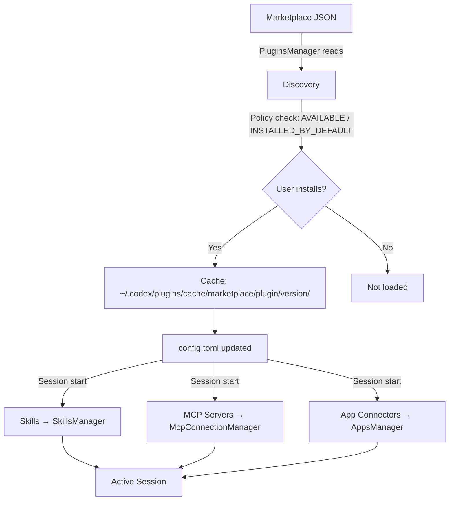

# Codex CLI Plugin System: Bundling Skills, MCP Servers, and App Connectors

**Date:** 2026-03-30

**Tags:** plugins, plugin-system, skills, mcp-servers, app-connectors, marketplace, config-toml, v0.117.0

Codex CLI v0.117.0 (released March 26, 2026) elevated plugins to a first-class workflow primitive.[^1] Where previously you might wire up an MCP server in `config.toml`, add a `SKILL.md` to a directory, and configure an app connector separately, plugins collapse all three into a single installable, shareable package. This article is a complete technical reference for building, distributing, and managing Codex plugins.

## What Plugins Are — and What They Are Not

A Codex plugin is a manifest-driven bundle that can package three types of component:[^2]

- **Skills** — Markdown instruction files that Codex loads contextually to guide behaviour on specific tasks.
- **MCP Servers** — External tool-provider processes defined in `.mcp.json` and registered with the `McpConnectionManager`, with tool names prefixed as `mcp__<server>__<tool>` to avoid collisions.[^3]
- **App Connectors** — Authenticated connections to external platforms (GitHub, Slack, Linear, etc.) defined in `.app.json`.

A plugin is *not* a replacement for an MCP server. An MCP server is still an independent process; a plugin is the packaging layer on top of it that makes it discoverable, installable, and removable as a named unit.[^4] The distinction matters: you can run an MCP server without a plugin, but you cannot ship a plugin without understanding what its components do.

## Plugin Anatomy

Every plugin has a mandatory entry point at `.codex-plugin/plugin.json`. All other artefacts live at the plugin root, not inside `.codex-plugin/`.

```
my-plugin/
├── .codex-plugin/
│   └── plugin.json          ← required
├── skills/
│   └── my-skill/
│       └── SKILL.md
├── .mcp.json                 ← optional MCP server config
├── .app.json                 ← optional app connector config
└── assets/                   ← optional icons, logos, screenshots
```

### The `plugin.json` Manifest

The manifest has three responsibilities: identify the plugin, point to its bundled components, and provide install-surface metadata.[^5]

**Minimal manifest** (skills-only plugin):

```json
{
  "name": "my-first-plugin",
  "version": "1.0.0",
  "description": "Reusable greeting workflow",
  "skills": "./skills/"
}
```

**Complete manifest** (all component types, full interface metadata):

```json
{
  "name": "my-plugin",
  "version": "1.2.0",
  "description": "Full-featured plugin example",
  "author": {
    "name": "Your Name",
    "email": "you@example.com",
    "url": "https://yoursite.example"
  },
  "homepage": "https://yoursite.example/my-plugin",
  "repository": "https://github.com/yourorg/my-plugin",
  "license": "MIT",
  "keywords": ["workflow", "automation"],
  "skills": "./skills/",
  "mcpServers": "./.mcp.json",
  "apps": "./.app.json",
  "interface": {
    "displayName": "My Plugin",
    "shortDescription": "One-line pitch for the plugin browser",
    "longDescription": "Longer markdown description shown on the detail page",
    "developerName": "YourOrg",
    "category": "Productivity",
    "capabilities": ["code", "search"],
    "websiteURL": "https://yoursite.example/my-plugin",
    "privacyPolicyURL": "https://yoursite.example/privacy",
    "termsOfServiceURL": "https://yoursite.example/terms",
    "defaultPrompt": [
      "Summarise the changes in this PR",
      "Create a release note for version ${VERSION}"
    ],
    "brandColor": "#4A90D9",
    "composerIcon": "./assets/icon.png"
  }
}
```

Key naming rule: `name` must be a stable, kebab-case identifier. Codex uses it as the plugin identifier and component namespace throughout the session.[^5]

### Bundling MCP Servers

If your plugin wraps one or more MCP servers, point `mcpServers` at a `.mcp.json` file in the plugin root:

```json
{
  "mcpServers": {
    "my-service": {
      "command": "npx",
      "args": ["-y", "@myorg/my-mcp-server"],
      "env": {
        "API_KEY": "${MY_SERVICE_API_KEY}"
      }
    }
  }
}
```

The `McpConnectionManager` prefixes every tool from this server as `mcp__my-service__<tool_name>`, preventing collisions when multiple plugins are active.[^3] If the server requires OAuth or additional setup at runtime, Codex triggers an Elicitation Request — an interactive prompt that appears before the tool is first called.[^6]

### Writing Skills for Plugins

Skills within a plugin follow the standard `SKILL.md` format, placed under `skills/<skill-name>/SKILL.md`:

```markdown
---
name: summarise-pr
description: Summarises a GitHub pull request with context from linked issues
---

When asked to summarise a PR:
1. Retrieve the PR description, commits, and any linked issue titles.
2. Identify the change type: feature, fix, refactor, or chore.
3. Write a three-sentence summary: what changed, why, and what to watch for in review.
```

The `skills` field in `plugin.json` points to the directory; Codex discovers all `SKILL.md` files within it automatically.[^7]

## Plugin Lifecycle



Session injection is the critical step: every time a new Codex thread starts, the `PluginsManager` provides its `LoadedPlugin` set to `McpManager`, `SkillsManager`, and `AppsManager` simultaneously.[^3] There is no hot-reload; plugin changes take effect on the next session.

## Distributing Plugins via Marketplaces

Plugins are surfaced through marketplace manifests. Three scopes are supported:[^8]

| Scope | File location | Who sees it |
|---|---|---|
| OpenAI Curated | Built-in | All Codex users |
| Repository | `$REPO_ROOT/.agents/plugins/marketplace.json` | Anyone opening that repo in Codex |
| Personal | `~/.agents/plugins/marketplace.json` | You only |

### Marketplace JSON Structure

```json
{
  "name": "my-team-marketplace",
  "interface": {
    "displayName": "My Team Plugins"
  },
  "plugins": [
    {
      "name": "my-plugin",
      "source": {
        "source": "local",
        "path": "./plugins/my-plugin"
      },
      "policy": {
        "installation": "AVAILABLE",
        "authentication": "ON_INSTALL"
      },
      "category": "Productivity"
    },
    {
      "name": "onboarding-plugin",
      "source": {
        "source": "local",
        "path": "./plugins/onboarding"
      },
      "policy": {
        "installation": "INSTALLED_BY_DEFAULT",
        "authentication": "ON_INSTALL"
      },
      "category": "Developer Tools"
    }
  ]
}
```

`installation` policy options:[^8]

- `AVAILABLE` — browseable and installable, not auto-installed.
- `INSTALLED_BY_DEFAULT` — installed automatically when Codex opens the repo.
- `NOT_AVAILABLE` — hidden from the browser (useful for staged rollouts).

Paths in `source.path` must be relative to the marketplace root and prefixed with `./`.

## Installation

### Via the CLI `/plugins` command

From any Codex CLI session:

```
/plugins
```

This opens an interactive plugin directory. Navigate to your target plugin, select **Install plugin**, complete any authentication prompts, then start a new thread.[^9] The `PluginsManager` resolves the source, validates the policy, and writes the resolved bundle to `~/.codex/plugins/cache/$MARKETPLACE_NAME/$PLUGIN_NAME/local/`.

### Manual Installation (repository-scoped)

```bash
# 1. Create plugin in repo
mkdir -p .codex/plugins/my-plugin
cp -r /path/to/my-plugin/* .codex/plugins/my-plugin/

# 2. Create or update marketplace manifest
cat > .agents/plugins/marketplace.json <<'EOF'
{
  "name": "repo-marketplace",
  "interface": { "displayName": "Repo Plugins" },
  "plugins": [
    {
      "name": "my-plugin",
      "source": { "source": "local", "path": "./plugins/my-plugin" },
      "policy": { "installation": "AVAILABLE", "authentication": "ON_INSTALL" },
      "category": "Developer Tools"
    }
  ]
}
EOF

# 3. Restart Codex — plugin appears in /plugins on next session
```

## Configuration Management

Installed plugins appear in `~/.codex/config.toml` under the `[plugins]` table:[^9]

```toml
[plugins."my-plugin@repo-marketplace"]
enabled = true

[plugins."another-plugin@openai-curated"]
enabled = false
```

The config layer follows the standard resolution hierarchy: CLI arguments > environment variables > project `.codex/config.toml` > global `~/.codex/config.toml` > defaults.[^3] Setting `enabled = false` keeps the plugin installed but prevents it from contributing to sessions — useful for temporarily disabling a noisy MCP server without losing your auth state.

To uninstall completely, use the plugin browser: **Uninstall plugin** removes the bundle from `~/.codex/plugins/cache/`, but any bundled *app connectors* remain installed in ChatGPT until removed separately.[^9]

## Scaffolding Plugins with `$plugin-creator`

The built-in `$plugin-creator` skill is the fastest path from idea to testable plugin:[^8]

```
@plugin-creator scaffold a plugin for our internal Jira instance that wraps the mcp-jira server
```

`$plugin-creator` generates:

- `.codex-plugin/plugin.json` with metadata stubs
- `skills/` directory with a starter `SKILL.md`
- `.mcp.json` referencing the target server
- A `marketplace.json` entry for local testing

Review the scaffolded output before sharing — in particular verify `name` is stable and unique, and that `source.path` values are relative to the marketplace root.

## Using Installed Plugins

Once installed and a new thread is started, plugins surface in two ways:

1. **Contextual loading** — Codex loads relevant skills automatically based on the task.
2. **Explicit `@` invocation** — Type `@` in the composer to browse installed plugins and skills by name.[^9]

```
@my-plugin summarise the last 10 commits on this branch
```

Plugin-backed MCP tools are available transparently; you do not need to invoke them by their prefixed `mcp__` name unless you want to reference a specific tool explicitly.

## Multi-Agent v2 and Plugin Propagation

With multi-agent v2 (also introduced in v0.117.0), spawned subagents at path-based addresses like `/root/agent_a` inherit the parent session's loaded plugins.[^1] This means a plugin-provided MCP server available in the root session is also available to worker agents without additional configuration — the `PluginsManager` injects the full `LoadedPlugin` set at session initialisation for every agent in the tree.

If a subagent requires a *different* plugin set, you can override via a custom agent file under `.codex/agents/`:

```toml
# .codex/agents/restricted-worker.toml
name = "restricted-worker"
description = "Runs with minimal plugin surface"
developer_instructions = "..."

[plugins."noisy-plugin@repo-marketplace"]
enabled = false
```

## Summary

The Codex plugin system turns the previous ad-hoc combination of `config.toml` MCP entries, scattered `SKILL.md` files, and manual app configuration into a single, versioned, discoverable unit. The key principles:

- One manifest (`plugin.json`) governs identity, components, and install-surface metadata.
- Marketplaces control discoverability and default installation policy.
- Session injection is synchronous at thread start — changes require a new session.
- `config.toml` is the source of truth for per-installation enable/disable state.
- Subagents in multi-agent v2 trees inherit the parent plugin set by default.

## Citations

[^1]: [Codex CLI v0.117.0 release notes — GitHub openai/codex](https://github.com/openai/codex/releases/tag/v0.117.0)
[^2]: [Plugins — Codex Developer Documentation](https://developers.openai.com/codex/plugins)
[^3]: [Codex Plugins System architecture — DeepWiki openai/codex](https://deepwiki.com/openai/codex/5.11-plugins-system)
[^4]: [Adithyan — Codex plugins, visually explained](https://adithyan.io/blog/codex-plugins-visual-explainer)
[^5]: [Build plugins — Codex Developer Documentation](https://developers.openai.com/codex/plugins/build)
[^6]: [Model Context Protocol — Codex Developer Documentation](https://developers.openai.com/codex/mcp)
[^7]: [Agent Skills — Codex Developer Documentation](https://developers.openai.com/codex/skills)
[^8]: [OpenAI Codex Changelog — developers.openai.com](https://developers.openai.com/codex/changelog)
[^9]: [Codex by OpenAI — Release Notes March 2026 (Releasebot)](https://releasebot.io/updates/openai/codex)
