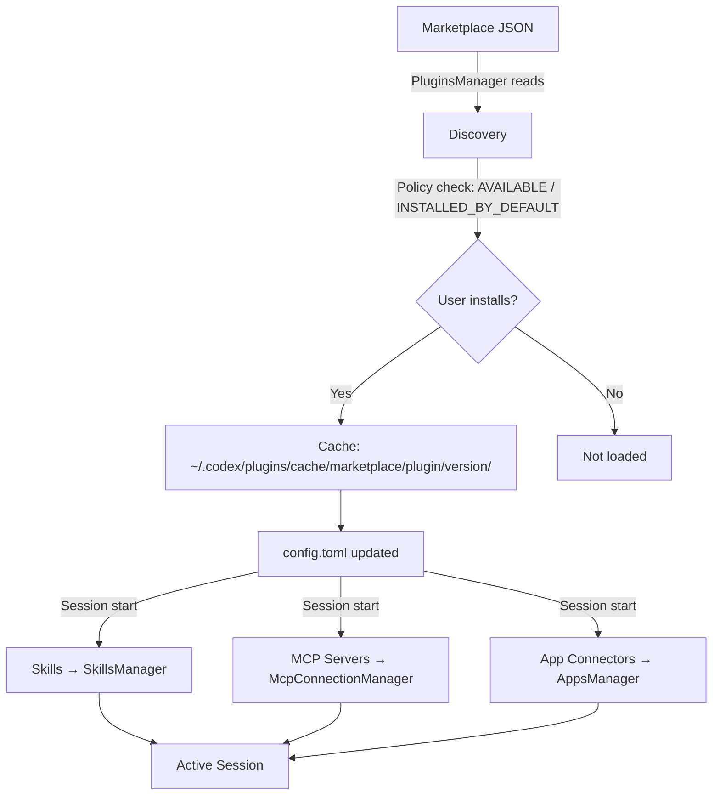
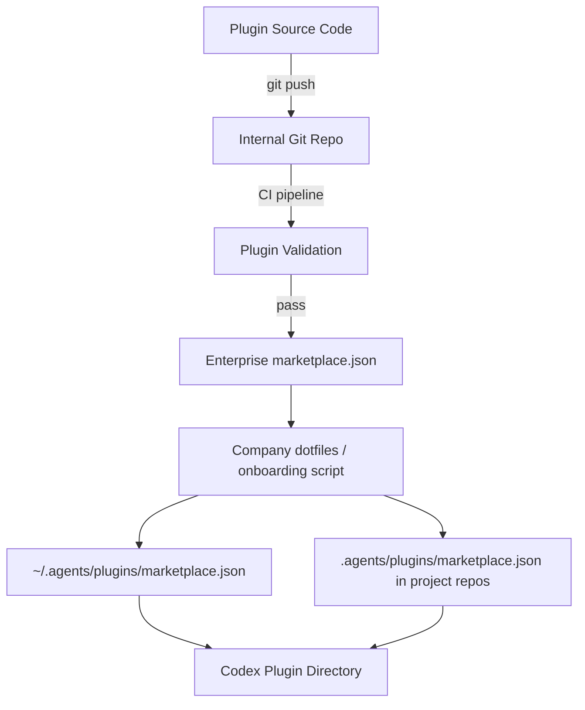

# Codex CLI Plugin System: Bundling Skills, MCP Servers, and App Connectors


Codex CLI v0.117.0 (released March 26, 2026) elevated plugins to a first-class workflow primitive.[^1] Where previously you might wire up an MCP server in `config.toml`, add a `SKILL.md` to a directory, and configure an app connector separately, plugins collapse all three into a single installable, shareable package. The 20+ first-party integrations OpenAI shipped — Slack, Figma, Notion, Gmail, Google Drive, Cloudflare — demonstrate the model, but the more interesting story is the infrastructure underneath them, which is now available to any developer.[^10] This article is a complete technical reference for building, distributing, and managing Codex plugins.

## Why Plugins Matter

Before the plugin system, sharing a Codex workflow meant handing someone:

- A copy of your `SKILL.md` files
- A snippet of `~/.codex/config.toml` for MCP servers
- Manual instructions for setting up app integrations

Plugins collapse that into a single installable bundle. Install once; Codex wires up the skills, MCP servers, and app connectors automatically. The guiding principle: **prototype locally, promote to plugin when sharing**.

| Situation | Recommended approach |
|-----------|-----|
| Single project, personal use | Local `SKILL.md` + config |
| Team-wide standards | Plugin in repo marketplace |
| Cross-project reuse | Plugin in personal marketplace |
| Distributing to other teams / OSS | Plugin in official directory |

## What Plugins Are — and What They Are Not

A Codex plugin is a manifest-driven bundle that can package three types of component:[^2]

- **Skills** — Markdown instruction files that Codex loads contextually to guide behaviour on specific tasks.
- **MCP Servers** — External tool-provider processes defined in `.mcp.json` and registered with the `McpConnectionManager`, with tool names prefixed as `mcp__<server>__<tool>` to avoid collisions.[^3]
- **App Connectors** — Authenticated connections to external platforms (GitHub, Slack, Linear, etc.) defined in `.app.json`.

The key distinction: **skills are the authoring format; plugins are the distribution format**.[^11] A workflow is designed as a skill, then wrapped in a plugin when it needs to be shared.

A plugin is *not* a replacement for an MCP server. An MCP server is still an independent process; a plugin is the packaging layer on top of it that makes it discoverable, installable, and removable as a named unit.[^4] The distinction matters: you can run an MCP server without a plugin, but you cannot ship a plugin without understanding what its components do.

## Skills: The Authoring Primitive

Before covering plugin packaging, it helps to understand the skill format that plugins wrap.

### Skill Directory Structure

A skill is a directory with a required `SKILL.md` and optional supporting files:[^7]

```
my-skill/
├── SKILL.md           # Required — instructions + YAML front matter
├── scripts/           # Optional — executable helpers
│   └── validate.sh
├── references/        # Optional — documentation Codex can consult
│   └── api-spec.yaml
├── assets/            # Optional — templates, fixtures
│   └── template.hbs
└── agents/
    └── openai.yaml    # Optional — appearance + MCP dependencies
```

### SKILL.md Format

The front matter requires `name` and `description`. The body contains imperative instructions:

```markdown
---
name: deploy-preview
description: >
  Build and deploy a preview environment for the current branch.
  Trigger when the user asks to deploy, preview, or stage changes.
---

## Steps

1. Run `scripts/validate.sh` to check prerequisites.
2. Build the container image using the project's Dockerfile.
3. Push to the preview registry at `$PREVIEW_REGISTRY`.
4. Output the preview URL.

## Constraints

- Never deploy to production.
- Always run validation before building.
```

The `description` field is critical — Codex uses it for **implicit invocation**, matching incoming tasks against skill descriptions to decide which skill to load.[^7]

### Progressive Disclosure

Codex uses a two-phase loading strategy to manage context efficiently:[^7]

1. **Metadata phase** — Codex reads only `name`, `description`, file path, and optional `agents/openai.yaml` for all discovered skills.
2. **Full load phase** — When Codex decides a skill matches the current task, it loads the complete `SKILL.md` instructions.

This means a repository with fifty skills does not consume fifty skills' worth of context tokens — only the metadata is loaded until a skill is actually needed.

### Discovery Locations

Codex scans these paths in priority order:[^7]

```
$CWD/.agents/skills          # Current directory
$CWD/../.agents/skills       # Parent directory
$REPO_ROOT/.agents/skills    # Repository root
$HOME/.agents/skills         # User home
/etc/codex/skills            # System admin
Built-in skills              # OpenAI bundled
```

### Invocation

Two modes:[^7]

- **Explicit** — Type `$skill-name` in the prompt, or use `/skills` in the TUI to browse.
- **Implicit** — Codex matches the task description against skill `description` fields and selects automatically.

### Optional Metadata: `agents/openai.yaml`

For richer integration, add appearance and dependency metadata:

```yaml
interface:
  display_name: "Deploy Preview"
  short_description: "Build and deploy preview environments"
  icon_small: "./assets/icon.svg"
  brand_color: "#3B82F6"
  default_prompt: "Deploy a preview of the current branch"

policy:
  allow_implicit_invocation: true

dependencies:
  tools:
    - type: "mcp"
      value: "container-registry"
```

The `dependencies.tools` block tells Codex which MCP servers the skill needs — Codex can install and wire them automatically when the skill is invoked.[^12]

## Plugin Anatomy

Every plugin has a mandatory entry point at `.codex-plugin/plugin.json`. All other artefacts live at the plugin root, not inside `.codex-plugin/`.

```
my-plugin/
├── .codex-plugin/
│   └── plugin.json          ← required
├── skills/
│   └── my-skill/
│       └── SKILL.md
├── .mcp.json                 ← optional MCP server config
├── .app.json                 ← optional app connector config
└── assets/                   ← optional icons, logos, screenshots
```

### The `plugin.json` Manifest

The manifest has three responsibilities: identify the plugin, point to its bundled components, and provide install-surface metadata.[^5]

**Minimal manifest** (skills-only plugin):

```json
{
  "name": "my-first-plugin",
  "version": "1.0.0",
  "description": "Reusable greeting workflow",
  "skills": "./skills/"
}
```

**Complete manifest** (all component types, full interface metadata):

```json
{
  "name": "my-plugin",
  "version": "1.2.0",
  "description": "Full-featured plugin example",
  "author": {
    "name": "Your Name",
    "email": "you@example.com",
    "url": "https://yoursite.example"
  },
  "homepage": "https://yoursite.example/my-plugin",
  "repository": "https://github.com/yourorg/my-plugin",
  "license": "MIT",
  "keywords": ["workflow", "automation"],
  "skills": "./skills/",
  "mcpServers": "./.mcp.json",
  "apps": "./.app.json",
  "interface": {
    "displayName": "My Plugin",
    "shortDescription": "One-line pitch for the plugin browser",
    "longDescription": "Longer markdown description shown on the detail page",
    "developerName": "YourOrg",
    "category": "Productivity",
    "capabilities": ["code", "search"],
    "websiteURL": "https://yoursite.example/my-plugin",
    "privacyPolicyURL": "https://yoursite.example/privacy",
    "termsOfServiceURL": "https://yoursite.example/terms",
    "defaultPrompt": [
      "Summarise the changes in this PR",
      "Create a release note for version ${VERSION}"
    ],
    "brandColor": "#4A90D9",
    "composerIcon": "./assets/icon.png",
    "logo": "./assets/logo.png",
    "screenshots": ["./assets/screenshot.png"]
  }
}
```

Key rules:

- `name` must be a stable, kebab-case identifier. Codex uses it as the plugin identifier and component namespace throughout the session.[^5]
- `version` follows semantic versioning. Codex uses the version as part of the cache key, so a version bump forces a reinstall on next sync.
- All paths must be relative to the plugin root and prefixed with `./`. Omit any pointer whose component does not exist — Codex will not complain about missing optional keys.
- `defaultPrompt` entries surface as starter suggestions after install — worth populating for discoverability.

### Bundling MCP Servers

If your plugin wraps one or more MCP servers, point `mcpServers` at a `.mcp.json` file in the plugin root:

```json
{
  "mcpServers": {
    "my-service": {
      "command": "npx",
      "args": ["-y", "@myorg/my-mcp-server"],
      "env": {
        "API_KEY": "${MY_SERVICE_API_KEY}"
      }
    }
  }
}
```

The `McpConnectionManager` prefixes every tool from this server as `mcp__my-service__<tool_name>`, preventing collisions when multiple plugins are active.[^3] If the server requires OAuth or additional setup at runtime, Codex triggers an Elicitation Request — an interactive prompt that appears before the tool is first called.[^6]

### Writing Skills for Plugins

Skills within a plugin follow the standard `SKILL.md` format, placed under `skills/<skill-name>/SKILL.md`:

```markdown
---
name: summarise-pr
description: Summarises a GitHub pull request with context from linked issues
---

When asked to summarise a PR:
1. Retrieve the PR description, commits, and any linked issue titles.
2. Identify the change type: feature, fix, refactor, or chore.
3. Write a three-sentence summary: what changed, why, and what to watch for in review.
```

The `skills` field in `plugin.json` points to the directory; Codex discovers all `SKILL.md` files within it automatically.[^7]

## MCP Server Configuration In Depth

MCP (Model Context Protocol) is the bridge between plugins and external systems. Codex supports two transport types.[^6]

### STDIO Servers (Local Process)

```toml
[mcp_servers.context7]
command = "npx"
args = ["-y", "@upstash/context7-mcp"]
startup_timeout_sec = 15
tool_timeout_sec = 120

[mcp_servers.context7.env]
API_KEY = "sk-..."
```

### Streamable HTTP Servers (Remote)

```toml
[mcp_servers.figma]
url = "https://mcp.figma.com/mcp"
bearer_token_env_var = "FIGMA_OAUTH_TOKEN"
http_headers = { "X-Figma-Region" = "us-east-1" }
```

### Universal Server Options

These apply to both transport types:[^6]

| Key | Default | Purpose |
|-----|---------|---------|
| `startup_timeout_sec` | 10 | Server initialisation timeout |
| `tool_timeout_sec` | 60 | Tool execution timeout |
| `enabled` | true | Enable/disable without deletion |
| `required` | false | Fail startup if server cannot initialise |
| `enabled_tools` | all | Tool allowlist |
| `disabled_tools` | none | Tool denylist (applied after allowlist) |

### OAuth for MCP

For servers requiring OAuth authentication:[^6]

```toml
mcp_oauth_callback_port = 5555
mcp_oauth_callback_url = "https://devbox.example.internal/callback"
```

Authenticate with:

```bash
codex mcp login <server-name>
```

Codex uses server-advertised scopes when available. The custom callback URL supports remote devbox scenarios where `localhost` is not reachable.

### CLI MCP Management

```bash
# Add a server
codex mcp add sentry --env SENTRY_TOKEN=sk-... -- npx @sentry/mcp-server

# View active servers in TUI
/mcp
```

## Plugin Lifecycle



Session injection is the critical step: every time a new Codex thread starts, the `PluginsManager` provides its `LoadedPlugin` set to `McpManager`, `SkillsManager`, and `AppsManager` simultaneously.[^3] There is no hot-reload; plugin changes take effect on the next session.

## Distributing Plugins via Marketplaces

Plugins are surfaced through marketplace manifests. Three scopes are supported:[^8]

| Scope | File location | Who sees it |
|---|---|---|
| OpenAI Curated | Built-in | All Codex users |
| Repository | `$REPO_ROOT/.agents/plugins/marketplace.json` | Anyone opening that repo in Codex |
| Personal | `~/.agents/plugins/marketplace.json` | You only |

### Marketplace JSON Structure

```json
{
  "name": "my-team-marketplace",
  "interface": {
    "displayName": "My Team Plugins"
  },
  "plugins": [
    {
      "name": "my-plugin",
      "source": {
        "source": "local",
        "path": "./plugins/my-plugin"
      },
      "policy": {
        "installation": "AVAILABLE",
        "authentication": "ON_INSTALL"
      },
      "category": "Productivity"
    },
    {
      "name": "onboarding-plugin",
      "source": {
        "source": "local",
        "path": "./plugins/onboarding"
      },
      "policy": {
        "installation": "INSTALLED_BY_DEFAULT",
        "authentication": "ON_INSTALL"
      },
      "category": "Developer Tools"
    }
  ]
}
```

### Installation Policies

The `policy.installation` field controls how plugins are surfaced:[^8]

- `AVAILABLE` — browseable and installable, not auto-installed.
- `INSTALLED_BY_DEFAULT` — installed automatically when Codex opens the repo.
- `NOT_AVAILABLE` — hidden from the browser (useful for staged rollouts).

`INSTALLED_BY_DEFAULT` is the key enterprise primitive. Commit a repo-scoped `marketplace.json` with this policy for core platform plugins, and every engineer who clones the repo gets them automatically without browsing a directory or running a setup command.

### Authentication Timing

The `policy.authentication` field controls when credential prompts appear:[^13]

| Value | Behaviour |
|-------|-----------|
| `ON_INSTALL` | Prompt for credentials immediately on install |
| `ON_FIRST_USE` | Defer the auth prompt until the plugin is first invoked |

`ON_FIRST_USE` produces a smoother onboarding experience for optional integrations; `ON_INSTALL` is preferable for plugins that are useless without credentials.

Paths in `source.path` must be relative to the marketplace root and prefixed with `./`.

## Installation

### Via the CLI `/plugins` command

From any Codex CLI session:

```
/plugins
```

This opens an interactive plugin directory. Navigate to your target plugin, select **Install plugin**, complete any authentication prompts, then start a new thread.[^9] The `PluginsManager` resolves the source, validates the policy, and writes the resolved bundle to `~/.codex/plugins/cache/$MARKETPLACE_NAME/$PLUGIN_NAME/local/`.

For local plugins, `$VERSION` is `local`. Updates require reinstallation because Codex loads from the cache path, not directly from the marketplace entry.

### Manual Installation (repository-scoped)

```bash
# 1. Create plugin in repo
mkdir -p .codex/plugins/my-plugin
cp -r /path/to/my-plugin/* .codex/plugins/my-plugin/

# 2. Create or update marketplace manifest
cat > .agents/plugins/marketplace.json <<'EOF'
{
  "name": "repo-marketplace",
  "interface": { "displayName": "Repo Plugins" },
  "plugins": [
    {
      "name": "my-plugin",
      "source": { "source": "local", "path": "./plugins/my-plugin" },
      "policy": { "installation": "AVAILABLE", "authentication": "ON_INSTALL" },
      "category": "Developer Tools"
    }
  ]
}
EOF

# 3. Restart Codex — plugin appears in /plugins on next session
```

## Configuration Management

Installed plugins appear in `~/.codex/config.toml` under the `[plugins]` table:[^9]

```toml
[plugins."my-plugin@repo-marketplace"]
enabled = true

[plugins."another-plugin@openai-curated"]
enabled = false
```

The config layer follows the standard resolution hierarchy: CLI arguments > environment variables > project `.codex/config.toml` > global `~/.codex/config.toml` > defaults.[^3] Setting `enabled = false` keeps the plugin installed but prevents it from contributing to sessions — useful for temporarily disabling a noisy MCP server without losing your auth state.

To uninstall completely, use the plugin browser: **Uninstall plugin** removes the bundle from `~/.codex/plugins/cache/`, but any bundled *app connectors* remain installed in ChatGPT until removed separately.[^9]

## Scaffolding Plugins with `$plugin-creator`

The built-in `$plugin-creator` skill is the fastest path from idea to testable plugin:[^8]

```
@plugin-creator scaffold a plugin for our internal Jira instance that wraps the mcp-jira server
```

`$plugin-creator` generates:

- `.codex-plugin/plugin.json` with metadata stubs
- `skills/` directory with a starter `SKILL.md`
- `.mcp.json` referencing the target server
- A `marketplace.json` entry for local testing

Review the scaffolded output before sharing — in particular verify `name` is stable and unique, and that `source.path` values are relative to the marketplace root. `@plugin-creator` can also generate a marketplace entry for a GitHub-hosted plugin when given a repo URL as context.

## Schema Generation and Validation

Two commands generate version-locked type definitions for tooling:[^13]

```bash
codex app-server generate-ts           # TypeScript types
codex app-server generate-json-schema  # JSON Schema bundle
```

Use the JSON Schema output in CI to validate manifests before distribution:

```bash
ajv validate \
  -s <(codex app-server generate-json-schema) \
  -d .codex-plugin/plugin.json
```

Increment `version` in `plugin.json` for every change that affects skills or MCP configuration. Codex uses the version as part of the cache key, so a version bump forces a reinstall on next sync.

## Using Installed Plugins

Once installed and a new thread is started, plugins surface in two ways:

1. **Contextual loading** — Codex loads relevant skills automatically based on the task.
2. **Explicit `@` invocation** — Type `@` in the composer to browse installed plugins and skills by name.[^9]

```
@my-plugin summarise the last 10 commits on this branch
```

Plugin-backed MCP tools are available transparently; you do not need to invoke them by their prefixed `mcp__` name unless you want to reference a specific tool explicitly.

## Building a Private Enterprise Plugin Registry

For organisations managing dozens of plugins, the repo + personal marketplace approach extends into a proper internal registry:[^13]



The CI validation step should verify manifest schema (via `codex app-server generate-json-schema`), confirm no unexpected MCP endpoints, and require a version bump for every content change. Distribute the company-wide `marketplace.json` via onboarding dotfiles; teams add project-specific plugins at `$REPO_ROOT/.agents/plugins/marketplace.json`.

### Distribution Options

OpenAI's official plugin directory hosts the 20+ first-party integrations; self-serve third-party submission is expected soon.[^2] In the meantime, four distribution paths are available:

1. **Repo marketplace** — commit `.agents/plugins/marketplace.json`; anyone who clones the repo gets access.
2. **Personal marketplace** — `~/.agents/plugins/marketplace.json` for individual tooling.
3. **GitHub-hosted** — a `marketplace.json` in a public repo that others reference manually.
4. **Enterprise registry** — internal CI/CD pipeline as described above.

## End-to-End Example: A Sentry Triage Plugin

Combining all three layers into a practical plugin:[^14]

```
sentry-triage/
├── .codex-plugin/
│   └── plugin.json
├── skills/
│   └── triage-errors/
│       ├── SKILL.md
│       └── scripts/
│           └── format-report.sh
├── .mcp.json
└── assets/
    └── icon.png
```

**`.mcp.json`** — wires the Sentry MCP server:

```json
{
  "sentry": {
    "command": "npx",
    "args": ["-y", "@sentry/mcp-server"],
    "env": {
      "SENTRY_TOKEN": "${SENTRY_AUTH_TOKEN}"
    }
  }
}
```

**`skills/triage-errors/SKILL.md`**:

```markdown
---
name: triage-errors
description: >
  Fetch recent unresolved Sentry errors, group by root cause,
  and generate a prioritised triage report.
---

1. Use the Sentry MCP tool to fetch unresolved issues from the last 24 hours.
2. Group issues by stack trace similarity.
3. For each group, identify the likely root cause from the code.
4. Run `scripts/format-report.sh` to produce a markdown report.
5. Present the report sorted by frequency × severity.
```

**`agents/openai.yaml`**:

```yaml
dependencies:
  tools:
    - type: "mcp"
      value: "sentry"
```

This plugin gives any team member a one-command Sentry triage workflow — install the plugin, and `$triage-errors` or even "check today's errors" triggers the full pipeline.

## Multi-Agent v2 and Plugin Propagation

With multi-agent v2 (also introduced in v0.117.0), spawned subagents at path-based addresses like `/root/agent_a` inherit the parent session's loaded plugins.[^1] This means a plugin-provided MCP server available in the root session is also available to worker agents without additional configuration — the `PluginsManager` injects the full `LoadedPlugin` set at session initialisation for every agent in the tree.

If a subagent requires a *different* plugin set, you can override via a custom agent file under `.codex/agents/`:

```toml
# .codex/agents/restricted-worker.toml
name = "restricted-worker"
description = "Runs with minimal plugin surface"
developer_instructions = "..."

[plugins."noisy-plugin@repo-marketplace"]
enabled = false
```

## Cross-Platform Compatibility

The skill format is converging across vendors. The same `SKILL.md` file works with Codex, Gemini CLI, and Claude Code's equivalent system.[^15] MCP is the shared protocol standard that Anthropic championed and OpenAI has adopted.[^6] Building on these standards means plugin investments are not locked to a single vendor's ecosystem.

## Practical Considerations

**Skill loading is lazy.** Skills inside a plugin follow the same progressive disclosure model as standalone SKILL.md files — they do not inflate the context window on startup.[^16]

**MCP servers start on demand.** The server defined in `.mcp.json` starts when a skill or prompt references it. Keep MCP startup time in mind for latency-sensitive workflows.

**Test before distributing.** Use the local marketplace entry generated by `@plugin-creator` to verify the full install-to-invoke cycle. The most common failure modes are incorrect relative paths in component pointers and missing authentication configuration.

**Namespace collisions.** Plugin names must be unique within a marketplace. Across marketplaces, Codex disambiguates by `$PLUGIN_NAME@$MARKETPLACE_NAME` — renaming a published plugin is a breaking change for any automation that references it.

## Current Limitations

- **Self-serve publishing** to the official Plugin Directory is not yet available — OpenAI currently curates submissions.[^5]
- **Plugin discovery in the CLI** is functional but less polished than the app experience — use `/plugins` to browse.[^2]
- **Hooks are not yet Windows-compatible** — skills relying on hook-based pre/post processing may not work on Windows installations.[^17]
- **No version pinning** for marketplace plugins — teams relying on stability should use repo-scoped local marketplaces with vendored plugin directories.

## Summary

The Codex plugin system turns the previous ad-hoc combination of `config.toml` MCP entries, scattered `SKILL.md` files, and manual app configuration into a single, versioned, discoverable unit. The key principles:

- One manifest (`plugin.json`) governs identity, components, and install-surface metadata.
- Skills are the authoring primitive; plugins are the distribution primitive.
- Marketplaces control discoverability and default installation policy.
- Session injection is synchronous at thread start — changes require a new session.
- `config.toml` is the source of truth for per-installation enable/disable state.
- Subagents in multi-agent v2 trees inherit the parent plugin set by default.
- The underlying skill and MCP standards are cross-platform, reducing vendor lock-in.

## Citations

[^1]: [Codex CLI v0.117.0 release notes — GitHub openai/codex](https://github.com/openai/codex/releases/tag/v0.117.0)
[^2]: [Plugins — Codex Developer Documentation](https://developers.openai.com/codex/plugins)
[^3]: [Codex Plugins System architecture — DeepWiki openai/codex](https://deepwiki.com/openai/codex/5.11-plugins-system)
[^4]: [Adithyan — Codex plugins, visually explained](https://adithyan.io/blog/codex-plugins-visual-explainer)
[^5]: [Build plugins — Codex Developer Documentation](https://developers.openai.com/codex/plugins/build)
[^6]: [Model Context Protocol — Codex Developer Documentation](https://developers.openai.com/codex/mcp)
[^7]: [Agent Skills — Codex Developer Documentation](https://developers.openai.com/codex/skills)
[^8]: [OpenAI Codex Changelog — developers.openai.com](https://developers.openai.com/codex/changelog)
[^9]: [Codex by OpenAI — Release Notes March 2026 (Releasebot)](https://releasebot.io/updates/openai/codex)
[^10]: [gHacks — OpenAI Adds Codex Plugins to Automate Workflows](https://www.ghacks.net/2026/03/29/openai-adds-codex-plugins-to-automate-workflows-and-expand-beyond-coding/)
[^11]: [PAS7 Studio — Codex Plugins, Explained](https://pas7.com.ua/blog/en/codex-plugins-explained-2026)
[^12]: [Customization — Codex Developer Documentation](https://developers.openai.com/codex/concepts/customization)
[^13]: [Codex Plugins — Neowin](https://www.neowin.net/news/openai-launches-codex-plugins-to-streamline-developer-workflows/)
[^14]: [Skills as Progressive Disclosure — codex-resources](https://danielvaughan.github.io/codex-resources/articles/2026-03-27-skills-progressive-disclosure-vs-mcp/)
[^15]: [Morph LLM — Claude Code Skills vs MCP vs Plugins: Complete Guide 2026](https://www.morphllm.com/claude-code-skills-mcp-plugins)
[^16]: [Codex Plugins — Neowin](https://www.neowin.net/news/openai-launches-codex-plugins-to-streamline-developer-workflows/)
[^17]: [Augment Code — OpenAI Codex CLI ships v0.116.0 with enterprise features](https://www.augmentcode.com/learn/openai-codex-cli-enterprise)
