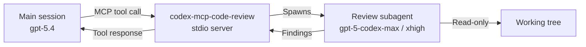

# Codex CLI Code Review Workflows: /review, review_model, and the MCP Extension

**Date:** 2026-03-30
**Tags:** code-review, /review, review_model, config-toml, profiles, codex-mcp-code-review, deep-review, uncommitted-changes, ci-cd, slash-commands

The `/review` command is one of Codex CLI's most practical daily-use features, yet it receives surprisingly little attention compared to the agent orchestration machinery. This article covers the complete review surface: the four preset modes, how to pin a dedicated review model, the `deep-review` profile pattern for high-effort analysis, the known limitation around in-flight task queuing, and the community `codex-mcp-code-review` server that extends reviews into full autonomous fix-and-verify loops.

---

## What `/review` Actually Does

Type `/review` in the CLI and Codex opens a preset picker. The reviewer runs as a **read-only sub-turn** — it never writes to your working tree.[^1] Findings appear as their own turn in the transcript, so you can rerun the review as you address issues and compare feedback across iterations without losing the conversation context.

Four presets are available:[^2]

| Preset | Scope |
|---|---|
| **Review against a base branch** | Finds the merge base between your current branch and a local reference branch, then diffs the full divergence. |
| **Review uncommitted changes** | Inspects staged files, unstaged modifications, and untracked files — everything `git status` would show. |
| **Review a commit** | Lists recent commits by SHA; Codex reads the exact changeset for the one you select. |
| **Custom review instructions** | Accepts freeform guidance ("focus on race conditions", "flag any PII exposure") and runs the reviewer with that prompt prepended. |

The base-branch preset is the workhorse for pre-PR review. Codex finds the merge base automatically rather than diffing tip-to-tip, which means it sees only your changes and not unrelated upstream work.[^3]

---

## The `review_model` Config Key

By default, `/review` uses whatever model is active in the current session. For teams that want a consistent, higher-reasoning model for reviews regardless of what their day-to-day session model is, the `review_model` key provides a clean override:[^4]

```toml
# ~/.codex/config.toml
model = "gpt-5.4"          # session default
review_model = "gpt-5-codex-max"   # review override
```

When set, every `/review` invocation — regardless of the current session model — uses the specified model. This is useful when your regular session runs a fast, cheaper model but you want a flagship model for correctness analysis.

---

## The `deep-review` Profile Pattern

For high-stakes review runs — pre-release security sweeps, large refactors, audit trails — the recommended pattern is a dedicated profile with `xhigh` reasoning effort:[^5]

```toml
# ~/.codex/config.toml
model = "gpt-5.4"
approval_policy = "on-request"

[profiles.deep-review]
model = "gpt-5-codex-max"
model_reasoning_effort = "xhigh"
approval_policy = "never"
```

Run it with:

```bash
codex --profile deep-review
```

Then trigger `/review` from within that session. The `xhigh` reasoning effort instructs the model to spend substantially more compute per query — appropriate for security analysis and cross-cutting correctness issues but too slow for routine commit reviews.[^6]

The `approval_policy = "never"` in the profile prevents the reviewer from pausing to ask for tool approvals, since review runs are read-only and there is nothing to approve.

---

## Review Workflow: Typical Pre-PR Flow

```mermaid
flowchart TD
    A[Feature branch with uncommitted changes] --> B[/review — base branch preset]
    B --> C{Findings?}
    C -- Critical / Important --> D[Address in working tree]
    D --> B
    C -- Suggestions only --> E[/review — uncommitted changes]
    E --> F{All clear?}
    F -- Yes --> G[git add && git commit]
    F -- No --> D
    G --> H[Push and open PR]
```

The iterative loop — review, address, review again — works well because each review appears as its own transcript turn. You can scroll back to compare findings from run N-1 versus run N to confirm issues have been resolved.

For the commit review mode, the workflow is simpler: after committing, run `/review` → select the commit SHA → verify no regressions slipped through.

---

## The Queuing Limitation

There is a known restriction: **`/review` cannot be queued while a task is in progress**. Attempting it shows `'/review' is disabled while a task is in progress`.[^7]

This becomes friction in workflows like "implement this endpoint, then review your changes". The current workaround is to wait for the implementation turn to complete before issuing `/review`. The underlying feature request (queueing all slash commands, tracked in issue #5123) remains open as of March 2026.[^8]

For genuine post-task review automation without manual intervention, the MCP approach below is the correct solution.

---

## `codex-mcp-code-review`: Autonomous Review Loops

The community [`codex-mcp-code-review`](https://github.com/Szpadel/codex-mcp-code-review) MCP server solves the queuing limitation by exposing a `review_uncommitted_changes` tool that any Codex session — including the main implementation session — can call via MCP.[^9]

### Architecture



The review subagent runs in its own clean context, which prevents the review finding mixed signals from the implementation history. The main session retains the full implementation context, so when it receives findings it can address them with full awareness of why the code was written that way.[^10]

### Configuration

```toml
# ~/.codex/config.toml
[[mcp_servers]]
name = "codex-review"
command = "uvx"
args = ["--from", "git+https://github.com/Szpadel/codex-mcp-code-review", "codex-mcp-code-review"]

[mcp_servers.env]
REVIEW_MODEL = "gpt-5-codex-max"
REVIEW_REASONING_EFFORT = "xhigh"
PARALLELISM = "2"
```

Key configuration notes:[^11]

- **`tool_timeout_sec`** must exceed the review timeout. The README specifies: if the review timeout is 2700 seconds, set `tool_timeout_sec = 3000` in your Codex config.
- **`--parallelism`** controls how many concurrent review runs can execute. Default is 4.
- **`--enable additional_review_instructions`** exposes an optional `additional_developer_instructions` argument on the tool, letting the calling session pass custom review criteria alongside the standard prompt.
- The sandbox runs with `approval_policy = "never"` and read-only disk access.

### Invoking from a Session

Once configured, you can instruct Codex to review mid-session:

```
Implement the OAuth token refresh logic, then call review_uncommitted_changes
with additional_developer_instructions: "Check for token leakage into logs,
validate expiry handling, and verify PKCE flow correctness."
```

The main session implements, then calls the MCP tool, which spawns the review subagent, waits for findings, and returns them as a tool response — all within a single turn.

---

## CI/CD Integration with `codex exec`

For headless review pipelines, use `codex exec` with `--full-auto`:[^12]

```bash
codex --full-auto exec \
  "Review all uncommitted changes against the main branch. \
   Focus on security, data-loss risks, and API contract violations. \
   Exit non-zero if critical or important findings are present." \
  --model gpt-5-codex-max \
  --sandbox-mode read-only
```

The `--full-auto` flag is required for headless operation; without it Codex may hang waiting for approval.[^13] The natural language instruction to "exit non-zero if critical findings are present" propagates via the process exit code. Wire this into your CI pipeline after code generation steps or before the PR gate.

---

## The `/diff` Companion Command

The `/diff` command displays all changes — staged, unstaged, and untracked — with syntax highlighting in the TUI.[^14] It is not a review; it shows raw diffs without interpretation. Use it as a quick sanity check before triggering `/review`, particularly to confirm the review scope matches your expectations.

The typical sequence is: `/diff` (confirm scope) → `/review` (get findings) → address issues → `/diff` again (verify changes) → commit.

---

## Summary

| Capability | Mechanism |
|---|---|
| Four review modes | `/review` preset picker |
| Dedicated review model | `review_model` in `config.toml` |
| High-effort deep review | `[profiles.deep-review]` with `model_reasoning_effort = "xhigh"` |
| Post-task automation | `codex-mcp-code-review` MCP server |
| Headless CI review | `codex --full-auto exec` with review instruction |
| Scope inspection | `/diff` before `/review` |

The `/review` command's read-only guarantee and four-mode flexibility make it a natural fit for every point in the development loop: pre-commit, pre-PR, and post-merge. The `codex-mcp-code-review` extension removes the last friction point — the inability to queue reviews during active tasks — by turning review into a callable MCP tool that any session can invoke autonomously.

---

## Citations

[^1]: Codex CLI Features — Code Review section. The reviewer "reports prioritized, actionable findings without touching your working tree." [developers.openai.com/codex/cli/features](https://developers.openai.com/codex/cli/features)

[^2]: Four review presets documented in the official Codex CLI features page: base branch, uncommitted changes, commit SHA, and custom instructions. [developers.openai.com/codex/cli/features](https://developers.openai.com/codex/cli/features)

[^3]: Codex "finds the merge base against the upstream branch" to scope the diff correctly. [developers.openai.com/codex/cli/features](https://developers.openai.com/codex/cli/features)

[^4]: Codex Configuration Reference: `review_model` — "Optional model override used by `/review` (defaults to the current session model)." [developers.openai.com/codex/config-reference](https://developers.openai.com/codex/config-reference)

[^5]: Advanced Configuration documentation shows the `deep-review` profile example with `model_reasoning_effort = "high"` and model override. [developers.openai.com/codex/config-advanced](https://developers.openai.com/codex/config-advanced)

[^6]: `xhigh` reasoning effort "thinks for an even longer period of time for a better answer"; appropriate for security analysis and large refactors. [developers.openai.com/codex/models](https://developers.openai.com/codex/models)

[^7]: GitHub issue #6590: "Allow /review to be queued while a task is in progress" — the error message `'/review' is disabled while a task is in progress` is confirmed. Closed as duplicate. [github.com/openai/codex/issues/6590](https://github.com/openai/codex/issues/6590)

[^8]: Issue #5123 "Queue slash commands" is the parent tracking issue, open as of March 2026. Referenced in the closure note of #6590. [github.com/openai/codex/issues/5123](https://github.com/openai/codex/issues/5123)

[^9]: `codex-mcp-code-review` by Szpadel: MCP server exposing `review_uncommitted_changes` tool for clean-context autonomous review runs. [github.com/Szpadel/codex-mcp-code-review](https://github.com/Szpadel/codex-mcp-code-review)

[^10]: From the project README: "keeps review context clean while fixes happen in the main session that retains implementation knowledge, reducing regressions." [github.com/Szpadel/codex-mcp-code-review](https://github.com/Szpadel/codex-mcp-code-review)

[^11]: `codex-mcp-code-review` README: timeout guidance ("if the review timeout is 2700 seconds, set `tool_timeout_sec = 3000`"), default parallelism of 4, `--enable additional_review_instructions` flag. [github.com/Szpadel/codex-mcp-code-review](https://github.com/Szpadel/codex-mcp-code-review)

[^12]: Codex CLI `codex exec` subcommand for non-interactive automation. [developers.openai.com/codex/cli/features](https://developers.openai.com/codex/cli/features)

[^13]: From code review automation guides: `--full-auto` flag is required for headless CI operation; without it "Codex may hang waiting for user approval." [inventivehq.com/knowledge-base/openai/how-to-use-codex-for-code-review](https://inventivehq.com/knowledge-base/openai/how-to-use-codex-for-code-review)

[^14]: Codex CLI slash commands reference: `/diff` — "Display Git changes including untracked files." [developers.openai.com/codex/cli/slash-commands](https://developers.openai.com/codex/cli/slash-commands)
