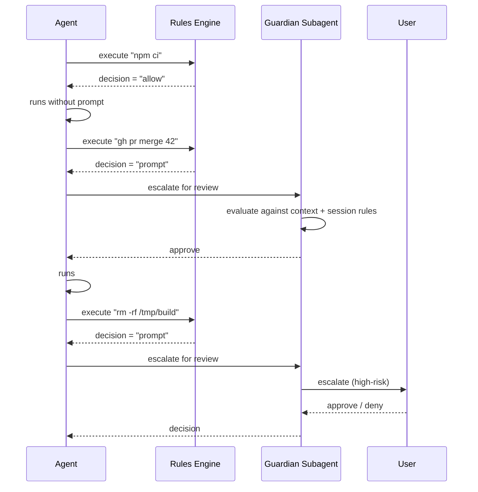
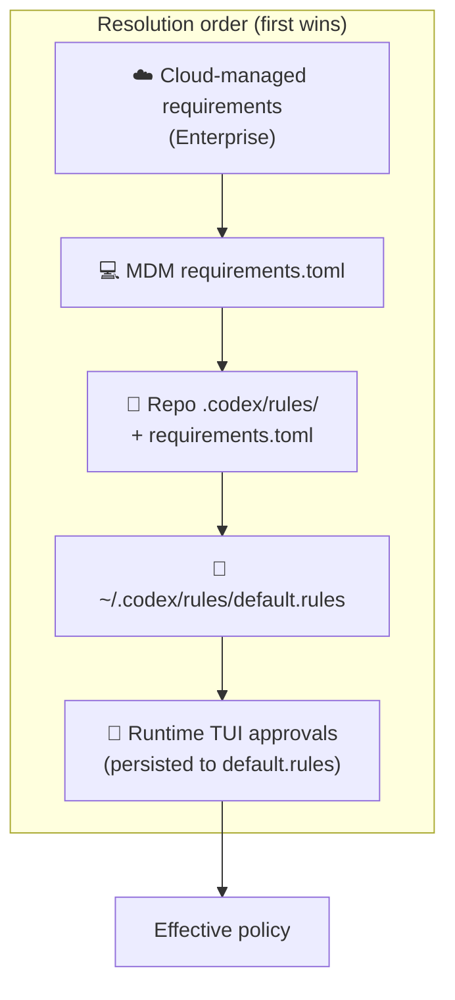

# Codex CLI Rules Engine: Starlark Policies, Smart Approvals, and the Guardian Subagent


The approval-modes article in this collection covered the two-axis model of `approval_policy` and `sandbox_mode`. What it could only mention in passing was the **Rules Engine** underneath — a Starlark-based policy layer giving you surgical, per-command control over what Codex executes outside the sandbox. With the Smart Approvals guardian subagent reaching GA in March 2026, the rules system is now production-ready. This article covers the full stack: `.rules` file format, `prefix_rule()` semantics, the `execpolicy check` testing harness, and how Smart Approvals automates rule creation without removing human oversight.

---

## Architecture Overview

Codex resolves approval decisions through three stacked layers:

```mermaid
flowchart TD
    CMD["Incoming command request"]
    SANDBOX["Sandbox mode check\n(read-only / workspace-write / danger-full-access)"]
    RULES["Rules Engine\n(prefix_rule resolution)"]
    SMART["Smart Approvals\nguardian subagent"]
    USER["Human TUI prompt"]
    EXEC["Execute"]
    BLOCK["Block / forbidden"]

    CMD --> SANDBOX
    SANDBOX -->|"Within bounds"| RULES
    SANDBOX -->|"Out of bounds"| USER
    RULES -->|"allow"| EXEC
    RULES -->|"forbidden"| BLOCK
    RULES -->|"prompt"| SMART
    SMART -->|"guardian approves"| EXEC
    SMART -->|"guardian escalates"| USER
```



The sandbox layer is a hard OS-level cap; the rules layer is a per-command policy table; Smart Approvals is an optional automation layer between the two.[^1]

---

## The `.rules` File

Rules live in Starlark files (`.rules` extension) under `rules/` directories at each Team Config location.[^2] Codex scans every location at startup. The user-scope file is `~/.codex/rules/default.rules`; repo-scope files sit under `<repo>/.codex/rules/`.

### Why Starlark?

Starlark is a Python-like language designed specifically for configuration — deterministic, no filesystem side-effects, no I/O, hermetically sandboxed.[^3] It is a natural fit for policy evaluation: readable syntax, optional comments, no risk of arbitrary code execution during rule loading.

---

## `prefix_rule()` Semantics

The sole public function in `.rules` files is `prefix_rule()`. It matches command argument prefixes — not regexes, not glob patterns — making the semantics easy to reason about and audit.[^4]

### Signature

```starlark
prefix_rule(
    pattern    = [...],          # Required: list of string | [string, ...]
    decision   = "allow",        # Optional: "allow" | "prompt" | "forbidden"
    justification = "...",       # Optional: shown in approval prompts
    match      = [...],          # Optional: must-match examples (unit tests)
    not_match  = [...],          # Optional: must-not-match examples
)
```

### Pattern Matching

Each element in `pattern` is either a **literal** (`"view"`) or a **union** (`["view", "list"]`). The pattern is an exact prefix: it must match the first N arguments of the command in order.[^4]

```starlark
# Matches: gh pr view 7888
# Matches: gh pr view --repo openai/codex
# Does NOT match: gh pr --repo openai/codex view 7888  (flags before positional)
prefix_rule(
    pattern = ["gh", "pr", "view"],
    decision = "prompt",
    justification = "PR viewing allowed; prompts to avoid accidental bulk reads",
    match = [
        "gh pr view 7888",
        "gh pr view --repo openai/codex",
    ],
    not_match = [
        "gh pr --repo openai/codex view 7888",
    ],
)
```

### Decision Precedence

When multiple rules match the same command, Codex applies the **most restrictive** decision:[^4]

```
forbidden  >  prompt  >  allow
```

This means you can write a broad `allow` rule for `git` and a narrower `forbidden` rule for `git push --force`, and the `forbidden` rule will win for that specific case.

### Shell Command Splitting

Codex uses a tree-sitter parser to safely split linear shell chains (`&&`, `||`, `;`, `|`) containing only plain words into individual commands, each evaluated separately against the rules.[^4] Scripts containing redirection, variable substitution, wildcards, or control flow are treated conservatively as a single `["bash", "-lc", "<script>"]` invocation.

---

## A Production-Ready Default Rules File

Below is a condensed version of the community-standard `~/.codex/rules/default.rules` that covers safe read-only operations:[^5]

```starlark
# File/text inspection
prefix_rule(pattern = ["cat"],  decision = "allow")
prefix_rule(pattern = ["grep"], decision = "allow")
prefix_rule(pattern = ["rg"],   decision = "allow")
prefix_rule(pattern = ["diff"], decision = "allow")

# Git read ops
prefix_rule(pattern = ["git", "log"],   decision = "allow")
prefix_rule(pattern = ["git", "diff"],  decision = "allow")
prefix_rule(pattern = ["git", "show"],  decision = "allow")
prefix_rule(pattern = ["git", "blame"], decision = "allow")
prefix_rule(pattern = ["git", "branch", ["--list", "-l"]], decision = "allow")

# GitHub CLI read ops
prefix_rule(pattern = ["gh", "pr",    ["list", "view"]], decision = "allow")
prefix_rule(pattern = ["gh", "issue", ["list", "view"]], decision = "allow")

# Lockfile-respecting installs & test runners
prefix_rule(pattern = ["npm", "ci"],              decision = "allow")
prefix_rule(pattern = ["uv", "sync", "--frozen"], decision = "allow")
prefix_rule(pattern = ["cargo", "test"],          decision = "allow")
prefix_rule(pattern = ["pytest"],                 decision = "allow")
```

---

## Testing Policies: `execpolicy check`

Before shipping a `.rules` file to a team, validate it with the built-in policy checker:[^4]

```bash
codex execpolicy check --pretty \
  --rules ~/.codex/rules/default.rules \
  -- gh pr view 7888 --json title,body,comments
```

The `--pretty` flag outputs human-readable JSON showing the strictest decision and every matching rule. You can pass multiple `--rules` flags to simulate layered policy resolution — useful when combining user-scope rules with repo-scope overrides.

The `match` and `not_match` fields on each `prefix_rule()` call are validated at rule-load time; if an example in `match` does not actually match the pattern, Codex logs a warning. This makes `.rules` files self-documenting and partially self-testing.[^4]

---

## Smart Approvals and the Guardian Subagent

### How Smart Approvals Works

When a command matches a `prompt` rule (or has no matching rule and the approval policy is `on-request`), Codex surfaces an approval prompt. In high-throughput agentic sessions, this generates interrupt fatigue. Smart Approvals, enabled by default since v0.115.0, reduces this by inserting a **guardian subagent** as an intermediate reviewer.[^6]



### Enabling the Guardian

The `approvals_reviewer` config key controls who reviews `prompt`-decision requests:[^6]

```toml
# config.toml
[profile.default]
approvals_reviewer = "guardian_subagent"   # or "user"
```

The deprecated `guardian_approval = true` field is still accepted and backfills `approvals_reviewer = "guardian_subagent"` automatically. Old configs preserve their behaviour without changes.[^6]

### ARC Escalations and MCP Approvals

Prior to PR #13860 (merged March 13, 2026), MCP tool approvals always bypassed the guardian and forced manual review. With the current release, ARC escalations flow into the **configured reviewer** — the guardian will handle routine MCP approvals and only escalate novel or high-risk requests to the user.[^6]

### Smart Rule Suggestions

When the guardian encounters a repeated `prompt` request, it may propose a `prefix_rule` for you to accept into `default.rules`. The TUI presents the suggested Starlark rule verbatim — review it carefully before accepting, particularly checking `not_match` examples to ensure the pattern is not over-broad.[^1]

---

## Enterprise Policy: `requirements.toml`

For ChatGPT Business and Enterprise deployments, admins layer requirements on top of user and repo rules via `requirements.toml`.[^7]

```toml
# requirements.toml  (enforced; users cannot override)
[policy]
allowed_approval_policies = ["on-request", "untrusted"]
allowed_sandbox_modes      = ["workspace-write", "read-only"]

# Enforce a forbidden rule for destructive git ops
[[policy.rules]]
pattern    = ["git", "push", "--force"]
decision   = "forbidden"
justification = "Force-push blocked by org policy; use --force-with-lease"
```

Codex applies requirements in this order (first wins per field):[^7]

1. Cloud-managed requirements (ChatGPT Business / Enterprise, fetched at sign-in)
2. MDM-deployed `requirements.toml` (macOS managed preferences)
3. Repo-scope `requirements.toml`
4. User-scope config

The `/status` slash command now shows an `allowed_approval_policies`, `allowed_sandbox_modes`, and `rules` summary so you can debug why an effective setting differs from what you put in `config.toml`.[^1]

---

## Layer Interaction Diagram



---

## Practical Recommendations

**Start with allow-list hygiene.** Copy the community `default.rules` template[^5] as your baseline, then add project-specific `prompt` rules for anything that could affect shared infrastructure.

**Use `not_match` as documentation.** Every non-obvious prefix rule should have at least one `not_match` example. It doubles as a load-time regression test.

**Pin `approvals_reviewer` for CI.** In `codex exec` pipelines set `approvals_reviewer = "user"` paired with a complete allow-list — the guardian adds latency in non-interactive contexts without adding value.

**Use `requirements.toml` for shared baselines.** Commit it to `<repo>/.codex/` with `forbidden` rules for destructive ops. Engineers can extend it locally but cannot weaken repo-level constraints.

---

## Citations

[^1]: OpenAI Codex Rules documentation — [developers.openai.com/codex/rules](https://developers.openai.com/codex/rules)

[^2]: OpenAI Codex Changelog v0.117.0 (26 March 2026) — [developers.openai.com/codex/changelog](https://developers.openai.com/codex/changelog)

[^3]: Starlark language specification — [github.com/bazelbuild/starlark/blob/master/spec.md](https://github.com/bazelbuild/starlark/blob/master/spec.md)

[^4]: Execution Policy and Approvals — Codex docs — [zread.ai/openai/codex/14-execution-policy-and-approvals](https://zread.ai/openai/codex/14-execution-policy-and-approvals)

[^5]: Community example `~/.codex/rules/default.rules` (Starlark, read-only ops) — [gist.github.com/vertti/ce82aa9e2fe8679b82746294f61a4875](https://gist.github.com/vertti/ce82aa9e2fe8679b82746294f61a4875)

[^6]: GitHub PR #13860 — Add Smart Approvals guardian review across core, app-server, and TUI (merged March 13, 2026) — [github.com/openai/codex/pull/13860](https://github.com/openai/codex/pull/13860)

[^7]: OpenAI Codex Managed Configuration docs — [developers.openai.com/codex/enterprise/managed-configuration](https://developers.openai.com/codex/enterprise/managed-configuration)
