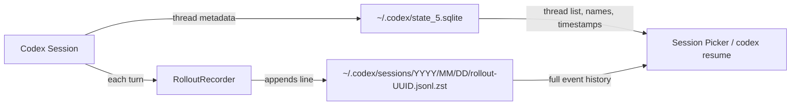
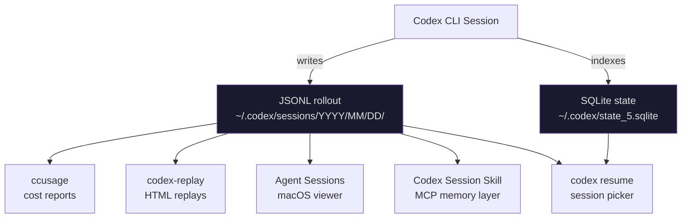

# Codex CLI Session Analytics: Mining the JSONL Rollout Format

**Date:** 2026-03-30
**Tags:** session-analytics, jsonl, rollout-format, ccusage, cost-analysis, observability

Every Codex CLI session leaves a trail. Since September 2025, the CLI has written a complete JSONL transcript of every turn, tool call, approval decision, and token-count event to `~/.codex/sessions/`.[^1] Most developers ignore these files entirely. That's a mistake — they're the richest source of agent observability data you have, and an ecosystem of tools has grown up around them.

This article covers the rollout format in depth: its schema, how token accounting works, and how to build meaningful analytics on top of it — from a simple `jq` one-liner to a full cost dashboard.

## The Persistence Architecture

Codex uses a two-layer persistence system:[^2]



**JSONL rollout files** hold the complete conversation: every user message, every model response, every tool invocation, and every token-count event. They're the source of truth for resumption and forking.[^3]

**SQLite (`state_5.sqlite`)** is a lightweight index: thread IDs, creation times, display names, and working directories. It's what powers the session picker when you run `codex resume`. A known edge case: if transport fails before the first turn completes, the SQLite row and rollout file are never created, so `codex resume` won't find the session even though a session ID was displayed.[^4]

### File Format

Rollout files are zstandard-compressed JSONL (`*.jsonl.zst`). Each line is a `RolloutLine` — a thin envelope around a `RolloutItem`. The five `RolloutItem` variants are:

| Variant | Description |
|---|---|
| `SessionMeta` | First line of every file; session ID, model, start time, git context |
| `UserMessage` | The human turn (prompt text, attached images, sandboxed dir) |
| `ResponseItem` | A model response item: text delta, reasoning, or tool invocation |
| `EventMsg` | Infrastructure events: `token_count`, `rate_limits`, compaction |
| `ApprovalDecision` | Tool approval outcome: approved/denied, source (config vs. user) |

Not all `EventMsg` subtypes are persisted — only those needed for UI replay. `token_count` events are always written because they're the only source of per-turn cost data.[^5]

## Token Accounting

The `token_count` payload uses a cumulative counter, not a per-turn counter:[^6]

```json
{
  "type": "event_msg",
  "payload": {
    "type": "token_count",
    "turn_context": { "model": "gpt-5-codex" },
    "input_tokens": 14823,
    "cached_input_tokens": 9400,
    "output_tokens": 387,
    "reasoning_tokens": 128
  }
}
```

To recover per-turn usage, subtract the previous `token_count` values from the current ones. This is the approach used by `ccusage`:[^7]

```
turn_input     = current.input_tokens     − previous.input_tokens
turn_cached    = current.cached_input_tokens − previous.cached_input_tokens
turn_output    = current.output_tokens    − previous.output_tokens
turn_reasoning = current.reasoning_tokens − previous.reasoning_tokens
```

`turn_context.model` identifies which model was active — essential when a session mixes models (e.g., Spark for drafting, then `gpt-5-codex` for final reasoning).

> ⚠️ Sessions from before September 6, 2025 contain no `token_count` events and cannot be cost-analysed. Some builds from early September 2025 emitted `token_count` without `turn_context`; those entries are skipped by tooling to prevent mispricing.[^8]

## Using ccusage for Cost Reporting

The `@ccusage/codex` package is the easiest way to get daily and monthly cost breakdowns from your rollout files:[^9]

```bash
# One-off runs via npx
npx @ccusage/codex@latest daily
npx @ccusage/codex@latest monthly
npx @ccusage/codex@latest session

# Or install globally
npm install -g @ccusage/codex
codex-usage daily --since 2026-03-01 --until 2026-03-30
```

Sample output from `daily`:

```
Date        Input     Cached    Output    Cost
─────────── ───────── ───────── ───────── ──────
2026-03-28  1.2M tok  890K tok  143K tok  $4.12
2026-03-29    847K     612K      91K      $2.88
2026-03-30    203K     158K      24K      $0.71
```

The `session` subcommand groups by `session_id` — useful for identifying which long-running task burned the most tokens before you had `max_tokens_per_session` configured.

Model aliases like `gpt-5-codex` are resolved to canonical LiteLLM pricing entries automatically. Cached input uses cache-read pricing; uncached input uses standard rates.[^10]

## Querying Rollout Files Directly

For ad-hoc queries, `zstd -d` to decompress then pipe through `jq`. A few practical recipes:

### Tool call frequency

```bash
zstd -d -c ~/.codex/sessions/2026/03/30/rollout-*.jsonl.zst \
  | jq -r 'select(.type=="event_msg") | select(.payload.type=="tool_call") | .payload.tool_name' \
  | sort | uniq -c | sort -rn
```

This reveals which tools your agent reached for most — a leading indicator of runaway shell loops or excessive `read_file` thrashing.

### Approval decisions audit

```bash
zstd -d -c ~/.codex/sessions/**/*.jsonl.zst \
  | jq -r 'select(.type=="approval_decision") | [.payload.tool_name, .payload.outcome, .payload.source] | @tsv'
```

Outputs a TSV of every tool that was approved or denied and whether the decision came from config rules or the human operator. Useful for tightening `smart_approvals` rules after a review.

### Reasoning token share by session

```bash
zstd -d -c ~/.codex/sessions/2026/03/30/rollout-*.jsonl.zst \
  | jq -s '
      [.[] | select(.type=="event_msg" and .payload.type=="token_count")]
      | last
      | (.payload.reasoning_tokens / .payload.output_tokens * 100 | round | tostring) + "% reasoning"'
```

High reasoning-token share (>40%) with low output means the model is doing lots of internal deliberation but not writing much — consider dropping `reasoning_effort` from `xhigh` to `high`.

## Cross-Session Prompt History Recall

Version 0.117.0 (March 26, 2026) added persistent prompt history to the app-server TUI, recalled across sessions via the standard `↑`/`↓` arrow keys.[^11] The history is sourced from the `UserMessage` records in rollout files, giving you access to every prompt you've typed since the CLI was installed — not just the current session.

This makes the rollout archive double as a personal prompt library. Combined with `codex-replay`'s interactive session picker (described below), you can resurface the exact prompt that solved a problem six weeks ago.

## The Third-Party Ecosystem

Several tools have emerged to make rollout files explorable without writing custom `jq`:

### codex-replay

`codex-replay` converts rollout files into self-contained HTML replays:[^12]

```bash
npx codex-replay ~/.codex/sessions/2026/03/30/rollout-abc.jsonl.zst -o replay.html
```

Features include:

- Interactive session picker that scans all local JSONL files and merges by `session_id`
- Filtering by time range (`--from`/`--to`)
- Hiding reasoning steps (`--no-reasoning`) for sharing with non-technical stakeholders
- Theming (`--theme oxide-blue`)
- Bookmarks for annotating key decision points (`--mark`)

Running without arguments opens the picker — each row shows latest activity time, project directory, turn count, and a preview of the first user prompt.

### Agent Sessions (macOS)

A native macOS app that reads the same rollout files, groups sessions by repository and working directory, and provides a searchable history UI with token analytics and git context. Useful when you want a persistent desktop view of agent activity without keeping a browser tab open.[^13]

### Codex History Viewer (VS Code)

A VS Code extension that surfaces session history directly in the sidebar, with search, tagging, and import/export. Fills the gap left by the VS Code Codex extension's lack of a built-in session viewer.[^14]

### Codex Session MCP Skill

An MCP skill that exposes your session history to other agents:[^15]

```toml
# config.toml
[[skills]]
name = "codex-session-history"
source = "mcpmarket/codex-session-history"
```

Lets a Codex session query previous sessions for context — effectively a memory layer built from actual agent history rather than summaries.

## Privacy and the `--ephemeral` Flag

Rollout files contain file paths, prompts, code snippets, and anything pasted into the composer. Never commit `~/.codex/sessions/` to version control.

For sensitive work (client codebases, credential handling), use `--ephemeral` to suppress rollout file creation entirely:[^16]

```bash
codex exec --ephemeral "rotate the staging API keys and update .env.example"
```

The session runs normally but leaves no local trace. Note that `--ephemeral` also disables `codex resume` for that session.

## Schema Drift Monitoring

The rollout format evolves with each release. The **Codex Session Format Check** skill verifies whether a new `codex` version changes the schema in ways that would break tools like Agent Sessions or ccusage:[^17]

```bash
# Run via the skill installer
codex "@codex-session-format-check verify"
```

It compares the live schema against a baseline and outputs a `schema_diff` report. Run this as part of your `codex upgrade` workflow before relying on analytics tooling that parses rollout files directly.

## Architecture Summary



## Practical Guidance

A few rules of thumb from working with rollout data at scale:

1. **Set `max_tokens_per_session`** before your next long-running task. Without it, a single overnight job can produce rollout files exceeding 100MB uncompressed.

2. **Review approval decisions weekly.** The audit query above takes under five seconds and will surface tools that are being approved automatically when they should require human oversight.

3. **Use session cost data to tune model routing.** If `session` mode shows specific task types consistently burning 10× the expected tokens, that's a signal to add a profile with lower `reasoning_effort` or route to Spark.

4. **Don't rely on rollout files as a backup system.** The `.jsonl.zst` format is append-only and can be corrupted if the process is killed mid-write. Use `codex resume --last` to verify a session is readable before treating it as authoritative.

## Citations

[^1]: Token count events have been emitted since commit `0269096` on September 6, 2025 — [ccusage Codex guide, "Limitations" section](https://ccusage.com/guide/codex/)
[^2]: Dual-layer persistence (JSONL + SQLite) — [DeepWiki: Codex Session Management and Persistence](https://deepwiki.com/openai/codex/3.3-session-management-and-persistence)
[^3]: Rollout files as source of truth for resume and fork — [DeepWiki: Codex Session Management and Persistence](https://deepwiki.com/openai/codex/3.3-session-management-and-persistence)
[^4]: SQLite/rollout not created on early transport failure — [GitHub Issue #15870: Codex can print a session ID but fail to persist](https://github.com/openai/codex/issues/15870)
[^5]: `RolloutItem` variants and persistence policy — [DeepWiki: Codex Session Management and Persistence](https://deepwiki.com/openai/codex/3.3-session-management-and-persistence)
[^6]: `token_count` cumulative counter schema — [ccusage Codex guide, "Data Processing" section](https://ccusage.com/guide/codex/)
[^7]: Delta calculation for per-turn usage — [ccusage Codex guide](https://ccusage.com/guide/codex/)
[^8]: Pre-September 2025 sessions lack `token_count`; early September builds missing `turn_context` — [ccusage Codex guide, "Limitations"](https://ccusage.com/guide/codex/)
[^9]: `@ccusage/codex` package — [GitHub: ryoppippi/ccusage](https://github.com/ryoppippi/ccusage)
[^10]: Model alias resolution and pricing formula — [ccusage Codex guide](https://ccusage.com/guide/codex/)
[^11]: Cross-session prompt history recall added in v0.117.0 — [Codex CLI v0.117.0 release notes](https://github.com/openai/codex/releases) and [OpenAI Codex Changelog](https://developers.openai.com/codex/changelog)
[^12]: `codex-replay` features and usage — [GitHub: zpdldhkdl/codex-replay](https://github.com/zpdldhkdl/codex-replay)
[^13]: Agent Sessions macOS app — described in search results from [Codex CLI session history search](https://github.com/openai/codex/discussions/3827)
[^14]: Codex History Viewer VS Code extension — [Visual Studio Marketplace: codex-history-viewer](https://marketplace.visualstudio.com/items?itemName=hiztam.codex-history-viewer)
[^15]: Codex Session History MCP skill — [MCP Market: codex-session-history](https://mcpmarket.com/tools/skills/codex-session-history-manager)
[^16]: `--ephemeral` flag — [OpenAI Codex non-interactive mode docs](https://developers.openai.com/codex/noninteractive)
[^17]: Codex Session Format Check skill — [LobeHub: codex-session-format-check](https://lobehub.com/skills/jazzyalex-agent-sessions-codex-session-format-check)
