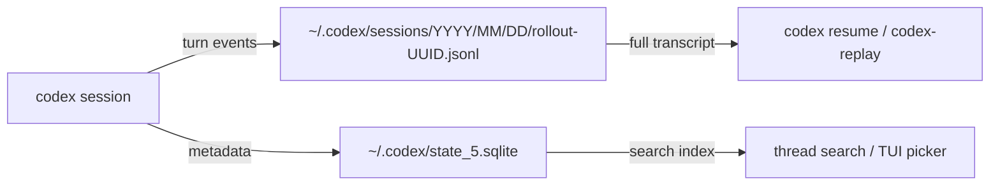
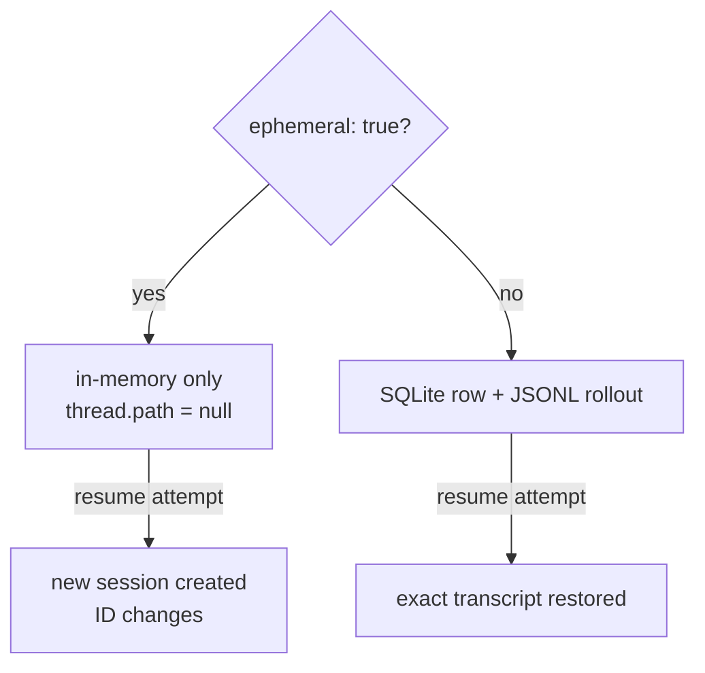

# Codex CLI Thread Search and Session Management: Finding, Archiving and Replaying Work


Codex CLI v0.117.0, released on 26 March 2026, promoted thread management from a hidden superpower to a first-class workflow.[^1] The headline features — searchable thread history with a sidebar shortcut, one-click archiving of all local threads, and synced settings between the desktop app and VS Code extension — sit on top of a robust persistence layer that most developers have never fully explored. This article maps that entire surface: storage internals, the CLI resume/fork commands, the app-server thread API, ephemeral sessions, and the third-party replay ecosystem.

## How Codex Stores Sessions

Every non-ephemeral Codex session produces two independent artefacts:[^2]

1. **A row in `~/.codex/state_5.sqlite`** — thread metadata: ID, title, model, working directory, creation and update timestamps, and archive status.
2. **A JSONL rollout file under `~/.codex/sessions/`** — the full transcript, structured by year/month/day: `~/.codex/sessions/2026/03/30/rollout-2026-03-30T14-22-07-<uuid>.jsonl`.

Both must exist for `codex resume` to work cleanly. A known edge case (issue #15870) shows that a transport failure early in a session can cause Codex to surface a session ID before either artefact is written, leaving a dangling reference.[^3] The JSONL file is the authoritative transcript; the SQLite row is the search index.



## Interactive Resume and Fork

The core CLI verbs for cross-session continuity are `codex resume` and `codex fork`.[^4]

```bash
# Interactive picker — shows recent sessions from cwd
codex resume

# Skip the picker; jump straight to the most recent session
codex resume --last

# Include sessions from any working directory
codex resume --all

# Target a specific session by UUID
codex resume <SESSION_ID>
```

`codex fork` branches the current transcript into a new thread ID, leaving the original intact — useful for exploring risky refactors or comparing two approaches against the same context:[^4]

```bash
codex fork --last          # fork most recent session
codex fork <SESSION_ID>    # fork a specific session
```

Inside the TUI, `/resume` opens the same interactive picker with inline search, and `/fork` branches in-session without exiting.

### Non-Interactive Automation

`codex exec resume` enables scripted pipelines to continue the last session without human interaction:[^4]

```bash
codex exec resume --last "Run the full test suite and summarise failures"
codex exec resume --all --json "What did we change in the auth module today?" \
  | jq '.content'
```

The `--json` flag emits a newline-delimited JSON event stream (`thread.started → turn.started → item.completed → turn.completed`), making these sessions trivially parseable in CI.[^5]

## Thread Search in v0.117.0

The v0.117.0 release added full-text thread search to the Codex desktop app: a sidebar shortcut surfaces the search pane, and keyboard shortcuts let you jump to recent threads without touching a mouse.[^1] Search filters against the SQLite metadata layer — thread titles, model, source kind (interactive/exec/realtime), working directory, and archive status — with cursor-based pagination for large histories.

The same search capability is exposed programmatically via the app-server's `thread/list` endpoint:[^6]

```json
{
  "method": "thread/list",
  "params": {
    "searchTerm": "auth module",
    "cwd": "/workspace/my-project",
    "archived": false,
    "sortKey": "updated_at",
    "limit": 20
  }
}
```

Valid `sortKey` values are `created_at` (default, newest first) and `updated_at`. The response includes an opaque cursor token for pagination.

## Archiving Threads

The one-click **Archive All Local Threads** feature in v0.117.0 moves every JSONL rollout for a project into an archived sub-directory, suppressing them from default `thread/list` results.[^1] This keeps the active thread list clean without deleting history.

Programmatically, the same operation is available via the app-server:[^6]

```json
{ "method": "thread/archive", "params": { "threadId": "abc-123" } }
{ "method": "thread/unarchive", "params": { "threadId": "abc-123" } }
```

To query archived threads explicitly, pass `"archived": true` to `thread/list`.

A practical pattern for project hygiene:

```bash
# Name a thread before archiving so it's findable later
# (via thread/name/set or the /title slash command in-session)
# Then bulk-archive via the UI sidebar at sprint close
```

## Ephemeral Sessions

When privacy or a clean slate matters more than persistence, `--ephemeral` on `codex exec` prevents both the SQLite row and the JSONL file from being written:[^4]

```bash
codex exec --ephemeral "Summarise the contents of ./secrets.env"
```

At the app-server level, `thread/start` and `thread/fork` accept `ephemeral: true`. When a thread is ephemeral, the server sets `thread.path` to `null` and `thread.ephemeral` to `true` in all responses. Attempting to resume an ephemeral session silently creates a fresh session rather than erroring — the ID changes, confirming no state was persisted.[^7]



## Session Continuity Patterns

For long-running agentic work, a few patterns prevent context drift across sessions:

**Checkpoint before exit.** Before closing a session, ask Codex for a recap and next-steps list. When you resume, open with "Continue from your last checkpoint" — the full history is available, but the abbreviated summary keeps the first turn focused.

**Use `/compact` proactively.** The `/compact` slash command triggers asynchronous context compaction, summarising earlier turns in place. Codex can sustain sessions up to seven hours by auto-compacting when approaching context limits.[^8] For multi-day tasks, compact before archiving so the resumed session starts with a dense summary rather than a raw transcript.

**Keep threads project-scoped.** Sessions stored in `~/.codex/state_5.sqlite` include the working directory. The `--all` flag on resume/fork ignores this filter; without it, `codex resume` only surfaces sessions from the current directory. Running `codex resume` from the project root is therefore a useful habit — you see only relevant sessions without the noise of unrelated work.

**Name threads immediately.** The `/title` slash command and the `thread/name/set` app-server RPC assign human-readable names that appear in the sidebar and the `codex resume` picker. Unnamed threads show only their UUID and the first user prompt, making large thread lists hard to scan.[^6]

## Replaying Sessions

The JSONL rollout format has spawned a growing ecosystem of visualisation tools.

**[codex-replay](https://github.com/zpdldhkdl/codex-replay)** renders a single rollout file to a self-contained HTML page:[^9]

```bash
codex-replay ~/.codex/sessions/2026/03/30/rollout-abc.jsonl -o replay.html \
  --mark "1:Kickoff" --mark "2:Auth fix" \
  --hide-reasoning
```

The interactive TTY picker (`codex-replay --pick`) scans `~/.codex/sessions/`, displaying cwd, turn count, session kind, and a preview of the first user prompt.

**[Agent Sessions](https://github.com/jazzyalex/agent-sessions)** is a native macOS app that supports Codex CLI alongside Claude Code, Gemini CLI, and others — providing a unified session browser, archive/resume actions, and real-time rate limit monitoring.[^10]

**[Codex History Viewer](https://marketplace.visualstudio.com/items?itemName=hiztam.codex-history-viewer)** brings the same functionality into VS Code as an extension with browse, search, tag, and import/export support.[^11]

## Summary

The v0.117.0 thread search release crystallises a session management model that has been maturing since the Rust rewrite. The key primitives are stable: dual persistence in SQLite and JSONL, `codex resume` / `codex fork` for interactive continuity, `codex exec resume` for scripted pipelines, `--ephemeral` for throwaway runs, and a rich app-server API for tooling integrations. Thread search in the sidebar and bulk archiving make the model ergonomic at scale. The third-party ecosystem — codex-replay, Agent Sessions, CodexMonitor — fills the visualisation and analytics gap while native tooling matures.

## Citations

[^1]: [Codex v0.117.0 Release Notes — OpenAI Codex Changelog](https://developers.openai.com/codex/changelog) — "Added search for past Codex app threads, including a sidebar shortcut and keyboard shortcuts for jumping to recent threads; added one-click option to archive all local threads in a project." (2026-03-26)
[^2]: [Codex CLI Session Persistence — Issue #15870: state_5.sqlite and rollout JSONL dual artefacts](https://github.com/openai/codex/issues/15870)
[^3]: [Codex can print a session ID but fail to persist any resumable local session artifacts after early transport failure — Issue #15870](https://github.com/openai/codex/issues/15870)
[^4]: [Codex CLI Command Line Reference — codex resume, codex fork, codex exec, --ephemeral](https://developers.openai.com/codex/cli/reference)
[^5]: [Codex CLI exec --json JSONL event stream format](https://developers.openai.com/codex/cli/reference)
[^6]: [Codex App Server README — thread/list, thread/archive, thread/name/set, thread/search](https://developers.openai.com/codex/app-server)
[^7]: [Codex CLI exec mode experiments — ephemeral flag behaviour](https://gist.github.com/alexfazio/359c17d84cb6a5af12bac88fa1db9770)
[^8]: [Codex CLI Features — /compact and automatic context compaction](https://developers.openai.com/codex/cli/features)
[^9]: [codex-replay — Turn Codex JSONL sessions into self-contained HTML replays](https://github.com/zpdldhkdl/codex-replay)
[^10]: [Agent Sessions — macOS session browser for Codex CLI, Claude Code, Gemini CLI and more](https://github.com/jazzyalex/agent-sessions)
[^11]: [Codex History Viewer — VS Code extension for browsing and managing Codex CLI session history](https://marketplace.visualstudio.com/items?itemName=hiztam.codex-history-viewer)
