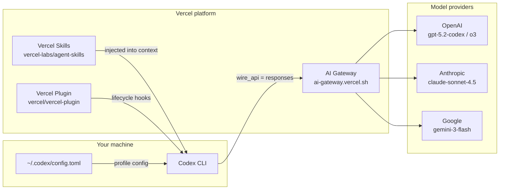
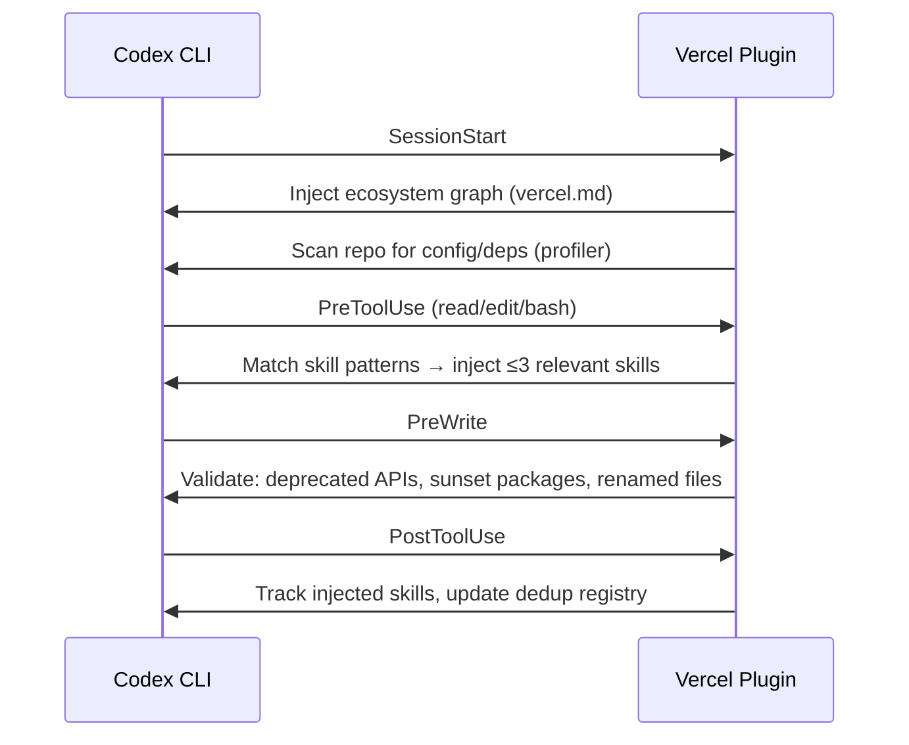

# Codex CLI and Vercel: AI Gateway, Skills and the Vercel Plugin Ecosystem


Vercel's investment in AI coding agents reached critical mass in March 2026 with two distinct — but complementary — integration surfaces for Codex CLI teams: the **Vercel AI Gateway** (a unified proxy that routes your Codex requests through any supported model provider) and the **Vercel Plugin** (a knowledge-dense bundle of 38 skills, three specialist agents, and a set of slash commands for Vercel platform work).[^1][^2] This article covers both paths, when to reach for each, and how to wire them together in a production-grade `config.toml`.

## The Two Integration Paths



**Vercel AI Gateway** is a network-layer proxy: your Codex CLI connects to `https://ai-gateway.vercel.sh/v1` instead of directly to OpenAI. You gain unified billing, traffic monitoring, spend dashboards, and the ability to swap models from a single profile flip — without touching your agent prompts.[^1]

**Vercel Skills / Plugin** is a context-layer enhancement: it injects Vercel platform knowledge into your agent at the right moment — when you edit a `next.config.ts`, run `vercel deploy`, or import from `@ai-sdk/react`.[^3] The skills run as lifecycle hooks inside the agent, not as a network proxy.

You can use one without the other. For most Vercel-focused teams, using both gives you model flexibility *and* deep platform expertise.

---

## Vercel AI Gateway: Routing Codex Through Multiple Providers

### Why Route Through the Gateway?

Direct API keys hard-wire you to one provider at `wire_api` format. The Gateway gives you:

- **Multi-provider routing** — switch between `openai/gpt-5.2-codex`, `anthropic/claude-sonnet-4.5`, `google/gemini-3-flash`, and 100+ other models by changing one config line[^1]
- **Centralised cost tracking** — per-team, per-project spend visible in the Vercel dashboard under *AI Gateway Overview*
- **OpenTelemetry traces** — every Codex request appears in *Vercel Observability → AI* with token counts, latency, and tool-call breakdowns
- **Failover policies** — route to a backup model if the primary is rate-limited or unavailable

### Configuration

Generate an AI Gateway API key at `vercel.com/[team]/~/ai-gateway`, then configure Codex:

```bash
export AI_GATEWAY_API_KEY="vgw_..."
```

```toml
# ~/.codex/config.toml

[model_providers.vercel]
name    = "Vercel AI Gateway"
base_url = "https://ai-gateway.vercel.sh/v1"
env_key  = "AI_GATEWAY_API_KEY"
wire_api = "responses"   # OpenAI Responses API format

# Default profile: gpt-5.2-codex through the gateway
[profiles.vercel]
model_provider = "vercel"
model          = "openai/gpt-5.2-codex"

# Fast profile: lightweight tasks
[profiles.fast]
model_provider = "vercel"
model          = "openai/gpt-4o-mini"

# Reasoning profile: complex design tasks
[profiles.reasoning]
model_provider = "vercel"
model          = "openai/o3"

# Cross-model review: use a different vendor for adversarial critique
[profiles.claude]
model_provider = "vercel"
model          = "anthropic/claude-sonnet-4.5"
```

Invoke with `codex --profile vercel` for standard work and `codex --profile claude` when you want a cross-model review pass.[^1] The `wire_api = "responses"` key is required; it tells Codex to use the OpenAI Responses API wire format, which the Gateway forwards to whichever provider you target — including non-OpenAI backends.[^1]

> ⚠️ Non-OpenAI models through the Gateway may produce metadata-not-found warnings at startup; these are cosmetic and do not affect functionality.

---

## Vercel Skills: Platform Knowledge in Your Agent Context

### How Skills Work

Skills are lazy-loaded Markdown files that the agent ingests on demand. The Vercel skills library (`vercel-labs/agent-skills`) provides deep-dive guidance for every major Vercel product, activated automatically when glob patterns, import statements, or bash regexes match what you're working on.[^3]

For agents that do not yet support the full plugin system (see below), `npx skills` is the recommended path:

```bash
npx skills add vercel-labs/agent-skills
```

This installs to `.codex/skills/` (or your agent-specific skills directory) and writes a skills lock file with exact GitHub tree SHAs for reproducible environments.[^4]

Highlights from the library relevant to Codex CLI teams:

| Skill | Fires when |
|---|---|
| `nextjs` | Editing `next.config.ts`, app-router files, RSC imports |
| `ai-sdk` | Importing `useChat`, `streamText`, `generateText` from `@ai-sdk/*` |
| `vercel-functions` | Working in `/api` routes, Edge functions, Cron Jobs |
| `turborepo` | Editing `turbo.json`, running `turbo build` |
| `vercel-sandbox` | Referencing Firecracker microVMs or untrusted code execution |
| `workflow` | Using Workflow DevKit, `DurableAgent`, or step-based execution |
| `investigation-mode` | Triggered on debugging prompts; orchestrates logs → browser verify → triage |

The injection engine deduplicates across the session — a skill already loaded in turn 3 is not re-injected in turn 12 — keeping your context window lean.[^3]

---

## The Vercel Plugin: Full-Stack Agent Enhancement

### Scope

The Vercel Plugin (`vercel/vercel-plugin`) is a superset of the skills library, bundling 38 skills, three specialist agents, five slash commands, and automated lifecycle hooks into a single installable unit.[^3] It launched on 17 March 2026 with Claude Code and Cursor support; Codex CLI support was extended in the March 26 update.[^5]

### Installation

```bash
# For Codex CLI (plugin system)
npx plugins add vercel/vercel-plugin

# Alternative: skills-only path (all agent types)
npx skills add vercel-labs/agent-skills
```

### Lifecycle Hooks

The plugin operates across seven lifecycle stages inside the agent loop:[^3]



The **session-start ecosystem graph** injection is the most impactful: every session begins with `vercel.md`, a text-form relational graph covering all Vercel products, their relationships, decision matrices, and migration awareness for sunset APIs.[^3] This is loaded once and does not count against per-tool-call injection limits.

### Specialist Agents

The three bundled specialist agents are invocable via your agent's delegation syntax:[^3]

| Agent | Expertise |
|---|---|
| `deployment-expert` | CI/CD pipelines, deploy strategies, environment variables, rollbacks |
| `performance-optimizer` | Core Web Vitals, rendering strategies, caching, asset optimisation |
| `ai-architect` | AI application design, model selection, streaming architecture, MCP integration |

In a Codex multi-agent workflow, delegate to these agents using the standard TOML subagent syntax:

```toml
[[spawn_agents]]
id   = "perf"
role = "deployment-expert"
task = "Analyse the current deploy pipeline and identify any caching misconfigurations"
```

### Slash Commands

Five slash commands are available directly in your session:[^3]

| Command | Purpose |
|---|---|
| `/vercel-plugin:bootstrap` | Link project, provision env vars, set up database |
| `/vercel-plugin:deploy` | Deploy preview; add `prod` for production |
| `/vercel-plugin:env` | List, pull, add, diff environment variables |
| `/vercel-plugin:status` | Project status, recent deployments, environment overview |
| `/vercel-plugin:marketplace` | Discover and install Vercel Marketplace integrations |

### Debugging

```bash
# Verbose skill injection logs
export VERCEL_PLUGIN_LOG_LEVEL=debug   # summary | debug | trace

# Self-diagnosis: manifest parity, hook timeouts, dedup health
npx vercel-plugin doctor
```

---

## Combining Both Integrations

The Gateway and the Plugin are orthogonal layers. A production `config.toml` for a Vercel team might look like:

```toml
[model_providers.vercel]
name     = "Vercel AI Gateway"
base_url = "https://ai-gateway.vercel.sh/v1"
env_key  = "AI_GATEWAY_API_KEY"
wire_api = "responses"

[profiles.default]
model_provider = "vercel"
model          = "openai/gpt-5.2-codex"

[profiles.review]
model_provider = "vercel"
model          = "anthropic/claude-sonnet-4.5"

[features]
multi_agent = true
```

Run with `codex --profile default` for day-to-day development; switch to `--profile review` for adversarial cross-model critique of your own agent's output. The Vercel Plugin skills inject platform knowledge regardless of which model is active behind the gateway.

### When to Use Skills-Only vs. Full Plugin

| Scenario | Recommended path |
|---|---|
| Team uses Claude Code + Codex side-by-side | Plugin on Claude Code; skills-only on Codex |
| Codex-first team on Vercel | Full plugin via `npx plugins add` |
| Read-only CI pipeline (`codex exec`) | Skills-only; plugins add unnecessary session overhead |
| Debugging unexpected injection behaviour | Plugin + `VERCEL_PLUGIN_LOG_LEVEL=trace` |

---

## Summary

Two distinct integration points serve different problems. The **Vercel AI Gateway** solves model routing, cost visibility, and provider redundancy at the network layer — configure once in `config.toml` and forget. The **Vercel Plugin** solves context quality at the agent layer — 38 skills injected on demand, three specialist agents for deep platform work, and pre-write validation that catches deprecated APIs before they ship. For Vercel-focused teams running Codex CLI at scale, both layers together give you the flexibility of multi-provider routing with the platform expertise of a specialist Vercel engineer in every session.

---

## Citations

[^1]: Vercel Docs — "OpenAI Codex" (AI Gateway configuration): <https://vercel.com/docs/agent-resources/coding-agents/openai-codex>
[^2]: Vercel Changelog — "Vercel plugin now supported on OpenAI Codex and Codex CLI" (March 26, 2026): <https://vercel.com/changelog/vercel-plugin-openai-codex-and-codex-cli-support>
[^3]: Vercel Docs — "Vercel Plugin for AI Coding Agents" (skills, agents, hooks): <https://vercel.com/docs/agent-resources/vercel-plugin>
[^4]: vercel-labs/skills GitHub repository — skills package manager: <https://github.com/vercel-labs/skills>
[^5]: Vercel Changelog — "Introducing the Vercel plugin for coding agents" (March 17, 2026 original launch): <https://vercel.com/changelog/introducing-vercel-plugin-for-coding-agents>
