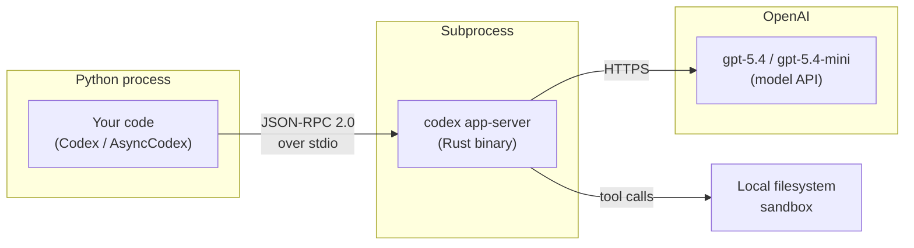
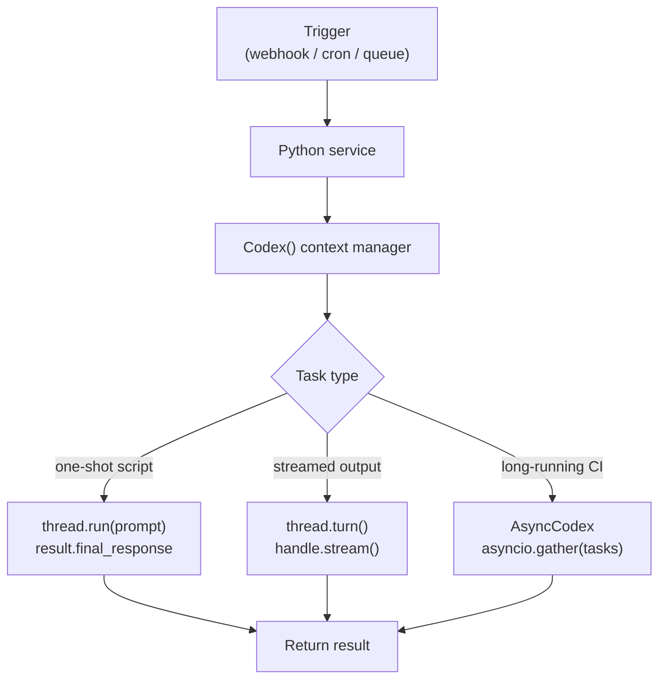

# The Codex Python SDK: Embedding Agents in Python Applications


## Overview

The Codex CLI ships with an official Python SDK — `codex_app_server` — that lets you drive the agent programmatically from Python scripts, pipelines, and applications.[^1] It wraps the `codex app-server` process over JSON-RPC 2.0, exposing a clean, typed surface with synchronous and asynchronous variants. Version 0.2.0 requires Python ≥ 3.10 and bundles the platform-specific CLI binary via `codex-cli-bin`.[^2]

This is the right layer when you need:

- Background automation that invokes Codex without a terminal
- Multi-step pipelines where you steer the agent mid-turn
- Structured output schemas extracted from agent results
- Async fan-out over many threads in parallel
- Integration with FastAPI, Celery, or other Python service stacks

If the interactive TUI is the cockpit, the Python SDK is the autopilot API.

---

## Architecture

The SDK does not call the OpenAI REST API directly. Instead, it starts `codex app-server` as a subprocess and communicates over its JSON-RPC 2.0 protocol.[^3] Your Python code becomes the client; the Codex binary is the server.



This means the SDK inherits all sandbox policies, domain allowlists, and approval configurations from your `codex.toml`.[^4] Nothing in the SDK bypasses the security model — it is simply a typed client for a protocol the CLI was already speaking.

---

## Installation

### From PyPI (published builds)

```bash
pip install codex-app-server-sdk
```

Published wheels bundle the matching `codex-cli-bin` runtime package, which carries the platform binary. No separate CLI installation is required.[^5]

### From source (development)

```bash
git clone https://github.com/openai/codex.git
cd codex/sdk/python
python -m pip install -e .
```

For local development against a custom-built binary, pass the path explicitly via `AppServerConfig`:

```python
from codex_app_server import Codex, AppServerConfig

config = AppServerConfig(codex_bin="/usr/local/bin/codex-dev")
with Codex(config=config) as codex:
    ...
```

---

## Core Concepts

### Codex and AsyncCodex

`Codex` is the synchronous entry point; `AsyncCodex` is the async mirror with an identical public shape.[^6] Both are context managers that handle subprocess startup and shutdown.

`Codex()` is **eager** — it starts the subprocess and performs the `initialize` handshake in `__init__`. Always use a context manager to guarantee clean shutdown:

```python
# Correct — subprocess is cleaned up on exit
with Codex() as codex:
    ...

# Avoid — close() may not be called on error
codex = Codex()
```

### Threads and Turns

The SDK exposes the same primitives as the app-server protocol:[^7]

| Primitive | Description |
|-----------|-------------|
| **Thread** | A persistent conversation. Survives process restarts; resumed by ID. |
| **Turn** | One request/response cycle within a thread. Unit of interruption. |
| **Item** | An atomic output within a turn: message delta, command, file edit, reasoning note. |

Create a new thread with `thread_start()`. Pick a model and set reasoning effort here:

```python
thread = codex.thread_start(
    model="gpt-5.4",
    config={"model_reasoning_effort": "high"},
)
```

### run() vs turn()

`thread.run()` is the high-level convenience method. It blocks until the turn completes and returns a `RunResult`:[^8]

```python
result = thread.run("Add docstrings to every public function in src/utils.py")
print(result.final_response)   # final assistant message, or None
print(len(result.items))       # total items emitted during the turn
```

`thread.turn()` is the low-level method. It returns a `TurnHandle` that you can stream, steer, or interrupt:[^9]

```python
handle = thread.turn(input="Refactor this class for better cohesion.")
for notification in handle.stream():
    if notification.method == "item/agentMessage/delta":
        print(notification.params["delta"], end="", flush=True)
```

Use `run()` for background scripts and pipelines. Use `turn()` when you need live progress output, mid-turn steering, or timeout handling.

---

## Quickstart

```python
from codex_app_server import Codex

with Codex() as codex:
    thread = codex.thread_start(model="gpt-5.4")
    result = thread.run("Explain Rust's borrow checker in three bullets.")
    print(result.final_response)
```

The `final_response` field returns `None` when the turn completes without a final-answer message — common when Codex executes commands but produces no assistant text.[^10]

---

## Multi-Turn Conversations

Call `run()` repeatedly on the same thread object. Context is maintained automatically:

```python
with Codex() as codex:
    thread = codex.thread_start(model="gpt-5.4")

    thread.run("Write a Python function that validates an ISO 8601 date string.")
    thread.run("Now add property-based tests using Hypothesis.")
    result = thread.run("Run the tests and fix any failures.")
    print(result.final_response)
```

Each call is a separate turn; the thread accumulates history between them. Codex uses prior turns for context when handling subsequent requests.[^11]

---

## Resuming Existing Threads

Reconnect to a previous session using its thread ID. The ID is stable across process restarts:

```python
with Codex() as codex:
    thread = codex.thread_resume("thr_abc123")
    result = thread.run("What did you change in the last turn?")
    print(result.final_response)
```

List all available threads:

```python
threads = codex.thread_list()
for t in threads:
    print(t.id, t.name, t.created_at)
```

---

## Streaming

For interactive progress, stream notifications from `TurnHandle`:

```python
from codex_app_server import Codex

with Codex() as codex:
    thread = codex.thread_start(model="gpt-5.4")
    handle = thread.turn("Summarise the AGENTS.md in this repo.")

    for notification in handle.stream():
        method = notification.method
        if method == "item/agentMessage/delta":
            print(notification.params.get("delta", ""), end="", flush=True)
        elif method == "turn/completed":
            print(f"\n[done — status: {notification.params.get('status')}]")
            break
```

`stream()` and `run()` are mutually exclusive per `TurnHandle` instance. Choose one per turn.[^12]

---

## Async Patterns

`AsyncCodex` provides identical methods returning coroutines. Prefer it inside FastAPI handlers, async workers, or when driving multiple threads concurrently:

```python
import asyncio
from codex_app_server import AsyncCodex

async def review_file(path: str) -> str:
    async with AsyncCodex() as codex:
        thread = await codex.thread_start(model="gpt-5.4-mini")
        result = await thread.run(f"Review {path} for obvious bugs. Return a JSON list.")
        return result.final_response or ""

async def batch_review(paths: list[str]) -> list[str]:
    return await asyncio.gather(*(review_file(p) for p in paths))
```

`AsyncCodex` initialises lazily — the transport is opened on `async with` entry or the first awaited call.[^13]

---

## Structured Output

Pass `output_schema` to constrain the response to a JSON schema. Codex instructs the model to return a structured object matching the schema:

```python
schema = {
    "type": "object",
    "properties": {
        "issues": {
            "type": "array",
            "items": {
                "type": "object",
                "properties": {
                    "file": {"type": "string"},
                    "line": {"type": "integer"},
                    "severity": {"type": "string"},
                    "message": {"type": "string"},
                },
                "required": ["file", "severity", "message"],
            },
        }
    },
    "required": ["issues"],
}

result = thread.run(
    "Audit the src/ directory for security issues.",
    output_schema=schema,
)
import json
issues = json.loads(result.final_response or "[]")
```

Note: `output_schema` is passed as a `turn()` parameter. The public API uses snake_case throughout; camelCase keys are handled internally.[^14]

---

## Error Handling and Retries

The SDK defines a hierarchy of typed exceptions:[^15]

| Exception | When it fires |
|-----------|---------------|
| `ServerBusyError` | Transient overload — safe to retry |
| `JsonRpcError` | Base class for all RPC errors |
| `MethodNotFoundError` | SDK/server version mismatch |
| `InvalidParamsError` | Bad input — fix the call, don't retry |

Use `retry_on_overload` for backoff on transient failures:

```python
from codex_app_server import Codex
from codex_app_server.retry import retry_on_overload

@retry_on_overload(max_attempts=5, base_delay=1.0)
def run_with_retry(thread, prompt: str):
    return thread.run(prompt)

with Codex() as codex:
    thread = codex.thread_start(model="gpt-5.4")
    result = run_with_retry(thread, "Generate a migration plan for moving to PostgreSQL.")
    print(result.final_response)
```

Never retry `InvalidParamsError` or `MethodNotFoundError` in a loop — these require fixing the call or updating the SDK.[^16]

---

## Approval Policies and Sandbox Configuration

Pass sandbox and approval policies when starting a turn. All public kwargs are snake_case:

```python
result = thread.run(
    "Run the full test suite and fix any failures.",
    approval_policy="auto",          # or "suggest", "full-auto"
    sandbox_policy="workspace-only", # confine file access to cwd
    developer_instructions="Use uv run pytest. Never modify pyproject.toml.",
)
```

In CI contexts, set `approval_policy="full-auto"` so the agent never blocks on approval prompts. The `developer_instructions` key is injected as a system-level constraint on the turn.[^17]

---

## Deployment Patterns



### CI integration example

```python
# review_pr.py — called from GitHub Actions
import sys
from codex_app_server import Codex

def main(pr_diff_path: str) -> int:
    diff = open(pr_diff_path).read()
    with Codex() as codex:
        thread = codex.thread_start(
            model="gpt-5.4-mini",
            config={"model_reasoning_effort": "medium"},
        )
        result = thread.run(
            f"Review this PR diff and return a JSON array of issues:\n\n{diff}",
            approval_policy="full-auto",
        )
    print(result.final_response)
    return 0

if __name__ == "__main__":
    sys.exit(main(sys.argv[1]))
```

---

## Common Pitfalls

**Creating a new thread per prompt.** Threads maintain history — re-use them for multi-turn tasks. Only call `thread_start()` for genuinely new conversations.

**Not using context managers.** `Codex()` starts a subprocess in `__init__`. Skipping `with` means the process may outlive your script.

**Retrying `InvalidParamsError`.** This is a programming error, not a transient failure. Log it and fix the call.

**Mixing `run()` and `stream()` on the same handle.** They are mutually exclusive. `stream()` and `run()` share the same underlying event consumer.[^18]

**Passing camelCase kwargs.** The public API is strictly snake_case (`output_schema`, not `outputSchema`). Passing camelCase silently produces `InvalidParamsError` in some server versions.[^19]

---

## Summary

| Use case | API |
|----------|-----|
| One-shot script | `Codex()` + `thread.run()` |
| Live progress in terminal | `Codex()` + `thread.turn()` + `handle.stream()` |
| FastAPI / async service | `AsyncCodex()` + `await thread.run()` |
| Concurrent file reviews | `AsyncCodex()` + `asyncio.gather()` |
| CI pipeline | `Codex()` + `approval_policy="full-auto"` |
| Structured data extraction | `thread.run()` + `output_schema=…` |

The Python SDK is still marked experimental in places, but it is stable enough for production automation — it is the same protocol layer the Codex web app and VS Code extension rely on.[^20] The API surface is intentionally narrow: understand `thread.run()`, know when to reach for `thread.turn()`, and handle `ServerBusyError` with backoff. That covers 95% of real use cases.

---

## Citations

[^1]: Codex Python SDK source — [github.com/openai/codex/tree/main/sdk/python](https://github.com/openai/codex/tree/main/sdk/python)

[^2]: SDK version and Python requirements — [sdk/python/README.md](https://github.com/openai/codex/blob/main/sdk/python/README.md)

[^3]: App-server architecture overview — [developers.openai.com/codex/app-server](https://developers.openai.com/codex/app-server)

[^4]: Codex app-server README — [codex-rs/app-server/README.md](https://github.com/openai/codex/blob/main/codex-rs/app-server/README.md)

[^5]: Published PyPI package — [libraries.io/pypi/codex-app-server-sdk](https://libraries.io/pypi/codex-app-server-sdk)

[^6]: `Codex` and `AsyncCodex` class reference — [sdk/python/docs/api-reference.md](https://github.com/openai/codex/blob/main/sdk/python/docs/api-reference.md)

[^7]: Thread/Turn/Item model — [developers.openai.com/codex/app-server](https://developers.openai.com/codex/app-server)

[^8]: `thread.run()` API — [sdk/python/docs/faq.md](https://github.com/openai/codex/blob/main/sdk/python/docs/faq.md)

[^9]: `thread.turn()` API — [sdk/python/docs/faq.md](https://github.com/openai/codex/blob/main/sdk/python/docs/faq.md)

[^10]: `final_response` behaviour — [sdk/python/docs/getting-started.md](https://github.com/openai/codex/blob/main/sdk/python/docs/getting-started.md)

[^11]: Multi-turn conversation pattern — [sdk/python/examples/README.md](https://github.com/openai/codex/blob/main/sdk/python/examples/README.md)

[^12]: `stream()` and `run()` exclusivity — [sdk/python/docs/api-reference.md](https://github.com/openai/codex/blob/main/sdk/python/docs/api-reference.md)

[^13]: `AsyncCodex` lazy init — [sdk/python/docs/faq.md](https://github.com/openai/codex/blob/main/sdk/python/docs/faq.md)

[^14]: Structured output and snake_case kwargs — [sdk/python/docs/faq.md](https://github.com/openai/codex/blob/main/sdk/python/docs/faq.md)

[^15]: Exception hierarchy — [sdk/python/docs/api-reference.md](https://github.com/openai/codex/blob/main/sdk/python/docs/api-reference.md)

[^16]: Error handling guidance — [sdk/python/docs/faq.md](https://github.com/openai/codex/blob/main/sdk/python/docs/faq.md)

[^17]: Approval and sandbox policies — [developers.openai.com/codex/cli/features](https://developers.openai.com/codex/cli/features)

[^18]: `stream()`/`run()` mutual exclusivity — [sdk/python/docs/api-reference.md](https://github.com/openai/codex/blob/main/sdk/python/docs/api-reference.md)

[^19]: snake_case migration guide — [sdk/python/docs/faq.md](https://github.com/openai/codex/blob/main/sdk/python/docs/faq.md)

[^20]: App-server as shared infrastructure — [developers.openai.com/codex/app-server](https://developers.openai.com/codex/app-server)
