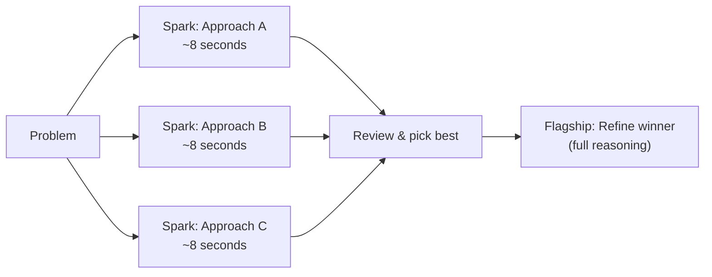
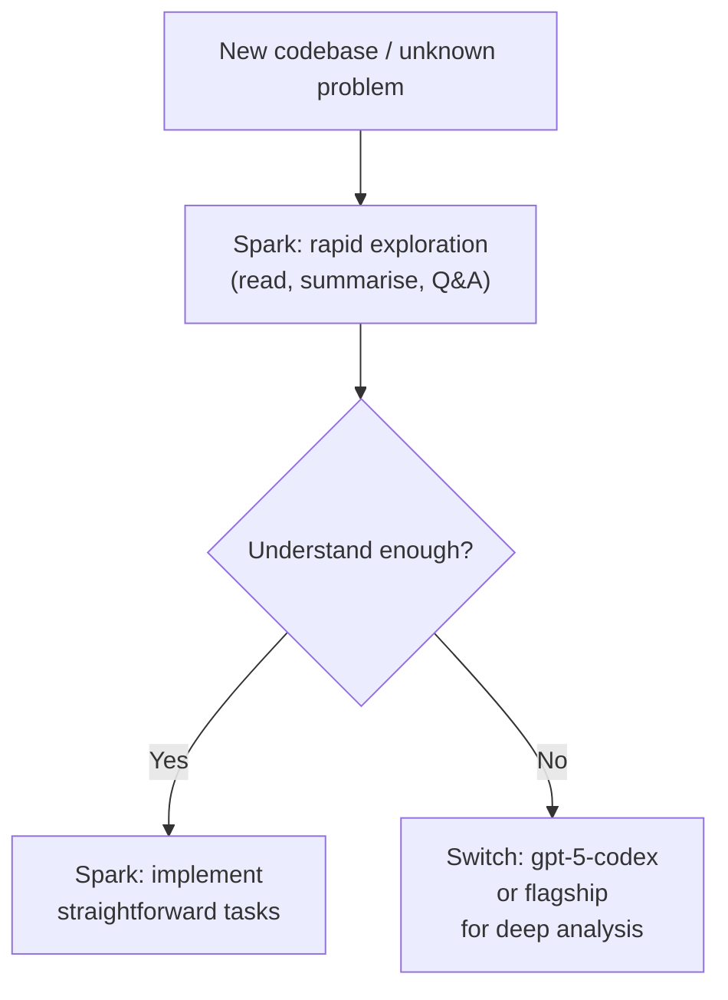

# GPT-5.3-Codex-Spark: Cerebras-Powered Real-Time Coding at 1,000 Tokens/Second

**Date:** 2026-03-30
**Tags:** gpt-5.3-codex-spark, cerebras, real-time-coding, model-selection, wse-3, inference-hardware, research-preview

---

## What Is Codex-Spark?

On 12 February 2026, OpenAI shipped a research preview of **`gpt-5.3-codex-spark`** — an inference-optimised distillate of GPT-5.3-Codex that runs on Cerebras Wafer-Scale Engine 3 (WSE-3) silicon rather than Nvidia GPU clusters.[^1] The headline number is eye-catching: over **1,000 tokens per second**, roughly 15× faster than the standard GPT-5.3-Codex at its `x-high` reasoning setting.[^2]

This is the first production deployment of a commercially-released OpenAI model on non-Nvidia hardware, and the first visible milestone of the multi-year, $10B+ OpenAI–Cerebras partnership announced on 14 January 2026.[^3][^4] It represents a genuine workflow paradigm shift for interactive coding: instead of committing to a single implementation path and waiting for a deep reasoning pass, you can generate and compare multiple approaches in the time a single standard-model response would have taken.

---

## Hardware: The Cerebras WSE-3

Understanding why Spark is fast requires a quick look at the hardware it runs on.

A conventional GPU cluster for inference strings together thousands of discrete chips over high-speed interconnects (NVLink, InfiniBand). Latency is bounded by the inter-chip fabric. Cerebras WSE-3 eliminates that bottleneck by etching the equivalent of a cluster onto a single wafer: **4 trillion transistors**, hundreds of thousands of AI cores, and an enormous pool of on-chip SRAM — all reachable at memory-bus speed with no inter-chip hops.[^5]

The practical result for inference:

- No serialisation penalty crossing chip boundaries
- Massive on-chip bandwidth reduces time-to-first-token (TTFT)
- Fixed chip count eliminates cluster scheduling variance

OpenAI shipped infrastructure improvements alongside Spark that benefit all models but are enabled by default for Spark:[^6]

| Improvement | Reduction |
|---|---|
| Per-client round-trip overhead | 80% |
| Per-token processing overhead | 30% |
| Time-to-first-token | 50% |

The mechanism is a **persistent WebSocket connection** replacing stateless HTTP for each Responses API call. This alone accounts for a large fraction of the perceived speed improvement on short completions.

---

## Model Position in the Codex Tier Table

Spark is **not** a replacement for the flagship Codex models. It occupies a deliberate tier: faster than anything else, but with a smaller reasoning budget and a reduced context window.

| Model | SWE-Bench Pro | Token Speed | Context Window |
|---|---|---|---|
| gpt-5.3-codex | ~72% | ~65–70 tok/sec | 400k+ tokens |
| **gpt-5.3-codex-spark** | **~56%** | **1,000+ tok/sec** | **128k tokens** |
| gpt-5.1-codex-mini | ~44% | ~200 tok/sec | 200k tokens |

Cerebras confirmed Spark "produces more capable responses than GPT-5.1-Codex-mini on SWE-Bench Pro and Terminal-Bench 2.0."[^7] In practical terms: it replaces mini as the right choice for rapid iteration, whilst still being meaningfully behind the flagship on complex multi-step work.

The capability ceiling is real. Independent testing found the model "drifts after 6–8 reasoning steps" versus 12+ for GPT-5.3-Codex.[^8] In one snake game implementation task, Spark completed in 50 seconds (vs. 6 minutes for Codex 5.3), but the output contained a collision detection bug and a memory leak that required corrective passes — making the total wall-clock advantage less dramatic than the tokens-per-second headline suggests.[^8]

---

## How to Use Codex-Spark in the CLI

### Interactive TUI

```bash
codex --model gpt-5.3-codex-spark
```

Inside an active session you can switch mid-thread with the model picker:

```
/model
```

Select **Spark** from the list. The switch takes effect immediately on the next turn.

### The Case-Sensitivity Footgun

The model identifier must be **all-lowercase**. The label shown in the UI ("GPT-5.3-Codex-Spark") is display text only. Using the capitalised form in `codex exec` throws:[^9]

```
Error: The 'GPT-5.3-Codex-Spark' model is not supported when using Codex with a ChatGPT account
```

Use the lowercase form in all config and flags:

```bash
codex exec --model "gpt-5.3-codex-spark" "write unit tests for src/parser.ts"
```

### Pinning to Spark via a Profile

Create a `spark` profile in `~/.codex/config.toml` to avoid repeating the flag:

```toml
[profiles.spark]
model = "gpt-5.3-codex-spark"
reasoning_effort = "high"

[profiles.spark.approvals]
mode = "auto"
```

Then invoke with:

```bash
codex --profile spark
```

### The `codex exec` Limitation

During the research preview, `codex exec` (non-interactive automation mode) only works with Spark when authenticating via an **API key**. ChatGPT Pro account login (OAuth) does not support Spark in exec mode — only interactive TUI mode works.[^9]

```toml
# ~/.codex/config.toml — required for exec mode with Spark
[auth]
api_key_env_var = "OPENAI_API_KEY"
```

---

## Workflow Patterns Unlocked by Spark's Speed

The 15× throughput difference is not just cosmetic. It changes what's *practical* to attempt interactively.

### Rapid Multi-Implementation Comparison



Use Spark to generate three candidate implementations in the time a single flagship response would take, then promote the best candidate to a flagship refinement pass. This is qualitatively different from the traditional "draft then revise" loop — you're choosing between complete implementations rather than iterating on one.

### Exploration Before Depth



Spark is well-suited to the *exploration* phase of a task — reading files, understanding API shapes, summarising existing code — where token throughput matters more than reasoning depth. Switch to the flagship only when the task genuinely requires extended multi-step planning.

### Rejection Sampling via Rapid Iteration

For tasks where correctness can be verified cheaply (tests pass/fail, compiler errors, linter output), Spark enables a tight iteration loop:

```bash
# Profile tuned for test-and-fix cycles
[profiles.spark-tdd]
model = "gpt-5.3-codex-spark"
reasoning_effort = "medium"

[profiles.spark-tdd.approvals]
mode = "auto"
```

Generate → test → fix in rapid succession without the per-turn latency overhead that makes this painful with slower models.

---

## Limitations and When Not to Use Spark

**Context window:** 128k tokens versus 400k+ for the standard model.[^10] Any task requiring large codebase ingestion — full-repo analysis, large refactors, or sessions that accumulate substantial history — will hit this ceiling. The flagship remains the only option for context-heavy work.

**Reasoning depth ceiling:** As noted above, the model drifts on tasks requiring more than 6–8 sequential planning steps.[^8] Architecture design, complex debugging of subtle concurrency bugs, or extended autonomous agents running dozens of sub-tasks should use the flagship.

**Text-only input:** Spark does not accept image input in the research preview. The `-i`/`--image` CLI flag is silently ignored.[^2]

**Preparedness Framework tier:** Spark does not meet OpenAI's "High" cybersecurity capability threshold under their Preparedness Framework — a consequence of being a smaller, inference-optimised model. This means it is not suitable as the model underpinning security-sensitive autonomous agent tasks.[^11]

**exec + ChatGPT account:** Non-interactive `codex exec` requires API key auth during the research preview.[^9]

**Rate limits:** Spark has **separate** rate limits during the research preview — usage does not count against standard ChatGPT Pro quotas. This is a temporary benefit; limits are subject to change as the model exits preview.[^1]

---

## Availability

- **Who:** ChatGPT Pro subscribers (research preview). Rolling out to API design partners.
- **Platforms:** Codex CLI, Codex app (web + desktop), VS Code extension.
- **API:** Responses API only (not the legacy Chat Completions endpoint).[^2]
- **Roadmap:** OpenAI described this as "the first in a family of ultra-fast models," with longer context windows and multimodal input planned.[^1]

---

## Summary: Pick Your Model by Task Shape

| Task shape | Recommended model |
|---|---|
| Rapid exploration, summarisation, Q&A | `gpt-5.3-codex-spark` |
| Test-and-fix iteration loops | `gpt-5.3-codex-spark` |
| Multi-implementation comparison | `gpt-5.3-codex-spark` × N |
| Straightforward, well-scoped tasks | `gpt-5.3-codex-spark` |
| Complex multi-step architecture design | `gpt-5.3-codex` or `gpt-5-codex` |
| Full-repo context required (>128k) | `gpt-5.3-codex` or `gpt-5-codex` |
| Long-horizon autonomous agent sessions | `gpt-5.1-codex-max` |
| Subagent delegation (many parallel tasks) | `gpt-5.4-mini` or `gpt-5.4-nano` |

Spark does not displace the flagship — it expands the useful range of interactive coding by making rapid exploration and iteration economically sensible in wall-clock time.

---

## Citations

[^1]: [Introducing GPT-5.3-Codex-Spark — OpenAI](https://openai.com/index/introducing-gpt-5-3-codex-spark/)
[^2]: [OpenAI Codex-Spark Achieves Ultra-Fast Coding Speeds on Cerebras Hardware — InfoQ](https://www.infoq.com/news/2026/03/open-ai-codex-spark/)
[^3]: [A new version of OpenAI's Codex is powered by a new dedicated chip — TechCrunch](https://techcrunch.com/2026/02/12/a-new-version-of-openais-codex-is-powered-by-a-new-dedicated-chip/)
[^4]: [OpenAI launches GPT-5.3-Codex-Spark on Cerebras chips — Tom's Hardware](https://www.tomshardware.com/tech-industry/artificial-intelligence/openai-lauches-gpt-53-codes-spark-on-cerebras-chips)
[^5]: [Introducing OpenAI GPT-5.3-Codex-Spark Powered by Cerebras — Cerebras Blog](https://www.cerebras.ai/blog/openai-codexspark)
[^6]: [OpenAI Launches GPT-5.3-Codex-Spark — Dataconomy](https://dataconomy.com/2026/02/13/openai-launches-gpt-5-3-codex-spark-for-ultra-fast-real-time-coding/)
[^7]: [Introducing OpenAI GPT-5.3-Codex-Spark Powered by Cerebras — Cerebras Blog](https://www.cerebras.ai/blog/openai-codexspark)
[^8]: [Codex 5.3 vs. Codex Spark: Speed vs. Intelligence — Turing College](https://www.turingcollege.com/blog/codex-5-3-vs-codex-spark-speed-vs-intelligence)
[^9]: [GitHub Issue #12235 — codex exec not supported with GPT-5.3-Codex-Spark via ChatGPT account](https://github.com/openai/codex/issues/12235)
[^10]: [Introducing GPT-5.3-Codex-Spark — Simon Willison](https://simonwillison.net/2026/Feb/12/codex-spark/)
[^11]: [OpenAI Releases GPT-5.3-Codex-Spark Research Preview — MarkTechPost](https://www.marktechpost.com/2026/02/12/openai-releases-a-research-preview-of-gpt-5-3-codex-spark-a-15x-faster-ai-coding-model-delivering-over-1000-tokens-per-second-on-cerebras-hardware/)
