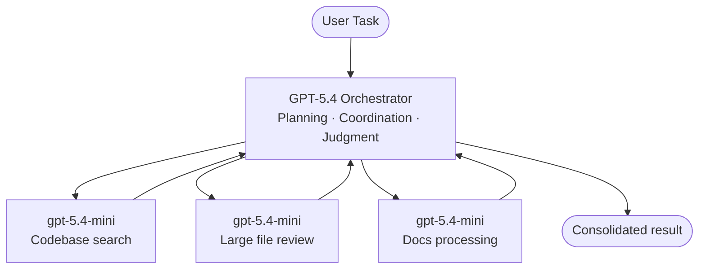
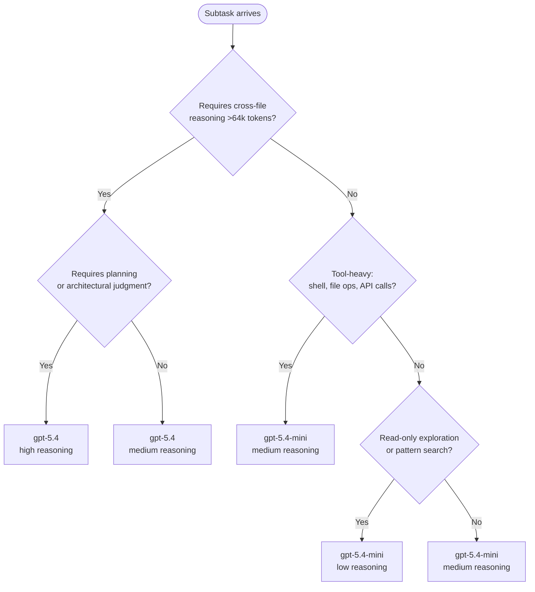

# GPT-5.4 mini in Codex CLI: Subagent Delegation, Model Routing and the Tiered Inference Architecture


OpenAI released GPT-5.4 mini and GPT-5.4 nano on 17 March 2026[^1], and they represent something more significant than two incremental model updates. They are, explicitly, the first models OpenAI has framed as purpose-built subagent models — designed to be orchestrated by a larger, more capable model rather than used as standalone all-purpose inferencing endpoints. For Codex CLI users, this arrival materially changes how you should think about multi-agent topologies, cost management, and the TOML configuration that governs them.

This article covers the technical specifics: what these models are, where they sit in the benchmark landscape, how to wire them into Codex CLI via custom agent TOML files and `config.toml` profiles, and the routing heuristics that will save you real money without sacrificing quality where it matters.

---

## The Tiered Inference Architecture

The framing from OpenAI is deliberate: GPT-5.4 handles "planning, coordination, and final judgment", while GPT-5.4 mini subagents handle "narrower subtasks in parallel — like searching a codebase, reviewing a large file, or processing supporting documents"[^2]. This is not a vague aspiration; the token-cost ratios make it concrete.

In Codex, GPT-5.4 mini consumes **30% of the included-limit quota** compared to GPT-5.4[^3]. On the raw API, input tokens cost $0.75/M versus $2.50/M for the flagship[^4]. Running a six-subagent codebase exploration job through mini rather than full GPT-5.4 drops the cost by roughly 3.3×.

GPT-5.4 nano goes further still: $0.20/M input tokens[^4]. Nano is API-only — it is not available in the Codex app, CLI, or IDE extension at time of writing — so it sits outside the Codex credit system. For teams building their own orchestration layers on top of the Responses API, nano becomes the logical choice for classification, routing decisions, and pattern-matching passes that feed into a Codex agent.



---

## Benchmark Reality Check

Before reaching for mini everywhere, the benchmark picture needs to be honest.

| Benchmark | GPT-5.4 | GPT-5.4 mini | GPT-5 mini (prior) |
|-----------|---------|-------------|-------------------|
| SWE-Bench Pro | 57.7% | 54.4% | 45.7% |
| OSWorld-Verified | 75.0% | 72.1% | 42.0% |
| τ²-bench Telecom | 98.9% | 93.4% | 74.1% |
| MCP Atlas | — | 57.7% | 47.6% |
| MRCR v2 (long-context, 128k) | 86.0% | 47.7% | — |

Sources: OpenAI blog[^1], DataCamp analysis[^5].

The headline numbers are encouraging: on SWE-Bench Pro, mini closes to within 3.3 points of the flagship while costing 3.3× less[^5]. The τ²-bench tool-use result (93.4%) is particularly relevant for Codex workflows where reliable shell-command generation and tool invocation are the bottleneck.

The number to watch is that **MRCR v2 long-context score: 47.7% versus 86.0%**[^5]. When a subagent needs to reason across a dense 128k+ context — holding many interrelated facts simultaneously — mini underperforms significantly. This is the signal for when to route to the orchestrator model rather than delegating.

---

## Configuring gpt-5.4-mini Subagents in Codex CLI

### The custom agent TOML approach

Since v0.117.0, the recommended way to configure a model-specific subagent is a standalone TOML file placed under `~/.codex/agents/` (user-scoped) or `.codex/agents/` (repository-scoped)[^6]. The file name becomes the agent's type identifier.

```toml
# .codex/agents/reviewer.toml
nickname_candidates = ["reviewer", "rev"]
description = "PR reviewer: correctness, security, and missing tests"
model = "gpt-5.4-mini"
model_reasoning_effort = "medium"
sandbox_mode = "read-only"
```

```toml
# .codex/agents/explorer.toml
nickname_candidates = ["explorer", "exp"]
description = "Fast codebase explorer — searches, reads, never edits"
model = "gpt-5.4-mini"
model_reasoning_effort = "low"
sandbox_mode = "read-only"
```

Any field omitted in an agent TOML inherits from the parent session's configuration[^6]. This means `mcp_servers`, `skills.config`, and `model_provider` do not need to be repeated if they are already set in `config.toml`.

### Global subagent settings in config.toml

```toml
# ~/.codex/config.toml
model = "gpt-5.4"
model_reasoning_effort = "high"

[agents]
max_threads = 8        # max parallel subagents; default 6
max_depth   = 1        # allow one level of child agents; default 1

[features]
multi_agent = true
```

`max_depth = 1` allows the root session to spawn children but prevents children spawning grandchildren. This is the safest default for controlled delegation — increase it only when you have a deliberate recursive pattern and have accounted for the exponential token cost[^6].

### Profiles for quick model switching

Profiles (experimental[^7]) let you name and switch between configurations:

```toml
# ~/.codex/config.toml

profile = "standard"

[profiles.standard]
model = "gpt-5.4"
model_reasoning_effort = "medium"

[profiles.economy]
model = "gpt-5.4-mini"
model_reasoning_effort = "medium"

[profiles.deep]
model = "gpt-5.4"
model_reasoning_effort = "high"
```

Switch at launch with `codex --profile economy` or in-session with `/config profile economy`. Profiles do not yet cascade into spawned subagents — subagents use the agent TOML or inherit the root session model, not the active profile[^7]. ⚠️

---

## Model Routing Decision Matrix

The goal is to answer: for a given subtask, which model should execute it?



Practical rules of thumb:

- **Use gpt-5.4-mini for**: codebase search, large-file review, documentation generation, test scaffolding, linting passes, diff summaries, and any task that primarily involves _reading_ and _pattern matching_ rather than _designing_.
- **Keep gpt-5.4 for**: architectural decisions, multi-file refactors where coherence across many interdependencies matters, final review passes, and anything that reads more than 64k tokens of dense, interrelated context.
- **Route to gpt-5.4 when mini's MRCR drops matter**: if your subagent needs to track more than ~20 distinct facts or constraints simultaneously across a large codebase context, the 47.7% long-context score is a real liability[^5].

---

## A Worked Multi-Agent Configuration

The following AGENTS.md and config.toml together describe a feature-development workflow where an orchestrator delegates to two mini subagents:

```toml
# .codex/agents/implementer.toml
nickname_candidates = ["implementer"]
description = "Writes code changes as directed by the orchestrator"
model = "gpt-5.4-mini"
model_reasoning_effort = "medium"
sandbox_mode = "full-access"
```

```toml
# .codex/agents/tester.toml
nickname_candidates = ["tester"]
description = "Writes and runs tests for changes produced by the implementer"
model = "gpt-5.4-mini"
model_reasoning_effort = "low"
sandbox_mode = "full-access"
```

```toml
# .codex/config.toml
model = "gpt-5.4"
model_reasoning_effort = "high"

[agents]
max_threads = 4
max_depth   = 1

[features]
multi_agent = true
```

```markdown
<!-- AGENTS.md (excerpt) -->
## Multi-agent task protocol

For feature tickets, use this pattern:
1. You (gpt-5.4) plan the changes and identify affected files
2. Spawn `implementer` to write the code
3. Spawn `tester` to write and run tests against the changes
4. Review implementer and tester output before committing

Never delegate final code-review judgment to subagents.
```

The sub-agent addresses use the path scheme introduced in v0.117.0: `/root/implementer`, `/root/tester`[^8]. Remote sessions surface these as names rather than UUIDs since the same release.

---

## GPT-5.4 nano: API-Only, Ultra-Cheap

Nano ($0.20/M input, $1.25/M output[^4]) is not available in the Codex CLI or app at launch. It exists in the raw Responses API. This makes it relevant for teams who:

- Build their own agent harnesses using the `codex-sdk` Python package and want a cheap routing/classification layer
- Run pre-processing pipelines (tokenisation checks, language detection, intent classification) before forwarding to a Codex session
- Use the app-server WebSocket transport and manage their own scheduling logic

For pure Codex CLI users, nano is not a configuration option today. It is worth monitoring the `[model_providers]` section of `config.toml` for when a direct API provider targeting the nano endpoint becomes the supported path[^7]. ⚠️

---

## Cost Modelling

For a Codex Pro subscription team, the credit ratio is what drives practical decisions. OpenAI states mini consumes 30% of GPT-5.4's quota[^3]. A rough model for a typical feature-development session:

```
Orchestrator (gpt-5.4): 1 planning turn × 1.0 credit unit
Implementer (gpt-5.4-mini): 3 code-writing turns × 0.30 credit units = 0.90
Tester (gpt-5.4-mini): 2 test-writing turns × 0.30 credit units = 0.60

Total: 2.50 credit units

vs. all-gpt-5.4: 6 turns × 1.0 = 6.0 credit units
Saving: ~58%
```

The actual multiplier depends on session length and context compaction behaviour. The key insight is that the savings compound: every exploration or documentation subtask you route to mini rather than the flagship extends your included limits by a factor of ~3.3 for that work.

---

## What Has Not Changed

GPT-5.4 mini is a new model, but the Codex CLI machinery around it is the same:

- `AGENTS.md` instructions still govern all sessions — both orchestrator and subagents read the applicable `AGENTS.md` hierarchy[^6]
- Sandbox modes, MCP server access, and skill configurations all apply identically to mini sessions
- The approval policy (`suggest`, `auto-edit`, `full-auto`) is set at the session level and is not per-agent in the current implementation ⚠️
- Hooks (experimental) fire on both orchestrator and subagent turns; hook scripts receive `model` in the JSON stdin, enabling model-aware logging

---

## Summary

GPT-5.4 mini is not a compromise option for developers who can't afford the flagship — it is a purpose-designed subagent model that scores within 3.3 points of GPT-5.4 on SWE-Bench Pro, runs 2× faster, and costs 3.3× less in the Codex credit system[^1][^3]. The clear failure mode is long-context reasoning (MRCR v2: 47.7% vs 86.0%), which gives a clean routing heuristic: keep the orchestrator on GPT-5.4 for anything requiring deep cross-file coherence, and delegate the rest to mini.

The custom agent TOML pattern introduced in v0.117.0 makes this wiring explicit and version-controllable. Commit your `.codex/agents/` directory alongside your `AGENTS.md` and treat the tiered inference topology as part of the project's technical design.

---

## Citations

[^1]: OpenAI, "Introducing GPT-5.4 mini and nano", March 17 2026. <https://openai.com/index/introducing-gpt-5-4-mini-and-nano/>
[^2]: OpenAI Codex models page. <https://developers.openai.com/codex/models>
[^3]: Augment Code, "OpenAI Codex CLI ships v0.116.0 with enterprise features". <https://www.augmentcode.com/learn/openai-codex-cli-enterprise>
[^4]: AI Free API, "GPT-5.4 mini vs GPT-5.4 nano pricing and routing logic". <https://www.aifreeapi.com/en/posts/gpt-5-4-mini-vs-gpt-5-4-nano>
[^5]: DataCamp, "GPT-5.4 mini and nano: Benchmarks, Access, and Reactions". <https://www.datacamp.com/blog/gpt-5-4-mini-nano>
[^6]: OpenAI Codex subagents documentation. <https://developers.openai.com/codex/subagents>
[^7]: OpenAI Codex advanced configuration reference. <https://developers.openai.com/codex/config-advanced>
[^8]: OpenAI Codex CLI v0.117.0 release notes. <https://github.com/openai/codex/releases/tag/v0.117.0>
