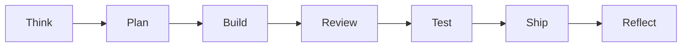
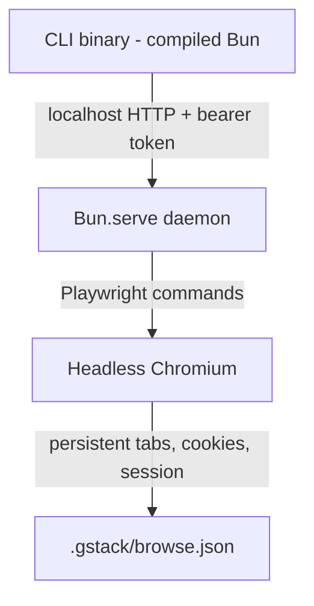
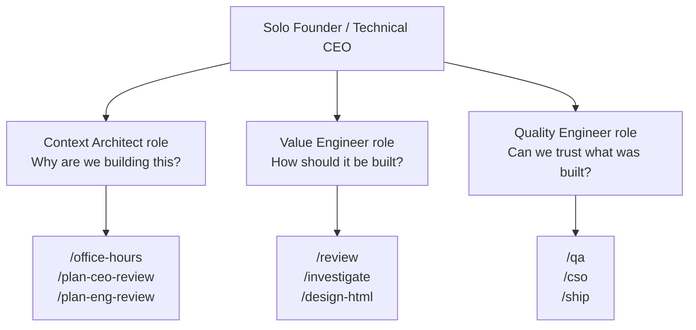
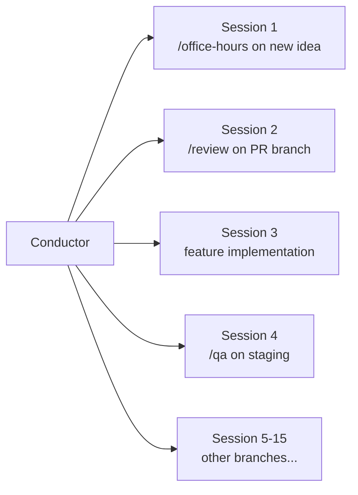

# gstack: Garry Tan's Production Claude Code Skills Toolkit

**Source:** https://github.com/garrytan/gstack
**Author:** Garry Tan (President & CEO, Y Combinator)
**Date saved:** 2026-03-30
**Content age:** Current as of March 2026 — verify before relying on specifics

---

## Summary

gstack is Garry Tan's open-source software factory: 31 slash-command skills for Claude Code (and Codex CLI, Cursor, Factory Droid) that turn the AI assistant into a virtual engineering team.[^1] In 60 days of part-time use while running YC full-time, Tan shipped 600,000+ lines of production code — 10,000–20,000 lines per day — with 35% test coverage throughout.[^2] The toolkit is MIT licensed, free, and represents a real production reference implementation of agentic engineering at scale.

---

## What gstack Is

> "gstack turns Claude Code into a virtual engineering team — a CEO who rethinks the product, an eng manager who locks architecture, a designer who catches AI slop, a reviewer who finds production bugs, a QA lead who opens a real browser, a security officer who runs OWASP + STRIDE audits, and a release engineer who ships the PR."[^3]

Each skill is a Markdown file following the SKILL.md standard. All 31 skills work across Claude Code, Codex CLI, Cursor, and Factory Droid. Nothing touches the system PATH or runs persistently in the background — everything lives inside `.claude/` or `.agents/`.

**Scale evidence (from Tan's own `/retro` across 3 projects):**

- 140,751 lines added, 362 commits, ~115k net LOC in one week
- 1,237 GitHub contributions in the first quarter of 2026 vs 772 for all of 2013 (building Bookface at YC)
- Part-time velocity while running Y Combinator full-time

---

## The Sprint Lifecycle

gstack is a structured process, not a loose collection of tools. Skills run in sprint order:



Each phase feeds into the next. `/office-hours` writes a design doc that `/plan-ceo-review` reads. `/plan-eng-review` writes a test plan that `/qa` picks up. `/review` catches bugs that `/ship` verifies are fixed. The lifecycle enforces continuity of context across the entire sprint.

---

## Key Skills

### Think Phase

| Skill | Specialist | Role |
|-------|-----------|------|
| `/office-hours` | YC Office Hours | Six forcing questions that reframe your product. Pushes back on framing, challenges premises, generates implementation alternatives. Design doc feeds into every downstream skill. |

### Plan Phase

| Skill | Specialist | Role |
|-------|-----------|------|
| `/plan-ceo-review` | CEO / Founder | Finds the 10-star product hiding inside the request. Four modes: Expansion, Selective Expansion, Hold Scope, Reduction. |
| `/plan-eng-review` | Eng Manager | Locks architecture, data flow, diagrams, edge cases, and test plan. Forces hidden assumptions into the open. |
| `/plan-design-review` | Senior Designer | Rates each design dimension 0–10, explains what 10 looks like, edits plan to get there. Includes AI Slop detection. |
| `/autoplan` | Review Pipeline | One command: CEO → design → eng review automatically, surfaces only taste decisions for human approval. |

### Build Phase

| Skill | Specialist | Role |
|-------|-----------|------|
| `/design-consultation` | Design Partner | Builds a complete design system from scratch, researches the landscape, proposes creative risks. |
| `/design-shotgun` | Design Explorer | Generates multiple AI design variants, opens comparison board in browser, iterates until direction approved. |
| `/design-html` | Design Engineer | Takes approved mockup, generates production-quality HTML with Pretext (computed text layout, reflows on resize). |

### Review Phase

| Skill | Specialist | Role |
|-------|-----------|------|
| `/review` | Staff Engineer | Finds bugs that pass CI but blow up in production. Auto-fixes the obvious ones. Flags completeness gaps. |
| `/investigate` | Debugger | Systematic root-cause debugging. Iron Law: no fixes without investigation. Stops after 3 failed fix attempts. |
| `/cso` | Chief Security Officer | OWASP Top 10 + STRIDE threat model. Zero-noise: 17 false-positive exclusions, 8/10+ confidence gate, independent finding verification. |
| `/codex` | Second Opinion | Independent code review from OpenAI Codex CLI. Three modes: review (pass/fail gate), adversarial challenge, open consultation. Cross-model analysis when both `/review` and `/codex` have run. |

### Test Phase

| Skill | Specialist | Role |
|-------|-----------|------|
| `/qa` | QA Lead | Tests app in real browser, finds bugs, fixes with atomic commits, re-verifies. Auto-generates regression tests for every fix. |
| `/qa-only` | QA Reporter | Same methodology as `/qa` but report only — no code changes. |
| `/benchmark` | Performance Engineer | Baselines page load times, Core Web Vitals, resource sizes. Compares before/after on every PR. |

### Ship Phase

| Skill | Specialist | Role |
|-------|-----------|------|
| `/ship` | Release Engineer | Syncs main, runs tests, audits coverage, pushes, opens PR. Bootstraps test frameworks if none exist. Auto-invokes `/document-release`. |
| `/land-and-deploy` | Release Engineer | Merges PR, waits for CI and deploy, verifies production health. One command: "approved" → "verified in production." |
| `/canary` | SRE | Post-deploy monitoring loop. Watches for console errors, performance regressions, and page failures. |

### Reflect Phase

| Skill | Specialist | Role |
|-------|-----------|------|
| `/retro` | Eng Manager | Team-aware weekly retro. Per-person breakdowns, shipping streaks, test health trends. `/retro global` spans all projects and AI tools (Claude Code, Codex, Gemini). |
| `/document-release` | Technical Writer | Updates all project docs to match what shipped. Catches stale READMEs automatically. |

### Power Tools

| Skill | What it does |
|-------|-------------|
| `/browse` | Real Chromium browser, real clicks, real screenshots. ~100ms per command after startup. |
| `/connect-chrome` | Launches real Chrome controlled by gstack with Side Panel extension — watch every action live. |
| `/careful` | Warns before destructive commands (rm -rf, DROP TABLE, force-push). |
| `/freeze` | Restricts edits to one directory while debugging. |
| `/guard` | `/careful` + `/freeze` combined. Maximum safety for production work. |
| `/learn` | Manages persistent memory across sessions. Learnings compound on your codebase. |

---

## The Persistent Chromium Browser Daemon

The `/browse` skill runs a long-lived Chromium process via Bun and Playwright, not a new browser per command.[^4]



**Key design decisions:**

- **Sub-200ms commands** after initial ~3s startup (vs 3–5s cold-start per command)
- **Port**: random between 10,000–60,000 per workspace — supports parallel isolated sessions
- **Auth**: random UUID bearer token, state file at mode 0o600
- **Auto-shutdown**: 30 minutes of inactivity — no explicit process management needed
- **Element references**: Playwright Locators via accessibility tree (`@e1`, `@e2`...) — avoids CSP breakage from DOM injection
- **Cookie import**: reads browser cookie DBs read-only from a temp copy; PBKDF2 + AES-128-CBC decryption in-process, never persisted to plaintext

**Why Bun over Node.js:** compiled binaries eliminate runtime dependencies; native SQLite avoids addon compilation for cookie access; native TypeScript execution in development removes build overhead.[^5]

---

## The "Boil the Lake" Completeness Principle

From ETHOS.md — the philosophical foundation of gstack:[^6]

> "When the marginal cost of completeness is near-zero, always choose the complete implementation. Completeness isn't expensive anymore; shortcuts are legacy thinking."

The four ETHOS principles:

1. **Boil the Lake** — full test coverage, all edge cases, complete error paths are the baseline, not the stretch goal
2. **Search Before Building** — question first, build second; three knowledge layers: established patterns (verify), current trends (scrutinise), first-principles reasoning (prize most)
3. **User Sovereignty** — AI models recommend; humans decide (humans have domain knowledge, business relationships, strategic timing, personal taste that models lack)
4. **Build for Yourself** — the best tools solve real problems; specificity beats generality

---

## The Solo-Founder Degenerate Case

gstack embodies the degenerate case of the Ch36 Agentic Pod pattern: when one human occupies all three pod roles simultaneously.



Tan explicitly frames this for "Founders and CEOs — especially technical ones who still want to ship."[^7] The skills enforce the discipline that a three-person pod would enforce socially: `/plan-eng-review` forces the same architectural interrogation a staff engineer would demand; `/cso` applies the same audit a security lead would run; `/qa` opens the same browser a QA lead would open.

The solo founder does not skip the gates — the skills enforce them unconditionally.

---

## Multi-Disciplinary Planning Gates

`/autoplan` encodes the full review chain as a single command:

```
/autoplan → CEO review → Design review → Eng review → Surfaces taste decisions only
```

This mirrors the multi-disciplinary planning gate structure in Ch36: no feature moves from plan to build without clearing product (CEO), design, and engineering lenses. The difference from a traditional planning meeting is that gstack runs the first three automatically, surfacing only the decisions that require human taste and judgment rather than mechanical checklist execution.

Smart review routing applies downstream: the CEO does not review infra bug fixes; design review does not run on backend-only changes. gstack tracks what reviews are appropriate and routes accordingly.[^8]

---

## Conductor-Based Parallelism at 10–15 Streams

gstack with [Conductor](https://conductor.build) provides the parallel execution model described in Ch36's agentic pod at scale:[^9]



Each session runs in an isolated workspace. The sprint structure is what makes this viable: without Think → Plan → Build → Review → Test → Ship, ten agents are ten sources of chaos. With the structure, each agent knows exactly what to do and when to stop.

Tan's reported practical maximum: **10–15 parallel sprints**. Management posture: "check in on the decisions that matter, let the rest run" — identical to the CEO-of-the-pod operating model in Ch36.

The unlock that enabled the jump from 6 to 12 parallel workers was `/qa`: an agent that sees the browser state, says "I SEE THE ISSUE," fixes it, generates a regression test, and verifies the fix closes the quality loop without human re-engagement.[^10]

---

## Installation

```bash
# Claude Code — global install
git clone --single-branch --depth 1 https://github.com/garrytan/gstack.git ~/.claude/skills/gstack
cd ~/.claude/skills/gstack && ./setup

# Codex CLI — user account
git clone --single-branch --depth 1 https://github.com/garrytan/gstack.git ~/gstack
cd ~/gstack && ./setup --host codex

# Codex CLI — repo-local
git clone --single-branch --depth 1 https://github.com/garrytan/gstack.git .agents/skills/gstack
cd .agents/skills/gstack && ./setup --host codex
```

Requirements: Claude Code or Codex CLI, Git, Bun v1.0+, Node.js (Windows only).

---

## Relevance to This Knowledge Base

### Knowledge Flywheel v2

gstack is a live demonstration of the Knowledge Flywheel applied to a solo technical operator. The `/learn` skill manages persistent cross-session memory — learnings compound on the codebase over time, exactly the flywheel accumulation model. The `/retro` skill closes the reflection loop, feeding shipping data and growth opportunities back into future sprint planning.

### Ch36 Agentic Pod Patterns

| Ch36 concept | gstack implementation |
|-------------|----------------------|
| Context Architect | `/office-hours`, `/plan-ceo-review`, `/learn` |
| Value Engineer | `/plan-eng-review`, `/review`, `/investigate`, `/design-html` |
| Quality Engineer | `/qa`, `/cso`, `/ship`, `/careful`, `/guard` |
| Solo-founder degenerate case | All 31 skills in one operator's hands |
| Multi-disciplinary planning gate | `/autoplan` (CEO → design → eng review) |
| Parallel pod execution | Conductor + 10–15 isolated sessions |
| Trust platform / gates | `/careful`, `/freeze`, `/guard`, `/cso` |
| Completeness over shortcuts | "Boil the Lake" ethos |

### Reference Implementation Value

gstack is the closest publicly available reference implementation of production agentic engineering at the scale and structure described in Ch36. It provides:

- Concrete skill implementations to study for the SKILL.md standard
- Evidence of real throughput numbers (600k+ lines, 60 days, part-time)
- A worked example of the solo-founder degenerate case
- Browser automation architecture that could inform Quality Engineer tooling
- The `/cso` security audit pattern as a model for automated trust gates

---

## Personal Notes

This is essential reference material for Part 6 of the book. Garry Tan is one of the most credible voices in this space — YC President, former Palantir engineer, built Posterous — and gstack is not a demo project. The throughput numbers are independently verifiable via his GitHub contribution graph.

The "Boil the Lake" principle deserves explicit citation in the agentic pod chapter: it reframes completeness from an aspiration (expensive, deferred) to the default (cheap, expected). This is the philosophical shift that justifies the Quality Engineer's role in a three-person pod — 100% test coverage is now the floor, not the ceiling.

The 56k+ GitHub stars (as of March 2026) suggest broad community validation beyond just YC-adjacent founders.

---

## Citations

[^1]: gstack README — 31 skills, MIT license: https://github.com/garrytan/gstack
[^2]: gstack README — 600,000+ lines in 60 days, 10,000–20,000 lines/day: https://github.com/garrytan/gstack
[^3]: gstack README — virtual engineering team description: https://github.com/garrytan/gstack
[^4]: gstack ARCHITECTURE.md — persistent browser daemon design: https://raw.githubusercontent.com/garrytan/gstack/main/ARCHITECTURE.md
[^5]: gstack ARCHITECTURE.md — Bun technology choice rationale: https://raw.githubusercontent.com/garrytan/gstack/main/ARCHITECTURE.md
[^6]: gstack ETHOS.md — Boil the Lake and four core principles: https://raw.githubusercontent.com/garrytan/gstack/main/ETHOS.md
[^7]: gstack README — "Who this is for" section: https://github.com/garrytan/gstack
[^8]: gstack README — smart review routing and Review Readiness Dashboard: https://github.com/garrytan/gstack
[^9]: gstack README — 10–15 parallel sprints with Conductor: https://github.com/garrytan/gstack
[^10]: gstack README — /qa as unlock for 6→12 parallel workers: https://github.com/garrytan/gstack
