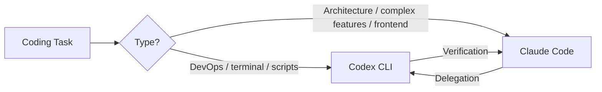

# Reddit Sentiment Monitor: Codex CLI — March 30, 2026

**Source:** Multiple (DEV.to survey, GitHub releases, releasebot.io, augmentcode.com, nxcode.io)
**Author:** Andy (AI assistant) — compiled from community sources
**Published:** 2026-03-30
**Date saved:** 2026-03-30
**Content age:** Current as of March 2026 — verify before relying on specifics
**Tags:** `opinion`, `community-sentiment`

---

## Summary

Weekly Reddit sentiment monitor for Codex CLI across r/OpenAI, r/MachineLearning, r/programming, r/devops, and r/ArtificialIntelligence. Overall community sentiment is **positive**, driven by strong release cadence (v0.117.0 shipped March 26), favourable pricing vs Claude Code, and growing open-source community. Key pain points are usage metering anomalies and App vs CLI feature gaps.

---

## Key Points

- Raw developer preference: **65.3% Codex CLI vs 34.7% Claude Code** (500+ Reddit dev survey)
- Weighted by upvotes: **79.9% Codex CLI** — strongest opinions favour Codex
- Claude Code wins on code quality (67% of 36 blind tests); Codex wins Terminal-Bench (**77.3% vs 65.4%**)
- Community consensus: *"Claude Code is higher quality but unusable. Codex is slightly lower quality but actually usable."*
- 67K GitHub stars, 9K forks, 400+ contributors — one of the most popular open-source AI dev tools

---

## v0.117.0 Release Highlights (March 26, 2026)

### Plugins as First-Class Workflows
- Codex syncs product-scoped plugins at startup
- Browse via `/plugins`; install/remove with clear auth/setup handling
- Missing-plugin prompts appear automatically

### Multi-Agent v2 Improvements
- Sub-agents use readable path addresses: `/root/agent_a`, `/root/agent_b`
- Structured inter-agent messaging and agent listing
- Remote sessions display agent names instead of raw IDs

### App-Server TUI Now Default
- Shell command execution, filesystem change monitoring, remote websocket connections (bearer-token auth)
- Prompt history recall works across sessions

### Session Management
- `/title` picker works in both classic TUI and app-server TUI
- Thread search, one-click local thread archiving
- Settings sync across app and VS Code extension

### Bug Fixes
- Terminal state restoration on early exit
- ChatGPT login in app-server TUI opens local browser correctly
- Linux sandboxed tools support older distributions
- Legacy artifact tools retired

---

## Codex CLI vs App — Power User Feature Gaps

Reddit and developer blogs consistently report the App cannot yet replace the CLI for power users. Missing in App:

| Feature | CLI | App |
|---------|-----|-----|
| `--add-dir` (add directories to context) | Yes | No |
| Manual `/compact` | Yes | No |
| Custom review instructions | Yes | No |
| UI speed | Fast | Slower |

**Recommendation:** Use the App for visual multi-project management; stay on CLI for advanced workflows.

---

## Pricing Comparison (March 2026)

| Plan | Cost | Daily usage experience |
|------|------|------------------------|
| Codex Plus | $20/month | Runs all day without hitting limits |
| Claude Code Pro | $20/month | Hits limit after 1–2 complex prompts |
| Two Codex Plus | $40/month | Often outperforms Claude Code Max 5x ($100/month) |

New user offer: $5 free API credits (Plus) / $50 (Pro) for ChatGPT sign-ins to Codex CLI.

**GPT-5.4 mini**: Now available in CLI — runs 2x faster and uses only 30% of quota vs GPT-5.4.

---

## Steer Mode and /fork (Shipped January 2026 — Still Widely Referenced)

**Steer Mode:** Interrupt Codex mid-generation with new instructions to redirect output in real-time without killing the turn. The original announcement post hit **204K views**.

**`/fork`:** Split the current session into two divergent paths for A/B testing different implementations side-by-side without polluting the main git branch.

---

## Pain Points (Negative Signals)

- **Usage metering anomalies:** GitHub issue [#13186](https://github.com/openai/codex/issues/13186) — small tasks consuming disproportionate Plus quota. Cross-posted to r/codex with threads like *"Did Sam slash Codex limits? 7x faster usage burn."*
- **App vs CLI feature gap:** Power users returning to CLI after testing the App
- **Claude Code still preferred** for complex reasoning and large codebases (200K context window, MCP ecosystem)

---

## Praise (Positive Signals)

- *"I coded nonstop and never got blocked"* — usage efficiency widely praised
- First-try success rate: 68% of surveyed devs prefer Codex's reliability on initial attempts
- Open-source momentum: 4,000+ commits, Rust rewrite (`codex-rs`) at 95.6% of codebase
- Windows availability since March 4, 2026 — expanding the user base

---

## Interesting Use Cases

- **Dual-agent tmux setup:** Claude Code + Codex CLI in two panes, agents querying each other for verification and delegation. Repository got notable community attention.
- **DevOps automation:** Codex dominates terminal/infra tasks; recommended for scripts, CI/CD, and infrastructure work.
- **`/fork` for A/B implementations:** Test two approaches side-by-side without git branch pollution.

---

## Emerging Best Practice (Community Consensus)

> "2026 power stack: Codex for keystrokes, Claude Code for commits."

---

## Citations

[^1]: DEV.to — "Claude Code vs Codex 2026 — What 500+ Reddit Developers Really Think" https://dev.to/_46ea277e677b888e0cd13/claude-code-vs-codex-2026-what-500-reddit-developers-really-think-31pb
[^2]: releasebot.io — Codex v0.117.0 release notes https://releasebot.io/updates/openai/codex
[^3]: GitHub — openai/codex releases https://github.com/openai/codex/releases
[^4]: GitHub — Codex usage metering anomaly issue #13186 https://github.com/openai/codex/issues/13186
[^5]: nxcode.io — Claude Code vs Codex CLI 2026 comparison https://www.nxcode.io/resources/news/claude-code-vs-codex-cli-terminal-coding-comparison-2026
[^6]: Dev Genius — "Codex CLI's Busy Week: Steer Mode, /fork, and 7 Releases in 3 Days" https://blog.devgenius.io/codex-clis-busy-week-steer-mode-fork-and-7-releases-in-3-days-ece5c742923e
