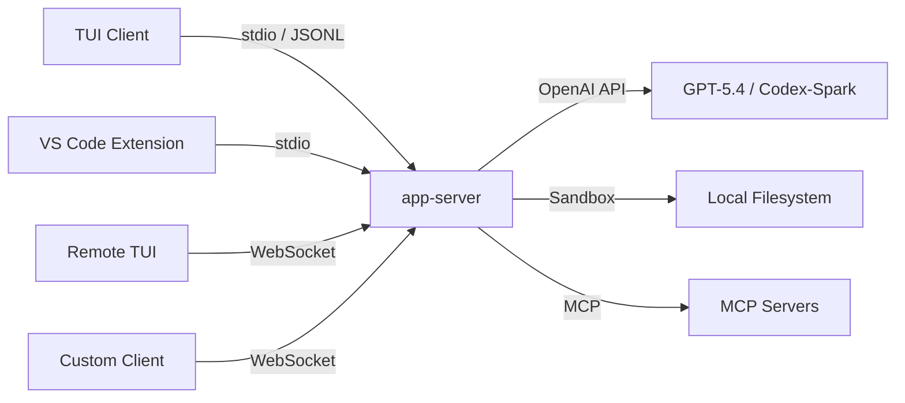
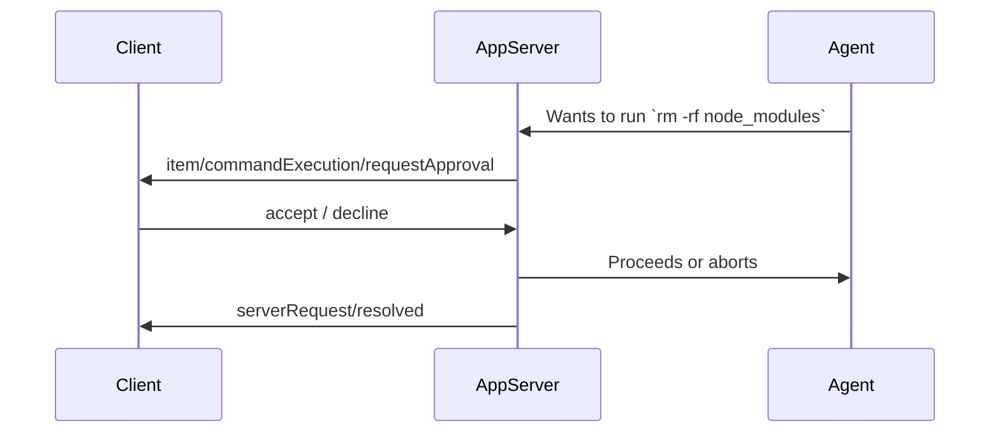

# Codex CLI App Server: Remote Access, WebSocket Transport, and Headless Deployment


The Codex CLI is typically presented as a local terminal tool, but underneath its TUI sits a full JSON-RPC 2.0 server — the **app-server** — that powers the VS Code extension, the Codex desktop app, and any third-party client that speaks the protocol [^1]. With the March 2026 releases, the app-server gained WebSocket transport, bearer-token authentication, health endpoints, and remote TUI connectivity [^2], turning Codex into something closer to a headless coding service than a simple CLI.

This article covers the app-server architecture, how to deploy it for remote access, and the security model you need to understand before exposing it beyond localhost.

## Architecture Overview

The app-server is a Rust binary (`codex app-server`) that accepts bidirectional JSON-RPC 2.0 messages over one of two transports [^1]:

- **stdio** (default): newline-delimited JSON (JSONL) over stdin/stdout — stable and production-ready
- **WebSocket** (experimental): one JSON-RPC message per WebSocket text frame — suitable for remote and browser-based clients

The `"jsonrpc":"2.0"` envelope header is omitted on the wire for compactness [^1]. Messages follow the standard request/response/notification pattern:

```json
// Request
{ "method": "turn/start", "id": 10, "params": { "threadId": "thr_123", "input": { "type": "userMessage", "message": "Refactor the auth module" } } }

// Notification (no id)
{ "method": "item/agentMessage/delta", "params": { "delta": "I'll start by..." } }
```



## Starting the App Server

The simplest invocation uses stdio:

```bash
codex app-server
```

For WebSocket transport, bind to an address:

```bash
codex app-server --listen ws://127.0.0.1:4500
```

This starts a WebSocket listener on port 4500, restricted to loopback [^1]. To bind to all interfaces (for remote access), use `0.0.0.0` — but **never without authentication** (see below).

## Session Lifecycle

Every client connection follows a strict handshake [^1]:

1. **`initialize`** — sends client metadata and negotiates capabilities
2. **`initialized`** notification — signals readiness
3. All other requests are rejected until this handshake completes

```json
{
  "method": "initialize",
  "id": 0,
  "params": {
    "clientInfo": {
      "name": "my-remote-client",
      "title": "Remote Codex Dashboard",
      "version": "1.0.0"
    },
    "capabilities": {
      "experimentalApi": true,
      "optOutNotificationMethods": ["item/agentMessage/delta"]
    }
  }
}
```

The response includes `userAgent`, `codexHome`, `platformFamily`, and `platformOs` — useful for clients that need to adapt behaviour to the host environment [^1].

### Thread Management

Once initialised, you manage conversations through threads:

| Method | Purpose |
|--------|---------|
| `thread/start` | Create a new conversation thread |
| `thread/resume` | Reopen an existing thread by ID |
| `thread/fork` | Branch from an earlier point (supports `ephemeral: true` for in-memory forks) |
| `thread/list` | Paginated thread history with filters (`modelProviders`, `archived`, `searchTerm`) |
| `thread/compact/start` | Trigger context compaction on a long thread |
| `thread/rollback` | Drop the last N turns |

### Turn Control

Turns are the unit of work within a thread:

```bash
# Conceptual flow
turn/start → [stream: turn/started, item/*, turn/completed]
turn/steer  → inject input into an active turn
turn/interrupt → cancel a running turn
```

Each `turn/start` accepts per-turn overrides for `model`, `approvalPolicy`, `sandbox`, and `personality` (`"friendly"`, `"pragmatic"`, or `"none"`) [^1].

## WebSocket Authentication

Loopback connections (`ws://127.0.0.1:PORT`) are appropriate for localhost and SSH port-forwarding workflows [^1]. Non-loopback listeners currently allow unauthenticated connections by default — a deliberate choice during the rollout phase, but one you should override immediately for any remote deployment [^3].

Two authentication modes are available via the `--ws-auth` flag:

### Capability Token

```bash
codex app-server \
  --listen ws://0.0.0.0:4500 \
  --ws-auth capability-token \
  --ws-token-file /etc/codex/ws-token
```

The token file contains a shared secret. Clients present it as `Authorization: Bearer <token>` during the WebSocket handshake [^1].

### Signed Bearer Token (HMAC JWT)

For production deployments, signed bearer tokens provide stronger guarantees:

```bash
codex app-server \
  --listen ws://0.0.0.0:4500 \
  --ws-auth signed-bearer-token \
  --ws-shared-secret-file /etc/codex/signing-key \
  --ws-issuer "my-org" \
  --ws-audience "codex-prod" \
  --ws-max-clock-skew-seconds 30
```

Clients must present an HMAC-signed JWT with matching `iss` and `aud` claims [^1]. Authentication is enforced before the JSON-RPC `initialize` message is processed, so unauthenticated clients never reach the agent.

## Health Endpoints

When running in WebSocket mode, the same listener serves HTTP health probes [^2]:

| Endpoint | Response | Notes |
|----------|----------|-------|
| `GET /readyz` | `200 OK` | Returns OK once accepting connections |
| `GET /healthz` | `200 OK` | Returns OK when no `Origin` header present |
| Any request with `Origin` | `403 Forbidden` | Prevents browser-origin CSRF probes |

These are designed for Kubernetes liveness/readiness probes and load-balancer health checks.

## Remote TUI Connection

The Codex TUI can connect to a remote app-server endpoint directly [^4]:

```bash
codex --remote ws://my-server:4500
```

Or with TLS:

```bash
codex --remote wss://codex.internal.example.com:4500
```

This is the pattern OpenAI envisions for keeping the agent close to compute resources — the heavy lifting runs on a server, whilst the TUI provides a lightweight local interface [^5]. Your laptop can sleep or disconnect; the server continues working, and the TUI resynchronises on reconnect.

## Backpressure and Overload Handling

The app-server uses bounded queues between transport, processing, and outbound writes [^1]. When the request ingress queue saturates, the server rejects new requests:

```json
{
  "error": {
    "code": -32001,
    "message": "Server overloaded; retry later."
  }
}
```

Clients should implement exponential backoff with jitter. This is particularly relevant for multi-client deployments where several TUI sessions or IDE extensions connect to the same app-server instance.

## Approval Flow for Remote Clients

The app-server's approval model carries directly to remote connections. When the agent attempts a file change or command execution, the server emits an approval request [^1]:



Two approval types exist:

- **Command execution**: accept, decline, or `acceptWithExecpolicyAmendment` (approve and update the policy for future similar commands)
- **File changes**: accept or decline

This means remote Codex sessions maintain the same safety guarantees as local ones — the agent cannot bypass sandbox boundaries just because it's running headless.

## Deployment Patterns

### Pattern 1: SSH Tunnel (Simplest)

Run the app-server on a remote machine with loopback binding, tunnel the port:

```bash
# On the server
codex app-server --listen ws://127.0.0.1:4500

# On your laptop
ssh -L 4500:127.0.0.1:4500 dev-server
codex --remote ws://127.0.0.1:4500
```

No authentication needed — the SSH tunnel handles it.

### Pattern 2: Authenticated WebSocket (Team Access)

For shared development servers where multiple developers connect:

```bash
codex app-server \
  --listen ws://0.0.0.0:4500 \
  --ws-auth signed-bearer-token \
  --ws-shared-secret-file /etc/codex/team-key \
  --ws-issuer "dev-team" \
  --ws-audience "codex-shared"
```

### Pattern 3: Containerised Headless Agent

In container deployments, stdio is tunnelled over the container runtime's network connection [^5]:

```toml
# config.toml for headless operation
[agent]
approval_policy = "never"
sandbox = "workspace-write"

[model]
name = "gpt-5.4"
```

```bash
docker run -v /workspace:/workspace \
  -e OPENAI_API_KEY \
  codex-cli app-server --listen ws://0.0.0.0:4500 \
  --ws-auth capability-token \
  --ws-token-file /run/secrets/ws-token
```

## Schema Generation

The app-server can generate TypeScript or JSON Schema definitions matching the exact protocol version [^1]:

```bash
codex app-server generate-ts --out ./schemas
codex app-server generate-json-schema --out ./schemas
```

This is invaluable for building custom clients — you get type-safe bindings for every request, response, and notification in the protocol.

## Experimental: Realtime Sessions

The March 2026 releases added experimental realtime session support [^2]:

| Method | Purpose |
|--------|---------|
| `thread/realtime/start` | Begin a realtime audio/text session |
| `thread/realtime/appendAudio` | Stream audio input chunks |
| `thread/realtime/appendText` | Inject text into a realtime session |
| `thread/realtime/stop` | End the session |

This underpins the voice-coding features now available in the Codex desktop app, and the protocol is available to any app-server client.

## Observability

For production deployments, structured logging is essential:

```bash
RUST_LOG=info LOG_FORMAT=json codex app-server --listen ws://0.0.0.0:4500
```

Setting `LOG_FORMAT=json` emits one structured trace event per line to stderr [^1], suitable for piping into your existing log aggregation stack (Datadog, Grafana Loki, CloudWatch).

## What's Next

OpenAI has stated their intention to refactor the TUI itself to be an app-server client [^5], completing the architecture where the server is the single source of truth and all interfaces — terminal, IDE, desktop app, mobile — are thin clients speaking JSON-RPC. The community is already building on this: the **Remodex** project enables iPhone-based remote control of Codex via an authenticated end-to-end encrypted channel [^6], and the `ai-sdk-provider-codex-app-server` package brings the protocol into Vercel's AI SDK ecosystem [^7].

The app-server transforms Codex from a local tool into infrastructure. Whether you're running headless agents in CI, sharing a powerful GPU server across a team, or building a custom coding interface, the protocol is there — documented, schema-generated, and open source.

## Citations

[^1]: OpenAI, "codex-rs/app-server/README.md," GitHub, 2026. <https://github.com/openai/codex/blob/main/codex-rs/app-server/README.md>

[^2]: OpenAI, "Codex Changelog," OpenAI Developers, March 2026. <https://developers.openai.com/codex/changelog>

[^3]: OpenAI, "App Server – Codex," OpenAI Developers, 2026. <https://developers.openai.com/codex/app-server>

[^4]: OpenAI, "Command line options – Codex CLI," OpenAI Developers, 2026. <https://developers.openai.com/codex/cli/reference>

[^5]: OpenAI, "Unlocking the Codex harness: how we built the App Server," OpenAI Blog, 2026. <https://openai.com/index/unlocking-the-codex-harness/>

[^6]: Emanuele-web04, "Remodex: Remote Control for Codex," GitHub, 2026. <https://github.com/Emanuele-web04/remodex>

[^7]: Vercel, "Community Providers: Codex CLI (App Server)," AI SDK, 2026. <https://ai-sdk.dev/providers/community-providers/codex-app-server>
