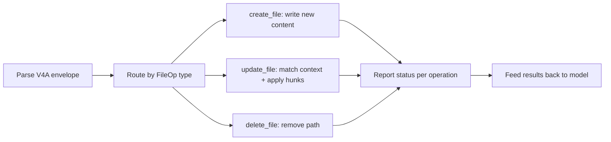

# The V4A Diff Format: How Codex CLI's apply_patch Actually Edits Your Code

**Date:** 2026-03-31
**Tags:** `apply_patch`, `V4A`, `diff-format`, `internals`, `file-editing`, `agent-loop`, `SDK`, `codex-cli`

---

Every time Codex CLI modifies a file, it does so through a single mechanism: the `apply_patch` tool emitting diffs in a format called **V4A**[^1]. Unlike traditional unified diffs or the search-and-replace blocks used by other coding agents, V4A is a purpose-built patch grammar that OpenAI's models have been specifically trained to produce[^2]. Understanding it is essential for anyone building custom harnesses, debugging failed patches, or integrating Codex models into their own tooling.

This article dissects the format, walks through the execution pipeline, compares it to competing approaches, and covers the practical edge cases you will hit in production.

## Why a Custom Diff Format?

Large language models have a fundamental constraint: they cannot directly manipulate files[^3]. They must describe intended changes through text, and a harness must interpret that description and apply it. Two design tensions dominate:

1. **Line numbers are unreliable.** Models hallucinate line numbers, especially after multiple edits shift content. Any format that depends on absolute line numbers will break.
2. **Full-file rewrites waste tokens.** Emitting an entire file for a one-line change is expensive and error-prone at scale.

OpenAI's solution was to design a context-anchored diff format — one that locates edit regions by matching surrounding code rather than trusting line numbers[^4]. The result is V4A: a compact, file-oriented patch grammar that supports creation, updates, deletion, and renaming in a single envelope.

## The V4A Grammar

The format is defined by a context-free grammar[^5]:

```
Patch     := Begin { FileOp } End
Begin     := "*** Begin Patch" NEWLINE
End       := "*** End Patch" NEWLINE
FileOp    := AddFile | DeleteFile | UpdateFile
AddFile   := "*** Add File: " path NEWLINE { "+" line NEWLINE }
DeleteFile:= "*** Delete File: " path NEWLINE
UpdateFile:= "*** Update File: " path NEWLINE [ MoveTo ] { Hunk }
MoveTo    := "*** Move to: " newPath NEWLINE
Hunk      := "@@" [ header ] NEWLINE { HunkLine }
HunkLine  := (" " | "-" | "+") text NEWLINE
```

Three line prefixes carry all the semantics:

| Prefix | Meaning |
|--------|---------|
| ` ` (space) | Context — must match existing code |
| `-` | Line to remove |
| `+` | Line to add |

### A Concrete Example

```
*** Begin Patch
*** Update File: src/auth/middleware.ts
@@ export function validateToken(
 export function validateToken(token: string): boolean {
-  const decoded = jwt.verify(token, SECRET);
-  return !!decoded;
+  try {
+    const decoded = jwt.verify(token, SECRET);
+    return !!decoded;
+  } catch {
+    logger.warn('Token validation failed');
+    return false;
+  }
 }
*** Add File: src/auth/__tests__/middleware.test.ts
+import { validateToken } from '../middleware';
+
+describe('validateToken', () => {
+  it('returns false for expired tokens', () => {
+    expect(validateToken('expired.jwt.here')).toBe(false);
+  });
+});
*** End Patch
```

The `@@` header anchors the hunk to the `export function validateToken(` line. The harness scans the file for that text, then applies context matching from there — no line numbers involved.

## How the CLI Executes Patches

The execution pipeline inside Codex CLI follows a tight loop[^6]:

```mermaid
sequenceDiagram
    participant Model as GPT-5.x Model
    participant Loop as Agent Loop
    participant Patch as apply_patch Handler
    participant FS as Filesystem

    Model->>Loop: Tool call: apply_patch(diff)
    Loop->>Patch: Parse V4A envelope
    Patch->>Patch: Split into FileOps
    loop Each FileOp
        Patch->>FS: Read current file content
        Patch->>Patch: Match context anchors
        alt Match found
            Patch->>FS: Apply additions/deletions
            Patch->>Loop: Status: completed
        else Match failed
            Patch->>Loop: Status: failed + error context
        end
    end
    Loop->>Model: Tool result(s)
    Model->>Loop: Next action or completion
```

Key implementation details:

- **Internal execution, not shell.** Despite appearing as a tool call, `apply_patch` is processed by `execApplyPatch` in the TypeScript agent (`src/utils/agent/exec.ts`), which calls `process_patch` from `apply-patch.ts`[^6]. In the Rust rewrite (`codex-rs`), equivalent logic lives in `codex-rs/core/`[^7]. No shell subprocess is spawned.
- **Progressive fuzzy matching.** The context-matching algorithm tries three strategies in order: exact match, match ignoring line endings, then match ignoring all whitespace[^3]. This handles the common case where trailing whitespace or line endings differ between the model's training data and your actual file.
- **Approval gates.** Before any patch hits the filesystem, the CLI displays a colourised diff (red for deletions, green for additions) and waits for user approval — unless running in auto-edit or full-auto mode[^6].

## The Responses API Integration

If you are building your own agent harness rather than using Codex CLI directly, the Responses API provides first-class `apply_patch` support[^1]. The workflow is:

1. **Request** — include `{"type": "apply_patch"}` in your `tools` array.
2. **Response** — the model returns `apply_patch_call` items containing `operation.type` (`create_file`, `update_file`, `delete_file`), `operation.path`, and `operation.diff`.
3. **Apply** — your harness interprets the V4A diff and modifies files.
4. **Report** — return `apply_patch_call_output` events with `status: "completed"` or `status: "failed"` plus an error message.
5. **Iterate** — the model receives your status and may issue further patches.

```bash
# Supported models for the apply_patch tool
# GPT-5.4, GPT-5.2, GPT-5.1
```

Reference implementations exist in both the Python Agents SDK (`apply_diff.py`) and the TypeScript Agents SDK (`applyDiff.ts`)[^1]. A community-maintained PyPI package, `codex-apply-patch`, extends the reference with in-memory application and PyO3 bindings[^8].

## V4A vs Competing Approaches

Every major coding agent has converged on diff-based editing, but the format details differ materially[^3]:

| Agent | Format | Anchor Strategy | Strengths |
|-------|--------|-----------------|-----------|
| **Codex (V4A)** | `*** Begin Patch` envelope with `@@` context headers | Context-line matching, progressive fuzzy | Multi-file + rename in one patch; model-trained natively |
| **Aider** | Search/Replace blocks (`<<<<<<<`/`>>>>>>>`) | Layered fuzzy matching via `difflib` | "Did you mean…" suggestions on mismatch |
| **Claude Code** | Structured `Edit` tool with `old_string`/`new_string` | Exact string match (must be unique) | Simple mental model; no format to learn |
| **Cursor** | LLM sketch → specialised Apply model | Two-stage: generation then integration | Separates intent from mechanics |
| **RooCode** | Search/Replace blocks | "Middle-out" fuzzy matching from estimated region | Relative indentation preservation |

The critical differentiator for V4A is that OpenAI has invested significant training compute to make their models fluent in this specific grammar[^2]. When GPT-4.1 shipped in April 2025, the accompanying prompt cookbook explicitly documented the format and noted "significant training effort" on patch generation[^4]. That investment has carried forward through every subsequent Codex model.

## Practical Edge Cases and Gotchas

### Multiple Context Changes in One Patch

Warp's engineering team discovered that Codex CLI's V4A parser does not correctly handle more than one `change_context` (`@@`) operation within a single file section of a patch[^9]. If you are building a custom harness, test this case explicitly.

### Whitespace Sensitivity

The fuzzy matching fallback handles trailing whitespace, but **leading indentation matters**. A Python file where the model expects four-space indentation but the file uses tabs will fail context matching. Ensure your `.editorconfig` or formatter settings are consistent.

### Azure-Hosted Models

In Codex CLI v0.80.0, PR #8763 removed the logic that appended `APPLY_PATCH_TOOL_INSTRUCTIONS` to the system prompt[^10]. This broke Azure-hosted GPT-4.1 deployments because Azure models did not have the format baked into their system behaviour. If you are running Codex against Azure OpenAI, verify that your model version includes native V4A support or inject the instructions manually.

### File Paths Must Be Relative

The grammar requires relative paths — never absolute[^5]. Paths like `/home/user/project/src/app.py` will cause the harness to reject the patch. This is a deliberate security constraint to prevent directory traversal.

## Building a Custom Harness

For teams embedding Codex models via the SDK rather than the CLI, the minimum viable harness needs four components:



Essential safeguards to implement[^1]:

1. **Path validation** — reject absolute paths and `..` traversal.
2. **Backup strategy** — snapshot files before patching, or use git stash.
3. **Atomicity decision** — choose between all-or-nothing (roll back on any failure) or per-file success/failure.
4. **Error messages** — return actionable context. `"Error: Invalid Context: @@ def fib(n):"` tells the model exactly which anchor failed, enabling self-correction on the next turn.

## Configuration in Codex CLI

The `apply_patch` behaviour is governed by the approval mode set in your `config.toml` or via the `--sandbox` flag[^6]:

```toml
# ~/.codex/config.toml

[sandbox]
# "suggest" = read-only, patches shown but not applied
# "auto-edit" = patches applied automatically, shell commands need approval
# "full-auto" = everything runs without approval
mode = "auto-edit"
```

In CI pipelines using `codex exec`, patches are applied non-interactively and the final diff is piped to stdout[^11]. This makes `apply_patch` the bridge between interactive development and automated workflows.

## What's Next for V4A

The format continues to evolve. Recent changelog entries note "more reliable file edits with `apply_patch`, fewer destructive actions such as `git reset`, and more collaborative behaviour when encountering user edits in files"[^12]. The direction is clear: make the patch loop more resilient to real-world conditions — concurrent edits, large files, and multi-model workflows where different agents may be touching the same codebase.

For developers building on Codex, the V4A format is not an implementation detail to ignore. It is the contract between model and machine — and understanding it is the difference between debugging mysterious edit failures and building robust agentic workflows.

---

## Citations

[^1]: OpenAI, "Apply Patch — OpenAI API," [https://developers.openai.com/api/docs/guides/tools-apply-patch](https://developers.openai.com/api/docs/guides/tools-apply-patch)

[^2]: OpenAI, "GPT-4.1 Prompting Guide," [https://developers.openai.com/cookbook/examples/gpt4-1_prompting_guide](https://developers.openai.com/cookbook/examples/gpt4-1_prompting_guide)

[^3]: Fabian Hertwig, "Code Surgery: How AI Assistants Make Precise Edits to Your Files," [https://fabianhertwig.com/blog/coding-assistants-file-edits/](https://fabianhertwig.com/blog/coding-assistants-file-edits/)

[^4]: OpenAI, "Codex Prompting Guide," [https://developers.openai.com/cookbook/examples/gpt-5/codex_prompting_guide](https://developers.openai.com/cookbook/examples/gpt-5/codex_prompting_guide)

[^5]: OpenAI, "codex-rs/core/prompt_with_apply_patch_instructions.md," GitHub, [https://github.com/openai/codex/blob/main/codex-rs/core/prompt_with_apply_patch_instructions.md](https://github.com/openai/codex/blob/main/codex-rs/core/prompt_with_apply_patch_instructions.md)

[^6]: PromptLayer, "How OpenAI Codex Works Behind-the-Scenes," [https://blog.promptlayer.com/how-openai-codex-works-behind-the-scenes-and-how-it-compares-to-claude-code/](https://blog.promptlayer.com/how-openai-codex-works-behind-the-scenes-and-how-it-compares-to-claude-code/)

[^7]: OpenAI, "openai/codex — Lightweight coding agent that runs in your terminal," GitHub, [https://github.com/openai/codex](https://github.com/openai/codex)

[^8]: PyPI, "codex-apply-patch," [https://pypi.org/project/codex-apply-patch/](https://pypi.org/project/codex-apply-patch/)

[^9]: Warp, "Codex Models Now Available in Warp," [https://www.warp.dev/blog/codex-models-in-warp-apply-patch-and-prompting-changes](https://www.warp.dev/blog/codex-models-in-warp-apply-patch-and-prompting-changes)

[^10]: GitHub Issue #14046, "`apply_patch` broken for Azure-hosted GPT-4.1 since v0.80.0," [https://github.com/openai/codex/issues/14046](https://github.com/openai/codex/issues/14046)

[^11]: OpenAI, "CLI — Codex | OpenAI Developers," [https://developers.openai.com/codex/cli](https://developers.openai.com/codex/cli)

[^12]: OpenAI, "Changelog — Codex | OpenAI Developers," [https://developers.openai.com/codex/changelog](https://developers.openai.com/codex/changelog)
