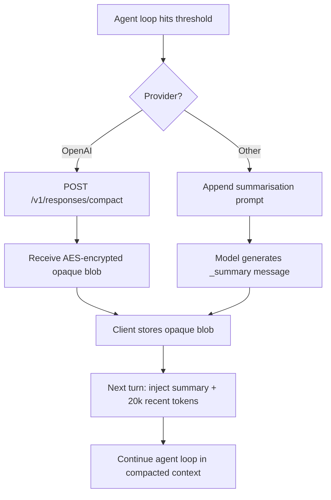

# Codex CLI Context Compaction: Architecture, Configuration, and Managing Long Sessions


Agentic coding sessions accumulate context fast. A non-trivial refactoring task — reading source files, running tests, writing patches, re-reading updated files — can saturate a 200k-token context window within a single working session.[^1] Codex CLI's context compaction system is the mechanism that keeps long sessions alive rather than crashing them into the context ceiling. Understanding its architecture, configuration knobs, and known failure modes is essential for anyone running Codex on tasks that span more than a few dozen file operations.

---

## The Two Trigger Points

Compaction fires at two distinct moments in the agent loop, not just at the end of a turn.[^2]

**Pre-turn trigger:** Before Codex sends a new user message to the model, it checks whether accumulated tokens already exceed the compaction threshold. If so, compaction runs first, producing a compressed context, and then the original user message is sent into the freshened window. The user never explicitly triggers this — it happens silently on the next `<Enter>`.

**Mid-turn trigger:** During a long tool-call chain, the model may complete a loop (all tool results received) but need to continue working. If the context has grown beyond threshold during that chain, Codex fires compaction at the loop boundary rather than waiting for the next user turn. The pending user request is preserved and replayed into the compacted context.

This dual-trigger design means compaction is woven into the agent loop itself, not bolted on as a post-processing step.

---

## Two Compaction Paths

How compaction actually works depends on your model provider.[^3]

### OpenAI Fast Path

When using OpenAI-hosted models, Codex calls a proprietary server-side endpoint — `POST /v1/responses/compact` — which returns an opaque, AES-encrypted compressed representation of the conversation.[^4] The client never inspects or modifies this blob; it simply passes it back on subsequent API calls. OpenAI's servers decrypt it, prepend a handoff message, and feed the restored context to the model.

The encryption is intentional. It prevents client-side tampering with summaries (which could be used for prompt injection), and the blob may contain structured metadata — tool call restoration data, internal state markers — that OpenAI doesn't expose to the client.[^4]

This "fast path" is fast because summarisation is offloaded to OpenAI's infrastructure. The client sees no additional latency from a local summarisation call.

### Local Path (Non-OpenAI Providers)

When you're routing through an alternative provider (Ollama, Azure, a custom endpoint), the fast path is unavailable. Codex falls back to a local approach: it appends a summarisation prompt as a user message, asks the model to produce a concise handoff summary, and stores the model's response as a user-role message prefixed with `_summary`.[^3]

This means the summarisation quality depends on your chosen model's instruction-following ability, and the summary is plaintext — inspectable and customisable.



---

## What Survives Compaction

After compaction runs, the reconstructed context contains exactly two things:[^2]

1. **One summary message** (user role) — either the opaque blob (OpenAI path) or the plaintext `_summary` response (local path)
2. **Up to 20,000 tokens of the most recent user messages** — giving the model recent conversational context that the summary might not fully capture

Everything else — previous assistant responses, tool call results, file contents read in earlier turns — is discarded. This is the source of quality degradation in very long sessions: each compaction loses fidelity that earlier turns accumulated.

Critically, Codex handles multiple compactions correctly. When collecting user messages to preserve, it detects and excludes any prior `_summary` messages, so only the freshest summary survives. Stale summaries don't accumulate.

---

## Configuration

### Compaction Threshold

The 90% hard ceiling is enforced in code as:[^5]

```
effective_auto_compact_limit = min(user_config_limit, context_window * 90%)
```

You can lower the threshold — pushing compaction to fire earlier — but you cannot raise it above 90%. Attempting to set `model_auto_compact_token_limit` higher than 90% of the context window is silently ignored. This cap was introduced in v0.100.0 and is intentional: pre-v0.100.0 behaviour allowed overflows that caused backend errors.[^5]

Relevant `~/.codex/config.toml` keys:

```toml
# Fire compaction when this many tokens are accumulated
# Must be ≤ 90% of model_context_window (hard cap enforced server-side)
model_auto_compact_token_limit = 180000

# Override the model's advertised context window for compaction calculations
model_context_window = 200000

# Cap individual tool / function output contributions to the context
tool_output_token_limit = 16000
```

### Custom Compaction Prompts

The local path's summarisation prompt is configurable. Use `compact_prompt` for a quick inline override:

```toml
compact_prompt = """
Summarise this coding session as a structured handoff for another AI engineer.
Include: current task, files modified (with brief description of each change),
decisions made and their rationale, blockers encountered, and clear next steps.
Use bullet lists. Be concise but complete.
"""
```

For longer prompts, use the file-based option (experimental):

```toml
experimental_compact_prompt_file = "~/.codex/prompts/compaction.md"
```

⚠️ `experimental_compact_prompt_file` is marked experimental and its behaviour may change without notice.

**Important:** Custom compaction prompts only affect the local path. When using OpenAI-hosted models, the fast path is used and summarisation happens server-side; your `compact_prompt` setting is ignored.

### Manual Compaction

Trigger compaction explicitly mid-session with the `/compact` command in the TUI. As of v0.117.0, you can queue follow-up instructions during a manual compact without losing them:[^6]

```
/compact Focus particularly on the authentication refactor and the three failing tests.
```

The custom instruction is passed to the summarisation step, biasing the summary towards information you know you'll need next.

---

## Known Failure Modes

### Compaction Death Spiral (v0.112, Fixed)

GitHub issue [#14120](https://github.com/openai/codex/issues/14120) documented a severe regression in v0.112: with `xhigh` reasoning effort and a moderately-sized codebase (under 30 files), the agent would compact down to roughly 12% remaining context, read a few files, hit the threshold again, compact again — cycling indefinitely without making meaningful code changes.[^7] One user reported 80% of their monthly credit quota consumed through compaction cycles alone, with no file modifications to show for it.

The root cause was an interaction between `xhigh` reasoning effort (which consumes tokens more aggressively in the reasoning trace) and the compaction logic, causing a feedback loop. The issue was resolved in subsequent releases; if you're on v0.109 or earlier and see similar behaviour, upgrading to v0.117.x is the fix. In the interim, dropping reasoning effort from `xhigh` to `high` was the reliable workaround.

### The 90% Clamp Overrides User Configuration

As noted above, the hard 90% cap silently ignores `model_auto_compact_token_limit` values that exceed the cap. If you've set an explicit limit expecting it to be honoured precisely, verify with a test session. OpenAI closed issue [#11805](https://github.com/openai/codex/issues/11805) as "not planned", so this is by-design behaviour, not a bug to be fixed.[^5]

---

## Codex vs Claude Code: A Design Comparison

The two dominant AI coding tools handle compaction quite differently:[^4]

| Aspect | Codex CLI (OpenAI path) | Claude Code |
|---|---|---|
| Summary format | AES-encrypted opaque blob | Human-readable markdown |
| Client visibility | None — client can't inspect | Full — user can read the summary |
| Customisation | `compact_prompt` (local path only) | `instructions` parameter |
| Trust model | Server controls fidelity | User controls fidelity |
| Tampering prevention | Encryption enforces integrity | No structural enforcement |

Claude Code's approach is more transparent: you can read what was summarised, and you can customise the instructions. Codex's encrypted fast path trades transparency for security and performance — summarisation is faster when offloaded, and encryption prevents a class of prompt injection attacks where a malicious summary could steer the model's subsequent behaviour.

For teams working with sensitive codebases, the opacity of Codex's fast path raises a different concern: you cannot audit what the summary contains. This is worth factoring in for compliance-sensitive environments.

---

## Practical Recommendations

**Structure long tasks into phases.** Rather than running a single open-ended session for a large migration, break it into sessions with clear completion criteria. Fewer compactions means less fidelity loss.

**Use `tool_output_token_limit` aggressively.** Large test suite outputs and verbose command results are a major source of rapid token accumulation. Capping tool outputs keeps the context from filling prematurely:

```toml
tool_output_token_limit = 8000
```

**Reserve `xhigh` for reasoning-heavy tasks.** The death spiral that hit v0.112 was triggered by `xhigh` + compaction interaction. Even on fixed versions, `xhigh` reasoning effort consumes tokens faster, pushing you towards the compaction threshold sooner. Use it for complex reasoning tasks, not routine file edits.

**Write targeted compaction prompts for specific workflows.** A compaction prompt tuned for a refactoring task (emphasising changed interfaces and rationale) differs from one tuned for debugging (emphasising reproduction steps and hypotheses tested). The `experimental_compact_prompt_file` approach lets you maintain several domain-specific prompts.

**Monitor context pressure with `/compact` before it auto-fires.** If you know a session is getting long, running `/compact` manually — with a custom instruction — gives you control over when summarisation happens and what it emphasises, rather than letting the automatic trigger catch it at a potentially awkward mid-turn moment.

---

## Citations

[^1]: Codex context window and agentic session scaling described in OpenAI Codex documentation — https://developers.openai.com/codex
[^2]: Dual-trigger compaction architecture (pre-turn and mid-turn) documented in — https://wasnotwas.com/writing/context-compaction/
[^3]: Two-path compaction architecture (OpenAI fast path vs local path) — https://wasnotwas.com/writing/context-compaction/
[^4]: AES-encrypted server-side compaction, opaque blob architecture, and Claude Code comparison — https://tonylee.im/en/blog/codex-compaction-encrypted-summary-session-handover
[^5]: Hard 90% compaction clamp introduced in v0.100.0, closed as intentional — https://github.com/openai/codex/issues/11805
[^6]: v0.117.0 release: queue follow-ups during manual `/compact` (PR #15259) — https://github.com/openai/codex/releases/tag/v0.117.0
[^7]: Compaction death spiral bug in v0.112 with xhigh reasoning effort — https://github.com/openai/codex/issues/14120
