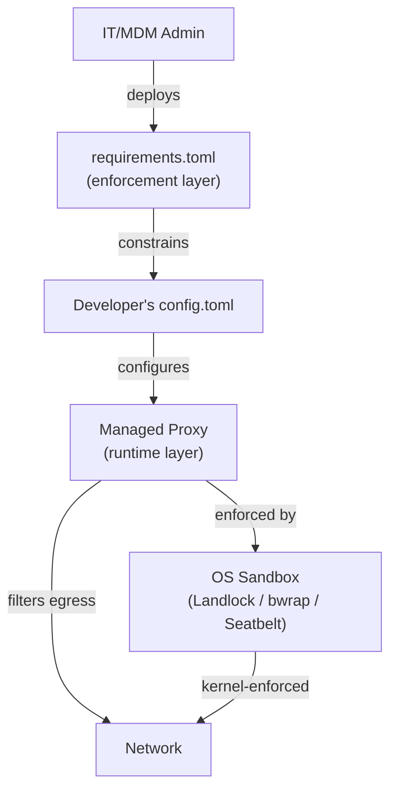
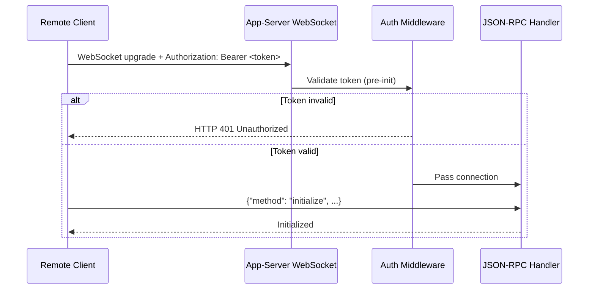
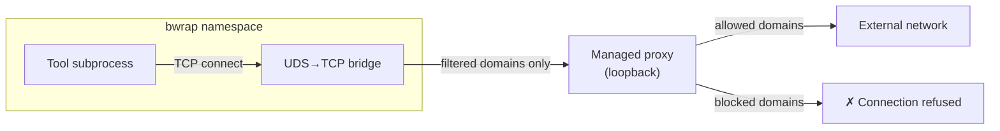
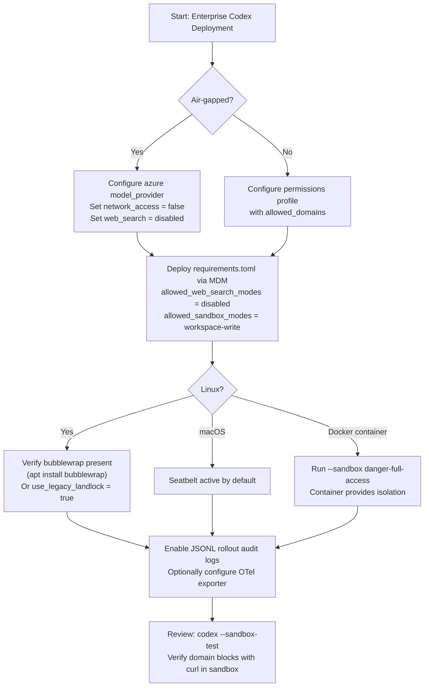

# Codex CLI Network Security: requirements.toml Enforcement, Landlock, and Air-Gapped Deployments


Enterprise teams deploying Codex CLI face two distinct network security challenges. The first is *operator enforcement*: ensuring that individual developers cannot weaken security policies set by the organisation. The second is *runtime isolation*: ensuring that the agent itself can only reach the network endpoints it genuinely needs. Codex addresses both through a layered architecture — `requirements.toml` for policy enforcement and the managed proxy plus OS-level sandbox primitives for runtime isolation — but the two layers are frequently confused. This article separates them clearly and shows how to configure each for regulated and air-gapped environments.

---

## The Default Stance: Network Off

By design, every Codex sandbox mode starts with network access disabled for the agent phase.[^7] The agent phase — where the model executes shell commands and reads files — is where prompt injection and data exfiltration risks are highest. Setup scripts that run before the agent phase retain internet access so that dependencies can be installed normally.

| Mode | Network | File writes | Intended use |
|------|---------|-------------|--------------|
| `read-only` | Off | None | Safe exploration |
| `workspace-write` | Off (configurable) | Workspace only | Standard development |
| `danger-full-access` | On | Unrestricted | High-risk / explicitly opted-in |

In `danger-full-access`, the `web_search` mode also automatically switches from `"cached"` (OpenAI's pre-indexed content) to `"live"` (real-time fetching).[^3] That distinction matters for prompt injection: cached search results are curated by OpenAI, whereas live mode can retrieve arbitrary third-party content that could contain injected instructions.

---

## The Two-Layer Model



The enforcement layer (`requirements.toml`) prevents a developer from *configuring* a policy that violates organisational rules. The runtime layer (managed proxy + OS sandbox) enforces those policies on actual subprocess network calls, regardless of whether the developer configured them correctly.[^1]

---

## requirements.toml: The Enforcement Layer

`requirements.toml` is an admin-controlled file that constrains security-sensitive configuration. Developers cannot override values that `requirements.toml` disallows — when a conflict is detected, Codex falls back to the nearest compatible value and notifies the user.[^2]

### Deployment Locations

| Platform | Path |
|---|---|
| Linux / macOS (system) | `/etc/codex/requirements.toml` |
| macOS (MDM) | `com.openai.codex` pref key `requirements_toml_base64` |
| Windows | `~/.codex/managed_config.toml` |
| ChatGPT Business/Enterprise | Cloud-fetched automatically at sign-in |

Cloud-fetched requirements (from ChatGPT Business/Enterprise plans) take precedence over local system files, providing a single source of truth for organisations managing both local CLI and cloud surfaces.[^2]

### Core Enforcement Keys

```toml
# /etc/codex/requirements.toml

# Prevent developers from disabling approvals entirely
allowed_approval_policies = ["on-request", "untrusted"]

# Prevent full-access sandbox mode
allowed_sandbox_modes = ["read-only", "workspace-write"]

# Restrict web search — empty array means "disabled only"
allowed_web_search_modes = ["disabled"]

# Lock specific feature flags
[features]
use_legacy_landlock = false   # force bubblewrap, not legacy Landlock
voice_transcription = false   # disable in regulated environments

# MCP server allowlist — only named, identity-matched servers permitted
[[mcp_servers]]
name = "internal-docs"
command = "/usr/local/bin/docs-mcp-server"

# Command rules — require prompt before git push, forbid curl to public internet
[[rules.prefix_rules]]
prefix = ["git", "push"]
policy = "prompt"

[[rules.prefix_rules]]
prefix = ["curl", "https://"]
policy = "forbidden"
```

### Web Search Mode Enforcement

The `web_search` configuration key accepts three values: `disabled`, `cached` (OpenAI-maintained index, no live egress), and `live` (real-time fetch).[^3] In regulated environments, lock to `disabled`:

```toml
# requirements.toml
allowed_web_search_modes = ["disabled"]
```

This blocks both the built-in web search tool and any MCP servers that perform live searches, since the MCP allowlist enforcement also applies.[^2]

---

## The Runtime Layer: Managed Proxy and OS Sandbox

When `requirements.toml` has constrained the policy, the runtime layer enforces it at the OS level. There are two mechanisms at play: the managed proxy (for domain-level filtering) and the OS sandbox primitive (for syscall-level enforcement).

### Domain Allow-Lists via Managed Proxy

Domain-level filtering requires a named permissions profile with the managed proxy enabled. The CLI's binary `network_access` flag only turns network on or off — for per-domain control, you must use the `permissions.<name>.network` table:[^3]

```toml
# ~/.codex/config.toml  (or project .codex/config.toml)

[permissions.corp-egress.network]
enabled = true
mode = "limited"                          # proxy-only; blocks direct sockets
allowed_domains = [
  "registry.npmjs.org",
  "pypi.org",
  "github.com",
  "*.internal.corp.example.com",
]
denied_domains = [
  "pastebin.com",
  "webhook.site",
]
allow_local_binding = false
proxy_url = "http://127.0.0.1:40301"     # managed proxy listener address

default_permissions = "corp-egress"       # apply this profile by default
```

Wildcard domains (`*.internal.corp.example.com`) are supported for subdomain matching.[^3] The `denied_domains` list operates as an explicit blocklist that takes precedence over the allowlist, useful for blocking known exfiltration endpoints even when broader access is permitted.

OpenAI provides three preset profiles in Codex web environments:[^7]

- **None** — empty list; every permitted domain must be enumerated explicitly.
- **Common dependencies** — a curated set of 70+ package registries, CDNs, and source control hosts (npm, PyPI, crates.io, Docker Hub, Maven, etc.).
- **All (unrestricted)** — no filtering.

The CLI equivalent is to populate `allowed_domains` manually or reference a shared `managed_config.toml` for team-wide defaults.

### HTTP Method Filtering

Domain allowlisting answers *where* the agent can connect; HTTP method filtering answers *what it can do* once connected. With filtering active, only idempotent, read-only methods pass:[^8]

- **Permitted:** `GET`, `HEAD`, `OPTIONS`
- **Blocked:** `POST`, `PUT`, `PATCH`, `DELETE` and all others

This prevents the agent from submitting forms, calling state-changing API endpoints, or exfiltrating data via a POST body — even to an explicitly allowlisted domain.

### Corporate Upstream Proxy Chaining

In environments where all egress must traverse a corporate HTTPS proxy (e.g., Zscaler, Netskope), chain the managed proxy to the upstream:

```toml
[permissions.corp-egress.network]
enabled = true
mode = "limited"
allowed_domains = ["registry.npmjs.org", "pypi.org"]
allow_upstream_proxy = true
proxy_url = "http://127.0.0.1:40301"
# Upstream proxy injected via environment variable HTTPS_PROXY, or:
# socks_url = "socks5://proxy.corp.example.com:1080"
```

For authenticated upstream proxies, inject credentials via `env_http_headers` on the model provider entry — this keeps secrets out of the TOML file and reads them from environment variables at runtime:[^3]

```toml
[model_providers.azure-corp]
name = "Azure Corp"
base_url = "https://my-instance.openai.azure.com/openai"
api_key_env_var = "AZURE_OPENAI_API_KEY"

[model_providers.azure-corp.env_http_headers]
"Proxy-Authorization" = "PROXY_AUTH_HEADER"  # value read from $PROXY_AUTH_HEADER env var
"api-version" = "AZURE_API_VERSION"
```

---

## SOCKS5 Proxy Integration

Codex has supported SOCKS5 proxies since v0.93.0 (December 2025), primarily for corporate environments that route all outbound traffic through a SOCKS5 gateway.[^9]

For the CLI process itself, configure the proxy under `[network]`:

```toml
[network]
proxy    = "socks5://proxy.corp.example.com:1080"
no_proxy = ["localhost", "127.0.0.1", "*.internal.example.com"]
```

Authenticated proxies use the standard `user:pass@host:port` form. Standard environment variables (`ALL_PROXY`, `HTTPS_PROXY`, `HTTP_PROXY`) are also honoured automatically, meaning most CI environments that already set these variables will route Codex traffic through the corporate proxy without additional configuration.

For tools running inside the sandbox that speak SOCKS5 natively (e.g. Git with `socks5://` in `http.proxy`), the managed proxy can be exposed as a SOCKS5 listener:

```toml
[permissions.network]
enable_socks5 = true
socks_url     = "http://127.0.0.1:43130"
```

UDP-over-SOCKS5 is disabled by default (`enable_socks5_udp = false`) and should only be enabled if a specific tool requires it, as it widens the attack surface.

---

## Bearer Token Authentication for Remote App-Server

v0.117.0 (26 March 2026) introduced two bearer-token authentication modes for the app-server's WebSocket listener.[^10] This is primarily relevant when Codex is embedded in a remote environment (CI runner, cloud VM) and a client UI needs to connect over a network rather than loopback.



### Capability Token

A simple static token stored in a file. Suitable for single-client deployments or SSH port-forwarding scenarios:

```bash
codex app-server \
  --ws-auth capability-token \
  --ws-token-file /run/secrets/codex-token
```

### Signed Bearer Token (HMAC-Signed JWS)

For environments with multiple clients or token rotation requirements, signed tokens provide time-bounded credentials verifiable without a database lookup:

```bash
codex app-server \
  --ws-auth signed-bearer-token \
  --ws-shared-secret-file /run/secrets/codex-hmac-secret \
  --ws-issuer "ci-runner" \
  --ws-audience "codex-agent" \
  --ws-max-clock-skew-seconds 30
```

Clock skew tolerance (`--ws-max-clock-skew-seconds`) is critical in CI environments where container clocks may drift. Tokens are validated against `iss` and `aud` claims; mismatches are rejected before any JSON-RPC processing occurs.

The loopback address (`ws://127.0.0.1`) is the recommended listener for SSH port-forwarding deployments. Non-loopback listeners currently allow unauthenticated connections by default during rollout.[^10] If the WebSocket is exposed on `0.0.0.0`, use bearer-token auth and firewall the port externally.

Authentication is enforced *before* the JSON-RPC `initialize` call. Pre-init requests return `"Not initialized"`; server overload returns JSON-RPC error code `-32001` (`"Server overloaded; retry later"`) — implement exponential backoff with jitter.

---

## Approval Policies

Sandbox permissions control what Codex *can* do; approval policies control when it *must ask first*. The two are orthogonal and should both be configured.[^8]

```toml
# Coarse-grained options:
approval_policy = "on-request"  # prompt for network access and risky ops
approval_policy = "never"       # full autonomy; use only in highly controlled envs
approval_policy = "untrusted"   # auto-allow known-safe ops; prompt for risky

# Fine-grained control:
approval_policy = { granular = {
  sandbox_approval    = true,
  rules               = true,
  mcp_elicitations    = true,
  request_permissions = false,
  skill_approval      = false
} }
```

Use `/approvals` or `/permissions` in the interactive CLI to inspect and change the active policy at runtime without restarting the session.

---

## Linux Sandbox Internals: Bubblewrap and Landlock

On Linux, Codex uses two distinct sandboxing approaches. Understanding which is active matters for container deployments and air-gapped environments.

### Bubblewrap Pipeline (Default)

The current default is the **bubblewrap pipeline**.[^4] When `bwrap` is present on `PATH`, Codex uses it to:

1. Mount the filesystem read-only by default via `--ro-bind / /`
2. Layer writable roots with `--bind <root> <root>`
3. Re-apply `.git`, resolved `gitdir:` entries, and `.codex` as read-only even within writable roots
4. Isolate the user namespace (`--unshare-user`) and PID namespace (`--unshare-pid`)
5. When network is restricted without proxy: isolate the network namespace (`--unshare-net`)

In managed proxy mode, the sandbox uses `--unshare-net` plus an internal TCP→UDS→TCP routing bridge rather than full network isolation, so the proxy itself remains reachable. After the bridge activates, `seccomp` blocks new `AF_UNIX`/`socketpair` creation for the user command.[^4] The helper also applies `PR_SET_NO_NEW_PRIVS` to prevent privilege escalation.



### Legacy Landlock Fallback

Legacy Landlock + mount protections remain available for environments where bubblewrap is unavailable or undesirable. Force it explicitly:[^4]

```toml
# config.toml
[features]
use_legacy_landlock = true
```

Or via CLI flag: `codex -c use_legacy_landlock=true`.

Note that `requirements.toml` can *prevent* use of legacy Landlock by setting `features.use_legacy_landlock = false`, ensuring all deployments use the bubblewrap pipeline.[^2]

### Container Deployments

Docker and other OCI containers often restrict the kernel features that bubblewrap requires. When `bwrap` cannot build valid loopback proxy routes, it fails closed — the agent cannot execute tool calls at all.[^4] The recommended pattern for containerised deployments:

```dockerfile
# Dockerfile — let the container provide isolation
FROM ubuntu:24.04
RUN apt-get install -y codex
# The container IS the sandbox; no nested bubblewrap needed
```

```bash
# Run Codex with full access inside an already-isolated container
codex --sandbox danger-full-access --full-auto "your task"
```

Use `--add-dir <path>` rather than `--sandbox danger-full-access` when you only need to extend writable roots beyond the project directory.[^5]

---

## Air-Gapped Deployments with Azure OpenAI

For environments with no outbound internet access to OpenAI's API, configure Codex to use an Azure OpenAI endpoint exclusively. The `requirements.toml` MCP server allowlist and `allowed_web_search_modes = ["disabled"]` prevent accidental calls to public endpoints.[^2]

```toml
# ~/.codex/config.toml — air-gapped profile

[model_providers.azure-airgapped]
name = "Azure Air-Gapped"
base_url = "https://codex-prod.openai.azure.com/openai"
api_key_env_var = "AZURE_OPENAI_KEY"
model = "gpt-4.5-codex"

[model_providers.azure-airgapped.env_http_headers]
"api-version" = "AZURE_API_VERSION"    # e.g. "2025-01-01-preview"

[profiles.airgapped]
model = "azure-airgapped/gpt-4.5-codex"
web_search = "disabled"
sandbox_mode = "workspace-write"

[profiles.airgapped.sandbox_workspace_write]
network_access = false

default_profile = "airgapped"
```

```toml
# /etc/codex/requirements.toml — enforce air-gapped posture org-wide

allowed_web_search_modes = ["disabled"]
allowed_sandbox_modes = ["read-only", "workspace-write"]
allowed_approval_policies = ["on-request", "untrusted"]

# Only the internal Azure MCP server is permitted
[[mcp_servers]]
name = "internal-tools"
url = "https://mcp.internal.corp.example.com"
```

⚠️ Entra ID (Azure AD) token authentication for Azure AI Foundry endpoints currently requires a workaround — see [issue #13241](https://github.com/openai/codex/issues/13241) — as Codex does not yet natively support the `az login` token exchange flow. Use API key authentication via `api_key_env_var` for production air-gapped deployments until this is resolved.

---

## JSONL Audit Logging for Compliance

Codex automatically writes per-session JSONL logs to `$CODEX_HOME/sessions/YYYY/MM/DD/rollout-*.jsonl`.[^6] Each file contains the full session: user/assistant messages, tool calls, approvals, and errors. These logs are the primary audit trail for demonstrating compliance.

For explicit audit workflows:

```bash
# Capture a specific session to a named transcript
codex --full-auto \
  --transcript analysis/$(date +%Y-%m-%d)_network-audit.jsonl \
  "run npm install and build"

# Review all tool calls in a session
jq 'select(.type == "tool_call")' \
  ~/.codex/sessions/2026/03/31/rollout-*.jsonl
```

For structured telemetry, opt in to OpenTelemetry export — off by default:

```toml
[otel.exporter.corp-collector]
endpoint = "https://otel.internal.corp.example.com:4318"
protocol = "http/protobuf"

[otel.exporter.corp-collector.headers]
"Authorization" = "Bearer <token>"
```

Enable JSON-format app-server logs for integration with your SIEM:

```bash
LOG_FORMAT=json codex --full-auto "your task" 2> /var/log/codex/session.jsonl
```

---

## MDM-Managed Deployment

For MDM-managed deployments (macOS via Jamf Pro, Fleet, Kandji), two preference keys under the `com.openai.codex` domain control policy enforcement:[^2]

- **`config_toml_base64`** — encoded defaults that apply unless overridden by project config.
- **`requirements_toml_base64`** — encoded constraints that Codex *rejects* any user config conflicting with.

Configuration precedence (highest to lowest): MDM managed preferences, then `managed_config.toml`, then `~/.codex/config.toml`, then project `.codex/config.toml`.

---

## Threat Model Summary

OpenAI explicitly documents four categories of risk when internet access is enabled:[^7]

1. **Prompt injection** — Agent fetches a web page or README containing crafted instructions that alter its behaviour. Mitigate with `web_search = "cached"` and tight domain allowlists.
2. **Data exfiltration** — Malicious scripts pipe environment variables, secrets, or git history to attacker-controlled endpoints. Mitigate with HTTP method filtering (block POST) and denylist of exfiltration targets.
3. **Malware inclusion** — Typosquatted packages or compromised dependencies fetched at install time. Mitigate with checksum verification in setup scripts and pinned dependency versions.
4. **Licence contamination** — Copyleft content incorporated without review. Mitigate with post-session licence scanning.

The layered approach — sandbox off by default, managed proxy with domain allowlist, method filtering, and approval prompts — addresses all four threat categories at different points in the attack chain.

---

## Putting It Together: Enterprise Hardening Checklist



| Layer | Mechanism | Key Config |
|---|---|---|
| Policy enforcement | `requirements.toml` | `allowed_*` keys, MDM deployment |
| Domain filtering | Managed proxy | `permissions.<n>.network.allowed_domains` |
| Binary network control | Sandbox | `sandbox_workspace_write.network_access` |
| OS enforcement (Linux) | bubblewrap + seccomp | `features.use_legacy_landlock` |
| Egress audit | JSONL rollouts + OTel | `$CODEX_HOME/sessions/` + `otel.exporter` |
| Web search lockdown | `requirements.toml` | `allowed_web_search_modes = ["disabled"]` |

The enforcement layer and runtime layer must both be configured — `requirements.toml` alone does not apply network filtering; it only prevents developers from disabling the filtering you configure in `config.toml`. Deploying both is the only way to achieve defence-in-depth.

---

## Citations

[^1]: [Agent approvals & security – Codex | OpenAI Developers](https://developers.openai.com/codex/agent-approvals-security)
[^2]: [Managed configuration – Codex | OpenAI Developers](https://developers.openai.com/codex/enterprise/managed-configuration)
[^3]: [Configuration Reference – Codex | OpenAI Developers](https://developers.openai.com/codex/config-reference)
[^4]: [Linux sandbox README – openai/codex on GitHub](https://github.com/openai/codex/blob/main/codex-rs/linux-sandbox/README.md)
[^5]: [Sandboxing – Codex | OpenAI Developers](https://developers.openai.com/codex/concepts/sandboxing)
[^6]: [Session/Rollout Files discussion – openai/codex GitHub Discussions #3827](https://github.com/openai/codex/discussions/3827)
[^7]: [Agent internet access – Codex web | OpenAI Developers](https://developers.openai.com/codex/cloud/internet-access)
[^8]: [Agent approvals & security – Codex | OpenAI Developers](https://developers.openai.com/codex/agent-approvals-security)
[^9]: [Codex CLI Changelog – v0.93.0, ~Dec 2025](https://developers.openai.com/codex/changelog) — SOCKS5 proxy support with policy enforcement
[^10]: [Codex App-Server README – GitHub openai/codex](https://github.com/openai/codex/blob/main/codex-rs/app-server/README.md) — Bearer-token auth modes and non-loopback caveats
