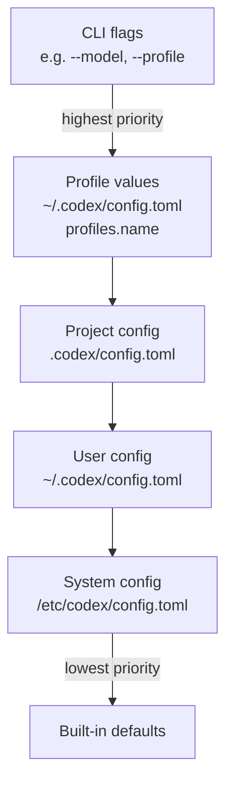

# Codex CLI Profiles: Advanced Configuration Switching for Multi-Workflow Development


Most Codex CLI users maintain a single `~/.codex/config.toml` and live with its trade-offs. A model that's fast enough for quick edits may be underpowered for a deep code review. A sandbox policy tuned for interactive work may be too permissive for a headless CI run. The profiles system — experimental as of early 2026 — is the answer to this context-switching problem, letting you define named configuration presets and switch between them with a single flag.[^1]

This article is a field guide for senior developers: what profiles actually control, how they compose with feature flags and project config, and what practical presets look like for real-world workflows.

---

## The Problem Profiles Solve

A typical week involves at least three distinct Codex modes:

- **Exploratory sprints**: rapid iteration, cheap model, minimal approval friction
- **Deep review**: high reasoning effort, stricter sandbox, `gpt-5-codex-max` or `gpt-5.4` with `xhigh` effort
- **CI/headless automation**: non-interactive, `--full-auto`, ephemeral session, read-only sandbox

Without profiles, switching between these requires either multiple config files managed by hand, wrapper scripts that set environment variables, or — most commonly — just using the same settings for everything and accepting the cost/quality mismatch.[^2]

Profiles give you named presets that override top-level config values. You can activate one with `codex --profile ci` and return to your default with `codex` alone.

---

## Profile Basics: TOML Syntax

Profiles live under `[profiles.<name>]` tables in `config.toml`. The file can be your user-level `~/.codex/config.toml` or a project-scoped `.codex/config.toml`. Both are valid; project-level overrides user-level for all keys outside a profile, but profiles themselves live in whichever file you define them.[^3]

```toml
# ~/.codex/config.toml

# Top-level defaults
model = "gpt-5.4-mini"
model_reasoning_effort = "medium"
approval_policy = "on-request"
sandbox_mode = "workspace-write"

[profiles.sprint]
model = "gpt-5.4-mini"
model_reasoning_effort = "low"
approval_policy = "auto-approve-all"
sandbox_mode = "workspace-write"
personality = "pragmatic"

[profiles.deep-review]
model = "gpt-5.4"
model_reasoning_effort = "xhigh"
plan_mode_reasoning_effort = "xhigh"
approval_policy = "on-request"
sandbox_mode = "read-only"
personality = "none"

[profiles.ci]
model = "gpt-5.4-mini"
model_reasoning_effort = "medium"
approval_policy = "auto-approve-all"
sandbox_mode = "read-only"
web_search = "disabled"
analytics.enabled = false
```

Activate a profile:

```bash
# Single session override
codex --profile deep-review

# Or as a default (persists across sessions)
# Add to config.toml root:
# profile = "deep-review"
```

---

## All Profile-Scoped Keys

The following keys can appear inside any `[profiles.<name>]` table.[^4] Not all top-level keys are profile-overridable — the list is narrower than the full config reference:

| Key | Type | Notes |
|-----|------|-------|
| `model` | string | Model slug — e.g. `"gpt-5.4"`, `"gpt-5.4-mini"`, `"gpt-5-codex"` |
| `model_reasoning_effort` | string | `"minimal"` \| `"low"` \| `"medium"` \| `"high"` \| `"xhigh"` |
| `plan_mode_reasoning_effort` | string | Separate effort level for Plan mode turns |
| `model_reasoning_summary` | string | `"auto"` \| `"concise"` \| `"detailed"` — controls reasoning trace verbosity |
| `model_verbosity` | string | `"low"` \| `"medium"` \| `"high"` — controls agent message length |
| `model_instructions_file` | path | Points to a `.md` system-instructions override for this profile |
| `model_catalog_json` | path | Profile-scoped model catalog; overrides the top-level value when both are set |
| `approval_policy` | string | `"on-request"` \| `"auto-approve-tools"` \| `"auto-approve-all"` |
| `sandbox_mode` | string | `"read-only"` \| `"workspace-write"` \| `"danger-full-access"` |
| `service_tier` | string | `"flex"` \| `"fast"` |
| `personality` | string | `"none"` \| `"friendly"` \| `"pragmatic"` |
| `web_search` | string | `"disabled"` \| `"cached"` \| `"live"` |
| `oss_provider` | string | `"lmstudio"` \| `"ollama"` — local provider for this profile |
| `tools_view_image` | bool | Enable/disable image viewing tool |
| `windows.sandbox` | string | Windows-only sandbox mode override |
| `analytics.enabled` | bool | Opt out of analytics for this profile (e.g. in CI) |
| `experimental_use_unified_exec_tool` | bool | Legacy exec tool toggle; prefer `[features].unified_exec` |

Note that `mcp_servers`, `model_providers`, and `[otel]` are **not** profile-overridable — they apply globally.[^4]

---

## Feature Flags: The `[features]` Table

Feature flags are separate from profiles but complement them. They live under `[features]` in `config.toml` and control experimental or optional capabilities for the entire session (not per-profile).[^5]

```toml
[features]
shell_tool = true             # default: true (stable)
multi_agent = true            # default: true (stable)
unified_exec = true           # default: true on non-Windows (stable)
shell_snapshot = true         # default: true (stable)
personality = true            # default: true (stable)
fast_mode = true              # default: true (stable)
enable_request_compression = true  # default: true (stable)
skill_mcp_dependency_install = true  # default: true (stable)

# Experimental — opt-in explicitly
codex_hooks = false           # lifecycle hooks engine
smart_approvals = false       # guardian subagent routing
prevent_idle_sleep = false    # prevent macOS sleep during long turns
undo = false                  # undo support (stable but off by default)
apps = false                  # ChatGPT Apps/connectors
```

The `codex features` subcommand provides a CLI interface:

```bash
# List all flags and their current state
codex features list

# Enable a flag (writes to ~/.codex/config.toml)
codex features enable codex_hooks
codex features enable smart_approvals

# Disable a flag
codex features disable apps

# When using --profile, changes write to that profile's scope
codex --profile ci features enable smart_approvals
```

One flag worth highlighting: `undo`. It's listed as stable but defaults to off, meaning most developers have never seen Codex's undo capability. Enable it globally and you get a `/undo` command to roll back the last agent action — genuinely useful during exploratory sessions.[^5]

---

## Configuration Precedence

Understanding the full precedence stack prevents surprising overrides:[^6]



Two edge cases to be aware of:

1. **`model_catalog_json` precedence flip**: When both the top-level config and the selected profile define `model_catalog_json`, the profile value wins. This is the only key where profile explicitly beats top-level within the same file.[^6]

2. **`-c / --config` one-off overrides**: You can override any key for a single run without touching config files:

   ```bash
   codex --config model_reasoning_effort=xhigh "Review this PR"
   codex --config sandbox_mode=danger-full-access "Run the migration script"
   ```

   These are highest-priority and are not written to disk.

3. **Profile + project config**: A project's `.codex/config.toml` applies before the user profile, so a project can set a default profile with `profile = "ci"` to ensure all team members use consistent settings when running Codex in that repo.

---

## Practical Profile Patterns

### The Sprint Profile

For rapid iteration where you want maximum throughput and minimum friction:

```toml
[profiles.sprint]
model = "gpt-5.4-mini"
model_reasoning_effort = "low"
approval_policy = "auto-approve-all"
sandbox_mode = "workspace-write"
personality = "pragmatic"
web_search = "cached"
model_verbosity = "low"
```

Run with `codex --profile sprint` or alias it in your shell:

```bash
alias cs='codex --profile sprint'
```

### The Deep Review Profile

For thorough code review, architecture planning, or preparing a PR for a sensitive service:

```toml
[profiles.deep-review]
model = "gpt-5.4"
model_reasoning_effort = "xhigh"
plan_mode_reasoning_effort = "xhigh"
model_reasoning_summary = "detailed"
approval_policy = "on-request"
sandbox_mode = "read-only"
web_search = "live"
model_verbosity = "high"
personality = "none"
```

Pair with the `/review` command and a dedicated AGENTS.md section for review conventions:

```bash
codex --profile deep-review "/review --base main"
```

### The CI Profile

For headless pipeline runs — maximise predictability, minimise cost and side effects:

```toml
[profiles.ci]
model = "gpt-5.4-mini"
model_reasoning_effort = "medium"
approval_policy = "auto-approve-all"
sandbox_mode = "read-only"
web_search = "disabled"
analytics.enabled = false
model_verbosity = "low"
```

In GitHub Actions:

```yaml
- name: Codex code review
  run: |
    codex exec \
      --profile ci \
      --ephemeral \
      --full-auto \
      --json \
      "Review the diff against our coding standards" \
      | tee review.jsonl
```

### The Local LLM Profile

For cost-zero local runs using Ollama or LM Studio:

```toml
[profiles.local]
oss_provider = "ollama"
model = "qwen2.5-coder:32b"
model_reasoning_effort = "medium"
approval_policy = "on-request"
sandbox_mode = "workspace-write"
web_search = "disabled"
analytics.enabled = false
```

Switch to it when working offline or prototyping tasks that don't need frontier model quality.[^7]

---

## Profile-Scoped Instructions Files

The `model_instructions_file` key lets each profile load a different system instruction file. This is powerful for per-role context without bloating a single AGENTS.md:

```toml
[profiles.security-audit]
model = "gpt-5.4"
model_reasoning_effort = "high"
model_instructions_file = "~/.codex/instructions/security-audit.md"
sandbox_mode = "read-only"

[profiles.doc-writer]
model = "gpt-5.4-mini"
model_reasoning_effort = "low"
model_instructions_file = "~/.codex/instructions/technical-writer.md"
personality = "friendly"
```

Each instructions file is a Markdown file that prepends system context. You can maintain a library of persona files and swap them in per profile.

---

## Limitations and Known Issues

**IDE extension not supported**: Profiles work only with the CLI. The VS Code, Cursor, and Windsurf extensions do not honour the `--profile` flag and always use top-level config values.[^1]

**Experimental status**: The profile system may change between minor versions. The key list above reflects the configuration reference as of March 2026; new keys may become profile-overridable in future releases. Pin your Codex CLI version in CI if you rely on specific profile behaviour.

**Feature flags are global**: You cannot have `codex_hooks = true` in one profile and `codex_hooks = false` in another. Feature flags apply to the session regardless of which profile is active.

**`codex exec` profile bug (fixed in v0.114.0+)**: Earlier versions of `codex exec --profile` did not correctly preserve profile-scoped settings when resuming a thread. This is resolved; upgrade if you see profile settings being ignored on resume.⚠️

---

## Quick Decision Matrix

| Workflow | Profile | Model | Effort | Sandbox | Approvals |
|----------|---------|-------|--------|---------|-----------|
| Rapid feature work | `sprint` | gpt-5.4-mini | low | workspace-write | auto |
| Architecture review | `deep-review` | gpt-5.4 | xhigh | read-only | on-request |
| CI pipeline | `ci` | gpt-5.4-mini | medium | read-only | auto |
| Local/offline | `local` | ollama/qwen | medium | workspace-write | on-request |
| Security audit | `security-audit` | gpt-5.4 | high | read-only | on-request |

---

## Summary

The profiles system is one of the more underused features in Codex CLI — partly because it's experimental, partly because it's spread across three separate documentation pages rather than having a single canonical guide. The investment in a small profile library (4–6 profiles covers most workflows) pays off immediately in reduced cognitive overhead when context-switching between tasks.

The `--profile` flag composes cleanly with all other CLI flags: `codex --profile ci --ephemeral --full-auto "..."` works exactly as expected. Add a project-level `.codex/config.toml` with `profile = "ci"` to ensure consistent behaviour across the team without each developer needing to remember to pass the flag.

Enable `undo` globally. You won't regret it.

## Citations

[^1]: OpenAI Developers. "Advanced Configuration – Codex." [developers.openai.com/codex/config-advanced](https://developers.openai.com/codex/config-advanced). Retrieved 2026-03-31.
[^2]: OpenAI Developers. "Config Basics – Codex." [developers.openai.com/codex/config-basic](https://developers.openai.com/codex/config-basic). Retrieved 2026-03-31.
[^3]: OpenAI Developers. "Sample Configuration – Codex." [developers.openai.com/codex/config-sample](https://developers.openai.com/codex/config-sample). Retrieved 2026-03-31.
[^4]: OpenAI Developers. "Configuration Reference – Codex." [developers.openai.com/codex/config-reference](https://developers.openai.com/codex/config-reference). Retrieved 2026-03-31.
[^5]: OpenAI Developers. "Features – Codex CLI." [developers.openai.com/codex/cli/features](https://developers.openai.com/codex/cli/features). Retrieved 2026-03-31.
[^6]: OpenAI Developers. "Command Line Options – Codex CLI." [developers.openai.com/codex/cli/reference](https://developers.openai.com/codex/cli/reference). Retrieved 2026-03-31.
[^7]: Codex CLI GitHub Releases. "openai/codex Releases." [github.com/openai/codex/releases](https://github.com/openai/codex/releases). Retrieved 2026-03-31.
