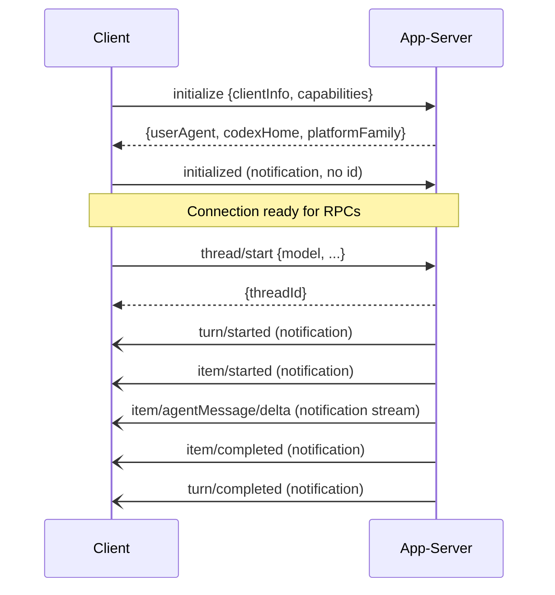

# Codex CLI Python SDK and v2 App-Server Filesystem RPCs


The v0.115.0 release of Codex CLI introduced two major primitives for programmatic control: an experimental Python SDK and a set of v2 filesystem RPCs exposed through the app-server JSON-RPC protocol.[^1] Together they turn Codex CLI from an interactive TUI into a scriptable, embeddable agent runtime that can be orchestrated from Python pipelines, notebooks, or custom tooling.

This article covers both SDK surfaces — their distinct purposes, the wire protocol underneath them, and patterns for putting them to work in real codebases.

---

## Two SDKs, One App-Server

Two Python packages exist and they are frequently confused:[^2]

| Package | Transport | Primary use |
|---|---|---|
| `openai-codex-sdk` (PyPI) | JSONL events over stdin/stdout | Wrapping the Codex CLI binary from Python scripts |
| `codex_app_server` (GitHub `sdk/python`) | JSON-RPC v2 over stdio or WebSocket | Direct interaction with the app-server JSON-RPC protocol |

The `openai-codex-sdk` package spawns the Codex CLI process and exchanges JSONL-formatted event messages with it — it does not ship the binary itself. The `codex_app_server` package implements the full JSON-RPC protocol surface and is the foundation the Codex App itself uses.

Both packages are explicitly marked **experimental** as of March 2026. Treat their APIs as unstable.[^3]

---

## Installing and Authenticating

```bash
# CLI wrapper (PyPI)
pip install openai-codex-sdk   # Python 3.10+

# App-server SDK (GitHub)
git clone https://github.com/openai/codex
cd codex/sdk/python
pip install -e .
```

The CLI wrapper SDK supports three authentication flows:[^4]

```python
from openai_codex_sdk import Codex

# 1. Environment variable (CI-friendly)
#    Set CODEX_AUTH_JSON before running
Codex.login_with_auth_json(overwrite=True)

# 2. Device-code flow (interactive terminal or Codex App onboarding)
Codex().login_with_device_code()

# 3. Direct API key
from openai_codex_sdk import Codex, CodexOptions
codex = Codex(CodexOptions(api_key="sk-..."))
```

Device-code authentication in the app-server TUI was added in v0.116.0, making ChatGPT-based login viable in enterprise environments where direct browser sign-in is blocked.[^5]

---

## Core Client API

### Starting and Running Threads

```python
import asyncio
from openai_codex_sdk import Codex

async def main():
    codex = Codex()
    thread = codex.start_thread()

    # Buffered: waits for full turn completion
    turn = await thread.run(
        "Audit this repo for unused dependencies and list them",
        options={"working_directory": "/path/to/repo"}
    )
    print(turn.final_response)
    print(turn.usage)  # input_tokens, cached_input_tokens, output_tokens

asyncio.run(main())
```

`turn.final_response` is `None` when no `agent_message` item completes the turn — for example when Codex performs only tool calls. Check `turn.items` in that case.[^6]

To resume an existing session across process restarts:

```python
# Resume the most recently active thread
thread = codex.resume_last_thread()  # reads CODEX_HOME env var

# Resume by explicit thread ID
thread = codex.resume_thread("0199a213-81c0-7800-8aa1-bbab2a035a53")
```

### Streaming Events

```python
async def review_with_streaming():
    codex = Codex()
    thread = codex.start_thread()
    streamed = await thread.run_streamed("Review the last commit for security issues")

    async for event in streamed.events:
        match event.type:
            case "item.started":
                print(f"→ {event.item.type}")
            case "item.agentMessage.delta":
                print(event.delta, end="", flush=True)
            case "item.completed":
                if event.item.type == "command_execution":
                    print(f"\nRan: {event.item.command}")
            case "turn.completed":
                print(f"\nTokens: {event.usage}")

    # turn.final_response available after events exhausted
    result = await streamed.result
```

The eight event types are: `thread.started`, `turn.started`, `item.started`, `item.completed`, `item.agentMessage.delta`, `turn.completed`, `turn.failed`, and `thread.tokenUsage.updated`.[^7]

### Structured Output

```python
schema = {
    "type": "object",
    "properties": {
        "files": {"type": "array", "items": {"type": "string"}},
        "verdict": {"type": "string", "enum": ["pass", "fail", "warn"]}
    },
    "required": ["files", "verdict"]
}

turn = await thread.run(
    "Check for hardcoded secrets in the repo",
    options={"output_schema": schema}
)
import json
result = json.loads(turn.final_response)
```

---

## The App-Server JSON-RPC Protocol

The app-server is the process behind both the Codex App and the `codex mcp-server` command. It speaks a JSON-RPC 2.0 variant — notably **without** the `"jsonrpc":"2.0"` envelope field — over newline-delimited JSON (JSONL) on stdio, or one message per WebSocket text frame.[^8]

### Session Initialisation

Every connection must complete a three-step handshake before issuing any other RPC:[^9]



The `clientInfo.name` field is logged to OpenAI's Compliance Logs Platform — enterprise teams can register known client names by contacting OpenAI.[^10]

Use `capabilities.optOutNotificationMethods` to suppress high-volume notifications (e.g. `item/agentMessage/delta`) when you only need final items:

```json
{
  "method": "initialize",
  "id": 0,
  "params": {
    "clientInfo": {"name": "my-pipeline", "title": "Deploy Pipeline", "version": "1.0.0"},
    "capabilities": {
      "experimentalApi": true,
      "optOutNotificationMethods": ["item/agentMessage/delta"]
    }
  }
}
```

---

## v2 Filesystem RPCs

The nine `fs/*` methods introduced in v0.115.0 give a connected client direct read/write access to the host filesystem through the app-server process.[^11] All paths must be **absolute**. File content is base64-encoded on the wire.

### Read and Write

```json
// Read a file
{"method": "fs/readFile", "id": 1, "params": {"path": "/project/src/main.py"}}
// → {"id": 1, "result": {"dataBase64": "aW1wb3J0IG9z..."}}

// Write a file (base64-encode your content first)
{"method": "fs/writeFile", "id": 2, "params": {
  "path": "/project/output/report.json",
  "dataBase64": "eyJzdGF0dXMiOiAib2sifQ=="
}}
```

### Directory Operations

```json
// List directory contents with metadata
{"method": "fs/readDirectory", "id": 3, "params": {"path": "/project/src"}}

// Create a directory tree (recursive by default)
{"method": "fs/createDirectory", "id": 4, "params": {"path": "/project/output/2026/03"}}

// Copy a directory tree
{"method": "fs/copy", "id": 5, "params": {
  "sourcePath": "/project/src",
  "destinationPath": "/project/backup/src",
  "recursive": true
}}

// Delete a file or directory tree
{"method": "fs/remove", "id": 6, "params": {"path": "/project/tmp"}}
```

### Filesystem Watching

```json
// Subscribe to changes on a path
{"method": "fs/watch", "id": 7, "params": {"path": "/project/src"}}
// → {"id": 7, "result": {"watchId": "a3f9...", "canonicalPath": "/project/src"}}

// Server pushes fs/changed notifications as files are modified:
// {"method": "fs/changed", "params": {"watchId": "a3f9...", "path": "/project/src/app.py", "kind": "modify"}}

// Unsubscribe
{"method": "fs/unwatch", "id": 8, "params": {"watchId": "a3f9..."}}
```

Watching a file (rather than a directory) correctly tracks updates delivered via atomic rename operations — relevant to editors like Vim that write via a temp-file-and-rename pattern.[^12]

---

## WebSocket Transport and Health Checks

The WebSocket listener is experimental but useful for container-hosted deployments where stdio is impractical:[^13]

```bash
# Local only (no auth required)
codex app-server --listen ws://127.0.0.1:8765

# Non-loopback with capability-token auth
codex app-server --listen ws://0.0.0.0:8765 \
  --ws-auth capability-token \
  --ws-token-file /run/secrets/codex-token
```

Two health probe endpoints are available on the same port once the server starts (added in v0.114.0):[^14]

| Endpoint | Returns 200 when... |
|---|---|
| `GET /readyz` | Listener is accepting new connections |
| `GET /healthz` | Request has no `Origin` header (CSRF guard) |

The `/healthz` `Origin` restriction means Kubernetes liveness probes work correctly (no `Origin` header), while browser-initiated requests are rejected.

For signed-bearer-token auth (JWS/JWT), configure the shared secret and optional issuer/audience claims:

```bash
codex app-server --listen ws://0.0.0.0:8765 \
  --ws-auth signed-bearer-token \
  --ws-shared-secret-file /run/secrets/codex-secret \
  --ws-issuer "my-org" \
  --ws-audience "codex-prod" \
  --ws-clock-skew-seconds 30
```

---

## Practical Patterns

### CI Pipeline: Automated PR Review

```python
import asyncio, base64, json
from openai_codex_sdk import Codex, CodexOptions

async def review_pr(repo_path: str, base_branch: str) -> dict:
    codex = Codex(CodexOptions(api_key=os.environ["CODEX_API_KEY"]))
    thread = codex.start_thread()

    schema = {
        "type": "object",
        "properties": {
            "severity": {"type": "string", "enum": ["low", "medium", "high", "critical"]},
            "findings": {"type": "array", "items": {"type": "string"}},
            "approved": {"type": "boolean"}
        },
        "required": ["severity", "findings", "approved"]
    }

    turn = await thread.run(
        f"Review changes against {base_branch} for security and correctness issues.",
        options={
            "working_directory": repo_path,
            "output_schema": schema,
            "skip_git_repo_check": False
        }
    )
    return json.loads(turn.final_response)
```

### pydantic-ai Integration

The SDK ships a `codex_handoff_tool` helper that bridges a pydantic-ai `Agent` to a Codex thread:[^15]

```python
from openai_codex_sdk import codex_handoff_tool, ThreadOptions
from pydantic_ai import Agent

orchestrator = Agent(
    "openai:gpt-5",
    tools=[
        codex_handoff_tool(ThreadOptions(
            working_directory="/project",
            approval_policy="auto-edit"
        ))
    ]
)

result = await orchestrator.run(
    "Investigate the failing tests, propose a fix, and generate a patch"
)
```

### MCP Server Injection

```python
from openai_codex_sdk import Codex, CodexOptions

codex = Codex(CodexOptions(
    mcp_servers=[{
        "name": "datadog",
        "command": "npx",
        "args": ["-y", "@datadog/mcp-server"]
    }]
))
thread = codex.start_thread()
turn = await thread.run("Query last hour of error logs from the payment service")
```

---

## Error Handling

The server returns JSON-RPC error objects with two notable codes:

| Code | Meaning | Action |
|---|---|---|
| `-32001` | Server overloaded | Retry with exponential backoff and jitter |
| Standard | `Not initialized` / `Already initialized` | Fix handshake sequencing |
| Standard | `<X> requires experimentalApi` | Add `experimentalApi: true` to `initialize` capabilities |

Keep the `openai-codex-sdk` package and the installed Codex CLI binary versions aligned — published SDK releases pin an exact `codex-cli-bin` version. Mismatches cause silent wire-format incompatibilities.[^16]

---

## Summary

The Codex CLI Python SDK surfaces two distinct integration points: a JSONL-over-stdio wrapper (`openai-codex-sdk`) for straightforward automation scripts, and a full JSON-RPC protocol implementation (`codex_app_server`) for deep integration with the app-server's complete method inventory. The v2 filesystem RPCs added in v0.115.0 extend this to include remote read/write/watch operations, making the app-server a capable building block for IDE extensions, notebook kernels, and custom CI tooling — all without reinventing the agent loop.

Both surfaces remain experimental. Treat the APIs as a moving target and pin versions aggressively until stabilisation is announced.

---

## Citations

[^1]: OpenAI Codex CLI v0.115.0 release notes — filesystem RPCs and Python SDK: <https://github.com/openai/codex/releases/tag/rust-v0.115.0>
[^2]: Codex CLI SDK documentation distinguishing the two Python packages: <https://developers.openai.com/codex/sdk>
[^3]: OpenAI Codex app-server README marking WebSocket and Python SDK as experimental: <https://github.com/openai/codex/blob/main/codex-rs/app-server/README.md>
[^4]: `openai-codex-sdk` PyPI package authentication API: <https://pypi.org/project/openai-codex-sdk/>
[^5]: OpenAI Codex CLI v0.116.0 release notes — device-code ChatGPT sign-in: <https://developers.openai.com/codex/changelog>
[^6]: Codex CLI SDK `Turn` object documentation — `final_response` semantics: <https://developers.openai.com/codex/sdk>
[^7]: Codex CLI JSONL event stream format and the eight event types: <https://developers.openai.com/codex/sdk>
[^8]: Codex app-server JSON-RPC v2 wire format (no `jsonrpc` envelope): <https://github.com/openai/codex/blob/main/codex-rs/app-server/README.md>
[^9]: App-server initialisation handshake three-step flow: <https://github.com/openai/codex/blob/main/codex-rs/app-server/README.md>
[^10]: `clientInfo.name` compliance logging and enterprise registration note: <https://github.com/openai/codex/blob/main/codex-rs/app-server/README.md>
[^11]: v2 filesystem RPC methods introduced in v0.115.0 (PRs #14245, #14435): <https://github.com/openai/codex/releases/tag/rust-v0.115.0>
[^12]: `fs/watch` handling of atomic rename-based file writes: <https://github.com/openai/codex/blob/main/codex-rs/app-server/README.md>
[^13]: WebSocket transport documentation and auth flag reference: <https://github.com/openai/codex/blob/main/codex-rs/app-server/README.md>
[^14]: Health check endpoints `/readyz` and `/healthz` added in v0.114.0 (PR #13782): <https://github.com/openai/codex/releases/tag/rust-v0.114.0>
[^15]: `codex_handoff_tool` pydantic-ai integration helper: <https://developers.openai.com/codex/sdk>
[^16]: SDK and CLI binary version pinning requirement: <https://pypi.org/project/openai-codex-sdk/>
