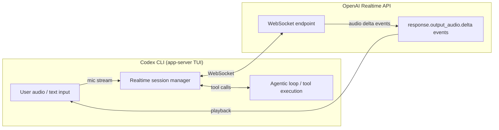
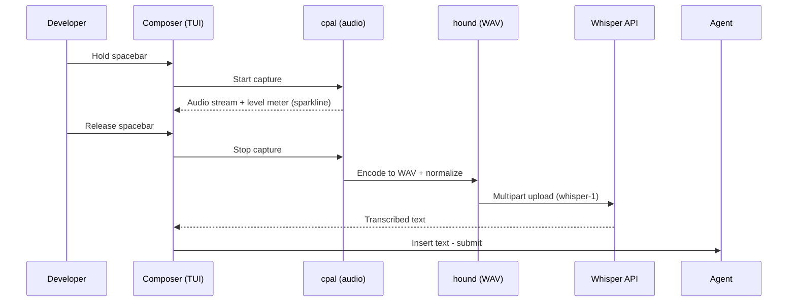

![Sketchnote: Codex CLI Realtime Sessions: Voice Pair Programming, Transcription Mode, and the [realtime] Config](/sketchnotes/articles/2026-03-31-codex-cli-realtime-sessions-voice-transcription.png)

# Codex CLI Realtime Sessions: Voice Pair Programming, Transcription Mode, and the [realtime] Config


Codex CLI's realtime session layer has matured significantly over the past few weeks. Two PRs — [#14556](https://github.com/openai/codex/pull/14556) and [#14606](https://github.com/openai/codex/pull/14606), both merged on 13 March 2026 — unified the previously fragmented realtime configuration under a single `[realtime]` TOML table and introduced a dedicated transcription mode alongside the existing conversational mode.[^1] This article unpacks what that means architecturally, how to configure each mode, and how to build practical voice pair-programming and live-transcription workflows on top of them.

## What Are Realtime Sessions?

Codex CLI's realtime sessions are persistent WebSocket connections to OpenAI's Realtime API that carry audio (or text) at low latency alongside the normal agentic loop.[^2] Unlike standard turn-based API calls, a realtime session keeps the connection open so audio streams in both directions without per-request round-trip overhead.

The Codex app has exposed these sessions through its TUI since early 2026, but the configuration surface was split across a `realtime_conversation_v2` feature flag and several ad hoc keys. PR #14606 removed the feature flag entirely and consolidated everything under `[realtime]`.[^3]



## The `[realtime]` Config Table

Add a `[realtime]` block to your `~/.codex/config.toml` (or a profile-scoped file) to configure session behaviour:[^4]

```toml
[realtime]
version = "v2"
type    = "conversational"   # or "transcription"
```

Both keys are optional — omitting them leaves Codex on its compiled defaults, which as of v0.116.0 are v2 conversational.[^5]

| Key | Values | Default | Notes |
|-----|--------|---------|-------|
| `version` | `"v1"`, `"v2"` | `"v2"` | v1 forces Quicksilver intent; v2 uses structured `response.output_audio.delta` events |
| `type` | `"conversational"`, `"transcription"` | `"conversational"` | Selects mode and payload shape (see below) |

Internally, the Rust field is `session_type` with `#[serde(rename = "type")]`[^6] so the wire format and TOML key are both `type`, avoiding a collision with Rust's reserved keyword.

### v1 vs v2

v1 sessions use the Quicksilver intent path and an older session-update payload shape. v2 sessions emit `response.output_audio.delta` events and carry the Codex tool unconditionally, which enables tool calls (file edits, shell commands) during audio turns.[^7] Prefer v2 for all new work.

## Conversational Mode

The default `"conversational"` mode is an interactive dialogue: speech in, speech out, with interleaved tool execution. Codex can read, write, and run code while talking through what it is doing.

```toml
[realtime]
version = "v2"
type    = "conversational"
```

### Context Initialisation

A key reliability fix shipped in v0.116.0: realtime sessions now initialise with the recent thread context from the current project.[^8] Previously, a voice session started cold and Codex had no knowledge of previous turns in the same thread, causing it to ask for context that was already established.

The session manager now serialises recent conversation history into the session initialisation payload, so you can say "carry on with the refactoring we discussed" and Codex will have the context.

### Self-Interruption Prevention

Older versions could self-interrupt: Codex would start speaking, receive its own audio output back through the microphone, and treat it as new user input. v0.116.0 addressed this with backpressure and silence detection during audio playback.[^9] The fix reduces spurious mid-sentence interruptions in environments without push-to-talk.

### WebSocket Prewarm Stall Fix

v0.117.0 fixed a first-turn stall where WebSocket prewarm could delay `turn/start`; startup now times out and falls back cleanly.[^10] If you saw a silent pause of several seconds before the first exchange, upgrading to v0.117.0 resolves it.

## Transcription Mode

`"transcription"` mode is purpose-built for workflows where you want speech-to-text output piped into the agentic loop rather than a full audio dialogue. You speak; Codex produces text; the agentic loop processes that text as a normal user message.

```toml
[realtime]
version = "v2"
type    = "transcription"
```

Under the hood, PR #14556 changed the session-update payload shape and switched the conversation item type from audio to `input_text` for user turns.[^11] This means the language model processes your speech as text, not as audio tokens, which reduces latency and token cost.

The Quicksilver intent is also suppressed for v2 transcription mode — critical because Quicksilver would otherwise short-circuit structured tool use.[^12]

### When to Use Transcription Mode

| Scenario | Recommended Mode |
|----------|-----------------|
| Voice pair programming — spoken back-and-forth with Codex | `conversational` |
| Hands-free dictation of tasks while reviewing code | `transcription` |
| Meeting transcription → action-item extraction | `transcription` |
| Accessibility: eyes-free coding in complex codebases | `conversational` |
| CI/CD pipeline that accepts spoken task descriptions | `transcription` |

Transcription mode is also the right choice when running Codex in environments without speakers or audio output capability — Docker containers, remote dev boxes, CI agents. Only the microphone-side WebSocket is required.

## Experimental Realtime WebSocket Mode Flag

The low-level flag that PR #14556 introduced — `experimental_realtime_ws_mode` — is a runtime selector that PR #14606 later wired to the `type` TOML key.[^13] You should not need to set it directly; use `type` in `[realtime]` instead. It remains in the codebase as the internal enum the session manager dispatches on.

## App-Server TUI: Device-Code Sign-In for Realtime

v0.116.0 added device-code ChatGPT sign-in to the app-server TUI onboarding flow.[^14] This matters for realtime sessions because ChatGPT credentials (Plus/Pro/Team/Enterprise) unlock the model-specific realtime usage limits, which are separate from standard Codex limits during the research preview.

If you are setting up a remote or headless machine where the browser cannot be opened automatically:

```bash
codex login --device-auth
```

The TUI prints a URL and a code. Open the URL on any device, enter the code, and the session is authenticated. Existing ChatGPT tokens can be refreshed through the same flow without full re-authentication.

## Remote WebSocket Sessions

App-server clients can connect to a remote Codex instance via WebSocket with bearer-token auth:[^15]

```bash
# On the remote server
codex app-server --listen ws://0.0.0.0:8765 \
  --ws-shared-secret-file /run/secrets/codex-ws-secret

# On the client
codex --ws ws://remote-host:8765 \
  --ws-auth signed-bearer-token
```

The server exposes health probes on the same listener:

```
GET /readyz   → 200 when ready to accept connections
GET /healthz  → 200 when the process is healthy
```

When the request ingress queue is full, the server returns JSON-RPC error `-32001` ("Server overloaded; retry later"). Implement exponential backoff with jitter on the client side.[^16]

## Practical Voice Pair-Programming Setup

### config.toml

```toml
[realtime]
version = "v2"
type    = "conversational"

[model]
model = "gpt-5-codex"

[features]
prevent_idle_sleep = true   # keep the session alive between turns
```

### AGENTS.md Addition for Voice Sessions

Add a section that helps Codex handle voice-specific patterns:

```markdown
## Voice session conventions
- Confirm destructive actions aloud before executing
- Summarise each completed file edit in one sentence
- If interrupted mid-sentence, restart the previous thought on next user turn
- Prefer short confirmations over long explanations when the task is clear
```

### Transcription Pipeline Pattern

```mermaid
sequenceDiagram
    participant Dev as Developer (microphone)
    participant RT as Realtime session (transcription)
    participant Loop as Agentic loop
    participant FS as Filesystem

    Dev->>RT: "Run the tests for the auth module"
    RT->>Loop: input_text: "Run the tests for the auth module"
    Loop->>FS: shell: cargo test auth --
    FS-->>Loop: test output (6 passed, 1 failed)
    Loop-->>Dev: "Six tests passed, one failed in token_refresh_test"
```

## v2 Handoff in Realtime Sessions

v0.117.0 shipped realtime transcript notifications for v2 sessions: the transcript context is now carried through handoffs, so if you hand a session off from local CLI to the Codex app (or vice versa), the new session initialises with the audio transcript history.[^17] This closes a gap where handoffs previously lost all voice context and the agent appeared to forget the conversation.

## Known Limitations

- **Transcription accuracy**: The Realtime API's speech-to-text path uses Whisper v3 under the hood. Technical terms, symbol names, and unusual identifiers may be misrecognised. Use `transcription` mode with a custom system prompt asking Codex to clarify any ambiguous symbol name before acting on it.
- **No Windows support in v0.117.0**: Realtime sessions on Windows require the Desktop app, not the CLI TUI. CLI support for Windows realtime was not available at the time of writing.
- **Context window limits**: Realtime sessions accumulate transcript tokens in the context. Long voice sessions will trigger the standard context compaction path (see the [compaction article](/2026/03/31/codex-cli-context-compaction-architecture/)). The compact_prompt should be written with voice transcript preservation in mind.
- **Model availability**: Realtime voice sessions require a paid ChatGPT plan. API key-only setups cannot use the voice path; they fall back to text mode automatically.
- **Built-in voice: 60-second cap**: The spacebar dictation feature limits recordings to 60 seconds per clip. For longer dictations, break into multiple clips or dictate into a local tool first.
- **Built-in voice: no Linux support**: The keyboard hook for spacebar-hold does not compile on Linux. Use the Spokenly MCP or system-level tools like OpenWhispr as alternatives.[^21]
- **Token consumption on echo loops**: If voice transcription echoes the result back into the prompt, a transcript/input loop can consume usage limits rapidly. Verify that transcribed text is not being double-inserted via hooks.[^28]
- **Whisper API latency**: The round-trip to `whisper-1` adds 300-700 ms after releasing the spacebar. Local alternatives (Spokenly's offline mode, OpenWhispr with Parakeet) eliminate this at the cost of a larger local model.

## Built-In Spacebar Voice Transcription (v0.105.0)

Codex CLI gained native voice transcription in v0.105.0 (26 February 2026), layering an OpenAI Whisper transcription pipeline on top of the existing composer.[^18] The mechanic is press-and-hold spacebar in the composer: with an empty composer, recording starts immediately; with text already present, a 500 ms hold delay prevents accidental activation.[^19]

### Enabling

Voice transcription is opt-in and disabled by default:

```toml
# ~/.codex/config.toml
[features]
voice_transcription = true
```

Or via the CLI subcommand:

```bash
codex features enable voice_transcription
```

### Recording and Transcription

While recording, a 12-character sparkline audio level meter appears in the composer for real-time feedback.[^19] Release the spacebar to stop recording. The audio is uploaded to OpenAI's Whisper API (`whisper-1` model) via multipart upload, resolved through `codex login` credentials — no separate `OPENAI_API_KEY` setup is required.[^19] Maximum recording length is **60 seconds** per clip.

Under the hood, the feature uses two Rust crates: **`cpal`** for cross-platform audio capture and **`hound`** for WAV encoding before upload. Audio is normalised with peak detection and headroom adjustment. There is no voice-activity detection (VAD) — recording runs for the entire hold duration regardless of silence.[^19]



### Platform Support

Voice transcription works on **macOS** (confirmed stable) and is reportedly available on **Windows**.[^20] Linux is explicitly not supported in the current implementation — on Linux, holding the spacebar types spaces rather than activating recording, because the keyboard hook does not compile on that platform.[^21] GitHub issues #12827 and #12894 track Linux coverage and the Linux/WSL parity request.[^22] Linux developers can use the Spokenly MCP integration (below) or system-level dictation tools like **OpenWhispr**, which pastes transcribed text at the cursor in any application.[^23]

---

## The Spokenly MCP: Agent-Initiated Voice Q&A

The built-in spacebar feature covers one scenario: dictating the initial prompt. It does nothing during an active agent run. For the agent to pause mid-workflow and ask a spoken question — and receive a spoken answer — the **Spokenly MCP** is required.[^24]

Spokenly runs a local HTTP MCP server at `localhost:51089`. The agent calls the `ask_user_dictation` tool when it needs clarification; a push-to-talk overlay appears, the user answers by voice, and the transcription returns to the agent as structured context.

### Setup

```bash
codex mcp add spokenly --url http://localhost:51089
```

Add a policy to `~/.codex/AGENTS.md`:

```markdown
## Voice Q&A
ALWAYS ask questions via the `ask_user_dictation` tool from the spokenly MCP server, never as plain text. This applies to any request for clarification or user input mid-task.
```

### Spokenly vs Built-In: Feature Comparison

| Capability | Built-in (`voice_transcription`) | Spokenly MCP |
|---|---|---|
| Initial prompt dictation | Yes | Yes (via any app focus) |
| Agent-initiated Q&A | No | Yes |
| Works during agent run | No | Yes |
| Local/offline models | No (Whisper API only) | Yes (Whisper, Parakeet on Apple Silicon) |
| Linux support | No | Yes |
| iOS remote input | No | Yes |
| Multi-app dictation | No | Yes |

Spokenly's `ask_user_dictation` tool is particularly useful when Codex is running a long autonomous task and surfaces an ambiguity. Without it, the agent either guesses or interrupts the flow with a text prompt that may not be seen immediately.[^24]

---

## Adding Voice Output: TTS via Hooks

Voice input is only half the loop. Text-to-speech can close the loop by wiring the `PostTaskComplete` hook to a TTS command:[^25]

```toml
# ~/.codex/config.toml
[hooks]
PostTaskComplete = "python3 ~/.codex/scripts/tts.py"
```

The hook receives the agent's final message as JSON on stdin. A minimal macOS implementation using `say`:

```bash
#!/usr/bin/env bash
# ~/.codex/scripts/tts.sh
response=$(cat | python3 -c "import sys, json; d=json.load(sys.stdin); print(d.get('message',''))")
say -v Samantha "$response"
```

On Windows, PowerShell's `Add-Type -AssemblyName System.Speech` provides the equivalent `SpeechSynthesizer` class. For cross-platform use, the `pyttsx3` Python library works on macOS, Windows, and Linux without an API key.[^26]

---

## Practical Voice Workflow Patterns

### Pattern 1: Voice-First Feature Development

1. Dictate a feature brief via spacebar
2. Let Codex plan and raise clarifications via Spokenly
3. Answer clarifications by voice
4. Review the PR diff visually, approve or comment by voice

The full cycle from brief to PR can run with zero keyboard input beyond approvals.

### Pattern 2: Accessibility-First Configuration

For developers who rely on voice for accessibility reasons, combine the full stack:

```toml
# ~/.codex/config.toml
[features]
voice_transcription = true

[hooks]
PostTaskComplete = "~/.codex/scripts/tts.sh"
SessionStart = "say -v Samantha 'Codex is ready'"
```

With Spokenly registered, every interaction is voice-addressable — initial prompt, mid-task questions, and task completion confirmation.

### Pattern 3: Headless Linux with Spokenly

On Linux servers where the built-in feature is unavailable, use Spokenly running on a macOS laptop to relay voice input to a remote Codex session:

```bash
# On the remote Linux server
codex mcp add spokenly --url http://YOUR_MAC_IP:51089
```

Spokenly proxies the voice call back to macOS. The agent runs on Linux, but the voice interface lives on the machine with a microphone.[^27]

---

## Summary

The `[realtime]` TOML config block (merged 13 March 2026) provides the configuration surface for Codex voice sessions. Use `type = "conversational"` for interactive voice pair programming, `type = "transcription"` for dictation and speech-to-text task pipelines. The v0.116.0 and v0.117.0 reliability fixes — context initialisation, self-interruption prevention, prewarm stall — make voice sessions production-worthy for focused coding sessions. The built-in spacebar dictation (v0.105.0) covers initial prompt input, while the Spokenly MCP extends voice to mid-task agent-initiated Q&A. TTS hooks close the output side of the loop. Combine with `prevent_idle_sleep`, a voice-aware AGENTS.md, and bearer-token remote WebSocket for a fully headless voice agent architecture.

## Citations

[^1]: Pull Request #14556 "Add realtime transcription mode for websocket sessions" — github.com/openai/codex/pull/14556; Pull Request #14606 "Unify realtime v1/v2 session config" — github.com/openai/codex/pull/14606

[^2]: OpenAI Realtime API documentation — developers.openai.com/api/docs/guides/realtime

[^3]: PR #14606 description: "removes `realtime_conversation_v2` feature flag, consolidating its functionality into the new configuration structure" — github.com/openai/codex/pull/14606

[^4]: Codex Configuration Reference — developers.openai.com/codex/config-reference

[^5]: Releasebot Codex March 2026 release notes: v0.116.0 shipped with improved realtime defaults — releasebot.io/updates/openai/codex

[^6]: PR #14606: "uses `session_type` internally with `#[serde(rename = \"type\")]` for both runtime and TOML structs" — github.com/openai/codex/pull/14606

[^7]: OpenAI Codex Changelog — developers.openai.com/codex/changelog

[^8]: Releasebot Codex v0.116.0 entry: "Realtime sessions now start with recent thread context" — releasebot.io/updates/openai/codex

[^9]: OpenAI Codex Changelog v0.116.0: reduced self-interruption during audio playback — developers.openai.com/codex/changelog

[^10]: OpenAI Codex Changelog v0.117.0: "fixed first-turn stall where WebSocket prewarm could delay turn/start; startup now times out and falls back cleanly" — developers.openai.com/codex/changelog

[^11]: PR #14556: "for v2 sessions in transcription mode, the system emits `input_text` conversation items for user messages" — github.com/openai/codex/pull/14556

[^12]: PR #14556: "WebSocket intent queries become parser-aware, preventing v2 transcription mode from forcing Quicksilver intent" — github.com/openai/codex/pull/14556

[^13]: PR #14606 wired `experimental_realtime_ws_mode` enum to the `type` TOML key — github.com/openai/codex/pull/14606

[^14]: OpenAI Codex Changelog v0.116.0: "App-server TUI supports device-code ChatGPT sign-in during onboarding and can refresh existing ChatGPT tokens" — developers.openai.com/codex/changelog

[^15]: Codex App-Server documentation — developers.openai.com/codex/app-server

[^16]: Codex App-Server documentation: JSON-RPC error `-32001` "Server overloaded; retry later" — developers.openai.com/codex/app-server

[^17]: OpenAI Codex Changelog v0.117.0: "realtime transcript notification in v2" with handoff context preservation — developers.openai.com/codex/changelog

[^18]: x-cmd blog, "Codex 0.105.0 Released: Voice Input Support" (Feb 26, 2026) — x-cmd.com/blog/260226/

[^19]: GitHub PR #3381, "voice transcription by nornagon-openai" — github.com/openai/codex/pull/3381 (spacebar hold, sparkline meter, cpal/hound crates, Whisper upload)

[^20]: Awesome Agents, "Codex 0.105.0 Ships Voice Input, Sleep Prevention, and a Complete Subagent Overhaul" — awesomeagents.ai/news/codex-0-105-voice-subagents-overhaul/

[^21]: GitHub Issue #12827, "Voice transcription no-op" — developer Eric Traut: "This feature isn't currently supported on Linux" — github.com/openai/codex/issues/12827

[^22]: GitHub Issue #12894, "Enable voice transcription in Linux/WSL builds" — github.com/openai/codex/issues/12894

[^23]: OpenWhispr cross-platform voice dictation — github.com/OpenWhispr/openwhispr

[^24]: Spokenly, "Voice Input for OpenAI Codex CLI via MCP" — spokenly.app/blog/voice-dictation-for-developers/codex

[^25]: Codex CLI hooks documentation (PostTaskComplete, SessionStop) — developers.openai.com/codex/cli/hooks

[^26]: Dev Genius, "Building A 'Voice' For My CLI Code Agent" (March 2026) — blog.devgenius.io/building-a-voice-for-my-cli-code-agent-5f2d15b5b89e

[^27]: Spokenly MCP remote proxy pattern (localhost port forwarding) — spokenly.app/blog/voice-dictation-for-developers/codex

[^28]: GitHub Issue #12902, "Voice transcription usage issue" — transcript echo loop risk — github.com/openai/codex/issues/12902
