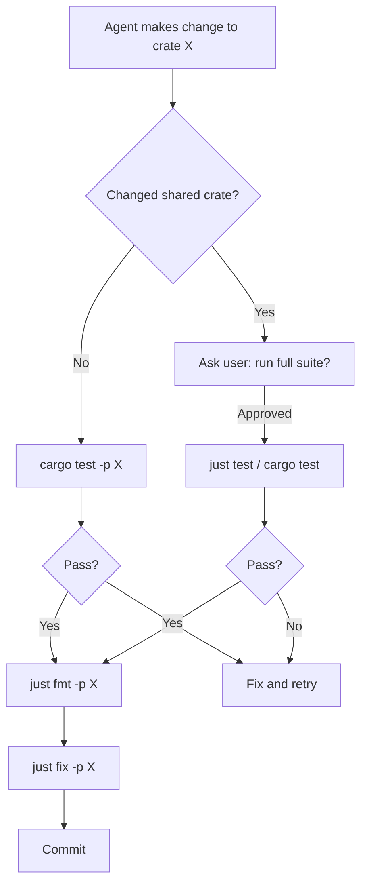

# Codex CLI for Rust Teams: AGENTS.md, Cargo Workflows, and Workspace Patterns


---

Codex CLI is written in Rust.[^1] That is not a coincidence — it means the OpenAI team has already worked out the patterns for using Codex to maintain a large, multi-crate Rust workspace, and that lived experience is encoded in their public `AGENTS.md`. This article distils those patterns into a reusable template for your own Rust teams, and extends them with the configuration details that matter for production use.

There is already an article in this knowledge base on [the codex-rs architecture itself](/codex-resources/articles/2026-03-28-codex-rs-rust-rewrite-architecture/). This article is about the other direction: using Codex CLI as your coding agent *on* a Rust project.

---

## Why Rust Teams Need Codex-Specific Configuration

Three things make Rust repos behave differently from Python or TypeScript projects under an AI agent:

- **Compilation is slow.** Workspace-wide builds touch `target/` heavily. Without explicit guidance, the agent will trigger expensive full rebuilds when targeted commands would suffice.
- **Feature flags multiply the build matrix.** `--all-features` can expand compilation work by an order of magnitude and should never be a default.
- **Network access is required to fetch dependencies** — which conflicts with Codex's default sandbox mode, which blocks outbound network.

A well-crafted `AGENTS.md` handles all three before the agent writes a single line of code.

---

## AGENTS.md Template for Rust Repositories

Place this at your repo root. Adjust crate names, test commands, and lint rules for your project.

```markdown
# AGENTS.md

## Build and Test

Always run targeted tests first. If you changed code in `crate-foo`, run:

```bash
cargo test -p crate-foo
```

If changes touch shared crates (`core`, `common`, `protocol`, or any crate that other
crates depend on), run the full test suite — but ask the user before doing so:

```bash
cargo test
# or, if cargo-nextest is installed:
just test
```

Do **not** use `--all-features` for routine local test runs. It expands the build
matrix significantly and can exhaust `target/` disk space. Use it only when a PR
explicitly targets feature-gated code.

## Formatting and Linting

After every Rust change, run `just fmt` in the `codex-rs`-style root directory without
asking for approval. This runs `cargo fmt` scoped to the workspace — never `cargo fmt --all`,
which would format submodules and generate noisy diffs.[^2]

Before finalising a large change, run:

```bash
just fix -p <crate-you-touched>
```

Prefer `-p` scoping to avoid workspace-wide Clippy builds. Only run `just fix` without
`-p` if you changed a shared crate.

Also run `just argument-comment-lint` before submitting any PR.

## Dependency Changes

When you modify `Cargo.toml` or `Cargo.lock`, refresh the Bazel lockfile:

```bash
just bazel-lock-update   # run from repo root
just bazel-lock-check    # catch drift before CI
```

Include the lockfile update in the same commit as the dependency change.

## Bazel / compile-time file access

If you add `include_str!()` or `sqlx::migrate!()`, update the crate's `BUILD.bazel`
file (`compile_data`, `build_script_data`, or test data). Cargo will succeed locally;
Bazel will silently fail if the reference is missing from BUILD.

## Code Style

- Keep Rust modules under 500 LoC, excluding tests. If a file exceeds ~800 LoC,
  create a new module rather than extending it.
- Prefer `crate::` to `super::` in non-test code.
- Avoid `lazy_static!`, `Once`, or global state. Pass context structs explicitly.
- Use enums and newtypes to keep callsites self-documenting.
- Follow Clippy's `collapsible_if` rule; inline `format!` args where possible.

## Sandbox note

`CODEX_SANDBOX_NETWORK_DISABLED=1` is set when the shell tool runs. Do **not** add or
modify any code related to `CODEX_SANDBOX_NETWORK_DISABLED_ENV_VAR` or
`CODEX_SANDBOX_ENV_VAR`.[^3]

```

---

## Sandbox Configuration for Rust Projects

The default sandbox blocks outbound network, which breaks `cargo fetch` and `cargo add` when the crate isn't cached locally.[^3] You have two options:

**Option 1: Pre-warm the dependency cache before the session.**

```bash
cargo fetch          # downloads all deps into ~/.cargo/registry
cargo vendor         # optional: vendor for fully offline builds
codex                # start the agent — all deps are already local
```

**Option 2: Run in `workspace-write` mode with network enabled for dependency operations.**

In `~/.codex/config.toml` or your project's `.codex/config.toml`:

```toml
[profiles.rust-dev]
model = "gpt-5-codex"
approval_policy = "unless-allow-listed"
sandbox_mode = "workspace-write"
```

Then launch with `codex --profile rust-dev`. The `workspace-write` mode permits file writes in the working directory but still prompts before network calls, giving you a balance between developer velocity and safety.[^3]

For teams that need fully offline Rust builds in CI, use `cargo vendor` to snapshot dependencies into the repo and point `CARGO_HOME` at the vendored directory. Codex agents running with `--yolo` (danger-full-access) in a pre-provisioned Docker container with vendored deps is the cleanest CI pattern.

---

## Testing Strategy: Two-Tier with cargo-nextest

The recommended pattern mirrors what the Codex CLI team uses internally:[^4]



**cargo-nextest** is the preferred test runner when installed.[^4] It runs each test in its own process, delivers up to 60% faster execution than `cargo test` on multi-core machines, and produces JUnit XML output for CI systems.[^5] Install it with:

```bash
cargo install --locked cargo-nextest
cargo install cargo-insta   # for snapshot tests
```

Your `justfile` can then expose a single `just test` target that automatically selects nextest if available:

```makefile
test:
    #!/usr/bin/env bash
    if command -v cargo-nextest &> /dev/null; then
        cargo nextest run
    else
        cargo test
    fi
```

For CI, add JUnit output so your pipeline can display per-test results:

```bash
cargo nextest run --message-format junit > test-results.xml
```

---

## Multi-Agent Patterns for Large Rust Workspaces

Large Rust workspaces benefit from Codex's multi-agent v2 feature when running parallel linting and testing.[^6] A common pattern spawns one agent per crate group:

```toml
# .codex/agents/rust-lint.toml
[agent]
name = "rust-lint"
model = "gpt-5-codex-mini"
task = "Run clippy and fmt checks across changed crates, report any failures."

[agent]
name = "rust-test"
model = "gpt-5-codex-mini"
task = "Run cargo test -p for each changed crate in parallel, report failures."
```

The orchestrator spawns both agents after the developer's change, waits for both to complete, and summarises results before requesting human review. This pattern reduces the wall-clock time of a typical lint + test cycle from minutes to seconds on workspaces with a dozen or more crates.

For dependency auditing, a third agent can run `cargo audit` against the advisory database and report any new CVEs introduced by the change — particularly useful when `Cargo.lock` is updated.

---

## Skills for Rust Development

The community skills ecosystem includes a Rust-focused skill available through [mcp.directory](https://mcp.directory/skills/skill-installer) that guides the agent in writing idiomatic Rust: proper data modelling, trait design, impl organisation, macros, and build-speed best practices.[^7]

Install it with:

```bash
codex run '$skill-installer install rust-idiomatic'
# or manually:
cp -r rust-idiomatic/ ~/.agents/skills/
```

Codex auto-discovers skills from `~/.agents/skills/` and `.agents/skills/` in the project root.[^7] Once installed, prompts like "add a typed builder for this struct" will produce idiomatic, Clippy-clean Rust rather than generic AI boilerplate.

The general-purpose `cc-skills` collection from [@samber](https://github.com/samber/cc-skills) provides cross-language conventions (error handling, observability, API shape) that complement language-specific Rust skills and prevent agents from making decisions that conflict with your broader engineering standards.[^7]

---

## GitHub Actions CI Integration

A minimal CI workflow that runs Codex-enforced checks mirrors the agent's own verification sequence:

```yaml
# .github/workflows/rust.yml
name: Rust CI

on: [push, pull_request]

jobs:
  test:
    runs-on: ubuntu-latest
    steps:
      - uses: actions/checkout@v4

      - name: Cache cargo registry
        uses: actions/cache@v4
        with:
          path: ~/.cargo/registry
          key: ${{ runner.os }}-cargo-${{ hashFiles('**/Cargo.lock') }}

      - name: Install cargo-nextest
        run: cargo install --locked cargo-nextest

      - name: Format check
        run: cargo fmt --check

      - name: Clippy
        run: cargo clippy -p your-crate -- -D warnings

      - name: Test
        run: cargo nextest run --message-format junit > test-results.xml

      - name: Upload results
        uses: actions/upload-artifact@v4
        with:
          name: test-results
          path: test-results.xml
```

Pair this with `codex exec` in a separate job for automated PR review:

```yaml
  codex-review:
    needs: test
    runs-on: ubuntu-latest
    steps:
      - uses: actions/checkout@v4
      - name: Codex review
        run: codex exec --no-interactive "Review the diff against main. Check for unsafe blocks, unwrap() calls in production paths, and missing error propagation. Output findings as a JSON array."
        env:
          OPENAI_API_KEY: ${{ secrets.OPENAI_API_KEY }}
```

---

## Known Limitations

- **`--all-features` with proc macros is brittle.** Some derive macros expand differently under feature combinations. The AGENTS.md guidance to avoid `--all-features` on routine runs exists for this reason, not just build speed.[^3]
- **Slow Clippy on workspaces.** Always scope with `-p`. A workspace-wide Clippy run against 30+ crates under Codex's default 2-minute tool timeout will time out silently. Set `tool_timeout_sec = 300` in your profile for Rust-heavy sessions.[^3]
- **Offline sandbox breaks `cargo add`.** If you want the agent to add new dependencies, either pre-warm the local registry or switch to `workspace-write` sandbox mode and approve the outbound network call. ⚠️ There is no native Codex mechanism for a selective crates.io allow-list; this is a known gap.
- **Bazel BUILD files.** Codex does not automatically update `BUILD.bazel` when it adds `include_str!()` references or new source files. Explicitly instruct the agent to update BUILD files in your AGENTS.md, or add a `PostToolUse` hook that checks for new files not declared in BUILD.[^3]

---

## Citations

[^1]: [How Codex is built – The Pragmatic Engineer](https://newsletter.pragmaticengineer.com/p/how-codex-is-built) — OpenAI's Codex CLI is now 95.6% Rust following the codex-rs rewrite.

[^2]: [codex/AGENTS.md at main · openai/codex](https://github.com/openai/codex/blob/main/AGENTS.md) — Official AGENTS.md from the Codex CLI repository, containing Rust-specific testing and formatting instructions.

[^3]: [Features – Codex CLI | OpenAI Developers](https://developers.openai.com/codex/cli/features) — Sandbox modes, approval policies, and shell tool behaviour in Codex CLI.

[^4]: [Development Setup – Codex CLI](https://www.mintlify.com/openai/codex/contributing/setup) — Official contributing guide; specifies cargo-nextest and cargo-insta as recommended tools alongside just.

[^5]: [cargo-nextest: A Next-Generation Rust Test Runner](https://nexte.st/) — nextest project homepage; documents process-per-test isolation, speed improvements, and JUnit output support.

[^6]: [Codex CLI Multi-Agent v2 – openai/codex releases](https://github.com/openai/codex/releases) — Path-based sub-agent addressing and multi-agent TOML configuration introduced in v0.117.0.

[^7]: [Codex CLI & Agent Skills Guide 2026](https://itecsonline.com/post/codex-cli-agent-skills-guide-install-usage-cross-platform-resources-2026) — Overview of the agent skills ecosystem, discovery paths, and the `cc-skills` collection.
