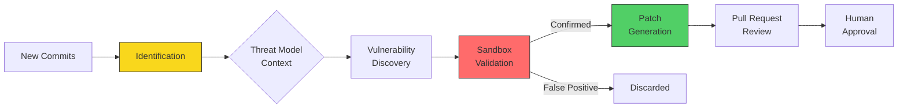
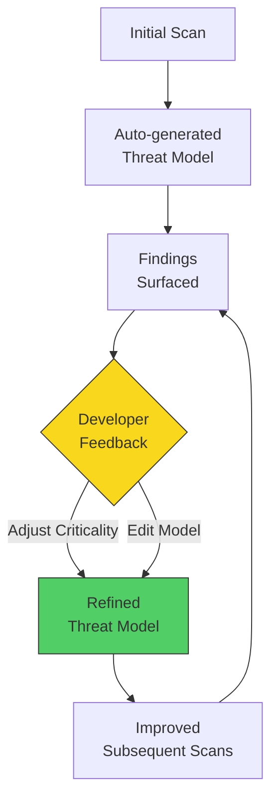
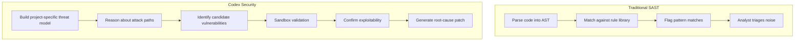

# Codex Security Agent: Continuous Vulnerability Scanning and Automated Threat Modelling


---

## Introduction

On 6 March 2026, OpenAI launched **Codex Security** — an application-security agent that scans connected repositories commit-by-commit, builds a project-specific threat model, validates findings in an isolated sandbox, and proposes patches ready for pull request[^1]. The product evolved from **Aardvark**, a private-beta security research agent first revealed in October 2025, powered by GPT-5 frontier models that reason about code rather than pattern-matching against it[^2]. The Aardvark branding was retired at launch, but the underlying autonomous agent architecture remains. Within its first thirty days, the research preview scanned over 1.2 million commits across external repositories, surfacing 792 critical findings and 10,561 high-severity issues[^3].

This article examines what Codex Security does, how it works under the hood, how to configure it, and how it compares to competing approaches — particularly Anthropic's Claude Code security review.

---

## Availability and Access

Codex Security is available as a **research preview** to ChatGPT Enterprise, Business, and Edu customers through the Codex web interface, with free usage for the initial month[^1]. OpenAI also launched **Codex for OSS**, offering eligible open-source maintainers six months of ChatGPT Pro, conditional access to Codex Security, and API credits for programmatic use[^4]. Projects like **vLLM** have already used Codex Security to find and patch issues in regular development workflows. Giving maintainers of critical infrastructure access to a tool that caught CVE-2025-32988 through CVE-2025-32990 in a single scan is a meaningful force multiplier for the broader ecosystem[^4].

Currently, the feature is accessed exclusively through the Codex web UI at `chatgpt.com/codex/security` — there is no dedicated CLI subcommand for it yet, though the Codex CLI can be integrated into CI/CD pipelines for complementary code-quality and SAST post-processing[^5].

---

## Architecture: Three-Stage Workflow

Codex Security operates as a background agent that continuously processes commits against your configured repositories. The workflow comprises three stages: identification, validation, and remediation[^2].



### Stage 1: Identification

When connected to a repository, the agent scans commits in **reverse chronological order**, building a codebase-specific threat model that captures attacker entry points, trust boundaries, sensitive data paths, and high-impact code paths[^2]. Unlike traditional SAST tools that rely on pattern matching or fuzzing, Codex Security uses **language-model reasoning, test-time compute, tool use, and large context windows** to explore realistic attack scenarios[^3].

### Stage 2: Validation

High-signal findings are passed to an **isolated sandbox environment** where the agent attempts to reproduce each issue — capturing execution details and confirming exploitability before surfacing the finding[^2]. This validation step is critical: during the beta period, it contributed to an **84% reduction in overall noise**, a **90% drop in over-reported severity**, and a **50% decrease in false-positive rates**[^3].

### Stage 3: Remediation

For each confirmed vulnerability, the agent generates a **minimal patch addressing the root cause** — context-aware and designed to fix the specific issue without breaking surrounding logic or introducing regressions[^2]. Patches do not modify code automatically — they are surfaced for human review and can be raised as pull requests through the standard development workflow. After a PR is merged, Codex Security can **revalidate the fix** to confirm the vulnerability is closed, completing the detection-to-remediation loop[^6].

---

## Setting Up a Security Scan

### Prerequisites

You need an active Codex Cloud environment with your GitHub repository connected. Navigate to **Codex environments** (`chatgpt.com/codex/settings/environments`) to create one if it does not already exist[^6].

### Creating a Scan

Visit `chatgpt.com/codex/security/scans/new` and configure the following[^6]:

1. **GitHub organisation** — select the org owning the target repository
2. **Repository** — the specific repo to scan
3. **Branch** — the branch to monitor (typically `main`)
4. **Environment** — assign the Codex Cloud environment
5. **History window** — longer windows provide more context but require extended backfill time

The initial backfill can take several hours for larger repositories as the agent processes historical commits to build its threat model[^6].

### Reviewing Findings

Once findings appear, access them at `chatgpt.com/codex/security/findings`. Two views are available[^6]:

- **Recommended Findings** — the top 10 most critical issues
- **All Findings** — a complete sortable, filterable table with description, metadata, code excerpts, and validation steps

---

## The Threat Model: Codex Security's Core Differentiator

The project-specific threat model is what separates Codex Security from traditional scanners. Rather than applying generic rules, the agent builds a contextual understanding of your system's architecture[^7].

A useful threat model identifies:

- **Entry points and untrusted inputs** — where external data enters the system
- **Trust boundaries and auth assumptions** — security perimeters and authentication logic
- **Sensitive data paths** — critical operations requiring protection
- **Priority review areas** — regions your team wants examined first

### Example Threat Model

```
Public API for account changes. Accepts JSON requests and file uploads.
Uses an internal auth service for identity checks and writes billing
changes through an internal service. Focus review on auth checks,
upload parsing, and service-to-service trust boundaries.
```

### Editing and Refining

The threat model is editable through the scan dashboard. OpenAI recommends exporting the current model, refining it conversationally within Codex, and reimporting the updated version[^7]. When you adjust the criticality of a finding, the agent uses that feedback to refine the model and improve precision on subsequent runs — a form of **adaptive learning** that tunes results to your architecture and risk posture[^2].



---

## Beta Results and Real-World Impact

The numbers from the first thirty days of the research preview are striking[^3]:

| Metric | Value |
|---|---|
| Commits scanned | 1.2 million+ |
| Critical findings | 792 |
| High-severity findings | 10,561 |
| Critical issue rate | < 0.1% of commits |
| Noise reduction | 84% |
| Over-reported severity drop | 90% |
| False-positive reduction | 50% |
| CVEs assigned | 14 |

The 14 assigned CVEs span projects including **PHP, libssh, Chromium, GOGS, Thorium, GnuPG, and GnuTLS**[^3]. Notable confirmed vulnerabilities include:

| CVE | Project | Class |
|-----|---------|-------|
| CVE-2025-32990 | GnuTLS certtool | Heap buffer overflow (off-by-one) |
| CVE-2025-32989 | GnuTLS | Heap buffer overread in SCT extension parsing |
| CVE-2025-32988 | GnuTLS | Double-free in otherName SAN export |
| CVE-2025-64175 | GOGS | Two-factor authentication bypass |
| CVE-2026-25242 | GOGS | Unauthenticated access bypass |
| CVE-2025-35430 | Thorium browser | Path traversal (arbitrary write) |
| CVE-2025-35431 | Thorium browser | LDAP injection |
| CVE-2025-35432–36 | Thorium browser | Unauthenticated DoS and mail abuse, session not rotated on password change |

NETGEAR, an early-access partner, reported that the tool "integrated effortlessly into our robust security development environment" and that findings often felt like having "an experienced product security researcher working alongside the team"[^4].

---

## CI/CD Integration with Codex CLI

While Codex Security itself runs through the web interface, the **Codex CLI** and **Codex GitHub Action** can complement it within CI/CD pipelines[^5]. The OpenAI Cookbook demonstrates a GitLab integration pattern where Codex CLI post-processes existing SAST results to consolidate duplicates, rank issues by exploitability, and provide actionable remediation steps[^5].

```bash
# GitLab CI job using Codex CLI for security post-processing
codex --full-auto \
  "Analyse the SAST report at gl-sast-report.json. \
   Consolidate duplicates, rank by exploitability, \
   and output remediation steps as CodeClimate JSON."
```

For fully automated CI environments, the `--dangerously-bypass-approvals-and-sandbox` flag is available — but should only be used in isolated runners, never on developer machines[^8].

---

## Comparison: Codex Security vs Claude Code Security Review

Anthropic launched **Claude Code Security** approximately two weeks before Codex Security, creating a direct competitive dynamic[^9]. The approaches differ fundamentally:

| Aspect | Codex Security | Claude Code Security |
|---|---|---|
| **Scanning model** | Continuous, commit-by-commit background agent | On-demand `/security-review` command |
| **Sandboxing** | Kernel-level (macOS Seatbelt, Linux Landlock/seccomp) | Application-layer hooks |
| **Threat modelling** | Auto-generated, editable, adaptive | Manual review scope |
| **Validation** | Sandbox reproduction of exploits | Static analysis with model reasoning |
| **Enterprise compliance** | GitHub Enterprise integration | SOC 2 Type II, HIPAA, zero data retention |
| **Primary strength** | Continuous monitoring, low false positives | Flexible governance, multi-agent review |

A DryRun Security study in March 2026 tested all three major AI coding agents (Codex, Claude, Gemini) building real applications. In the final vulnerability counts, Codex produced the fewest remaining issues (8), compared to Claude (13) and Gemini (11)[^10]. However, the study also found that **broken access control** appeared across all three agents — security is not yet part of their default reasoning[^10].

The emerging consensus is that neither tool alone is sufficient. Running both costs roughly 2× per review but catches meaningfully more issues, as different models trained on different data surface different vulnerability classes[^9].

---

## Language Support and Limitations

Codex Security is **language-agnostic** — it uses model reasoning rather than language-specific analysis rules, so performance tracks the underlying model's ability to understand a given language rather than a curated rule set[^6].

Practical limitations to be aware of:

- **No build required.** The agent reads source and does not need the project to compile or run, which simplifies setup but means some dynamic vulnerabilities may be harder to surface.
- **Patches require human review.** Auto-apply is not supported; every patch surfaces as a proposed PR.
- **Initial scans take time.** Large monorepos may take multiple days for the first full backfill.
- **Research preview quality.** The product is explicitly a research preview; expect iteration on false positive rates and model behaviour as the system matures.
- **GitHub-only at launch.** Codex Security connects via Codex Web to GitHub repositories; GitLab and Bitbucket are not supported at time of writing.

---

## How It Differs from Traditional SAST



The critical difference is **validation before surfacing**. SAST tools report every pattern match; triage is the analyst's problem. Codex Security attempts exploitation in a sandbox first, so the findings that reach the queue have confirmed exploitability — not theoretical risk.

The tradeoff is speed and coverage: a traditional SAST scan completes in minutes and can achieve high recall on known pattern classes. Codex Security is slower, more compute-intensive, and is not a replacement for SAST on high-recall requirements. OpenAI's documentation explicitly acknowledges this — the tool is designed to complement existing SAST rather than replace it[^6].

---

## Security Considerations and Operational Risks

Ironically, Codex itself was subject to a critical vulnerability discovered by Phantom Labs (BeyondTrust). A **command injection flaw** in the branch name parameter — passed unsanitised into a shell command during container setup — could have exposed GitHub authentication tokens[^11]. The vulnerability affected Codex CLI, Codex SDK, and the IDE extension, and was patched on 5 February 2026 after responsible disclosure on 16 December 2025[^11].

This incident underscores a broader point made by Check Point Research: "Don't assume AI tools are secure by default"[^11]. As AI agents consume branch names, commit messages, issue titles, and PR bodies, these inputs become attack surfaces in their own right.

Additional operational considerations for production deployments:

- **Prompt injection risk.** Any autonomous agent that reads code is potentially susceptible to adversarial content embedded in source files or commit messages. OpenAI has not published details of mitigations, but this is a non-trivial concern for repositories with external contributor access.
- **Data residency.** The agent sends source code to OpenAI's APIs for analysis. For teams with strict data residency requirements, confirm whether Codex Security is compatible with existing data processing agreements before connecting production codebases. Enterprise Zero Data Retention (ZDR) policies apply where active.
- **Threat model as a living document.** The threat model degrades in accuracy as architecture evolves. Assign ownership for keeping it current — particularly after significant infrastructure changes, new integrations, or auth model updates.

---

## Practical Recommendations

1. **Start with the threat model** — invest time editing it to reflect your actual architecture before judging finding quality
2. **Use the feedback loop** — adjust criticality ratings to train the agent towards your risk posture
3. **Complement with CI/CD** — pair Codex Security's continuous scanning with Codex CLI in your pipeline for SAST post-processing
4. **Layer your tools** — consider running both Codex Security and Claude Code security review for maximum coverage
5. **Audit your attack surface** — treat all agent-consumed inputs (branch names, PR titles, commit messages) as untrusted data

---

## Citations

[^1]: [Codex Security: now in research preview — OpenAI](https://openai.com/index/codex-security-now-in-research-preview/)
[^2]: [OpenAI Codex Security — Applying AI](https://applyingai.com/2026/03/openais-codex-security-revolutionizing-ai-driven-application-security-in-2026/)
[^3]: [OpenAI Codex Security Scanned 1.2 Million Commits — The Hacker News](https://thehackernews.com/2026/03/openai-codex-security-scanned-12.html)
[^4]: [OpenAI Launches Codex Security — AI Business](https://aibusiness.com/agentic-ai/openai-launches-codex-security)
[^5]: [Automating Code Quality and Security Fixes with Codex CLI on GitLab — OpenAI Cookbook](https://cookbook.openai.com/examples/codex/secure_quality_gitlab)
[^6]: [Setup — Codex Security — OpenAI Developers](https://developers.openai.com/codex/security/setup)
[^7]: [Improving the Threat Model — Codex Security — OpenAI Developers](https://developers.openai.com/codex/security/threat-model)
[^8]: [Codex CLI Comprehensive Guide — SmartScope](https://smartscope.blog/en/generative-ai/chatgpt/openai-codex-cli-comprehensive-guide/)
[^9]: [Codex vs Claude Code 2026 — Morph LLM](https://www.morphllm.com/comparisons/codex-vs-claude-code)
[^10]: [AI coding agents keep repeating decade-old security mistakes — Help Net Security](https://www.helpnetsecurity.com/2026/03/13/claude-code-openai-codex-google-gemini-ai-coding-agent-security/)
[^11]: [OpenAI Codex vulnerability enabled GitHub token theft — SiliconANGLE](https://siliconangle.com/2026/03/30/openai-codex-vulnerability-enabled-github-token-theft-via-command-injection-report-finds/)
[^12]: [Introducing Aardvark: OpenAI's agentic security researcher — OpenAI](https://openai.com/index/introducing-aardvark/)
[^13]: [Security — Codex Developer Docs](https://developers.openai.com/codex/security)
[^14]: [Codex Security — OpenAI Help Centre](https://help.openai.com/en/articles/20001107-codex-security)
[^15]: [FAQ — Codex Security Developer Docs](https://developers.openai.com/codex/security/faq)
[^16]: [Codex for Open Source — OpenAI Developers](https://developers.openai.com/community/codex-for-oss)
