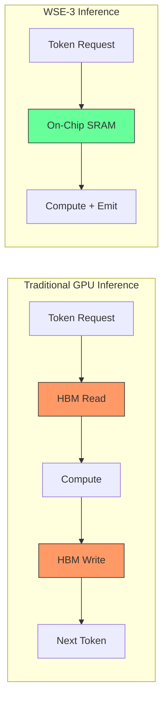
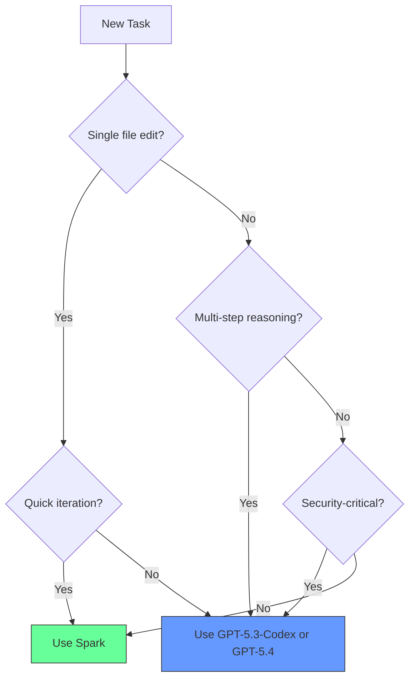

# GPT-5.3-Codex-Spark and the Cerebras Inference Stack: Real-Time Coding at 1,000 Tokens per Second

**Date:** 2026-03-31
**Tags:** codex-spark, cerebras, real-time, inference, websocket, wse-3, model-selection, latency

---

GPT-5.3-Codex-Spark is OpenAI's first model purpose-built for real-time coding iteration, and the first production model served entirely on non-NVIDIA hardware. Released on 12 February 2026 as a research preview for ChatGPT Pro subscribers [^1], Spark trades reasoning depth for raw speed — delivering over 1,000 tokens per second on the Cerebras Wafer-Scale Engine 3 (WSE-3) [^2]. For Codex CLI users, it changes the economics of interactive workflows: rapid prototyping, single-file edits, and frontend iteration become near-instantaneous.

This article covers the hardware underpinnings, the infrastructure optimisations OpenAI shipped alongside Spark, how to configure it in Codex CLI, benchmark realities, and practical patterns for integrating it into a multi-model workflow.

## The Cerebras WSE-3 and Why It Matters

Codex-Spark is the first fruit of OpenAI's multi-year, $10 billion+ agreement with Cerebras Systems [^3]. The WSE-3 is Cerebras' third-generation wafer-scale chip, packing 4 trillion transistors and the largest on-chip memory of any AI accelerator [^2]. The architecture scales out to thousands of systems, pushing fast memory capacity into the multi-terabyte range [^2].

For coding workloads, the key advantage is **latency, not throughput**. Traditional GPU clusters optimise for batch throughput; the WSE-3's on-chip SRAM eliminates the memory-bandwidth bottleneck that causes per-token latency spikes in transformer inference. The result: Spark sustains ~1,000 tokens/s compared to GPT-5.3-Codex's ~65–70 tokens/s — roughly a 15× speed-up [^4].



## Infrastructure Optimisations

Spark's raw speed would be wasted if the network stack added latency on every round-trip. OpenAI shipped three infrastructure changes alongside the model [^5]:

| Optimisation | Improvement |
|---|---|
| Persistent WebSocket connection | 80% reduction in client/server round-trip overhead |
| Responses API stream rewrite | 30% reduction in per-token overhead |
| Session initialisation rewrite | 50% improvement in time-to-first-token |

The WebSocket transport is enabled by default for Spark and is rolling out as the default for all models [^5]. In `config.toml`, provider-level WebSocket support is exposed via the `supports_websockets` key [^6]:

```toml
[model_providers.openai]
supports_websockets = true
```

## Configuring Spark in Codex CLI

### Quick start

Launch a session with Spark directly:

```bash
codex -m gpt-5.3-codex-spark
```

Or switch mid-session using the `/model` command:

```
/model gpt-5.3-codex-spark
```

### Persistent configuration

Set Spark as your default model in `~/.codex/config.toml`:

```toml
model = "gpt-5.3-codex-spark"
```

Or scope it to a project by placing `.codex/config.toml` in the repository root [^6].

### Profile-based switching

For teams that want Spark for rapid iteration but the full model for deep work, profiles provide clean switching [^6]:

```toml
[profiles.spark]
model = "gpt-5.3-codex-spark"
model_reasoning_effort = "low"

[profiles.deep]
model = "gpt-5.3-codex"
model_reasoning_effort = "xhigh"
```

Launch with `codex --profile spark` for quick edits or `codex --profile deep` for complex refactors.

### Access requirements

Spark is currently available only to ChatGPT Pro subscribers ($200/month) [^1]. API access is rolling out to select design partners [^2]. Users on Plus or Team plans will see the model listed in `/model` but cannot use it — the CLI silently routes to the default model [^7]. Check actual model availability with `/status` rather than `/model` [^8].

## Benchmark Reality Check

OpenAI's announcement claims Spark matches GPT-5.3-Codex's 77.3% on Terminal-Bench 2.0 [^1]. Independent community benchmarks tell a different story:

| Benchmark | GPT-5.3-Codex | Codex-Spark (OpenAI) | Codex-Spark (Independent) |
|---|---|---|---|
| SWE-Bench Pro | 56.8% [^9] | ~56% ⚠️ | ~56% |
| Terminal-Bench 2.0 | 77.3% [^9] | 77.3% [^1] | ~58.4% [^10] |
| Context Window | 400k+ tokens | 128k tokens | 128k tokens |

The ~19 percentage point gap on Terminal-Bench 2.0 between official and independent scores is significant [^10]. Dominic Elm's analysis notes: "Spark is a smaller, distilled model that trades intelligence for speed, scoring 58.4% on Terminal-Bench 2.0 versus the full Codex's 77.3%" [^10].

⚠️ OpenAI's SWE-Bench Pro claim of "matching" accuracy may reflect a specific scaffold configuration; independent reproductions with standardised scaffolding show lower scores.

The practical takeaway: Spark is meaningfully **more capable than GPT-5.1-Codex-mini** (+12.3 points on Terminal-Bench) [^10] but **not equivalent to the full GPT-5.3-Codex** on complex multi-step tasks. It reportedly drifts after 6–8 reasoning steps, whereas the full model maintains coherence across 12+ step plans [^4].

## When to Use Spark (and When Not To)



**Spark excels at:**

- Rapid prototyping and boilerplate generation
- Single-file edits (CSS, React components, configuration)
- Frontend iteration cycles
- Interactive pair programming where latency matters more than depth

**Stick with the full model for:**

- Multi-step debugging across services
- Security-critical code (authentication, encryption, validation)
- Database migrations requiring stateful reasoning
- Large codebase analysis beyond the 128k context window

## Multi-Model Workflow: Spark as a Subagent

One powerful pattern combines Spark's speed with a flagship model's reasoning. Using Codex CLI's multi-agent v2 system, you can delegate quick edits to a Spark-powered subagent while the primary agent handles orchestration:

```toml
# .codex/agents/quick-edit.toml
model = "gpt-5.3-codex-spark"
model_reasoning_effort = "low"
instructions = """
You handle single-file edits and quick formatting fixes.
Keep changes minimal and focused.
"""
```

The primary agent (running GPT-5.4 or GPT-5.3-Codex) can then spawn this subagent for rapid tasks while retaining the full model's reasoning for architectural decisions.

## API Pricing and Cost Considerations

For API access (rolling out to design partners), Spark's pricing is significantly lower than the full model [^11]:

| Model | Input (per 1M tokens) | Output (per 1M tokens) |
|---|---|---|
| gpt-5.3-codex-spark | $1.75 | $14.00 |

⚠️ API pricing is subject to change as Spark exits research preview.

Combined with its 15× throughput, Spark can be dramatically more cost-effective for high-volume, low-complexity coding tasks — particularly in CI/CD pipelines using `codex exec` for automated formatting, linting fixes, and boilerplate generation.

## The Strategic Picture

Codex-Spark represents OpenAI's first step toward a dual-mode Codex architecture: real-time collaboration for rapid iteration alongside longer-horizon reasoning for deep work [^2]. Over time, these modes will blend — Codex maintaining an interactive loop while delegating complex work to background subagents [^2].

For the Codex CLI ecosystem, the implications are clear: model selection is no longer just about capability but about **matching latency characteristics to task complexity**. The profile system, multi-agent delegation, and the upcoming plugin marketplace all support this heterogeneous-model future.

The Cerebras partnership also signals OpenAI's strategic diversification away from NVIDIA dependency [^3]. Whether WSE-3 inference scales to flagship models remains to be seen, but for distilled, speed-optimised variants like Spark, the wafer-scale approach delivers a qualitatively different developer experience.

## Citations

[^1]: OpenAI, "Introducing GPT-5.3-Codex-Spark," 12 February 2026. [https://openai.com/index/introducing-gpt-5-3-codex-spark/](https://openai.com/index/introducing-gpt-5-3-codex-spark/)

[^2]: Cerebras, "Introducing OpenAI GPT-5.3-Codex-Spark Powered by Cerebras," February 2026. [https://www.cerebras.ai/blog/openai-codexspark](https://www.cerebras.ai/blog/openai-codexspark)

[^3]: Tom's Hardware, "OpenAI launches GPT-5.3-Codex-Spark on Cerebras chips — marks AI giant's first production deployment away from Nvidia," February 2026. [https://www.tomshardware.com/tech-industry/artificial-intelligence/openai-lauches-gpt-53-codes-spark-on-cerebras-chips](https://www.tomshardware.com/tech-industry/artificial-intelligence/openai-lauches-gpt-53-codes-spark-on-cerebras-chips)

[^4]: Turing College, "Codex 5.3 vs. Codex Spark: Speed vs. Intelligence," 2026. [https://www.turingcollege.com/blog/codex-5-3-vs-codex-spark-speed-vs-intelligence](https://www.turingcollege.com/blog/codex-5-3-vs-codex-spark-speed-vs-intelligence)

[^5]: InfoQ, "OpenAI Codex-Spark Achieves Ultra-Fast Coding Speeds on Cerebras Hardware," March 2026. [https://www.infoq.com/news/2026/03/open-ai-codex-spark/](https://www.infoq.com/news/2026/03/open-ai-codex-spark/)

[^6]: OpenAI, "Configuration Reference – Codex," 2026. [https://developers.openai.com/codex/config-reference](https://developers.openai.com/codex/config-reference)

[^7]: GitHub, "Codex Spark not yet available? · Issue #11623," 12 February 2026. [https://github.com/openai/codex/issues/11623](https://github.com/openai/codex/issues/11623)

[^8]: GitHub, "Limitations of GPT-5.3-Codex-Spark visible in /status but not /model · Issue #12992," 2026. [https://github.com/openai/codex/issues/12992](https://github.com/openai/codex/issues/12992)

[^9]: OpenAI, "Introducing GPT-5.3-Codex," 5 February 2026. [https://openai.com/index/introducing-gpt-5-3-codex/](https://openai.com/index/introducing-gpt-5-3-codex/)

[^10]: Dominic Elm (@elmd_), "GPT-5.3-Codex-Spark is not GPT-5.3-Codex!," X/Twitter, February 2026. [https://x.com/elmd_/status/2023417837193240788](https://x.com/elmd_/status/2023417837193240788)

[^11]: TypingMind, "Connect and use GPT-5.3 Codex Spark from OpenAI with API Key," 2026. [https://www.typingmind.com/guide/openai/gpt-5.3-codex-spark](https://www.typingmind.com/guide/openai/gpt-5.3-codex-spark)
