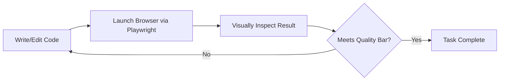
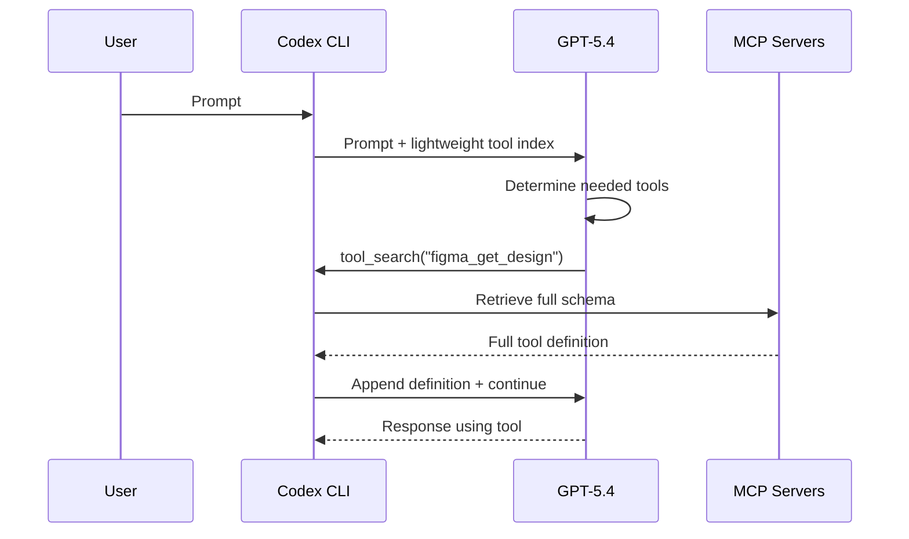

# GPT-5.4 Computer Use and Tool Search in Codex CLI: Visual Debugging, Deferred Loading, and /fast Mode


---

GPT-5.4, released on 5 March 2026, is OpenAI's first mainline reasoning model to ship with native computer-use capabilities alongside the frontier coding performance inherited from GPT-5.3-Codex [^1]. For Codex CLI users, three features stand out: **computer use** for visual debugging loops, **tool search** for deferred MCP tool loading, and **/fast mode** for accelerated token generation. This article covers all three — what they do, how to configure them, and where the edges are.

## Computer Use: From Code Generation to Desktop Navigation

Previous Codex models could write Playwright scripts and parse screenshots. GPT-5.4 goes further: it can issue raw mouse clicks, keystrokes, scrolls, and drag operations in response to screenshots, closing the loop between "write the code" and "verify it works visually" [^2].

### Performance

The numbers tell the story. On OSWorld-Verified — which measures a model's ability to navigate real desktop environments through screenshots and keyboard/mouse actions — GPT-5.4 scores **75.0%**, surpassing both human experts at 72.4% and Claude Opus 4.6 at 72.7% [^3]. GPT-5.2 managed 47.3% on the same benchmark [^2]. That is not an incremental gain; it is a capability tier change.

### How It Works in the API

The computer-use tool is passed as `{"type": "computer"}` in the tools array. The model receives a screenshot, returns structured actions (click coordinates, keystrokes, scroll directions), and the client executes them before feeding back the next screenshot [^3]. GPT-5.4 also introduces `"detail": "original"` for image inputs — preserving full fidelity up to 10.24 megapixels (6000px max dimension) — which materially improves click accuracy on dense interfaces compared to the previous `"high"` cap of 2048px [^3].

### Playwright Interactive: The Codex Skill

OpenAI released an experimental Codex skill called **Playwright (Interactive)** that demonstrates computer use and coding working in tandem [^1]. Unlike the headless Playwright skill that simply runs browser automation scripts, the interactive variant creates a closed loop:



The model writes code, launches a headless Chrome instance, takes a screenshot of the running application, evaluates the visual output, and iterates — all within a single Codex session with minimal user intervention [^4].

OpenAI demonstrated this with a theme park simulation game: tile-based path placement, ride construction, guest pathfinding, and queueing — built from a single lightly specified prompt. The full session ran approximately 90 minutes [^4].

### Practical Implications for Codex CLI Users

Computer use in Codex CLI is most valuable for:

- **Frontend visual QA**: the model builds a component, screenshots the result, and fixes layout issues without you describing what is wrong
- **Electron app testing**: particularly useful for desktop applications where DOM inspection is insufficient
- **Design-to-implementation loops**: pair with Figma MCP for design context, then use Playwright Interactive for visual verification

⚠️ Computer use is available via the API and the Codex app. The Codex CLI TUI currently surfaces it through the Playwright Interactive skill rather than as a raw computer-use tool. Direct `{"type": "computer"}` tool access in the CLI is not yet documented as a first-class config option.

## Tool Search: Deferred Loading for MCP-Heavy Setups

If you run multiple MCP servers — Figma, Notion, Slack, GitHub, plus a few custom ones — you have likely noticed the token cost of injecting every tool definition into every request. A moderately equipped setup can burn thousands of tokens on tool schemas before the conversation even begins [^5].

### The Problem

Consider a configuration with two MCP servers exposing 36 tools. The combined schema definitions total roughly 2,500 characters (388 words) per request, yet the tools are relevant for perhaps 5% of queries [^6]. At GPT-5.4's input pricing of $2.50 per million tokens [^7], this overhead adds up across a full working day.

### How Tool Search Works

Tool search, introduced with GPT-5.4, replaces upfront schema injection with on-demand retrieval [^5]:

1. The model receives a **lightweight index** of available tools (names and brief descriptions)
2. When the model determines it needs a specific tool, it issues a tool-search call to retrieve the full definition
3. The full schema is appended to the conversation only when needed



### Results

OpenAI evaluated tool search across 250 tasks from Scale's MCP Atlas benchmark with all 36 servers enabled: **47% token reduction with no accuracy loss** [^5]. For enterprise teams running 10+ MCP servers, this translates directly to lower costs and improved prompt cache hit rates.

### Configuration

In the API, tool search is enabled by including `{"type": "tool_search"}` in the tools array [^5]. MCP server tools marked with `defer_loading: True` participate in deferred loading.

### Current Limitations in Codex CLI

Here is the catch: as of v0.117.0, Codex CLI does not yet expose tool search as a first-class configuration option for MCP tools. General MCP tool definitions are still injected upfront [^6]. GitHub issue #14507 requests extending GPT-5.4-style deferred loading to all MCP server tools in the CLI [^6]. The issue is labelled `enhancement` and `agent` but has no implementation timeline.

**Model support matrix for tool search** [^8]:

| Model | Tool Search |
|---|---|
| GPT-5.4 | ✅ Supported |
| GPT-5.4 Pro | ✅ Supported |
| GPT-5.4 Mini | ✅ Supported |
| GPT-5.4 Nano | ❌ Not supported |
| GPT-5.3-Codex | ❌ Not supported |

If you are using the Codex Python SDK (`codex_app_server`) with direct API calls, you can pass tool search configuration today. For the CLI TUI, you are waiting on the upstream issue.

## /fast Mode: Same Model, Higher Token Velocity

GPT-5.4's latency profile is its Achilles heel. Artificial Analysis measured it as the slowest model on their benchmarks — 185 seconds time-to-first-token for complex reasoning tasks [^9]. For interactive coding sessions, that is painful.

### What /fast Does

The `/fast` slash command in Codex toggles priority processing, delivering **up to 1.5× faster token velocity** with the same model and the same intelligence [^1]. It is not a different model checkpoint — it is the same GPT-5.4, routed through a faster inference path.

The trade-off: `/fast` mode costs **2× the standard plan usage** [^9]. For ChatGPT subscription users, this means your included limits drain twice as quickly.

### When to Use It

```toml
# config.toml — profile for fast interactive work
[profiles.fast]
model = "gpt-5.4"
model_reasoning_effort = "medium"
# Toggle /fast in-session for latency-sensitive tasks
```

Use `/fast` for:

- Interactive debugging sessions where you are waiting on each response
- Short, focused prompts where latency matters more than token budget
- Demos and pair programming where responsiveness affects flow

Skip it for:

- Long-running autonomous tasks (subagents, `codex exec` pipelines)
- Batch operations where you are not watching the output
- Budget-constrained team environments

## Reasoning Effort: Tuning the Cost–Latency Curve

GPT-5.4 supports five reasoning effort levels: `none`, `low`, `medium`, `high`, and `xhigh` [^10]. The default is `none`, optimised for lower latency. Higher settings allocate more reasoning tokens before producing a response.

```toml
# config.toml
model = "gpt-5.4"
model_reasoning_effort = "high"
```

For Codex CLI workflows, consider a tiered approach:

| Task Type | Recommended Effort | Rationale |
|---|---|---|
| Codebase exploration | `none` or `low` | Speed matters, reasoning depth does not |
| Implementation | `medium` or `high` | Balance between quality and cost |
| Complex refactoring | `high` or `xhigh` | Maximise reasoning for architectural decisions |
| Subagent workers | `low` or `medium` | Cost efficiency across parallel agents |

## Context Window: 272K Standard, 1M Extended

GPT-5.4 supports up to **1 million tokens** of context [^1], but the standard window is 272K tokens. Extended context beyond 272K incurs **2× input pricing and 1.5× output pricing** for the full session [^7].

For Codex CLI, configure extended context via:

```toml
# config.toml — experimental extended context
model_context_window = 1048576
model_auto_compact_token_limit = 272000
```

⚠️ Extended context support in the CLI is not yet fully documented. The `/compact` command remains the practical tool for managing context in long sessions.

## Benchmark Context: Where GPT-5.4 Wins and Where It Does Not

For Codex CLI users choosing between models, the benchmark picture is nuanced [^3]:

| Benchmark | GPT-5.4 | GPT-5.3-Codex | Claude Opus 4.6 |
|---|---|---|---|
| SWE-Bench Pro | 57.7% | 56.8% | — |
| SWE-Bench Verified | 77.2% | — | 79.2% |
| OSWorld (computer use) | **75.0%** | — | 72.7% |
| Terminal-Bench 2.0 | 75.1% | **77.3%** | — |

GPT-5.4 leads on computer use and general professional tasks. GPT-5.3-Codex still edges it on Terminal-Bench for pure terminal-based coding [^3]. For most Codex CLI workflows that do not involve visual debugging, GPT-5.3-Codex remains competitive at a lower price point.

## Putting It Together: A Visual QA Workflow

Here is a practical configuration for a frontend team using all three features:

```toml
# config.toml
model = "gpt-5.4"
model_reasoning_effort = "high"

[profiles.visual-qa]
model = "gpt-5.4"
model_reasoning_effort = "medium"

[profiles.subagent]
model = "gpt-5.4-mini"
model_reasoning_effort = "low"
```

The workflow:

1. **Implement** with the default GPT-5.4 profile at `high` effort
2. **Visual QA** using the Playwright Interactive skill — switch to `visual-qa` profile for faster iteration
3. **Delegate** test writing to subagents on GPT-5.4-mini
4. Toggle `/fast` when iterating interactively on visual fixes

## What is Coming

The open issue #14507 for tool search in MCP tools suggests this gap will close [^6]. When it does, the combination of deferred tool loading plus computer use will make Codex CLI significantly more efficient for teams running complex MCP configurations with visual testing workflows.

GPT-5.2 Thinking retires on 5 June 2026 [^7]. If you are still using it, now is the time to test GPT-5.4 with your existing AGENTS.md and config.toml — the reasoning effort `none` default means you will need to explicitly set effort levels to match GPT-5.2's behaviour.

## Citations

[^1]: OpenAI. "Introducing GPT-5.4." openai.com, 5 March 2026. [https://openai.com/index/introducing-gpt-5-4/](https://openai.com/index/introducing-gpt-5-4/)

[^2]: Digital Applied. "GPT-5.4: Computer Use, Tool Search, Benchmarks, Pricing." digitalapplied.com, March 2026. [https://www.digitalapplied.com/blog/gpt-5-4-computer-use-tool-search-benchmarks-pricing](https://www.digitalapplied.com/blog/gpt-5-4-computer-use-tool-search-benchmarks-pricing)

[^3]: Alex Lavaee. "GPT-5.4: The Real Leap Isn't Coding." alexlavaee.me, March 2026. [https://alexlavaee.me/blog/gpt-5-4-the-real-leap-isnt-coding/](https://alexlavaee.me/blog/gpt-5-4-the-real-leap-isnt-coding/)

[^4]: Appius. "Playwright Interactive in GPT-5.4 e Codex." appius.it, March 2026. [https://www.appius.it/playwright-interactive-in-gpt-5-4-codex/](https://www.appius.it/playwright-interactive-in-gpt-5-4-codex/)

[^5]: OpenAI Developers. "Using GPT-5.4." developers.openai.com, March 2026. [https://developers.openai.com/api/docs/guides/latest-model](https://developers.openai.com/api/docs/guides/latest-model)

[^6]: GitHub Issue #14507. "Extend GPT-5.4-style tool search and deferred loading to all MCP server tools." github.com/openai/codex, 12 March 2026. [https://github.com/openai/codex/issues/14507](https://github.com/openai/codex/issues/14507)

[^7]: OpenAI Developer Community. "GPT-5.4 deep dive: pricing, context limits, and tool search explained." community.openai.com, March 2026. [https://community.openai.com/t/gpt-5-4-deep-dive-pricing-context-limits-and-tool-search-explained/1375800](https://community.openai.com/t/gpt-5-4-deep-dive-pricing-context-limits-and-tool-search-explained/1375800)

[^8]: OpenAI Developers. "GPT-5.4 mini Model." developers.openai.com, March 2026. [https://developers.openai.com/api/docs/models/gpt-5.4-mini](https://developers.openai.com/api/docs/models/gpt-5.4-mini)

[^9]: Better Stack Community. "GPT-5.4: Features, benchmarks, and tradeoffs." betterstack.com, March 2026. [https://betterstack.com/community/guides/ai/gpt-54-overview/](https://betterstack.com/community/guides/ai/gpt-54-overview/)

[^10]: OpenAI Developers. "Codex Models." developers.openai.com, March 2026. [https://developers.openai.com/codex/models](https://developers.openai.com/codex/models)
