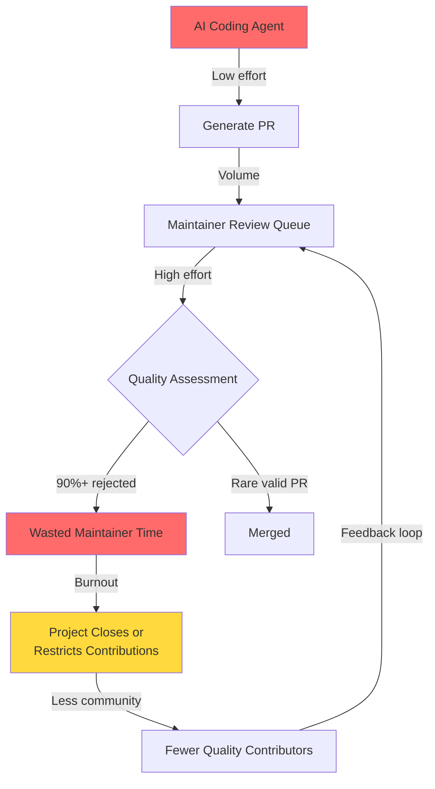
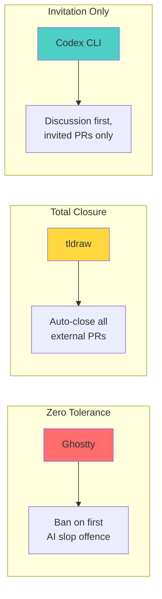

# AI Slopageddon and the Open-Source Contribution Crisis: How Codex CLI's Invitation-Only Model Signals a New Era


In January 2026, three critical open-source projects took unprecedented defensive measures within weeks of each other. cURL shut down its bug bounty programme[^1]. tldraw began automatically closing all external pull requests[^2]. Ghostty implemented a zero-tolerance policy where submitting AI-generated code earns a permanent ban[^3]. The common trigger: a flood of low-quality, AI-generated contributions that overwhelmed maintainer capacity.

OpenAI's Codex CLI — itself a tool that enables the very workflows generating these contributions — responded with its own structural shift. In Discussion #9956, the Codex team announced an invitation-only contribution model[^4], closing the door on unsolicited pull requests entirely. The irony is difficult to ignore, but the reasoning reveals something important about where open-source governance is headed.

## The Economics of Contribution Collapse

Before AI coding agents, contributing to open source required genuine effort: reading the codebase, understanding the issue, writing and testing code, crafting a coherent pull request description. That effort served as a natural quality filter[^5]. AI tools have eliminated the effort whilst leaving the evaluation burden entirely on maintainers.

The numbers tell the story. By late 2025, 20% of cURL's bug bounty submissions were AI-generated, whilst the overall valid rate had dropped to just 5%[^1]. In the first three weeks of January 2026, cURL received twenty security reports — none valid. Stack Overflow saw 25% less activity within six months of ChatGPT's launch[^5]. Tailwind CSS watched documentation traffic fall 40% and revenue drop 80% even as downloads climbed[^5].



The structural asymmetry is clear: AI tools optimise for submission volume, whilst the cost of review, rejection, and reputation defence falls entirely on unpaid volunteers[^6].

## The GitHub Contribution Economy

A GitHub profile full of green contribution squares looks impressive to recruiters. AI makes it trivially easy to generate dozens of pull requests across popular projects[^5]. The contributor gets a visible contribution history; the maintainer gets more work dumped on their plate.

GitHub product manager Camilla Moraes opened a community discussion acknowledging "a critical issue affecting the open source community"[^7]. Proposed solutions included giving maintainers the option to disable pull requests entirely, restrict them to project collaborators, and add transparency mechanisms for AI-generated content. Yet when maintainers asked for the ability to block Copilot-generated issues from their repositories, the response was effectively "no" — Copilot issues appear under the human user's name with no AI attribution[^7].

This creates an uncomfortable dynamic: GitHub profits from the tools generating the flood whilst offering only incremental mitigations to those drowning in it.

## Codex CLI's Invitation-Only Model

OpenAI's response within its own repository was more decisive. The Codex team's updated `contributing.md` is unambiguous[^4]:

> Pull requests that have not been explicitly invited by a member of the Codex team will be closed without review.

The stated rationale goes beyond simple gatekeeping. The Codex team argued that many contributions arrived "without full visibility into the architectural context, system-level constraints, or near-term roadmap considerations"[^4]. Reviewing and iterating on these PRs often consumed more time than implementing the fix internally.

The most revealing line in the policy: "In an AI-accelerated world, code itself is no longer the scarce resource. Understanding the problem, identifying the right solution, and making good prioritisation decisions are the hard parts — and those are areas where community input is most valuable and scalable"[^4].

### What Contributors Can Still Do

The invitation-only model does not mean the project is closed. Contributors are directed to:

1. **Open issues** describing proposals or upvote existing enhancement requests
2. **Report bugs** with detailed analysis, reproduction steps, and root-cause hypotheses
3. **Participate in discussions** on architecture and design decisions

The Codex team may then invite specific contributors to submit a PR when the problem is well understood and the issue is high-impact[^4]. Even invited PRs that introduce undiscussed scope changes may be closed.

### Documentation as a Closed System

Perhaps the most telling detail: Codex's documentation source lives in a private repository, editable only by OpenAI employees[^4]. Many documentation updates are automated by Codex itself — the codebase changes so rapidly that manual documentation updates would be nearly impossible to maintain. Bug reports about documentation go through the public issue tracker, but the fix is always internal.

## The Three Defensive Postures

Looking across the ecosystem, three distinct patterns have emerged for handling AI-generated contribution floods:



| Posture | Projects | Mechanism | Trade-off |
|---|---|---|---|
| **Zero tolerance** | Ghostty | Permanent ban for AI slop[^3] | Harsh but clear; risks losing genuine contributors who used AI for formatting |
| **Total closure** | tldraw | Auto-close all external PRs[^2] | Eliminates review burden entirely; kills community contribution |
| **Invitation only** | Codex CLI | Discussion → invited PR[^4] | Preserves high-quality collaboration; increases friction for all contributors |

Mitchell Hashimoto's Ghostty policy is notably explicit: "This is not an anti-AI stance. This is an anti-idiot stance. It's the people, not the tools, that are the problem"[^3].

## The Paradox: Codex as Both Cause and Cure

OpenAI's position is paradoxical. Codex CLI and its ecosystem of agentic coding tools are a primary driver of the AI-generated PR flood[^6]. Yet OpenAI also launched the Codex for Open Source programme on 7 March 2026, offering maintainers six months of free ChatGPT Pro and API credits[^8] — essentially providing the same tools as relief for the problem those tools created.

The programme includes:

- **ChatGPT Pro with Codex** for core maintainers with write access
- **Codex Security** access (conditional) for vulnerability scanning
- **API credits** through the $1M Codex Open Source Fund for projects using Codex in PR review, maintainer automation, or release workflows[^8]

Critically, the programme is tool-agnostic — OpenAI explicitly names OpenCode, Cline, pi, and OpenClaw as supported alternatives[^8]. This positions it as genuine ecosystem support rather than vendor lock-in.

But as several observers noted: "The tools flooding maintainer inboxes with low-quality code submissions are the same tools now being offered as relief"[^6]. Whether this constitutes arsonist-as-firefighter or genuine responsibility-taking depends on your perspective.

## What This Means for Codex CLI Users

If you are using Codex CLI to contribute to open-source projects — and many of us are — the slopageddon has direct implications for your workflow:

### Before Submitting AI-Assisted Contributions

1. **Read the project's contribution guidelines first.** An increasing number of projects have explicit AI policies. Submitting an AI-generated PR to a project that bans them damages your reputation permanently
2. **Open an issue before writing code.** The Codex model — discuss first, code second — is becoming the community norm, not the exception
3. **Review what your agent produces.** The compound engineering model (80% planning and review, 20% execution) applies doubly when contributing to someone else's project
4. **Disclose AI assistance.** Transparency builds trust. Most maintainers do not object to AI-assisted contributions — they object to undisclosed, unreviewed AI slop

### Using Codex for Maintainer Defence

If you maintain an open-source project, Codex CLI can help manage the flood:

```toml
# .codex/config.toml — PR triage profile
[profiles.triage]
model = "gpt-5.4-mini"
model_reasoning_effort = "medium"

[profiles.triage.instructions]
file = "AGENTS.md"
```

```markdown
<!-- AGENTS.md for PR triage -->
## PR Review Guidelines
- Check for AI-generated content markers (repetitive phrasing,
  generic variable names, missing project-specific conventions)
- Verify the contributor has an associated issue discussion
- Assess whether the change aligns with ROADMAP.md priorities
- Flag PRs that modify security-sensitive paths without prior approval
```

Combine this with the `codex exec` pipeline for automated first-pass triage:

```bash
# Triage incoming PRs against project conventions
gh pr list --state open --json number,title,body | \
  codex exec --profile triage \
  "Review each PR against our AGENTS.md contribution standards.
   Flag any that appear to be undiscussed AI-generated submissions."
```

## The Broader Shift: From Code to Context

Daniel Stenberg's warning at FOSDEM captures the trajectory: "Everyone is going to vibe code their own. And then, at the end of 2026, everyone is going to start realising what kind of burden they actually built themselves into"[^1].

The Codex CLI contribution model — where the valuable contribution is problem analysis and architectural discussion, not code — may represent the future of open-source collaboration. When any agent can generate a syntactically correct patch in seconds, the scarce resource is understanding *which* patch to generate and *why*.

This is fundamentally the same insight driving the compound engineering model[^9]: in an agentic world, the human's job shifts from writing code to directing, reviewing, and validating. For open-source communities, the same principle applies — but the stakes are higher because maintainer capacity is finite and unpaid.

The projects that survive the slopageddon will not be those that generate the most code. They will be those that cultivate the most thoughtful contributors — people who understand problems deeply enough to guide agents toward the right solutions. Codex CLI's invitation-only model, for all its friction, is an early experiment in what that future looks like.

## Citations

[^1]: Stenberg, D. (2026). "AI-generated bug reports and the curl bug bounty shutdown." [curl blog](https://daniel.haxx.se/blog/) and FOSDEM 2026 presentation. Also covered in [InfoQ: AI "Vibe Coding" Threatens Open Source](https://www.infoq.com/news/2026/02/ai-floods-close-projects/).

[^2]: Ruiz, S. (2026). "tldraw auto-closing external pull requests." Announced 15 January 2026. Covered in [The Register: GitHub ponders kill switch for pull requests](https://www.theregister.com/2026/02/03/github_kill_switch_pull_requests_ai/).

[^3]: Hashimoto, M. (2026). "Ghostty zero-tolerance policy for AI-generated contributions." Covered in [RedMonk: AI Slopageddon and the OSS Maintainers](https://redmonk.com/kholterhoff/2026/02/03/ai-slopageddon-and-the-oss-maintainers/).

[^4]: OpenAI. (2026). "Updating Codex Contribution Guidelines." [GitHub Discussion #9956](https://github.com/openai/codex/discussions/9956) and [contributing.md](https://github.com/openai/codex/blob/main/docs/contributing.md).

[^5]: Holterhoff, K. (2026). "AI Slopageddon and the OSS Maintainers." [RedMonk](https://redmonk.com/kholterhoff/2026/02/03/ai-slopageddon-and-the-oss-maintainers/).

[^6]: Bara, M. (2026). "AI Is the Largest Consumer of Open Source in History, and Its Worst Contributor." [Medium](https://medium.com/@marc.bara.iniesta/ai-is-the-largest-consumer-of-open-source-in-history-and-its-worst-contributor-91bc776438b5).

[^7]: GitHub. (2026). "Community discussion on AI-generated contribution management." Covered in [The Register](https://www.theregister.com/2026/02/03/github_kill_switch_pull_requests_ai/).

[^8]: OpenAI. (2026). "Codex for Open Source." [OpenAI Developers](https://developers.openai.com/community/codex-for-oss). Also covered in [WinBuzzer](https://winbuzzer.com/2026/03/09/openai-codex-open-source-maintainers-free-chatgpt-pro-xcxwbn/).

[^9]: Vaughan, D. (2026). "Compound Engineering with Codex: The 80/20 Plan-Review Model." [Codex Resources](/codex-resources/articles/2026-03-27-compound-engineering-codex-80-20/).
