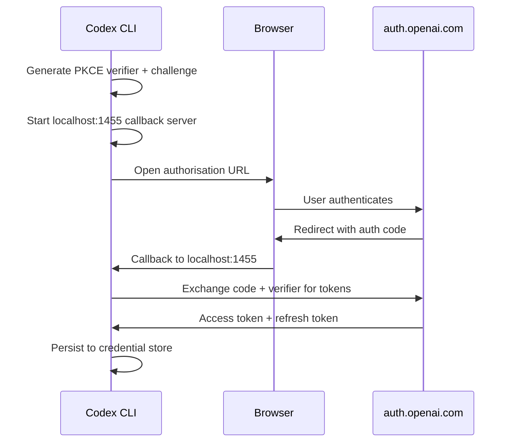
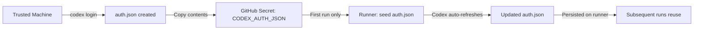
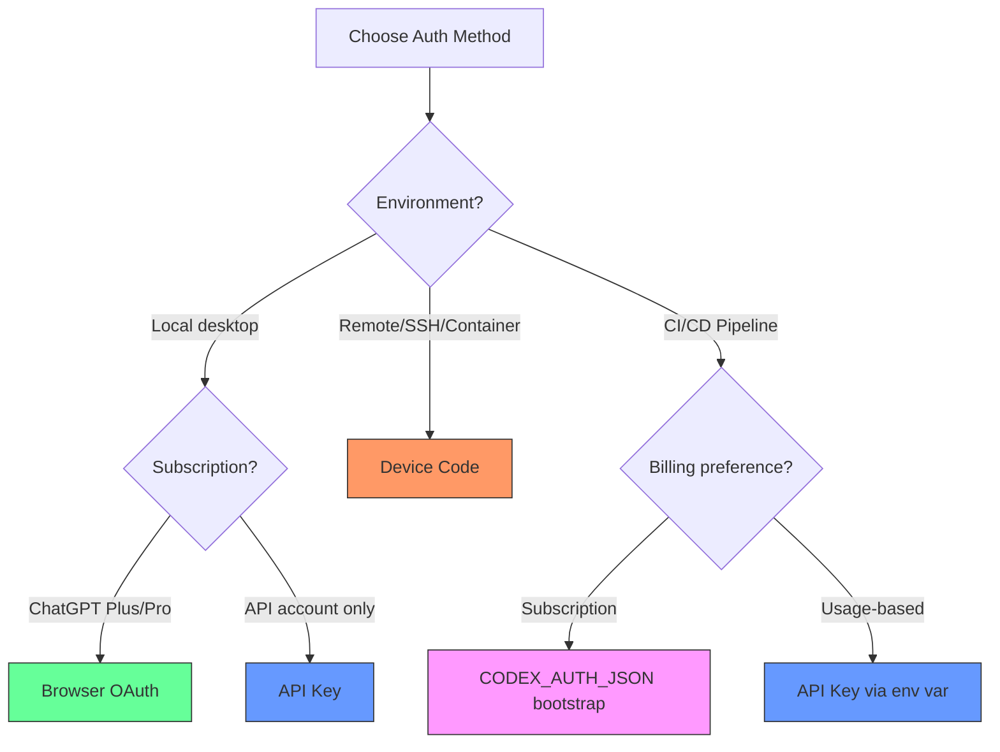

# Codex CLI Authentication: OAuth, Device Code, API Keys, and CI/CD Credential Management


---

Every Codex CLI session begins with authentication, yet the auth system is one of the least-documented corners of the toolchain. Codex supports three distinct sign-in methods — browser-based ChatGPT OAuth, device-code flow for headless environments, and API key authentication — each with different capabilities, billing models, and security trade-offs. This article maps the full authentication architecture: the OAuth PKCE flow internals, credential storage backends, token lifecycle management, CI/CD bootstrapping with `CODEX_AUTH_JSON`, managed environment lockdowns, and the dynamic bearer token system for custom model providers.

## Two Billing Universes

Before choosing an auth method, understand that Codex CLI operates across two fundamentally different billing models [^1]:

| Method | Billing | Features |
|---|---|---|
| **ChatGPT sign-in** | Subscription (Plus $20, Pro $200, Business, Edu, Enterprise) | Full feature set: Codex cloud, fast mode, Codex-Spark, realtime voice |
| **API key** | Usage-based (per-token, standard API rates) | Core CLI only; no Codex cloud, no fast mode |

ChatGPT sign-in is the default and recommended path for most developers. API key auth is suited to automation pipelines, custom harnesses, or teams that already manage OpenAI API spend through their platform account [^1].

## Method 1: Browser-Based OAuth (Default)

Running `codex login` with no flags triggers the browser-based ChatGPT OAuth flow [^1]. Under the hood, Codex:

1. Starts a local HTTP server on port 1455 to handle the callback [^2].
2. Generates a PKCE code verifier and challenge pair [^2].
3. Opens the browser to `https://auth.openai.com/oauth/authorize` with the public client ID `app_EMoamEEZ73f0CkXaXp7hrann` [^3].
4. Exchanges the authorisation code for access and refresh tokens at `https://auth.openai.com/oauth/token` [^3].
5. Persists the tokens using the configured credential storage backend.



### When Browser Auth Fails

The localhost callback requires the browser and CLI to run on the same machine. This breaks in common scenarios:

- SSH sessions to remote development machines
- Docker containers and Kubernetes pods
- Corporate environments where localhost port binding is restricted
- WSL2 instances where the default browser opens in Windows but the callback targets the Linux network namespace

For all of these, use device-code authentication instead [^1].

## Method 2: Device Code Flow (Beta)

Device-code auth decouples the browser from the CLI, making it work in any headless or remote environment [^1]:

```bash
codex login --device-auth
```

Or select "Sign in with Device Code" from the interactive login UI.

The flow presents a URL and a one-time code. Open the URL on any device (phone, laptop, different machine), authenticate, enter the code, and the CLI receives its tokens without needing a localhost callback [^1].

### Prerequisites

Device-code login must be explicitly enabled before use [^1]:

- **Personal accounts:** Enable in ChatGPT → Settings → Security → "Allow device code login"
- **Workspace accounts:** A workspace admin must enable it in ChatGPT → Workspace Settings → Permissions → "Allow device code login"

This opt-in requirement is a security measure — device-code flows are more susceptible to social engineering attacks than browser redirects, so OpenAI keeps them disabled by default.

### Remote and Container Use Cases

For containerised development environments, the device-code flow is the standard pattern:

```bash
# Inside a Docker container or remote SSH session
codex login --device-auth

# Output:
# Open https://auth.openai.com/device in your browser
# Enter code: ABCD-1234
# Waiting for authentication...
```

For Codex running on Kubernetes, the app-server's device-code sign-in support (added in late March 2026) enables authentication without browser callbacks — particularly useful for headless deployments [^4].

## Method 3: API Key Authentication

For automation and custom integrations, API key auth avoids the OAuth dance entirely [^1]:

```bash
# Pipe from environment variable (recommended)
printenv OPENAI_API_KEY | codex login --with-api-key

# Or from a secrets manager
vault kv get -field=openai_key secret/codex | codex login --with-api-key
```

**Never pass the API key as a command-line argument** — it would appear in shell history and process listings. Always pipe via stdin [^2].

### Feature Limitations

API key authentication provides access to the core CLI but excludes subscription-tier features [^1]:

- ❌ Codex cloud (`codex cloud exec`)
- ❌ Fast mode (`/fast`)
- ❌ Codex-Spark (requires ChatGPT Pro)
- ❌ Realtime voice sessions
- ✅ Full local CLI functionality
- ✅ Custom model providers
- ✅ `codex exec` for CI/CD
- ✅ Multi-agent workflows (local)

## Credential Storage Backends

Codex supports three credential storage modes, configured via `cli_auth_credentials_store` in `config.toml` [^1] [^2]:

```toml
# In ~/.codex/config.toml
cli_auth_credentials_store = "keyring"  # or "file" or "auto"
```

| Mode | Storage Location | Encryption | Best For |
|---|---|---|---|
| `keyring` | OS credential manager (macOS Keychain, Windows Credential Manager, Linux Secret Service) | OS-managed | Shared machines, security-conscious setups |
| `file` | `~/.codex/auth.json` (plaintext) | None | CI/CD runners, containers, simple setups |
| `auto` | Prefers OS keyring, falls back to file | Mixed | Default; works everywhere |

### Keyring Isolation

Keyring entries use a computed key derived from the `CODEX_HOME` directory path, so different Codex installations (e.g., separate `CODEX_HOME` values for work and personal) maintain isolated credential stores [^2]. On macOS, credentials appear in Keychain Access under the service name "Codex Auth".

### The `auth.json` File

When using file-based storage, `auth.json` sits in `$CODEX_HOME` (defaulting to `~/.codex`). It contains access tokens, refresh tokens, and session metadata in plaintext JSON [^1]:

```bash
# Inspect session health (without exposing tokens)
jq '{auth_mode, last_refresh, has_refresh_token: ((.tokens.refresh_token // "") != "")}' \
  ~/.codex/auth.json
```

⚠️ Treat `auth.json` as a password-equivalent secret. Never commit it, paste it into tickets, or share it in chat [^1].

## Token Lifecycle and Refresh

For ChatGPT sessions, Codex manages token refresh automatically [^1]:

- Access tokens are refreshed proactively during active sessions before they expire.
- If a token has expired (e.g., after an idle period), Codex performs a reactive refresh-and-retry on receiving a `401` response [^5].
- Sessions are considered stale after approximately 8 days without a refresh [^5].
- Refreshed credentials are written back to the storage backend, keeping `auth.json` current [^5].

This means active Codex sessions can run indefinitely without re-authentication, but sessions left idle for more than ~8 days will require a fresh login.

## CI/CD Authentication with `CODEX_AUTH_JSON`

Running Codex in CI/CD pipelines requires careful credential management. The recommended approach uses ChatGPT-managed auth with `CODEX_AUTH_JSON` as a bootstrap secret [^5]:



### GitHub Actions Setup

```yaml
name: Codex CI
on: [push]

env:
  CODEX_HOME: ${{ github.workspace }}/.codex-home

jobs:
  codex-review:
    runs-on: self-hosted  # Persistent runner recommended
    steps:
      - uses: actions/checkout@v4

      - name: Bootstrap Codex auth
        env:
          CODEX_AUTH_JSON: ${{ secrets.CODEX_AUTH_JSON }}
        run: |
          mkdir -p "$CODEX_HOME"
          if [ ! -f "$CODEX_HOME/auth.json" ]; then
            printf '%s' "$CODEX_AUTH_JSON" > "$CODEX_HOME/auth.json"
            chmod 600 "$CODEX_HOME/auth.json"
          fi

      - name: Run Codex
        run: codex exec "review the changes in this PR"
```

### Critical Detail: Conditional Seeding

The `if [ ! -f ... ]` guard is essential [^5]. Without it, every run overwrites the refreshed `auth.json` with the original (increasingly stale) secret, eventually causing auth failures.

### Self-Hosted vs Ephemeral Runners

| Runner Type | Strategy |
|---|---|
| **Self-hosted** | `CODEX_HOME` persists between jobs; `auth.json` refreshes naturally [^5] |
| **Ephemeral** (GitHub-hosted) | Restore `auth.json` from secure storage → run Codex → persist updated file back [^5] |

For ephemeral runners, consider using a cache or artefact storage to persist the refreshed `auth.json` between runs, or simply use API key authentication to avoid the token-lifecycle complexity entirely.

### Serialising Access

⚠️ Concurrent jobs sharing the same `auth.json` can cause race conditions during token refresh. Serialise Codex CI runs using GitHub Actions `concurrency` groups or a mutex [^5]:

```yaml
concurrency:
  group: codex-auth-${{ github.repository }}
  cancel-in-progress: false
```

## Managed Environment Controls

Enterprise administrators can lock down authentication behaviour using `requirements.toml` or workspace-level configuration [^1]:

```toml
# Force ChatGPT-only login (no API keys)
forced_login_method = "chatgpt"

# Restrict to a specific workspace
forced_chatgpt_workspace_id = "ws_abc123def456"
```

These keys prevent developers from bypassing workspace audit trails by using personal API keys, and ensure all usage is billed through the organisation's ChatGPT subscription [^1].

Codex cloud additionally requires multi-factor authentication (MFA) on the ChatGPT account before granting access [^1].

## Custom Provider Authentication

For custom model providers (Ollama, Azure OpenAI, Mistral, LM Studio), Codex supports several auth patterns [^6]:

### Static API Key via Environment Variable

```toml
[model_providers.azure]
name = "Azure OpenAI"
base_url = "https://my-resource.openai.azure.com/openai"
env_key = "AZURE_OPENAI_API_KEY"
```

### Static HTTP Headers

```toml
[model_providers.custom]
env_http_headers = { "X-Custom-Auth" = "MY_AUTH_TOKEN_ENV" }
```

### Dynamic Bearer Token Refresh

Added via PR #15917 (March 2026), custom providers can now fetch and refresh short-lived bearer tokens dynamically [^4]. This addresses enterprise identity providers that issue tokens with limited lifespans:

⚠️ The exact configuration keys for dynamic token refresh (`auth_token_command`, `auth_token_refresh_interval_ms`) were proposed in issue #15189 but the final implementation may use different key names [^7]. Check the latest configuration reference for current syntax.

## Corporate Proxy and TLS Configuration

In environments with TLS-intercepting proxies, set the custom CA bundle before authentication [^6]:

```bash
# Codex-specific CA bundle
export CODEX_CA_CERTIFICATE=/etc/ssl/corporate-ca-bundle.pem

# Fallback (if CODEX_CA_CERTIFICATE is unset)
export SSL_CERT_FILE=/etc/ssl/corporate-ca-bundle.pem

codex login
```

This applies to login flows, Responses API connections, and WebSocket transports [^6].

## Logout and Credential Cleanup

```bash
# Clear all stored credentials
codex logout
```

Always use `codex logout` rather than manually deleting `auth.json` — the logout command clears credentials from all configured storage backends (file, keyring, or both) [^2].

When migrating between auth methods (e.g., ChatGPT to API key), run `codex logout` first to ensure no stale tokens interfere.

## Troubleshooting

| Symptom | Likely Cause | Fix |
|---|---|---|
| Login opens browser but callback fails | Port 1455 blocked or WSL network mismatch | Use `codex login --device-auth` |
| `401` errors after idle period | Session stale (>8 days) | Re-run `codex login` |
| Spark model not available | Using API key auth (not ChatGPT Pro) | Switch to ChatGPT sign-in |
| CI/CD auth fails intermittently | Concurrent token refresh race | Add `concurrency` group to workflow |
| Corporate proxy SSL errors | Missing custom CA bundle | Set `CODEX_CA_CERTIFICATE` |

Codex generates a dedicated `codex-login.log` file for debugging authentication failures [^1]. Check `$CODEX_HOME/codex-login.log` for detailed OAuth error messages.

## Decision Matrix



## Citations

[^1]: OpenAI, "Authentication — Codex Developer Docs," 2026. <https://developers.openai.com/codex/auth>

[^2]: Mintlify / OpenAI, "codex login — Codex CLI Reference," 2026. <https://www.mintlify.com/openai/codex/cli/login>

[^3]: OpenAI, "Enable Headless or Command-line Authentication for Codex CLI — GitHub Issue #3820," 2026. <https://github.com/openai/codex/issues/3820>

[^4]: OpenAI, "Changelog — Codex Developer Docs," 2026. <https://developers.openai.com/codex/changelog>

[^5]: OpenAI, "Maintain Codex account auth in CI/CD (advanced)," 2026. <https://developers.openai.com/codex/auth/ci-cd-auth>

[^6]: OpenAI, "Advanced Configuration — Codex Developer Docs," 2026. <https://developers.openai.com/codex/config-advanced>

[^7]: GitHub, "Support dynamic bearer token refresh for custom model providers — Issue #15189," February 2026. <https://github.com/openai/codex/issues/15189>
