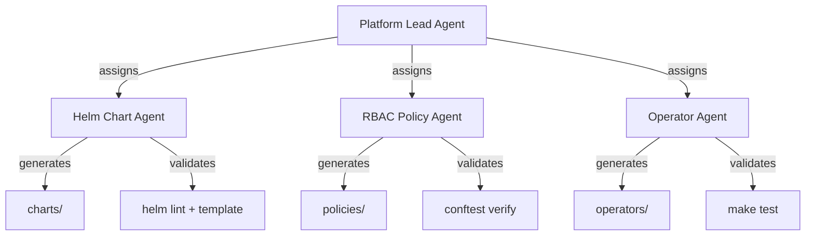
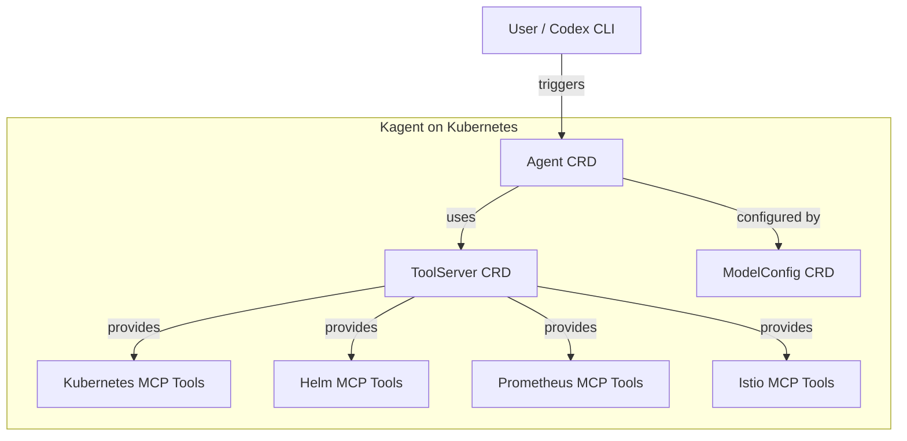

# Codex CLI for Kubernetes and Cloud-Native Teams: AGENTS.md, Helm Workflows, and the Agent Sandbox CRD


Kubernetes YAML is notoriously error-prone. Helm templates add Go template syntax on top. Operator development demands reconciliation loops, CRD schemas, and RBAC policies — all of which must be kept in sync. Codex CLI is well-suited to this domain precisely because it can generate manifests, run `kubectl apply --dry-run=server`, interpret the output, and iterate — all within a single agentic turn.

This article covers production AGENTS.md patterns for Kubernetes repositories, sandbox configuration for `kubectl` and `helm` workflows, running Codex itself on Kubernetes, and the emerging ecosystem of Kubernetes-native AI agent frameworks that complement Codex CLI in cloud-native pipelines.

## AGENTS.md for Kubernetes Repositories

A well-structured AGENTS.md is the single most impactful investment for Kubernetes teams adopting Codex CLI. The agent reads this file at session start and uses it to constrain every generation and validation step [^1].

### Production Template

```markdown
# AGENTS.md — Kubernetes Platform Team

## Project Structure
- `charts/` — Helm charts (Chart.yaml, values.yaml, templates/)
- `manifests/` — Raw Kubernetes manifests for non-Helm resources
- `operators/` — Kubebuilder operator source (Go)
- `policies/` — OPA/Gatekeeper ConstraintTemplates

## Commands
- Lint Helm charts: `helm lint charts/<name> --strict`
- Template render: `helm template charts/<name> -f charts/<name>/values.yaml`
- Dry-run apply: `kubectl apply --dry-run=server -f <manifest>`
- Run operator tests: `cd operators/<name> && make test`
- Run e2e tests: `cd operators/<name> && make test-e2e`
- Kubebuilder scaffold: `kubebuilder create api --group <g> --version <v> --kind <k>`

## Rules
- NEVER apply resources to a live cluster without `--dry-run=server` first
- ALWAYS validate Helm output with `helm template` before committing
- Use `apiVersion: apps/v1` — never use beta API versions
- CRD schemas MUST include OpenAPI validation (`x-kubernetes-validations`)
- RBAC rules follow least-privilege: scope to specific resources and verbs
- Secrets must use ExternalSecrets or Sealed Secrets — never plain Secret manifests
- Container images must specify digest tags, not `:latest`
- All Deployments must include resource requests, limits, and readiness probes
- Prefer `kustomize` overlays for environment-specific configuration over duplicated YAML
```

### Nested AGENTS.md for Chart Subdirectories

For monorepos containing multiple Helm charts, place a chart-specific AGENTS.md inside each chart directory:

```markdown
# charts/api-gateway/AGENTS.md

## Chart-Specific Rules
- This chart uses Istio VirtualService — not Ingress
- Values schema is enforced via values.schema.json — update it when adding keys
- Test with: `helm unittest charts/api-gateway`
```

Codex CLI discovers AGENTS.md files by walking up from the working directory [^2], so chart-level instructions override repository-level defaults automatically.

## Sandbox Configuration for Kubernetes Tooling

Codex CLI's default `read-only` sandbox blocks `kubectl`, `helm`, and other tools that write to the filesystem or make network calls. Kubernetes workflows require deliberate permission escalation.

### Recommended Profile

```toml
# ~/.codex/config.toml

[profiles.k8s]
model = "gpt-5.4"
model_reasoning_effort = "high"
sandbox_mode = "workspace-write"
approval_policy = "unless-allow-listed"

[profiles.k8s.sandbox]
writable_roots = ["./charts", "./manifests", "./operators"]
```

Launch with:

```bash
codex --profile k8s
```

The `workspace-write` sandbox allows Codex to modify files within the project and run `helm template` or `kubectl apply --dry-run=server` — but blocks outbound network access by default [^3]. For workflows that require cluster connectivity (e.g., dry-run validation against a real API server), you have two options:

1. **Allow specific egress** — configure domain allow-lists in the sandbox to permit your cluster API endpoint
2. **Use `danger-full-access`** inside an isolated CI runner or containerised environment where Codex cannot reach production clusters

⚠️ Never use `danger-full-access` on a machine with `kubeconfig` pointing at a production cluster.

### Starlark Rules for Kubernetes Safety

```python
# .codex/rules/k8s.rules

prefix_rule(
    pattern=["kubectl delete", "kubectl drain", "helm uninstall"],
    decision="forbidden",
    description="Destructive cluster operations are forbidden"
)

prefix_rule(
    pattern=["kubectl apply --dry-run"],
    decision="allow",
    description="Dry-run applies are safe"
)

prefix_rule(
    pattern=["helm template", "helm lint", "helm unittest"],
    decision="allow",
    description="Helm validation commands are safe"
)
```

These rules prevent the agent from running destructive `kubectl` commands whilst allowing validation workflows to proceed without approval prompts [^4].

## Practical Workflows

### Helm Chart Generation and Validation

A typical prompt for generating a new Helm chart:

```
Create a Helm chart in charts/user-service for a Go HTTP service.
Include: Deployment, Service, HPA, PDB, ServiceAccount, NetworkPolicy.
Use values.yaml for all configurable fields. Add helm-unittest tests.
Validate with helm lint --strict and helm template.
```

Codex will scaffold the chart, populate `templates/`, write `values.yaml` with sensible defaults, create test files under `tests/`, and run the validation commands — iterating if `helm lint` reports errors.

### Operator Development with Kubebuilder

For teams building Kubernetes operators, Codex handles the boilerplate-heavy reconciliation loop:

```
Add a new CRD "BackupSchedule" (group: platform.example.com, version: v1alpha1)
using Kubebuilder. The reconciler should create a CronJob that runs
a backup script at the schedule specified in .spec.schedule.
Include OpenAPI validation, RBAC markers, and unit tests.
```

The agent runs `kubebuilder create api`, generates the types, writes the reconciler, adds RBAC markers, and runs `make test` to verify [^5].

### Multi-Agent Pattern for Platform Teams

For large-scale Kubernetes operations, a dispatcher–worker pattern using Codex's multi-agent v2 system distributes work across specialists:



Configure this in `.codex/agents/`:

```toml
# .codex/agents/helm-specialist.toml
[agent]
model = "gpt-5.4-mini"
instructions = "You are a Helm chart specialist. Generate and validate Helm charts only."

# .codex/agents/rbac-specialist.toml
[agent]
model = "gpt-5.4-mini"
instructions = "You are a Kubernetes RBAC specialist. Generate and validate RBAC policies and OPA constraints."
```

The lead agent spawns specialists using path-based addressing (`/root/helm-specialist`) and collects results before committing [^6].

## Running Codex CLI on Kubernetes

For teams wanting a persistent, shared Codex instance, a community Helm chart packages Codex CLI as a Kubernetes deployment [^7]:

```bash
helm repo add openai-codex https://chrisbattarbee.github.io/openai-codex-helm
helm repo update
helm install codex openai-codex/openai-codex
```

Access the running instance:

```bash
kubectl exec -it deploy/codex-openai-codex -c codex -- codex
```

Authentication uses the device code flow — enable it in your ChatGPT security settings before connecting [^7].

### Monitoring Codex on Kubernetes

Codex lacks native telemetry for subprocess calls, making kernel-level monitoring essential in Kubernetes deployments. eBPF-based tools (Metoro, Falco, Tetragon) can track which APIs and endpoints Codex calls during execution [^7]. This is critical for audit compliance in enterprise environments.

### CodeXCTL: Kubernetes-First Orchestration

The community `codexctl` project provides a declarative `services.yaml` for managing Codex agent pods on Kubernetes [^8]. It renders manifests using templates, bootstraps Codex agent pods per PR or task, and integrates with GitHub and Kaniko pipelines. The agent pod image must include `kubectl`, `gh`, and other binaries since the Codex agent has no access to host tools [^8].

## The Kubernetes Agent Sandbox CRD

Kubernetes SIG Apps introduced the **Agent Sandbox** project in March 2026 — a CRD and controller purpose-built for AI agent workloads [^9]. This is directly relevant to teams running Codex or similar agents on Kubernetes.

### Key Capabilities

| Feature | Benefit |
|---|---|
| **Sandbox CRD** | Declarative API for singleton, stateful agent workloads |
| **SandboxWarmPool** | Pre-provisioned pods eliminating cold-start latency |
| **SandboxClaim** | Request a pre-warmed environment from a template |
| **Runtime isolation** | gVisor or Kata Containers for kernel-level sandboxing |
| **Scale-to-zero** | Idle agents consume zero resources, resume exactly where they left off |

### Installation

```bash
export VERSION="v0.1.0"
kubectl apply -f \
  https://github.com/kubernetes-sigs/agent-sandbox/releases/download/${VERSION}/manifest.yaml
kubectl apply -f \
  https://github.com/kubernetes-sigs/agent-sandbox/releases/download/${VERSION}/extensions.yaml
```

A Python SDK (`k8s-agent-sandbox`) is also available for programmatic integration with agent orchestration code [^9].

### Codex in an Agent Sandbox

The Agent Sandbox provides the isolation layer that Codex CLI's built-in Landlock/Seatbelt sandbox provides locally — but at cluster scale. A SandboxTemplate pre-configured with Codex CLI, `kubectl`, `helm`, and your team's toolchain gives each agent invocation a clean, isolated environment with network policies enforced at the Kubernetes level rather than relying on Codex's own sandbox [^9].

## Kagent: CNCF's Kubernetes-Native AI Agent Framework

**Kagent** (CNCF Sandbox, created by Solo.io) takes a different approach — rather than running Codex on Kubernetes, it provides a Kubernetes-native framework where agents, tools, and model configurations are defined as CRDs [^10].

### Architecture



Kagent ships with pre-built MCP tool servers for Kubernetes, Istio, Helm, Argo, Prometheus, Grafana, and Cilium [^10]. Its engine is built on Google ADK and supports OpenAI, Anthropic, Google Vertex AI, and Ollama as LLM providers [^10].

### Integration with Codex CLI

Kagent's MCP tool servers can be consumed by Codex CLI directly. Configure a Kagent MCP endpoint in your `config.toml`:

```toml
[mcp_servers.kagent-k8s]
transport = "http"
url = "http://kagent-tools.kagent-system.svc:8080/mcp"
```

This gives Codex access to Kubernetes cluster operations through Kagent's tools — reading pod logs, querying Prometheus metrics, generating resources — without granting direct `kubectl` access [^10].

### kmcp: Bootstrapping MCP Servers for Kubernetes

The `kmcp` tool (part of the Kagent project) scaffolds MCP servers and deploys them to Kubernetes, letting teams build custom tool servers that Codex CLI can consume via MCP configuration [^10].

## CI/CD Integration: codex exec for Kubernetes Validation

Automate Helm chart validation in GitHub Actions using `codex exec`:

```yaml
# .github/workflows/helm-validate.yml
name: Helm Validation
on:
  pull_request:
    paths: ['charts/**']

jobs:
  validate:
    runs-on: ubuntu-latest
    steps:
      - uses: actions/checkout@v4
      - uses: openai/codex-action@v1
        with:
          prompt: |
            Run helm lint --strict and helm template for every chart
            under charts/. Report any errors as a structured JSON summary.
          full-auto: true
          codex-args: >-
            --output-schema .github/helm-report-schema.json
            -o helm-report.json
        env:
          CODEX_API_KEY: ${{ secrets.CODEX_API_KEY }}
      - uses: actions/upload-artifact@v4
        with:
          name: helm-report
          path: helm-report.json
```

The `--output-schema` flag ensures structured, machine-parseable output for downstream pipeline steps [^11].

## Known Limitations

- **No native cluster awareness** — Codex CLI does not introspect live cluster state unless you grant network access and provide a `kubeconfig`. Consider using Kagent MCP tools as a safer alternative.
- **Helm dependency resolution** — `helm dependency build` requires network access to fetch chart dependencies. Pre-run this step outside the sandbox or use a chart repository mirror.
- **CRD complexity** — Generating deeply nested CRD schemas with `x-kubernetes-validations` occasionally requires `xhigh` reasoning effort for correct CEL expressions.
- **Windows sandbox** — Windows native sandbox support for `kubectl` and `helm` relies on the v0.118.0 proxy-only networking model, which is still stabilising [^12].

## Citations

[^1]: [Custom instructions with AGENTS.md – Codex | OpenAI Developers](https://developers.openai.com/codex/guides/agents-md)
[^2]: [Configuration Reference – Codex | OpenAI Developers](https://developers.openai.com/codex/config-reference)
[^3]: [Advanced Configuration – Codex | OpenAI Developers](https://developers.openai.com/codex/config-advanced)
[^4]: [Codex CLI Rules Engine documentation – Codex | OpenAI Developers](https://developers.openai.com/codex/cli/features)
[^5]: [Kubernetes Operators: Building Custom Controllers with Kubebuilder](https://dasroot.net/posts/2026/03/kubernetes-operators-building-custom-controllers-kubebuilder/)
[^6]: [Codex CLI Multi-Agent v2 – path-based addressing](https://developers.openai.com/codex/changelog)
[^7]: [Running OpenAI's Codex on Kubernetes – Metoro](https://metoro.io/blog/openai-codex-kubernetes)
[^8]: [codex-k8s/codexctl – Kubernetes-first CLI orchestrator](https://github.com/codex-k8s/codexctl)
[^9]: [Running Agents on Kubernetes with Agent Sandbox – Kubernetes Blog](https://kubernetes.io/blog/2026/03/20/running-agents-on-kubernetes-with-agent-sandbox/)
[^10]: [Kagent – Bringing Agentic AI to Cloud Native](https://kagent.dev/)
[^11]: [GitHub Action – Codex | OpenAI Developers](https://developers.openai.com/codex/github-action)
[^12]: [Codex CLI 0.118.0 Release Notes](https://github.com/openai/codex/releases/tag/rust-v0.118.0)
