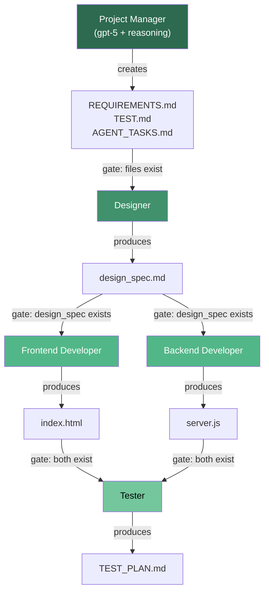

# From CLI to Pipeline: Building Multi-Agent Workflows with the OpenAI Cookbook Pattern


---

Codex CLI is a formidable single-agent tool, but shipping a production feature typically involves design, frontend, backend, and testing — work that maps naturally to multiple specialised agents. The official OpenAI Cookbook provides a reference pattern for exactly this: expose Codex CLI as an MCP server, then orchestrate it with the OpenAI Agents SDK using gated handoffs[^1][^2].

This article walks through the Cookbook pattern end-to-end, examines the gating logic that makes it production-grade, compares it with Claude Code's team/swarm approach, and explores how to extend it for enterprise delivery pipelines.

## The Core Idea: Codex CLI as an MCP Server

Running `codex mcp-server` starts Codex CLI as a long-lived Model Context Protocol (MCP) server over stdio[^3]. The server exposes two tools:

| Tool | Purpose | Key Parameters |
|------|---------|----------------|
| `codex()` | Start a new Codex session | `prompt`, `approval-policy`, `sandbox`, `model`, `cwd` |
| `codex-reply()` | Continue an existing session | `prompt`, `threadId` |

The `threadId` returned in `structuredContent.threadId` from the initial `codex()` call is how the Agents SDK maintains conversational continuity across multiple turns[^2]. Modern MCP clients read `structuredContent`; older clients fall back to the `content` field[^3].

```bash
# Start Codex as an MCP server
codex mcp-server
```

From the Agents SDK's perspective, Codex is just another MCP tool — but one that can read, write, and execute code inside a sandboxed environment.

## Single-Agent: The Minimal Pattern

The simplest useful configuration pairs a planning agent with Codex MCP for execution[^1]:

```python
from agents import Agent, Runner
from agents.mcp import MCPServerStdio

async with MCPServerStdio(
    name="Codex CLI",
    params={
        "command": "npx",
        "args": ["-y", "codex", "mcp-server"],
    },
    client_session_timeout_seconds=360000,
) as codex_mcp_server:

    developer = Agent(
        name="Game Developer",
        instructions=(
            "You are an expert in building simple games using "
            "basic HTML + CSS + JavaScript with no dependencies. "
            'Always call codex with "approval-policy": "never" '
            'and "sandbox": "workspace-write"'
        ),
        mcp_servers=[codex_mcp_server],
    )

    designer = Agent(
        name="Game Designer",
        model="gpt-5",
        handoffs=[developer],
    )

    result = await Runner.run(designer, "Implement a fun new game!")
```

The Designer formulates a brief, then hands off to the Developer, who calls `codex()` to write the code. The handoff is automatic — the SDK exposes it to the LLM as a `transfer_to_game_developer` tool[^4].

## Multi-Agent: The Gated Handoff Pattern

The Cookbook's headline pattern introduces a **Project Manager** agent that enforces gating logic between specialised roles[^1]. No agent advances until its predecessor's artefacts are verified to exist.



### The Project Manager Agent

The PM is the only agent that receives the initial prompt. It creates three planning documents, then orchestrates handoffs with explicit file-existence checks before each gate[^1]:

```python
project_manager_agent = Agent(
    name="Project Manager",
    instructions="""
    You are the Project Manager.

    Handoffs (gated by required files):
    1) After REQUIREMENTS.md, TEST.md, AGENT_TASKS.md are created,
       hand off to the Designer.
    2) Wait for /design/design_spec.md. Verify it exists before proceeding.
    3) When design_spec.md exists, hand off in parallel to both
       Frontend Developer and Backend Developer.
    4) Wait for /frontend/index.html AND /backend/server.js.
       Verify both exist.
    5) When both exist, hand off to the Tester.
    6) Do not advance until the required files for that step are present.
    """,
    model="gpt-5",
    model_settings=ModelSettings(
        reasoning=Reasoning(effort="medium")
    ),
    handoffs=[
        designer_agent,
        frontend_developer_agent,
        backend_developer_agent,
        tester_agent,
    ],
    mcp_servers=[codex_mcp_server],
)
```

The `Reasoning(effort="medium")` setting gives the PM deeper chain-of-thought for orchestration decisions without the latency cost of full reasoning[^1]. Each specialised agent hands back to the PM via `transfer_to_project_manager` after completing its deliverables.

### Bidirectional Handoffs

The SDK requires explicit handoff registration in both directions[^4]:

```python
designer_agent.handoffs = [project_manager_agent]
frontend_developer_agent.handoffs = [project_manager_agent]
backend_developer_agent.handoffs = [project_manager_agent]
tester_agent.handoffs = [project_manager_agent]
```

Each handoff is exposed to the LLM as a tool named `transfer_to_<agent_name>`. The PM's instructions explicitly reference these tool names, creating a deterministic control flow despite the underlying non-deterministic LLM[^4].

### Execution

```python
result = await Runner.run(
    project_manager_agent,
    task_list,
    max_turns=30,
)
```

The `max_turns=30` parameter bounds the total number of LLM round-trips across all agents, preventing runaway loops[^1].

## Observability: Traces Dashboard

Every prompt, tool call, and handoff is automatically captured in the OpenAI Traces dashboard at `platform.openai.com/trace`[^1][^2]. This provides:

- **Full audit trail** of which agent produced which artefact
- **Latency breakdown** per agent and per tool call
- **Handoff visualisation** showing the exact sequence of delegations
- **Token usage** attributed to each agent role

For enterprise pipelines, this trace data feeds directly into compliance and cost-attribution workflows.

## Comparison: Codex Cookbook vs Claude Code Teams

Claude Code shipped its own multi-agent orchestration in February 2026 with Agent Teams and the `TeammateTool` system[^5]. The two approaches share similar goals but differ significantly in architecture:

| Aspect | Codex Cookbook Pattern | Claude Code Agent Teams |
|--------|----------------------|------------------------|
| **Orchestration** | External (Agents SDK in Python) | Built-in (single terminal session) |
| **Communication** | Handoff tools (`transfer_to_*`) | Shared task list + direct messaging |
| **Gating** | Explicit file-existence checks in PM instructions | Task dependencies and status tracking |
| **Concurrency** | SDK manages parallel handoffs | Teammates run in independent context windows |
| **Observability** | OpenAI Traces dashboard | Hook fields (`agent_id`, `agent_type`) |
| **Customisation** | Full Python — any logic you can code | Configuration-driven with `.claude/agents/` |

The Codex pattern is more explicit and auditable: every gate is a verifiable file-existence check, and the entire flow is captured in code you control. Claude Code's approach is more ergonomic for ad-hoc work — you can interact with individual teammates directly without going through the lead[^5].

## Extending for Enterprise Pipelines

The Cookbook pattern maps directly to enterprise delivery workflows. Consider a production deployment pipeline:

```mermaid
flowchart LR
    PM["Release Manager"] --> SPEC["Spec Writer"]
    SPEC -->|gate: spec.md| IMPL["Implementation\n(parallel agents)"]
    IMPL -->|gate: code + tests| REVIEW["Code Reviewer"]
    REVIEW -->|gate: approval.md| DEPLOY["Deployment Agent"]
    DEPLOY -->|gate: health check| MONITOR["Monitoring Agent"]

    style PM fill:#1b4332,color:#fff
    style SPEC fill:#2d6a4f,color:#fff
    style IMPL fill:#40916c,color:#fff
    style REVIEW fill:#52b788,color:#fff
    style DEPLOY fill:#74c69d,color:#000
    style MONITOR fill:#95d5b2,color:#000
```



Key adaptations for enterprise use:

1. **Artefact validation**: Replace simple file-existence checks with content validation (e.g., verify test coverage thresholds, lint pass, type-check pass)
2. **Human-in-the-loop gates**: Insert approval steps where a human must sign off before the pipeline advances
3. **Codex subagents for parallelism**: Combine the SDK-level orchestration with Codex's native subagent system[^6] for fan-out within individual stages (e.g., spawning `explorer` subagents for codebase analysis before implementation)
4. **Sandbox escalation**: Use `read-only` sandbox for exploration agents, `workspace-write` for implementers, reserving `danger-full-access` for deployment agents only

### Configuration for Codex MCP Calls

Each agent should scope its Codex MCP calls appropriately:

```toml
# Explorer agents — read-only sandbox
approval-policy = "never"
sandbox = "read-only"

# Implementation agents — workspace writes
approval-policy = "never"
sandbox = "workspace-write"

# Deployment agents — full access (with human gate)
approval-policy = "on-request"
sandbox = "danger-full-access"
```

## Codex Subagents vs SDK Multi-Agent

It is worth distinguishing between two levels of multi-agent capability in the Codex ecosystem:

- **Codex subagents** (configured via `AGENTS.md` or `.codex/agents/`) run within a single Codex session, spawning child agents for parallel tasks like codebase exploration[^6]. They share the parent's sandbox and are bounded by `agents.max_depth` (default 1).
- **SDK multi-agent** (the Cookbook pattern) orchestrates multiple independent Codex MCP sessions from external Python code. Each agent gets its own thread, sandbox scope, and model configuration.

The two compose naturally: the SDK orchestrates high-level workflow stages, whilst individual agents within those stages use subagents for internal parallelism.

## Getting Started

```bash
# Install dependencies
pip install openai-agents python-dotenv
npm install -g codex

# Clone the Cookbook notebook
git clone https://github.com/openai/openai-cookbook.git
cd openai-cookbook/examples/codex/codex_mcp_agents_sdk

# Run the single-agent example
python single_agent_workflow.py

# Run the multi-agent gated pipeline
python multi_agent_workflow.py
```

Set your `OPENAI_API_KEY` in a `.env` file, and the Cookbook scripts handle the rest — including starting Codex as an MCP server via `npx`.

## Key Takeaways

The Cookbook pattern transforms Codex CLI from an interactive tool into a programmable pipeline stage. The gated handoff approach — where the PM verifies artefact existence before advancing — provides the determinism that enterprise workflows demand, whilst the Agents SDK's handoff primitives keep the orchestration code readable and extensible.

For teams already using Codex CLI, this is the natural next step: same tool, same sandbox model, but now coordinated across multiple specialised agents with full observability.

## Citations

[^1]: OpenAI Cookbook, "Building Consistent Workflows with Codex CLI & Agents SDK", [https://developers.openai.com/cookbook/examples/codex/codex_mcp_agents_sdk/building_consistent_workflows_codex_cli_agents_sdk](https://developers.openai.com/cookbook/examples/codex/codex_mcp_agents_sdk/building_consistent_workflows_codex_cli_agents_sdk)

[^2]: OpenAI Developers, "Use Codex with the Agents SDK", [https://developers.openai.com/codex/guides/agents-sdk](https://developers.openai.com/codex/guides/agents-sdk)

[^3]: OpenAI Developers, "Model Context Protocol – Codex", [https://developers.openai.com/codex/mcp](https://developers.openai.com/codex/mcp)

[^4]: OpenAI Agents SDK, "Handoffs", [https://openai.github.io/openai-agents-python/handoffs/](https://openai.github.io/openai-agents-python/handoffs/)

[^5]: Anthropic, "Orchestrate teams of Claude Code sessions", [https://code.claude.com/docs/en/agent-teams](https://code.claude.com/docs/en/agent-teams)

[^6]: OpenAI Developers, "Subagents – Codex", [https://developers.openai.com/codex/subagents](https://developers.openai.com/codex/subagents)
