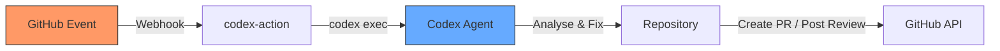
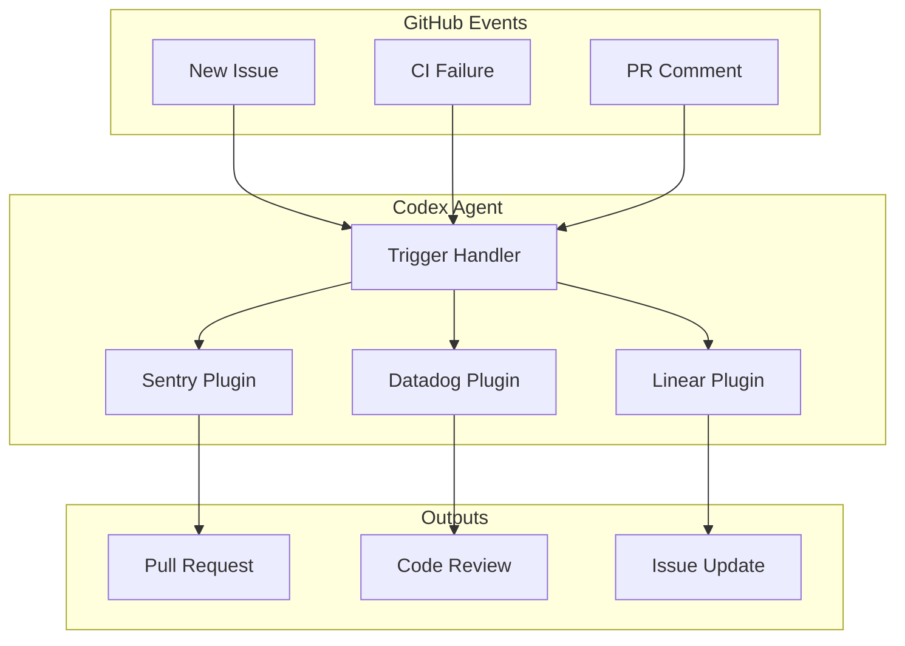

# Codex CLI Triggers: Event-Driven GitHub Automation Beyond CI/CD


---

With the March 2026 release wave, OpenAI shipped five headline features simultaneously: Plugins, Triggers, the Security Agent, Windows support, and GPT-5.4 mini integration[^1]. Of these, **Triggers** may be the most consequential for how teams structure their development workflows. They transform Codex from a tool you invoke into a teammate that responds — autonomously reacting to GitHub events with sub-second latency, without any human initiating the task[^2].

This article covers the architecture, configuration, supported events, and practical patterns for deploying Triggers in production, including comparisons with the polling-based approaches offered by competing agents.

## The Core Idea: Event-Driven vs Polling

Most AI coding agents operate reactively: you type a prompt, the agent responds. Some — notably Claude Code's `/loop` and Schedule features — add time-based polling, where the agent periodically checks for work[^3]. Triggers take a fundamentally different approach.



Triggers are **event-driven**: they fire only when a specific GitHub event occurs — a new issue, a PR comment, a CI failure — and they activate within milliseconds rather than waiting for the next polling cycle[^2]. The practical implications are significant: lower compute costs (no idle polling), faster response times, and a natural alignment with GitHub's webhook architecture.

## How Triggers Work: The codex-action Pipeline

Triggers are implemented through the `openai/codex-action@v1` GitHub Action[^4]. This action installs the Codex CLI, optionally starts the Responses API proxy when you provide an API key, and runs `codex exec` under the permissions you specify[^5]. The key insight is that you define triggers using standard GitHub Actions `on:` event syntax — the action itself is event-agnostic.

### Supported Event Patterns

Any GitHub Actions workflow event can trigger Codex. The most common patterns:

| Event | Trigger Configuration | Use Case |
|---|---|---|
| PR opened/updated | `pull_request: [opened, synchronize, reopened]` | Automated code review |
| CI failure | `workflow_run: [completed]` with failure check | Auto-fix broken builds |
| New issue | `issues: [opened]` | Issue triage and initial fix |
| PR review comment | `pull_request_review_comment: [created]` | Implement reviewer feedback |
| `@codex` mention | `issue_comment: [created]` | On-demand agent tasks |

### A Minimal Trigger: PR Review on Every Push

```yaml
name: Codex pull request review
on:
  pull_request:
    types: [opened, synchronize, reopened]

jobs:
  codex:
    runs-on: ubuntu-latest
    permissions:
      contents: read
      pull-requests: write
    steps:
      - uses: actions/checkout@v5
      - uses: openai/codex-action@v1
        with:
          openai-api-key: ${{ secrets.OPENAI_API_KEY }}
          prompt-file: .github/codex/prompts/review.md
          output-file: codex-output.md
          safety-strategy: drop-sudo
          sandbox: workspace-write
```

This workflow fires every time a PR is opened or updated. Codex reads the diff, applies the review prompt from `.github/codex/prompts/review.md`, and posts its findings as a standard GitHub code review[^5].

## Configuration Deep Dive

The `codex-action` exposes a comprehensive set of inputs for controlling execution, security, and output[^4].

### Prompt Management

Prompts can be provided inline via `prompt` or loaded from a committed file via `prompt-file`. The file-based approach is strongly recommended for production: it keeps prompts version-controlled, reviewable, and composable with GitHub Actions variable interpolation[^5].

```yaml
prompt-file: .github/codex/prompts/review.md
```

### Sandbox Modes

The `sandbox` input controls file system access:

| Mode | Access Level | When to Use |
|---|---|---|
| `read-only` | No writes | Pure analysis and review |
| `workspace-write` | Write within repo | Fix generation, code changes |
| `danger-full-access` | Unrestricted | Only after thorough stability testing |

### Safety Strategies

The `safety-strategy` input governs privilege escalation on the runner[^4]:

- **`drop-sudo`** (default): Revokes sudo membership before invoking Codex. This change persists for the remainder of the job — subsequent steps cannot use sudo either. Usually the correct choice on GitHub-hosted runners.
- **`unprivileged-user`**: Runs Codex as a pre-created unprivileged account. Use this on self-hosted runners where you manage user accounts.
- **`unsafe`**: No privilege restriction. Required for Windows runners; avoid elsewhere.

### Access Control

```yaml
allow-users: "alice,bob"
allow-bots: "dependabot[bot]"
```

By default, only users with write access to the repository can trigger the action. The `allow-users` and `allow-bots` inputs provide explicit allowlists for additional accounts[^4]. This is a critical security boundary — without it, any PR author could inject arbitrary prompts through commit messages or issue bodies.

## The Auto-Fix Pattern: Triggering on CI Failure

The most powerful Trigger pattern uses `workflow_run` to react to CI failures[^6]. When your test suite fails, Codex reads the failure output, diagnoses the root cause, applies a minimal fix, and opens a PR for review.

```yaml
name: Codex auto-fix
on:
  workflow_run:
    workflows: ["CI"]
    types: [completed]

jobs:
  autofix:
    if: ${{ github.event.workflow_run.conclusion == 'failure' }}
    runs-on: ubuntu-latest
    permissions:
      contents: write
      pull-requests: write
    steps:
      - uses: actions/checkout@v5
        with:
          ref: ${{ github.event.workflow_run.head_sha }}
      - uses: openai/codex-action@v1
        with:
          openai-api-key: ${{ secrets.OPENAI_API_KEY }}
          prompt: |
            The CI workflow failed on this commit. Diagnose the
            failure, apply a minimal fix, and verify the tests pass.
            Do not refactor unrelated code.
          sandbox: workspace-write
          codex-args: '["--full-auto"]'
      - uses: peter-evans/create-pull-request@v5
        with:
          commit-message: "fix(ci): auto-fix failing tests via Codex"
          branch: codex/auto-fix-${{ github.run_id }}
          title: "🤖 Codex auto-fix for CI failure"
```

The checkout step uses the failed commit's SHA to ensure Codex analyses the exact state that broke[^6]. The `peter-evans/create-pull-request` action then packages the fix into a reviewable PR on a dedicated branch.

## Plugin + Trigger Pipeline Architecture

Triggers become substantially more powerful when combined with the Plugin system, also shipped in March 2026[^1]. Plugins use the Model Context Protocol (MCP) — originally developed by Anthropic — to connect Codex to external data sources and services[^7].



The initial plugin lineup includes Sentry, Datadog, Linear, Notion, and Jira, with support for custom MCP servers for proprietary internal tools[^7]. A typical enterprise pipeline might look like:

1. **Issue arrives** in GitHub (Trigger fires)
2. Codex queries **Sentry** for related error traces (Plugin)
3. Codex checks **Linear** for linked tickets and context (Plugin)
4. Codex analyses the codebase, applies a fix, runs tests
5. Codex opens a **PR** with the fix and links to the original issue

This creates the fully automated pipeline that OpenAI described at launch: "Issue arrives → Auto-fix → Auto-open PR"[^1].

## Codex Cloud + @codex Mentions

Beyond the GitHub Action, Codex Cloud provides a complementary trigger mechanism. When Automatic Reviews are enabled for a repository, Codex processes every new PR without requiring an explicit mention[^8]. For on-demand tasks, any user with access can comment `@codex review` on a PR to trigger a cloud-based code review[^8].

Codex Cloud reviews focus on P0 and P1 severity issues by default, and repository maintainers can customise review behaviour through an `AGENTS.md` file containing a "Review guidelines" section[^8]. For one-off focus areas:

```
@codex review for security regressions
```

## Comparison with Competing Approaches

| Capability | Codex Triggers | Claude Code Schedule | GitHub Copilot |
|---|---|---|---|
| Activation model | Event-driven (webhook) | Time-based polling | Manual / PR-based |
| Latency | Sub-second | Minutes (polling interval) | Seconds (manual) |
| Idle cost | Zero | Continuous polling compute | N/A |
| Autonomous PR creation | Yes (`codex-action`) | Via background tasks | Limited |
| Plugin ecosystem | MCP-based (Sentry, Datadog, etc.) | MCP-based | Extensions |
| CI failure auto-fix | Native (`workflow_run` trigger) | Manual configuration | Not built-in |

Claude Code's strengths lie in deep interactive collaboration — superior reasoning, desktop control, voice input, and mobile remote access[^3]. Codex's Trigger architecture optimises for a different use case: unattended, autonomous responses to repository events. The two approaches are complementary rather than directly competing for the same workflow.

## Configuration via config.toml

Triggers work alongside the existing Codex configuration system. The `notify` hook in `config.toml` provides local event notifications — currently supporting the `agent-turn-complete` event — which can drive desktop toasts, chat webhooks, or CI updates[^9]:

```toml
notify = ["bash", "-lc", "curl -X POST https://hooks.slack.com/..."]
```

The `codex_hooks` feature flag enables lifecycle hooks loaded from `hooks.json` files alongside active config layers, though this remains under development[^9]. For production Trigger deployments, the GitHub Action pathway is the stable, supported approach.

## Security Considerations for Production

Running an autonomous agent on repository events introduces meaningful security surface:

1. **Prompt injection**: PR descriptions, commit messages, and issue bodies are attacker-controlled inputs. Always use committed prompt files rather than interpolating user-submitted content into prompts[^4].
2. **Privilege minimisation**: Start with `sandbox: read-only` for review tasks. Only escalate to `workspace-write` for fix-generation workflows. Avoid `danger-full-access` unless absolutely necessary[^5].
3. **Access control**: Configure `allow-users` and `allow-bots` explicitly. The default (write-access users only) is a reasonable baseline but should be reviewed for public repositories[^4].
4. **Secret exposure**: The `drop-sudo` safety strategy prevents Codex from accessing secrets stored at the system level, but GitHub Actions secrets referenced in the workflow file are still accessible to the runner process. Limit the secrets available to Codex jobs to the minimum required[^5].
5. **Human-in-the-loop**: For fix-generation workflows, always create a PR for review rather than pushing directly to the default branch. The auto-fix pattern above enforces this through the `create-pull-request` action.

## Getting Started

The fastest path to a working Trigger:

1. Add `OPENAI_API_KEY` as a repository secret
2. Create `.github/codex/prompts/review.md` with your review guidelines
3. Add the PR review workflow YAML shown above
4. Open a test PR and watch Codex respond

For CI auto-fix, add a second workflow file using the `workflow_run` pattern. Start with `sandbox: workspace-write` and `--full-auto`, and only broaden access after verifying stability in your specific environment[^5].

## Citations

[^1]: [OpenAI Codex March 2026 Update Summary: Plugins, Triggers, and 5 Core Changes](https://help.apiyi.com/en/openai-codex-march-2026-updates-summary-plugins-triggers-security-en.html)
[^2]: [OpenAI's Codex Gets Plugins — And The Real Fight For AI-Powered Development Begins](https://www.webanditnews.com/2026/03/28/openais-codex-gets-plugins-and-the-real-fight-for-ai-powered-development-begins/)
[^3]: [OpenAI Codex: What it does and how to use it (2026)](https://www.eesel.ai/blog/openai-codex)
[^4]: [GitHub Action – Codex | OpenAI Developers](https://developers.openai.com/codex/github-action)
[^5]: [How to Run Codex CLI Safely inside GitHub Actions](https://smartscope.blog/en/generative-ai/chatgpt/codex-cli-github-actions/)
[^6]: [Use Codex CLI to automatically fix CI failures — OpenAI Cookbook](https://developers.openai.com/cookbook/examples/codex/autofix-github-actions)
[^7]: [Features – Codex CLI | OpenAI Developers](https://developers.openai.com/codex/cli/features)
[^8]: [Use Codex in GitHub | OpenAI Developers](https://developers.openai.com/codex/integrations/github)
[^9]: [Advanced Configuration – Codex | OpenAI Developers](https://developers.openai.com/codex/config-advanced)
